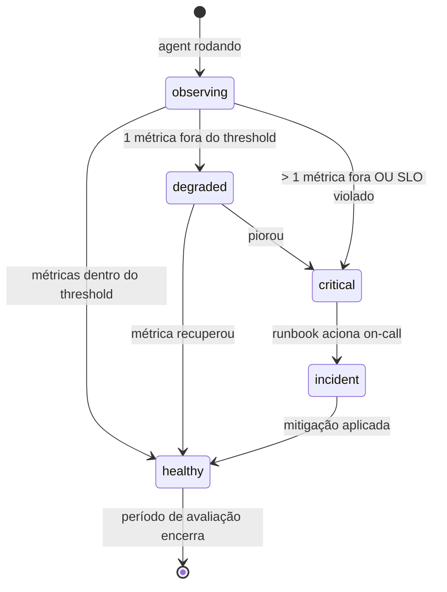

# Kata: Design do Loop de Feedback + Métricas (SLO quando tier-1/2)

> **Prefixo:** `kata-` | **Tipo:** Skill Repetível | **Escopo:** Engenharia — Agents: design do loop de feedback (`feedback.md`) e métricas operacionais (`metrics.md`) do agent em `operational-concrete`

## Workflow

```
Progresso:
- [ ] 1. Ler overview + dooc + (opcional) PoV
- [ ] 2. Declarar modalidades de feedback (HITL + critic + métricas)
- [ ] 3. Declarar ≥ 3 métricas objetivas
- [ ] 4. Quando tier-1/2: declarar SLO + error budget policy
- [ ] 5. Declarar runbook(s) per lex-runbook-for-every-alert
- [ ] 6. Validação final
```

### Passo 1: Ler overview + dooc + (opcional) PoV

1. Lê `overview.md` para tier, leading metric, lagging metric
2. Lê `dooc/{agent}.md` para confirmar tier e capturar evidências de leading metric do PoV
3. Em `with-pov`, lê `pov-path/feedback.md` e `pov-path/observability/value-metrics.md` — herda métricas que provaram valor

### Passo 2: Declarar modalidades de feedback

Template `feedback.md`:

```markdown
# Feedback Loop — {agent}

> **Bounded Context:** {context}
> **Agent:** {agent}
> **Tier:** {tier}

## Modalidades

### HITL (Human-in-the-Loop) para ações irreversíveis

Toda ação que produz efeito irreversível DEVE passar por confirmação humana. Catálogo:

| Ação | Gatilho | Quem confirma | SLA de resposta |
|------|---------|---------------|------------------|
| `criar_lancamento_erp` | Output do agent recomenda criação | Analista contábil owner | 4 horas úteis |
| `enviar_email_cliente` | Output requer comunicação | Operador on-call | 1 hora útil |

Quando não há confirmação no SLA → escalonamento via `escalation.md`.

### Critic LLM

Quando o agent usa padrão `reflexion` ou tier-1/2 com qualidade > latência, um modelo critic revisa o output antes de devolver. Configuração:

- **Modelo:** {nome do critic LLM}
- **Threshold de aceitação:** {valor}
- **Etapa do orchestrator que invoca:** {referência a orchestrator.md::Workflow}
- **Ação em rejeição:** {retry com refinement | escalonar para humano | abortar com erro}

### Métricas objetivas (≥ 3 obrigatórias)

Métricas que fecham o loop de aprendizado quantitativamente. Listadas em detalhe em `metrics.md`. Cada métrica DEVE ter:

- Nome canônico (snake_case)
- Definição operacional (como medida em runtime)
- Threshold (valor esperado em produção)
- Janela de avaliação
- Ação remedial em desvio

## Estados do loop



## Pivot triggers

Condições que disparam revisão estrutural do agent (mudança de escopo, retraining de modelo, despromoção a `pre-operational`):

- Leading metric < threshold por ≥ 2 ciclos consecutivos
- Pivot trigger pré-declarado em `value-proof.md` do PoV
- Lagging metric não evolui após {N} dias

Pivot DEVE ser registrado em ADR.

## Catálogo

### `{metric_name_1}` (LEADING — fonte: DoOC item b)

- **Definição:** {como medida}
- **Tipo:** counter | gauge | histogram
- **Unidade:** {%, ms, count}
- **Threshold:** {valor}
- **Janela:** {duração}
- **Source:** {nome do span/log/decorator}
- **Ação em desvio:** {pivot trigger | degradation alert | incident}

### `{metric_name_2}` (LAGGING — fonte: DoOC item c)

(idem)

### `{metric_name_3}` (operacional — latência, erro)

(idem)

## SLO (obrigatório tier-1/2)

> **Aplicabilidade:** este arquivo SLO existe quando `tier ∈ {tier-1, tier-2}`. Para tier-3/4, omitir esta seção.

```yaml
service: {agent}
tier: tier-1 | tier-2
slos:
  - name: availability
    sli: "successful_runs / total_runs (excluding 4xx user-error)"
    objective: 99.9% (tier-1) | 99.5% (tier-2)
    window: 30d
    error_budget_policy: "pause features when ≥ 80% consumed"
  - name: latency_p99
    sli: "agent_turn_duration_seconds{p99}"
    objective: {N}s
    window: 30d
  - name: quality (when measurable)
    sli: "critic_acceptance_rate OR human_approval_rate"
    objective: {%}
    window: 7d
owners:
  - team: {team-name}
    escalation: "@on-call-handle | #channel"
```

> Para tier-3/4, declarar `SLO: none — best effort` e omitir o bloco YAML.

## Runbooks

Cada alerta crítico DEVE ter runbook (per `lex-runbook-for-every-alert`):

| Alert | Runbook |
|-------|---------|
| `{agent}-availability-breach` | `docs/runbooks/{agent}-availability-breach.md` |
| `{agent}-p99-breach` | `docs/runbooks/{agent}-p99-breach.md` |

## Instrumentação

Per `lex-observability-required`:

- 1 trace por turn do agent (span `agent.turn`)
- ≥ 1 métrica de latência (histogram)
- structured log com `correlation_id`, `org_id`, `client_id`, `agent_id`, `outcome`
- Propagação de `traceparent` para tools downstream

Implementação via decorator centralizado per `lex-logging-decorator`.

## Outputs

| Output | Formato | Destino |
|--------|---------|---------|
| `feedback.md` | Markdown | `docs/{context}/agents/{agent}/feedback.md` |
| `metrics.md` | Markdown | `docs/{context}/agents/{agent}/metrics.md` |
| `docs/runbooks/{agent}-*.md` | Markdown | placeholders criados quando alertas declarados |

## Restrições

- HITL para ações irreversíveis é OBRIGATÓRIO (não negociável)
- < 3 métricas objetivas viola Diretriz 04
- tier-1/2 sem SLO viola `lex-slo-required`
- Alerta sem runbook viola `lex-runbook-for-every-alert`
- Pivot trigger ausente em agents com PoV é proibido (PoV declarava trigger; mesmo trigger DEVE existir em produção)

---

**Modelo:** Kata produz feedback + métricas. Em tier-1/2, declara SLO. Cada alerta tem runbook. Cross-link rigoroso com `lex-observability-required` e `lex-slo-required`.
