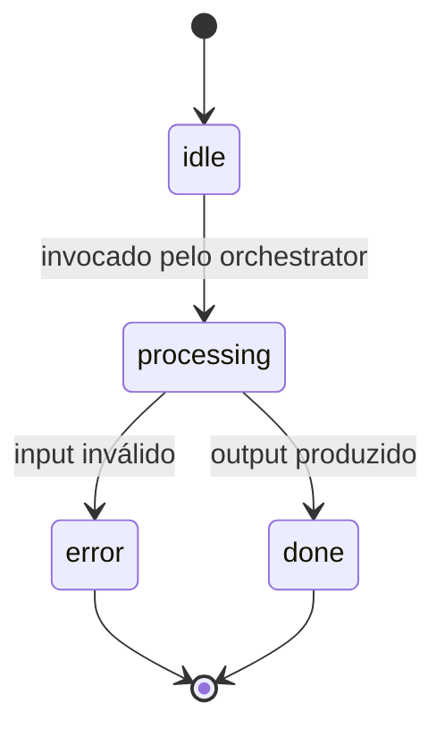

# Kata: Design dos Specialists (com Delegação a Theseus quando aplicável)

> **Prefixo:** `kata-` | **Tipo:** Skill Repetível | **Escopo:** Engenharia — Agents: design de sub-agentes especialistas (specialists) do agent em `operational-concrete`, produzindo `specialists/{name}.md`

## Workflow

```
Progresso:
- [ ] 1. Ler orchestrator + lista de specialists
- [ ] 2. Para cada specialist: avaliar se mapeia a aggregate
- [ ] 3. Quando mapeia: delegar a Theseus (kata-domain-model wrapper)
- [ ] 4. Quando não mapeia: redigir specialist direto
- [ ] 5. Validar fronteiras entre specialists (sem sobreposição)
- [ ] 6. Validação final
```

### Passo 1: Ler orchestrator + lista de specialists

1. Carrega `orchestrator.md::Specialists declarados`
2. Carrega `orchestrator.md::Estados (entre specialists)` para entender o handoff esperado
3. Para cada specialist, identifica: nome, escopo declarado pelo orchestrator, aggregate alvo (quando declarado)

### Passo 2: Para cada specialist, avaliar mapeamento com aggregate

Critério de mapeamento:

| Sinal | Decisão |
|-------|---------|
| Specialist opera sobre uma entidade canônica do `docs/{context}/entities/` (ex.: `Transaction`, `Account`) | Mapeia a aggregate → delegar a Theseus |
| Specialist representa um sub-caso de uso transversal (ex.: "normalização de descrições") | Não mapeia → produz direto |
| Specialist é uma capability técnica (ex.: "OCR de PDF") | Não mapeia → produz direto |

Em caso de dúvida, preferir delegação a Theseus — ele pode declinar quando não couber.

### Passo 3: Quando mapeia, delegar a Theseus

Invocação:

```
Agent → warrior-theseus
  via kata-domain-model
  input:
    - context: {context}
    - aggregate-root: {Aggregate}
    - source: docs/{context}/entities/{entity}.md (existente) OU PoV-derived
    - usage: specialist of agent {agent}
  output esperado:
    - validação da fronteira do aggregate
    - lista de entidades + value objects + invariantes
    - lista de errors do aggregate per lex-error-handling
```

Theseus devolve a especificação do aggregate (em `docs/{context}/entities/{entity}.md` se ainda não existir). O Kata então transcreve o specialist `specialists/{name}.md` referenciando o aggregate.

### Passo 4: Quando não mapeia, produzir direto

Template canônico para `specialists/{name}.md`:

```markdown
# Specialist — {SpecialistName}

> **Bounded Context:** {context}
> **Agent owner:** `{agent}`
> **Aggregate alvo:** `{Aggregate}` (path) | N/A — capability técnica
> **Source of truth:** `system-prompt.md` do agent define identidade pai; este arquivo refina escopo

## Por que existe

{1-3 frases descrevendo a sub-tarefa cognitiva que o specialist isola. Por que faz sentido isolar — escopo distinto, tools distintas, estados distintos.}

## Responsabilidades

### Faz

- {Responsabilidade 1}
- {Responsabilidade 2}

### Não faz

- {Exclusão 1 — ex: não chama tools de escrita; outro specialist responsável}
- {Exclusão 2}

## Estados



## Workflow com tools

| Etapa | O que faz | Tools usadas | Memória |
|-------|-----------|--------------|---------|
| 1. Validar input | Confere `org_id`/`client_id` + schema do payload | (nenhuma) | curta |
| 2. {Etapa N} | {} | {} | {} |
| 3. Produzir output | Formata payload para o orchestrator | (nenhuma) | curta |

## Tools consumidas (subset)

| Tool | Por quê | Idempotência |
|------|---------|--------------|
| `{tool-name}` | {} | sim/não |

Cross-link `tools.md` para detalhamento.

## Memória consumida (subset)

- **Curta:** sessão atual
- **Média:** {quando consome}
- **Longa:** {quando consome}

Cross-link `memory.md`.

## Erros emitidos

| Code | Reason | Quando |
|------|--------|--------|
| `ERR400_INVALID_PARAMETER` | `INVALID_TRANSACTION_FORMAT` | input fora do schema |
| `ERR422_VALIDATION_FAILED` | `AMBIGUOUS_MATCH` | par não consegue ser desambiguado |

Cross-link `lex-error-handling` + `codex-known-errors`.

## Outputs

| Output | Formato | Destino |
|--------|---------|---------|
| `specialists/{name}.md` (1 por specialist) | Markdown | `docs/{context}/agents/{agent}/specialists/{name}.md` |
| Atualizações em `docs/{context}/entities/` | Markdown | quando Theseus criou ou ajustou aggregates |

## Exemplo de Execução

Para `rec-classifier`, o orchestrator declarou 2 specialists:

1. `statement-parser` — capability técnica (não mapeia a aggregate; produzido direto)
2. `category-matcher` — mapeia a aggregate `TransactionCategory` (delegado a Theseus, que retorna a spec do aggregate e o Kata transcreve o specialist)

Saída final:

```
docs/reconciliation/agents/rec-classifier/specialists/
├── statement-parser.md
└── category-matcher.md

docs/reconciliation/entities/
└── transaction-category.md  (atualizado por Theseus)
```

## Restrições

- Não criar specialist sem `Por que existe`
- Não permitir sobreposição em `Faz` entre specialists
- Não criar specialist que duplica capability do orchestrator
- Theseus é a autoridade em aggregate boundaries; quando ele declina o mapeamento, o specialist é produzido direto

---

**Modelo:** Kata produz specialists com fronteiras nítidas. Delega a Theseus quando aplicável; produz direto quando não há paralelo com domínio. Sempre roda após `kata-agent-orchestrator-design` declarar ≥ 2 specialists.
