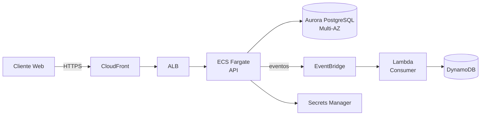

# Kata: Desenhar Arquitetura AWS

> **Prefixo:** `kata-` | **Tipo:** Skill Repetível | **Escopo:** Design de arquitetura AWS para uma nova feature, sistema ou workload — escolha de serviços, diagrama, IaC, estimativa de custo e análise de risco

## Workflow

```
Progresso:
- [ ] 1. Clarificar requisitos e restrições
- [ ] 2. Mapear dados, fluxos e interações
- [ ] 3. Escolher serviços por pilar Well-Architected
- [ ] 4. Desenhar diagrama de arquitetura
- [ ] 5. Analisar riscos e alternativas
- [ ] 6. Estimar custo mensal
- [ ] 7. Gerar scaffolding IaC
- [ ] 8. Produzir documento de arquitetura
```

### Passo 1: Clarificar requisitos e restrições

Consultar `.ahrena/.directives` e fazer perguntas em lote:

1. **Tráfego esperado:** pico e média (requests/s, GB/mês); padrão (constante, spiky, diurnal)?
2. **Latência exigida:** p50, p95, p99?
3. **Disponibilidade (SLA):** 99% (~3.65 dias/ano), 99.9% (~8.76h), 99.99% (~52min)?
4. **RTO/RPO:** tempo aceitável de recuperação e perda máxima de dados?
5. **Dados sensíveis:** PII, PCI, dados de saúde? Compliance aplicável?
6. **Multi-region?** Por que (latência global vs DR)?
7. **Orçamento mensal:** limite aproximado?
8. **Integrações externas:** APIs terceiras, banco legado, SAP, etc.?
9. **Deadline:** urgência impacta decisão (ex.: migrar on-prem em 3 meses vs 12)?

Sem respostas claras, o design fica suposição — escalate ao usuário.

### Passo 2: Mapear dados, fluxos e interações

1. **Componentes lógicos:** quais módulos/serviços compõem o sistema? (ex.: API de refund, motor de eventos, dashboard admin)
2. **Dados manipulados:** quais entidades, onde persistem, qual volume, qual padrão de acesso (read-heavy, write-heavy, OLTP vs OLAP)?
3. **Fluxos críticos:** traçar o caminho de dados no caso feliz (ex.: cliente → ALB → API → DB → evento → consumer)
4. **Interações externas:** integração com Guardia core, providers de pagamento, email, SMS, etc.
5. **Padrões de tráfego:** sincrono (request/response) vs assíncrono (fila/evento)?

### Passo 3: Escolher serviços por pilar Well-Architected

Consultar `codex-aws-services` e `codex-aws-well-architected`. Para cada componente, responder:

| Pilar | Questão guiada |
|---|---|
| **Security** | IAM necessário? Criptografia? Dados sensíveis? Auth público/privado? |
| **Reliability** | Multi-AZ? Multi-region? Backup? Failover? |
| **Performance** | Latência? Escala esperada? Serverless ou provisioned? |
| **Cost** | Previsibilidade do workload? Savings Plans fazem sentido? |
| **Operational** | Time operará via CI/CD? Precisa de muito logging? |
| **Sustainability** | Graviton compatível? Região com baixo carbono? |

Registrar a escolha de cada serviço **e por quê** (e alternativas consideradas, para eventual ADR).

### Passo 4: Desenhar diagrama de arquitetura

Produzir diagrama em Mermaid ou draw.io mostrando:

- Componentes (caixas com ícones AWS)
- VPCs e subnets (privada vs pública)
- Fluxos de dados (setas com protocolo: HTTPS, SQL, gRPC)
- Integração externa (nuvens ou caixas fora do VPC)
- Multi-AZ/Multi-region se aplicável

Exemplo Mermaid:



### Passo 5: Analisar riscos e alternativas

Para decisões-chave, registrar:

| Decisão | Escolhida | Alternativa | Trade-off |
|---|---|---|---|
| Compute API | ECS Fargate | Lambda | Fargate escolhido por tráfego sustained; Lambda consideraria cold start |
| DB primário | Aurora PostgreSQL | DynamoDB | Aurora por queries relacionais; DynamoDB para padrões key-value |
| Streaming | EventBridge | SNS+SQS | EventBridge por schema registry e filtragem avançada |

Identificar **riscos técnicos**:

- Single points of failure
- Gargalos de performance previstos
- Dependências críticas externas
- Limites de serviço AWS que podem ser atingidos

Cada decisão estrutural que afeta múltiplos componentes ou contratos **DEVE gerar ADR** — invocar `kata-adr-write` (quando no fluxo Issue-Driven).

### Passo 6: Estimar custo mensal

1. **AWS Pricing Calculator** para estimativa detalhada.
2. **Infracost** para integração com Terraform.
3. Decompor por pilar:
   - Compute (ECS, Lambda, EC2)
   - Storage (S3, EBS, RDS storage)
   - Database (RDS compute, DynamoDB RCU/WCU, ElastiCache)
   - Network (NAT Gateway, data transfer, ALB hours)
   - Other (KMS, Secrets Manager, CloudWatch logs)
4. Considerar **picos de tráfego** e **cenários de falha** (failover multi-AZ duplica custo momentaneamente).
5. Comparar com budget informado — se excede >20%, revisitar escolhas.

### Passo 7: Gerar scaffolding IaC

Criar **esqueleto inicial** em Terraform ou CDK (conforme ferramenta do projeto):

- Módulo para cada componente principal (VPC, ECS, Aurora, etc.)
- Tags padronizadas (ver `lex-aws-cost`)
- Placeholders para valores de negócio (capacidades, retenções, tamanhos)
- Referências a secrets via Secrets Manager (valores populados fora do IaC, ver `lex-aws-security`)

O scaffolding **não precisa estar production-ready** — é ponto de partida para o time de DevOps iterar.

### Passo 8: Produzir documento de arquitetura

Estrutura (quando no fluxo Issue-Driven, este documento **é parte** de `.ahrena/issues/{n}/03-architecture.md` ou referenciado dele):

```markdown
# Arquitetura AWS — {nome do sistema}

## Contexto e Requisitos
- Descrição funcional
- Requisitos não-funcionais (tráfego, SLA, RTO/RPO, compliance)
- Restrições

## Visão Geral (Diagrama)
```mermaid
...
```

## Componentes

### {Nome do Componente}
- **Serviço AWS:** ECS Fargate
- **Por quê:** workload sustained, containers Python, sem ops de K8s necessária
- **Configuração:** 2 tasks por padrão, ALB, target tracking 70% CPU
- **Alternativas descartadas:** Lambda (rejected: cold start em endpoint síncrono crítico)

### {...}

## Escolha de Região
- **Primária:** sa-east-1 (compliance LGPD + latência BR)
- **Fallback:** us-east-1 (failover para workload tier-1)

## Segurança
- IAM roles específicas por componente
- KMS para storage encryption
- Secrets Manager para credenciais
- WAF em CloudFront
- VPC privada + VPC Endpoints

## Reliability
- Multi-AZ para Aurora e ECS
- RTO: 1h / RPO: 5min
- Backup via AWS Backup com retenção de 90 dias
- Chaos testing trimestral

## Performance
- Target latency p99: 300ms
- Auto-scaling por CPU + ALB target tracking
- CloudFront para assets estáticos

## Cost Optimization
- Savings Plan 1-year para ECS (cobrir baseline)
- Spot para batch jobs não críticos
- S3 Intelligent-Tiering para bucket de logs
- Budget mensal: US$ {X}

## ADRs Gerados
- [ADR-{n}: {decisão}](docs/adr/...)

## Estimativa de Custo
| Componente | Mensal (USD) |
|---|---|
| ECS Fargate + ALB | 650 |
| Aurora (r6g.large Multi-AZ) | 540 |
| S3 + Data Transfer | 120 |
| NAT Gateway (2 AZ) | 65 |
| CloudWatch | 45 |
| Other | 80 |
| **Total** | **~1.500** |

## Riscos e Mitigações
- **Risco:** pico sazonal (Black Friday) excede capacidade
  - **Mitigação:** pre-scaling via schedule + aumento de max capacity no auto-scaling
- **Risco:** failover região = RTO fora do SLA
  - **Mitigação:** runbook pré-testado; replication lag monitorado

## IaC Scaffolding
- Localização: `infra/modules/{sistema}/`
- Ferramenta: Terraform
- Próximos passos: DevOps revisa, parametriza, aplica em staging
```

## Saídas

| Saída | Formato | Destino |
|-------|---------|---------|
| Documento de arquitetura | Markdown | `.ahrena/issues/{n}/03-architecture.md` (ou arquivo dedicado) |
| Diagrama | Mermaid embutido ou SVG/PNG | No documento de arquitetura |
| ADRs | Markdown MADR | `docs/adr/ADR-*` (via `kata-adr-write`) |
| IaC scaffolding | Arquivos `.tf` ou `.ts` (CDK) | `infra/modules/{sistema}/` ou pasta equivalente |
| Estimativa de custo | Tabela no documento + planilha do Pricing Calculator | Documento + link |

## Restrições

- **Sem pular pilares:** as 6 dimensões do Well-Architected precisam ser consideradas mesmo que brevemente.
- **Justificar escolhas:** cada serviço escolhido tem "por quê" + alternativa considerada.
- **Aplicar Lexis:** `lex-aws-security`, `lex-aws-iac`, `lex-aws-cost` são mandatórias desde o design.
- **Estimativa de custo obrigatória:** arquitetura sem custo é incompleta.
- **ADR para decisões estruturais:** não deixar decisões críticas apenas no documento — elas merecem ADR.
