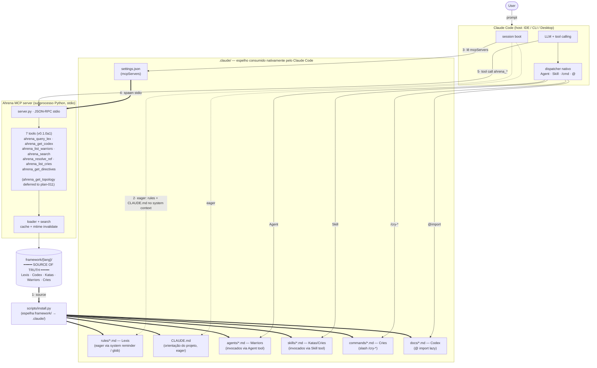

# Plano: Ahrena MCP Server — framework como recurso queryable por agentes externos

## Objetivo

Expor o framework Ahrena (Lexis, Codex, Katas, Warriors, Cries) como um **MCP server local** consumível por qualquer cliente MCP-compatível (Claude Code, Cursor, Strands, agents externos). Em vez de cada agente carregar o repo inteiro ou usar grep, o MCP server fornece consulta cirúrgica via tools: `ahrena_query_lex`, `ahrena_list_warriors`, `ahrena_get_codex`, `ahrena_search`, `ahrena_resolve_ref`. Reduz dramaticamente o footprint de tokens em sessões que precisam consultar o framework esporadicamente, e prepara terreno para o futuro onde `apollo-agents` (e agents Strands externos) consomem o framework programaticamente.

## Contexto

### Estado atual

- Framework hoje é consumido por **convenção de path**: agentes carregam Lexis via `cursor.rules` / `claude-code.rules` (sempre eager ou via glob lazy-load)
- Para consulta pontual ("qual a Lex sobre idempotência?"), agente faz grep ou carrega o arquivo inteiro
- `apollo-agents` (plan-013) será o primeiro consumidor de tools MCP estruturadas; faz sentido o framework também estar como MCP
- Plan-008 (Headroom) já contempla MCP server externo; este plan contempla o framework próprio como MCP server interno

### Por que MCP (não REST API local, não CLI)

| Mecanismo | Prós | Contras |
|---|---|---|
| **MCP server** ✅ | Padrão Anthropic; integra direto com Claude Code/Cursor; tools são primeira-classe; protocolo JSON-RPC sobre stdio ou HTTP | Requer cliente MCP (Claude/Cursor já têm) |
| REST API local | Universal | Cada cliente precisa adaptador; sem integração nativa em IDEs |
| CLI tool | Simples | Output não estruturado para parser de LLM; não compõe com tool calling |
| MCP-resources (read-only) | Padrão MCP | Limitado a get; não cobre search ou query |

MCP é o **único** mecanismo onde Claude Code/Cursor integram tools de forma nativa, sem adaptador.

### Tools propostas

| Tool | Input | Output | Uso típico |
|---|---|---|---|
| `ahrena_query_lex` | `name: str` (e.g., `"lex-idempotency-implementation"`), `lang: str` (default `"pt-BR"`) | Conteúdo completo da Lex em markdown | "Qual é a Lex de idempotência implementation?" |
| `ahrena_list_warriors` | `clade: str` (opcional, e.g., `"engineering"`) | Array de `{name, clade, subclade, description, line_count}` | "Quais warriors existem em engineering?" |
| `ahrena_get_codex` | `name: str`, `lang: str` | Conteúdo do Codex | "Mostre o codex-component-api" |
| `ahrena_search` | `query: str`, `pilar: str` (opcional, `"lex"\|"codex"\|"kata"\|"warrior"\|"cry"`), `lang: str` | Array de `{path, snippet, score}` ranked | "Onde se fala sobre 'circuit breaker'?" |
| `ahrena_resolve_ref` | `ref: str` (e.g., `"lex-idempotency"`, `"codex-component-api"`) | `{path, full_name, type, exists}` | "Esse ref existe? Onde fica?" |
| `ahrena_get_directives` | `(none)` | Conteúdo de `.ahrena/.directives` parseado | Agente externo lendo configuração do projeto |
| `ahrena_list_cries` | `(none)` | Array de cries com descriptions | Self-discovery em sessão Strands |
| `ahrena_get_topology` | `(none)` | `docs/internal/warrior-topology-2026.md` (criado em plan-011) | Agente quer entender a topologia atual — **DEFERIDO até plan-011 mergear** (não shipa nesta iteração) |

### Decisões fechadas

| Decisão | Valor | Por quê |
|---|---|---|
| Linguagem do server | Python 3.10+ usando `mcp` SDK (oficial Anthropic) | Continuidade com `install.py` e `validate.py`; cumpre folgado o budget de latência (<200ms query, <500ms search); barreira de contribuição baixa |
| Empacotamento | Pacote em `tools/ahrena-mcp/` com `pyproject.toml` próprio. Instalação **canônica** via `pipx install -e .ahrena/tools/ahrena-mcp` rodada pelo próprio `scripts/install.py` (que copia o source do pacote para `.ahrena/tools/`). Console script `ahrena-mcp` declarado em `[project.scripts]` resolve via `PATH`. Distribuição em PyPI (ver §Release & Distribution) é conveniência adicional para adopter sem clone — não é pré-requisito | Sem path absoluto, sem dep de PyPI para default-on funcionar; `install.py` é o único canal de instalação do framework e do server |
| Localização do conteúdo | Server lê `framework/{lang}/...` do repo onde está rodando OU de path declarado em config | Trabalha em qualquer projeto que adote Ahrena |
| Discovery do framework | (a) `--root` flag, (b) env var `AHRENA_ROOT`, (c) walk para cima procurando `.ahrena/` | Conveniente |
| Idiomas suportados | Cada tool aceita `lang` parameter; defaulta a `language.default` lido de `.directives` | i18n nativo |
| Search engine | `whoosh` (Python pure) ou `ripgrep` shell-out (mais rápido, requer rg installed) | Codex documenta os dois; defaulta para ripgrep se disponível |
| Caching | Cache de file content e search index em memória; invalidate em `mtime` change | Performance |
| Auth | Sem auth (server local stdio) | MCP local, baixo risco |
| Registro como MCP server | `framework/mcp/ahrena.json` com config para Cursor (`.cursor/mcp.json` `mcpServers`) e Claude Code (`.mcp.json` no root + `enabledMcpjsonServers` em `.claude/settings.json` — Claude Code rejeita `mcpServers` em settings) | Mesmo padrão dos demais (github.json, notion.json, figma.json), com o ajuste de schema do Claude Code corrigido pelo `fix(install)` desta PR |
| Adoção | **Default-on, instalação pelo próprio framework** — `framework/.directives.sample` contém `mcp.servers: [ahrena]` descomentado; `install.py` (a) copia `tools/ahrena-mcp/` para `.ahrena/tools/`, (b) roda `pipx install -e <path>` (silencioso na primeira instalação; com prompt em re-instalação interativa), (c) mergeia `framework/mcp/ahrena.json` em `.cursor/mcp.json` + `.mcp.json` no root + `enabledMcpjsonServers` em `.claude/settings.json`. Adopter opta-OUT comentando a linha em `.ahrena/.directives` | Performance benefit é universal e sem custo material. Honesto: server fica realmente disponível pós-`make install` sem PyPI nem path absoluto. Quando `pipx` está ausente, `install.py` warns + skips (não-fatal). `lex-mcp` rule 3 continua atendida pelo `.directives.sample` |
| HARD-GATE | Não — server é tooling opcional, não Lex | Adoção orgânica |
| Idiomas dos artefatos do framework | Codex em 3 idiomas (pt-BR canonical + es + en); cry em 3 idiomas | `lex-framework-language` |

## Arquitetura — integração com Claude Code

### Diagrama

**Leitura em uma sentença:** o Claude Code consome `.claude/` por mecanismos nativos (rules eager, Agent, Skill, slash, `@` import), enquanto o MCP server vive como subprocesso paralelo que lê `framework/` direto e responde a tool calls — ambos têm `framework/` como fonte única.

### Os `.md` em `.claude/` perdem o sentido?

**Não.** Eles continuam necessários, mas o papel varia por tipo. A regra prática:

> **Conteúdo que precisa estar EM contexto antes de qualquer raciocínio do agente → arquivo em `.claude/`.**
> **Conteúdo PUXADO sob demanda quando o agente sabe que precisa → MCP.**

#### Continuam indispensáveis

| Arquivo | Por que MCP **não** substitui |
|---|---|
| `rules/*.md` (Lexis com `alwaysApply` ou globs) | São injetadas como system reminder no boot. O agente nem precisa "saber que existem" — elas são contexto. MCP é pull: exigiria o agente já saber chamar `ahrena_query_lex(...)` antes de aplicar a regra. |
| `CLAUDE.md` | Entry point lido automaticamente. MCP é spawned **a partir** de `settings.json` — vem depois. Sem CLAUDE.md, o Claude Code não tem orientação inicial. |
| `agents/*.md` (Warriors) | Subagents invocados pela tool nativa `Agent`. O Claude Code lê esses arquivos para descobrir os subagents e seus prompts. Não há tool MCP que substitua o **mecanismo de subagent**. |
| `skills/*.md` (Katas, Cries) | Invocadas pela tool nativa `Skill`. A lista é exposta no system prompt automaticamente. MCP pode *listar* via `ahrena_list_cries`, mas a invocação real é nativa. |
| `commands/*.md` (slash) | `/cry-*` é mecanismo nativo do Claude Code. |
| `settings.json` | É exatamente o que **ativa** o MCP server. Não pode migrar para o MCP. |

#### Onde o MCP gera ganho real

| Caso | Por que MCP é melhor |
|---|---|
| `docs/*.md` (Codex) consumido em massa via `@` import | `ahrena_get_codex(name)` devolve só o que precisa; `@` import traz o arquivo inteiro. MCP não elimina os arquivos — coexiste. |
| Search cross-pilar / cross-idioma (`"circuit breaker"`) | `ahrena_search` retorna hits ranqueados; grep manual não tem ranking nem awareness de pilar. |
| Agentes externos sem `.claude/` (Strands, `apollo-agents`) | Não têm rules/skills/commands nativos — só MCP serve para esses adopters. |
| Resolução de refs (`lex-idempotency` existe? onde?) | `ahrena_resolve_ref` é determinístico; grep depende do nome literal. |

#### Síntese

Os arquivos em `.claude/` **são o wiring nativo** do Claude Code (governança eager, dispatch de subagents/skills/commands, `@` import). O MCP **adiciona uma camada de query estruturada** sobre o mesmo `framework/`. As duas camadas coexistem porque servem fases diferentes: `.claude/` é **contexto de partida**, MCP é **consulta sob demanda**. A única coisa que talvez encolha com o tempo é o uso intensivo de `@` import para Codex grandes — mas mesmo isso é decisão por arquivo, não razão para apagar nada.

## Escopo

### Artefatos a criar (3 idiomas onde aplicável)

| Pilar / tipo | Caminho | Conteúdo |
|---|---|---|
| Codex | `_foundation/tooling/codex/codex-ahrena-mcp.md` (3 idiomas) | Conceito; instalação (`pip install -e tools/ahrena-mcp` ou via release artifact); tools expostas com signatures e exemplos; integração via `mcp.servers` em `.directives`; uso em Claude Code, Cursor, Strands; performance considerations; troubleshooting |
| Cry | `_foundation/tooling/cries/cry-ahrena-mcp-install.md` (3 idiomas) | Atalho que (a) instala o pacote, (b) adiciona `ahrena` em `mcp.servers`, (c) roda `install.py` para mergeear config nos arquivos das plataformas |
| Pacote Python | `tools/ahrena-mcp/` (root do pacote) | `pyproject.toml`, `src/ahrena_mcp/server.py`, `src/ahrena_mcp/tools/*.py` (uma função por tool), `src/ahrena_mcp/loader.py` (parser de framework), `src/ahrena_mcp/search.py` |
| MCP config | `framework/mcp/ahrena.json` | Config no padrão dos outros: `command: "python"`, `args: ["-m", "ahrena_mcp.server", "--root", "${workspaceFolder}"]` |
| Tests | `tools/ahrena-mcp/tests/` | Tests unitários por tool; integration test usando MCP client mock |
| Doc interno | `docs/internal/ahrena-mcp-architecture.md` (pt-BR-only) | Decisões de design; trade-offs (whoosh vs ripgrep); roadmap (futuro: write tools — `ahrena_create_lex` etc — fora deste plan) |

### Atualizações em artefatos existentes (3 idiomas)

| Arquivo | Mudança |
|---|---|
| `framework/.directives.sample` | **Descomentar** o bloco `mcp.servers` e listar `ahrena` como entry padrão. Comentário acima explica que esse é o server interno do framework (default-on; comentar a linha desliga) |
| `_foundation/tooling/codex/codex-mcp-common.md` | Acrescentar `ahrena` à lista de servers conhecidos com link para `codex-ahrena-mcp` |
| `framework/platforms.yaml` | Registrar codex novo + cry novo |
| `engineering/architecture/codex/codex-component-agents.md` (criado em plan-012) | Acrescentar referência ao Ahrena MCP como source de discovery do framework para `apollo-agents` |
| `scripts/install.py` | Mergear `framework/mcp/ahrena.json` em `.cursor/mcp.json` e no equivalente do Claude Code (`.mcp.json` no root + `enabledMcpjsonServers` em `.claude/settings.json`) sempre que `mcp.servers` listar `ahrena`. Como `.directives.sample` já lista por padrão, novo adopter recebe ahrena ativo no primeiro `make install` (default-on). Lógica do merger é o mesmo mecanismo existente para github/notion/figma |

## Fora de escopo

- **Write tools** (`ahrena_create_lex`, `ahrena_update_codex`) — primeira iteração read-only; mutação fica para iteração futura
- **MCP server hospedado remoto** — server é local stdio; remote requer auth, TLS, scaling — fora
- **Web UI para o framework** — separado; MkDocs já serve `docs/`
- **Suporte a múltiplos frameworks** simultaneamente em um server — server é por-instância
- **Scaffolding de skills via MCP** — plan-010 cobre skills externos; integração futura possível mas fora aqui
- **Métricas de uso** (qual tool é mais chamada) — fica para iteração futura via `@measured` (plan-015)

## Release & Distribution

> Adicionado em 2026-05-09; ajustado em 2026-05-10 após o pivô arquitetural do PR #76 review. **Não bloqueia default-on** — `scripts/install.py` já cuida de tudo via `pipx install -e .ahrena/tools/ahrena-mcp/`. Esta seção cobre o caminho complementar: publicar o pacote para adopter **sem clone do repo Ahrena**.

### Por que release ainda faz sentido (mesmo com pipx no install.py)

A instalação canônica via `install.py` resolve o caso "adopter já clonou ou rodou bootstrap do framework" — copia `tools/ahrena-mcp/` para `.ahrena/tools/` e instala via pipx em PATH. **Default-on funciona honestamente**, sem PyPI.

Release continua útil para casos ortogonais:

- **Agente externo sem framework instalado** (Strands em projeto não-Ahrena, script CI ad-hoc): `uvx ahrena-mcp --root /path/to/some/ahrena/repo` resolve sem clone.
- **Distribuição binary-like sem dep de Python no host do adopter**: PyPI + `pipx install ahrena-mcp` é one-liner.
- **Versionamento independente**: release tags permitem pin de versão do server sem precisar de upgrade do framework inteiro.

Em outras palavras: pré-pivô, release era condição para default-on. Pós-pivô, release é facilidade adicional.

### Decisões de release

| Decisão | Valor | Justificativa |
|---|---|---|
| Canal v1 | GitHub Releases (wheel `.whl` + sdist anexados na tag) | Sem dependência de PyPI público inicial. Bom enquanto o pacote ainda é alpha/beta. |
| Canal v2 | PyPI público | Após maturidade. Habilita `uvx ahrena-mcp` zero-install — padrão de fato para MCP servers em 2026. |
| Versionamento | SemVer (governado por `lex-semantic-version`) | `0.1.0a1` (alpha) → `0.1.0b1` (beta) → `0.1.0` (stable) → `1.0.0` quando o contrato (7 tools desta iteração + `ahrena_get_topology` quando plan-011 mergear) congela |
| Trigger | Tag push `v*.*.*` em `main` | GitHub Action automatiza build + release. Tag assinada (`lex-signed-commits`). |
| Compat Python | 3.10–3.13 | Janela alinhada à `mcp` SDK e ao stack do framework |
| Comando em `framework/mcp/ahrena.json` | `command: "ahrena-mcp", args: ["--root", "${workspaceFolder}"]` em todas as fases | `install.py` instala o pacote via pipx → console script `ahrena-mcp` resolve via `PATH`. Mesma config funciona para fases v1 (GitHub Release) e v2 (PyPI/`uvx`); só muda como adopters externos obtêm o pacote. Sem mudança em `ahrena.json` por release |

### Artefatos a criar (release)

| Arquivo | Conteúdo |
|---|---|
| `.github/workflows/ahrena-mcp-release.yml` | GitHub Action: on tag `v*.*.*` build sdist + wheel via `python -m build`; cria GitHub Release; anexa artefatos. Quando habilitado PyPI: trusted publisher OIDC + `pypa/gh-action-pypi-publish`. |
| `tools/ahrena-mcp/CHANGELOG.md` | Formato Keep-a-Changelog. Entrada inicial `0.1.0a1`. |
| `tools/ahrena-mcp/.gitignore` | `.venv/`, `dist/`, `build/`, `*.egg-info/`, `__pycache__/`, `.pytest_cache/`, `.mypy_cache/`, `.coverage`, `*.pyc` |
| Atualização de `framework/mcp/ahrena.json` | (Já feito em commit `chore(framework): ahrena.json uses bare 'ahrena-mcp' command (PATH-based)`.) `command: "ahrena-mcp"` permanece estável entre releases |
| Atualização de `codex-ahrena-mcp.md` (3 idiomas) | Seção "Instalação" reflete release path como caminho recomendado; `pip install -e` vira nota para contributors |
| Atualização de `cry-ahrena-mcp-install.md` (3 idiomas) | Atalho aciona `scripts/install.py` (instalação canônica). `pipx run` / `uvx` documentados como alternativas para adopter externo sem framework |

### Steps adicionais (após 1–30 mergeados)

- [ ] 31. Adicionar `CHANGELOG.md` em `tools/ahrena-mcp/` com entrada `0.1.0a1`
- [ ] 32. Adicionar `.gitignore` em `tools/ahrena-mcp/`
- [ ] 33. Criar `.github/workflows/ahrena-mcp-release.yml` (build sdist + wheel; on tag push; cria GitHub Release; anexa artefatos)
- [ ] 34. Promover `version` em `pyproject.toml` de `0.1.0a0` → `0.1.0a1`
- [ ] 35. Commit + push em `main`; tag `v0.1.0a1` assinada; verificar GitHub Release gerado com `.whl` anexado
- [ ] 36. Smoke test de consumo externo: em projeto sandbox **sem** clone do Ahrena, validar `pipx install --spec <whl-url> ahrena-mcp` + `pipx run` no `command` do `.mcp.json`; abrir Claude Code; validar `tools/list` e uma `tools/call`
- [ ] 37. Quando contrato das tools (7 atuais + topology) estável após uso real por apollo-agents: configurar trusted publisher OIDC no PyPI
- [ ] 38. Tag `v0.1.0` (release stable) com publicação em PyPI via Action
- [ ] 39. Documentar (em `codex-ahrena-mcp`) o caminho alternativo para adopter externo: `uvx ahrena-mcp --root <repo>` ou `pipx install ahrena-mcp` quando não há `install.py` rodando localmente. **Não alterar** `framework/mcp/ahrena.json` — `command: "ahrena-mcp"` continua válido (a diferença está em onde o pacote vem)
- [ ] 40. (Removido — `framework/mcp/ahrena.json` não precisa atualização entre fases)
- [ ] 41. Anunciar release no canal interno + abrir issue de adoção em projetos consumidores conhecidos (apollo-agents, Strands)

### Verificação adicional (release)

12. `.whl` publicado em GitHub Release na tag `v0.1.0a1`
13. Em projeto sandbox sem Ahrena clonado, `pipx install --spec <whl-url> ahrena-mcp` sobe o pacote em PATH; `tools/list` responde
14. Após PyPI: `uvx ahrena-mcp --root <repo>` funciona end-to-end em sandbox limpa (Python apenas, sem clone)
15. `CHANGELOG.md` atualizado em cada tag
16. `framework/mcp/ahrena.json` permanece com `command: "ahrena-mcp"` em todas as fases (sem alteração entre v1 e v2)

### Riscos adicionais (release)

- **Nome `ahrena-mcp` ocupado em PyPI.** Mitigação: pre-check antes do step 37; fallback `guardia-ahrena-mcp` ou `ahrena-framework-mcp`; manter consistência em GitHub Releases.
- **`pipx` ausente no host do adopter.** Mitigação: `install.py` detecta a ausência, imprime `WARNING` com instruções (`https://pipx.pypa.io/stable/installation/`) e segue (não-fatal). Adopter pode (a) instalar pipx e re-rodar `install.py`, (b) instalar manualmente via `pip install --user .ahrena/tools/ahrena-mcp` ajustando PATH. Documentar em `codex-ahrena-mcp`.
- **`uv`/`uvx` ausente em projetos legados** que tentam consumo externo. Mitigação: codex documenta `pipx install` e `pip install` como caminhos alternativos para o caso "sem framework instalado". Não impor `uv` como única via.
- **Adopter externo aponta `--root` para diretório sem `framework/`.** Mitigação: já implementado no spike — server falha cedo com mensagem `"framework/ not found under <root>"`. Codex enfatiza esse pré-requisito.
- **Quebra de contrato entre 0.1.x e 0.2.x consumida por apollo-agents.** Mitigação: SemVer rigoroso; 0.x admite breaking changes em minor mas anuncia em CHANGELOG; estável só após `1.0.0`.
- **GitHub Actions secret/PyPI token roubado.** Mitigação: trusted publisher OIDC dispensa token; restringir workflow a tag push em `main`.

## Steps

- [ ] 1. **Confirmar plan-012 mergeado** (codex-component-agents existe para receber a referência) e idealmente plan-013 (apollo-agents existe — primeiro consumidor)
- [ ] 2. Abrir issue com template `feature-request`, Issue Type `Feature`, label `feature request ➕`, título "feat(framework): Ahrena MCP server — framework as queryable resource for agents"
- [ ] 3. Criar branch `feat/{N}-ahrena-mcp-server` e worktree
- [ ] 4. Atualizar status deste plan para `in-progress`
- [ ] 5. Estudar `mcp` SDK Python oficial — confirmar API atual (specversion, transport stdio); decidir entre `mcp.server.Server` (lower) e `mcp.fastmcp.FastMCP` (high-level — mais simples)
- [ ] 6. Criar `tools/ahrena-mcp/pyproject.toml` com dependências (`mcp`, `pyyaml`, `whoosh` ou similar; ripgrep via shell)
- [ ] 7. Implementar `loader.py`: parser que lê `framework/{lang}/...`, retorna estrutura indexada (path → metadata + content)
- [ ] 8. Implementar `search.py`: indexer (whoosh) ou wrapper de ripgrep; signature `search(query, pilar=None, lang="pt-BR") -> List[Hit]`
- [ ] 9. Implementar cada tool em `tools/*.py` (funções puras consumindo loader e search)
- [ ] 10. Implementar `server.py` registrando tools via SDK
- [ ] 11. Escrever tests por tool em `tests/`
- [ ] 12. **Smoke test stdio**: rodar `python -m ahrena_mcp.server --root .` em sandbox; mandar JSON-RPC `initialize` + `tools/list` + `tools/call ahrena_list_warriors`; validar resposta
- [ ] 13. Criar `framework/mcp/ahrena.json` no padrão dos demais
- [ ] 14. Atualizar `scripts/install.py` para mergear `framework/mcp/ahrena.json` em `.cursor/mcp.json` e (a) `.mcp.json` no root do projeto + (b) `enabledMcpjsonServers: ["ahrena"]` em `.claude/settings.json` quando `mcp.servers` lista `ahrena`. Validar que adopter sai do `make install` com ahrena ativo sem precisar mexer manualmente
- [ ] 15. **Smoke test integração Claude Code**: adicionar `ahrena` em `mcp.servers` em `.directives` de projeto sandbox; rodar `install.py`; abrir Claude Code; verificar que tools aparecem em `/mcp` list; chamar `ahrena_query_lex name="lex-idempotency"`; verificar resposta
- [ ] 16. **Smoke test integração Cursor**: idem; verificar tools em Cursor MCP UI
- [ ] 17. **Smoke test apollo-agents** (se plan-013 mergeado): pedir ao apollo-agents para "consultar a Lex de idempotência"; verificar que ele invoca `ahrena_query_lex` em vez de carregar o arquivo
- [ ] 18. Redigir `codex-ahrena-mcp.md` em pt-BR
- [ ] 19. Redigir `cry-ahrena-mcp-install.md` em pt-BR
- [ ] 20. Atualizar `codex-mcp-common.md` em pt-BR
- [ ] 21. Atualizar `codex-component-agents.md` em pt-BR
- [ ] 22. Atualizar `framework/.directives.sample`: descomentar bloco `mcp.servers` e incluir `- ahrena` como entry padrão; comentário-cabeçalho explicando default-on e como opt-out
- [ ] 23. Atualizar `framework/platforms.yaml`
- [ ] 24. Redigir `docs/internal/ahrena-mcp-architecture.md` (pt-BR-only)
- [ ] 25. Traduzir codex e cry para `es` e `en`
- [ ] 26. Rodar `python3 scripts/install.py --self --target . --platform claude-code` e `cursor`
- [ ] 27. Rodar `kata-artifact-self-review` em codex e cry novos
- [ ] 28. Commits atômicos: pacote `tools/ahrena-mcp/` (1 commit por módulo principal); 1 commit para artefatos do framework; 1 commit para platforms.yaml + install.py
- [ ] 29. Push e abrir PR via `kata-contributing-pr`
- [ ] 30. Após merge: arquivar plan e remover worktree

## Dependências

- **Plan-012 mergeado** — codex-component-agents existe para receber referência (bloqueante)
- **Plan-013 desejável** — apollo-agents é o primeiro consumidor real (não bloqueante; plan-021 funciona standalone, mas valor menor)
- `mcp` SDK Python instalável (https://github.com/modelcontextprotocol/python-sdk)
- `pyyaml` (já dependência indireta)
- `whoosh` ou `ripgrep` para search
- `lex-mcp` mergeada (já está) — governa adoção via `mcp.servers`
- **Independente** de plans 011, 014-020 (estes não bloqueiam)

## Riscos

- **MCP SDK Python ainda imaturo** — breaking changes possíveis. Mitigação: pin de versão estrito em `pyproject.toml`; auditoria trimestral
- **Performance do search em framework grande.** Mitigação: indexer (whoosh) com cache; ripgrep como fallback rápido; budget de < 200ms por query no smoke test
- **Conflito com Headroom MCP server (plan-008)** se ambos ativos. Mitigação: nomes distintos (`ahrena` vs `headroom`); cada um expõe tools próprias; coexistência testada em smoke test 16
- **Loader quebra se framework está em estado inconsistente** (e.g., artefato presente em pt-BR mas não em es). Mitigação: loader é resiliente (retorna apenas o que existe; warn quando lang missing); não crasha
- **Tools demais inflam contexto do agente** que conecta. Mitigação: 7 tools nesta iteração (8 com topology) é número moderado; cada uma com description curta; codex documenta quando NÃO usar (e.g., para carregar muitos artefatos de uma vez é melhor ler arquivo direto)
- **Apollo-agents (plan-013) não usar a tool por desconhecimento.** Mitigação: warrior `apollo-agents` lista `ahrena_*` tools nas suas Katas/Codex de referência; smoke test 17 valida
- **Server rodando indefinitivamente em background causa leak.** Mitigação: stdio transport encerra com cliente; servidor é stateless além do cache; sem leak conhecido

## Verificação

1. Pacote `tools/ahrena-mcp/` instalável via `pip install -e tools/ahrena-mcp`
2. `python -m ahrena_mcp.server --root .` sobe corretamente em stdio
3. 7 tools expostas via `tools/list` MCP RPC nesta iteração (`ahrena_get_topology` shipa em PR posterior, após plan-011 produzir o topology doc)
4. Smoke tests Claude Code, Cursor, apollo-agents passam
5. `framework/mcp/ahrena.json` segue padrão dos demais
6. `scripts/install.py` mergeia config quando `ahrena` em `mcp.servers`
7. `codex-ahrena-mcp` × 3 idiomas + `cry-ahrena-mcp-install` × 3 idiomas + `docs/internal/ahrena-mcp-architecture.md` (pt-BR)
8. `codex-mcp-common`, `codex-component-agents`, `.directives.sample`, `platforms.yaml` atualizados
9. Performance: query média < 200ms; search < 500ms em framework full
10. Tests com >80% coverage no pacote `tools/ahrena-mcp/`
11. PR final passa HARD-GATE de `lex-pr-quality`; carrega stamp de custo se plan-007 mergeado
12. **Sem alteração** em Lexis cross-cutting; **sem nova Lex** criada (codex e cry apenas)