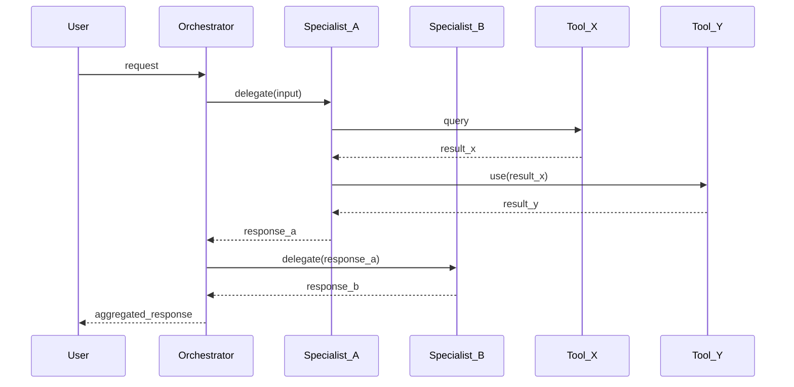
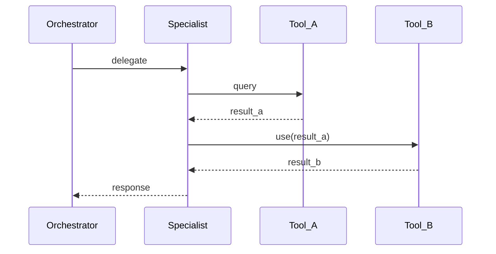
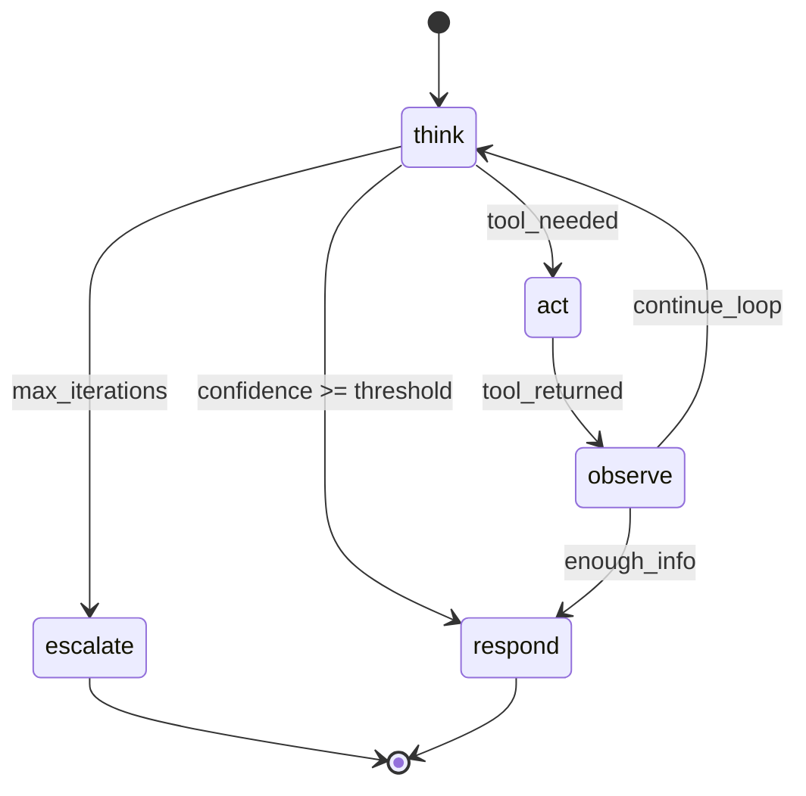
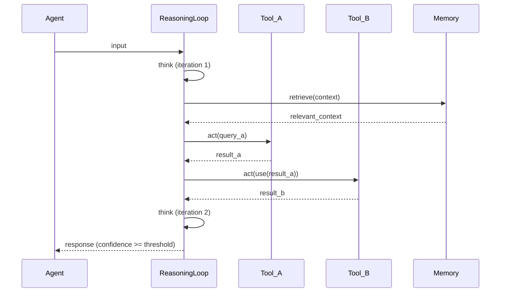
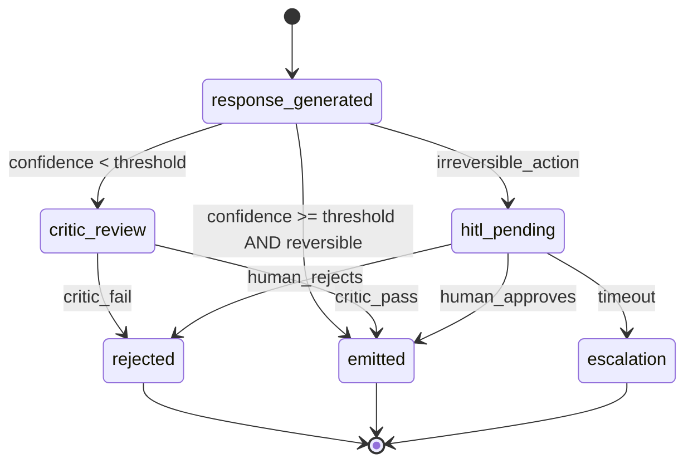
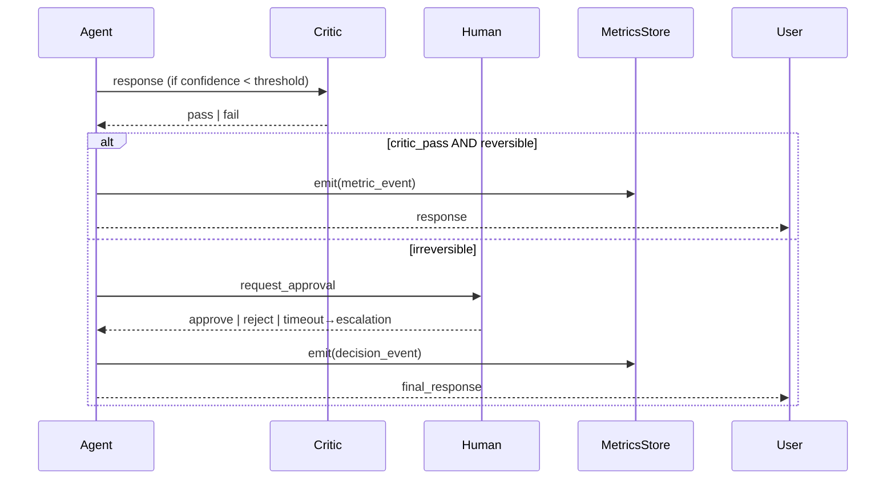
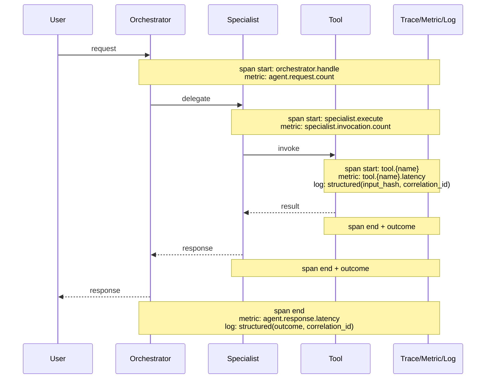
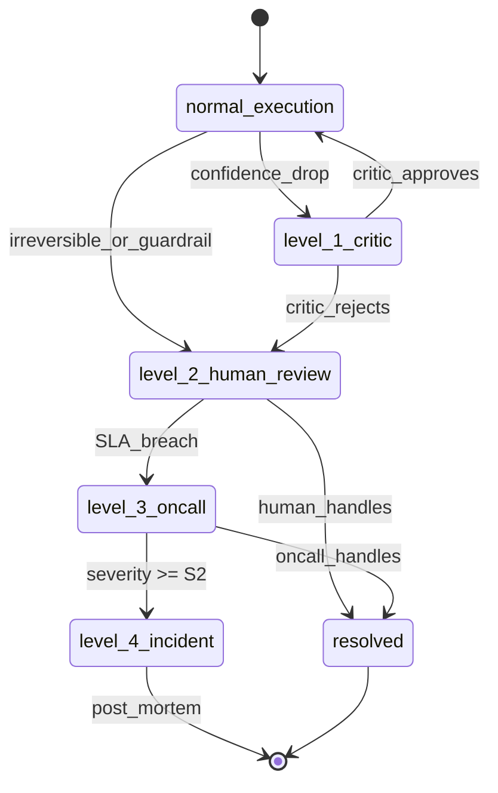
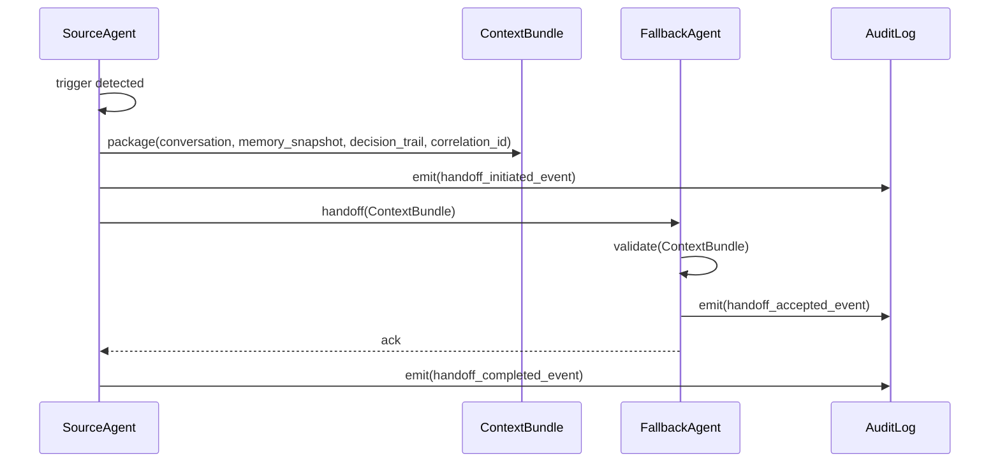

# Codex: Documentos de Design de Agent — Estrutura e Templates

> **Prefixo:** `codex-` | **Tipo:** Manual de Referência | **Escopo:** Plataforma Guardia — templates e convenções para documentos do eixo Agent Design

## Estrutura Canônica

```
docs/
└── {context}/                          # Capability (Bounded Context em kebab-case)
    ├── agents/
    │   └── {agent}/                    # 13 arquivos por agente (Hub & Spoke)
    │       ├── overview.md             # seção 1
    │       ├── orchestrator.md         # seção 2
    │       ├── specialists/            # seção 3 — collection
    │       │   └── {name}.md
    │       ├── tools.md                # seção 4
    │       ├── memory.md               # seção 5
    │       ├── reasoning-loop.md       # seção 6
    │       ├── feedback.md             # seção 7
    │       ├── context-pack.md         # seção 8
    │       ├── system-prompt.md        # seção 9
    │       ├── metrics.md              # seção 10
    │       ├── guardrails.md           # seção 11
    │       ├── authorization.md        # seção 12
    │       └── escalation.md           # seção 13
    ├── dooc/
    │   └── {agent-name}.md             # seção 14 — DoOC snapshot por agent (sibling, não filho)
    └── feature-agent-map.md            # seção 15 — correlação m:n com Feature Design (no root)
```

> **Eixo paralelo — Feature Design.** `entities/`, `oas/`, `events/`, `features/`, `metrics/` NÃO vivem sob este Codex — eles compõem o eixo Feature Design e são governados por `codex-feature-design-docs` + `lex-feature-design-docs`. A correlação m:n entre features e agents é declarada em `feature-agent-map.md` (seção 15) com cross-refs bidirecionais (`served_by_agents` em features ↔ `serves_features` em agents).

### Convenções

| Item | Regra |
|------|-------|
| `{context}` | Capability (Bounded Context) em kebab-case. Ex.: `Reconciliation` → `reconciliation` |
| `{agent}` | kebab-case do nome do agente. Ex.: `RecClassifier` → `rec-classifier/` |
| Arquivos de `specialists/` | `{specialist-name}.md` em kebab-case. **Máximo de 5 specialists por agente** — acima disso, reconsiderar a arquitetura (specialists adicionais viram agentes próprios) |
| Arquivo de `dooc/` | `{agent}.md` (mesmo slug do agent) |
| `feature-agent-map.md` | Arquivo único no root da capability (não dentro de subpasta) |
| Idioma | conforme `language.default` em `.ahrena/.directives` |
| Padrão DDD | Hub & Spoke (orchestrator central + N specialists subordinados) |

Os 13 arquivos por agente cobrem as **6 Diretrizes** (Identidade, Memória, Ferramentas, Feedback, Escopo, Contexto) mais os conceitos de runtime distintos: **`feedback`, `guardrails`, `reasoning-loop`, `authorization` e `escalation` são conceitos distintos e não se sobrepõem** — feedback é o sinal de retorno após a ação, guardrails são restrições de runtime em I/O, reasoning-loop é o padrão cognitivo do agent, authorization é a permissão de ação, escalação é o protocolo de handoff. **`dooc/{agent}.md` vive fora de `agents/`** (sibling, não filho) porque é artefato de governança (gate de promoção `pre-operational` → `operational-concrete`), não estrutura do agent.

## Templates

### 1. `agents/{agent}/overview.md`

Cabeçalho DDD-style do agente: propósito, stage tag, entry mode, tier, owner e referências cruzadas. É o ponto de entrada para qualquer humano ou agente que abre a pasta `{agent}/`.

````markdown
# Agent: {AgentName}

> **Stage:** `pre-operational` | `operational-concrete` | `legacy-pov`
> **Entry mode:** `with-pov` | `direct-entry` | `user-override`
> **Tier:** `tier-1` | `tier-2` | `tier-3` | `tier-4`
> **Owner:** @{username} (product) + @{username} (engineering)
> **Bounded Context:** {context}
> **authored_by:** `warrior-metis`
> **PR ref:** {owner/repo#NNN ou commit SHA da promoção}

## Propósito

{2 a 4 frases descrevendo o problema de negócio que o agente resolve. Foque no valor entregue, não na implementação. Exemplo: "Classifica transações bancárias em categorias contábeis para reduzir tempo de fechamento mensal de 14 para 9 dias úteis."}

## Stage tag

- **Valor declarado:** `stage: {valor}`
- **Critério de promoção:** {referência à DoOC em `../dooc/{agent}.md` quando `operational-concrete`; gaps declarados quando `pre-operational` ou `legacy-pov`}

## Entry mode

- **Modo declarado:** `{with-pov | direct-entry | user-override}`
- **ADR/PDR de override:** {path em `docs/adr/` ou `docs/pdr/`, ou `N/A` quando `with-pov`}

## Serves features

Features que este agent serve (forward mapping da correlação m:n). DEVE ser reflexa em `features/{feature}.md` campo `served_by_agents` e no forward mapping de `feature-agent-map.md`. Inconsistência bidirecional bloqueia em Gate 2.

| Feature | Coverage | Notas |
|---------|----------|-------|
| `{feature-name}` | default \| edge case \| exclusive | ... |

```yaml
# Forma estruturada (consumida por warrior-metis/warrior-athena na verificação cruzada):
serves_features:
  - feature: {feature-name}
    coverage: default | edge-case | exclusive
```

## Persona

{Papel, domínio, recusas, tom. Referenciar `lex-brand-voice` para voz Guardia.}

## Escopo

{Casos de uso cobertos; cenários fora do escopo enumerados com recusa explícita.}

## Estados (entre specialists)

```mermaid
stateDiagram-v2
    [*] --> {estado_inicial}
    {estado_inicial} --> {specialist_1_ativo}: {trigger}
    {specialist_1_ativo} --> {specialist_2_ativo}: {trigger}
    {specialist_2_ativo} --> {estado_final}: {trigger}
    {estado_final} --> [*]
```

## Workflow (com tools e dependências)



## Por que existe

{2 a 4 frases. Foque na fatia do problema que este specialist resolve e por que faz sentido isolá-lo do orquestrador.}

## Responsabilidades

- {responsabilidade 1}
- {responsabilidade 2}
- {responsabilidade 3}

## Estados

```mermaid
stateDiagram-v2
    [*] --> {estado_inicial}
    {estado_inicial} --> {estado_intermediario}: {trigger}
    {estado_intermediario} --> {estado_final}: {trigger}
    {estado_final} --> [*]
```

## Workflow com tools



## Tools consumidas (subset)

| Tool | Tipo | Side-effects | Idempotente |
|------|------|--------------|:-----------:|
| `{tool_name}` | deterministic \| ML \| MCP | none \| write \| network | Sim/Não |

## Memória consumida (subset)

| Camada | Schema referenciado | TTL |
|--------|---------------------|-----|
| curta \| média \| longa | `{schema}` | {valor} |

## Erros emitidos

| Code | Reason | Mensagem |
|------|--------|----------|
| `ERR400_INVALID_PARAMETER` | `INVALID_INPUT` | "..." |

## Deterministic

| Tool | Pydantic signature | Permissões | Side-effects | Idempotente |
|------|---------------------|------------|--------------|:-----------:|
| `validate_account(account_id: UUID) -> ValidationResult` | leitura | none | Sim |
| `normalize_currency(amount: int, from_currency: str, to_currency: str) -> int` | none | none | Sim |

## ML

| Tool | Pydantic signature | Modelo | Side-effects | Idempotente |
|------|---------------------|--------|--------------|:-----------:|
| `classify_transaction(text: str) -> Category` | classifier-v3 | none | Sim (mesmo input, mesmo output) |

## MCP

| Tool | Server | Transport | Side-effects | Idempotente |
|------|--------|-----------|--------------|:-----------:|
| `github.get_file(...)` | `github` | remote-http | leitura | Sim |
| `slack.send_message(...)` | `slack` | remote-http | write (notificação) | Não (requer `Idempotency-Key` per `lex-idempotency`) |

> **MCP tools** seguem `lex-mcp` (transport preference order, fallback behavior, allow-list via `mcp.servers` em `.ahrena/.directives`). Toda tool listada na seção MCP DEVE referenciar o server correspondente em `mcp.servers`.

## Idempotência

Tools que modificam estado DEVEM declarar comportamento de idempotência per `lex-idempotency` (chave + janela + payload-hash quando aplicável).

## Validação de input em fronteira

Cada tool DEVE validar input em sua fronteira via Pydantic (per `lex-python-security`); inputs inválidos retornam erro estruturado e não chegam ao corpo da função.

## Camadas

| Camada | Schema | Store | TTL | Retenção | PII handling |
|--------|--------|-------|-----|----------|--------------|
| curta | `SessionContext` | janela do LLM | sessão | n/a | dados em trânsito; nunca persistido fora da sessão |
| média | `CustomerHistory` | Redis | 30d (rolling) | 30d (per `lex-data-retention` — classe `operational-context`) | CPF mascarado; email hash; nunca conteúdo bruto |
| longa | `DomainRules` | Postgres (versionado) + vector store | indefinido (versionado por SHA) | per `lex-data-retention` — classe `domain-knowledge` (revisão trimestral) | dados de regra (sem PII) |

## Camada curta

{Definição do schema da janela; campos preservados entre turnos da mesma sessão; limite de tokens.}

## Camada média

{Schema do histórico; chave de busca (entity_id, customer_id); estratégia de invalidação; quem escreve (orchestrator vs. specialists).}

## Camada longa

{Estratégia de RAG quando aplicável; versionamento de regras; processo de atualização (PR, ADR quando estrutural).}

## Right to be forgotten

Camada média DEVE suportar deleção on-request per `lex-data-retention` (LGPD Art. 18 / GDPR Art. 17) dentro do SLA de 15 dias.

## Padrão escolhido

{Nome do padrão + justificativa em 2-4 frases. Por que este padrão para este agent? Que tipo de problema ele resolve melhor que alternativas?}

## Estados do loop



## Workflow (com tools e dependências)



## Parâmetros operacionais

| Parâmetro | Valor | Justificativa |
|-----------|-------|---------------|
| `max_iterations` | N | {balanço entre cobertura e custo de tokens} |
| `confidence_threshold` | 0.X | {calibrado contra dataset de validação} |
| `token_budget_per_loop` | N | {limite duro; loop aborta se excedido} |
| `temperature` | 0.X | {alta para exploração, baixa para determinismo} |

## Encadeamento com outros arquivos

- O loop **chama tools** declaradas em `tools.md`; dependências entre tools (qual consome output de qual) são canonizadas no `sequenceDiagram` acima.
- O loop **consulta memória** declarada em `memory.md` (camadas curto/médio/longo) durante o estado `think`.
- O loop **emite sinais de feedback** capturados em `feedback.md` (critic, métricas) — feedback é consequência, não parte do loop.
- O loop **escala** para humano/outro agent via protocolo em `escalation.md` quando `max_iterations` é atingido ou guardrail bloqueia ação.

## Modalidades

| Modalidade | Quando | Bloqueante | Latência alvo |
|------------|--------|:----------:|---------------|
| HITL | ações irreversíveis (per `codex-ai-first-experience`) | Sim | < 4h business |
| Critic LLM | ações reversíveis em batch | Não | < 30s |
| Métricas objetivas | sempre | Não | dashboard em tempo real |

## Estados do loop



## Sequência (HITL + critic + métricas)



## Métricas objetivas

| Métrica | Tipo | Threshold | Janela | Dashboard |
|---------|------|-----------|--------|-----------|
| `accuracy` | leading | >= 0.92 | 7d, n >= 500 | {link} |
| `reversal_rate` | lagging | <= 0.05 | 30d | {link} |
| `time_to_action` | lagging | <= 9d (vs. baseline 14d) | mensal | {link} |

> Tier-1/2 dispara SLO formal per `lex-slo-required`; tier-3/4 mantém métricas (b) e (c) da DoOC mesmo sem SLO formal.

## Escalation matrix

| Trigger | Ação | Canal |
|---------|------|-------|
| timeout HITL > 4h | escalation para owner | Slack @{owner} |
| reversal_rate > 0.10 (24h) | pause + critic-only | runbook em `docs/runbooks/` |

## Few-shot examples

| ID | Input | Output esperado | Origem | Categoria |
|----|-------|-----------------|--------|-----------|
| FS-001 | "..." | "..." | cliente piloto | classificação típica |
| FS-002 | "..." | "..." | revisão humana | edge case |

Mandatório: 5-15 exemplos em `pre-operational`; ≥10 curados em `operational-concrete`.

## Exemplos negativos

| ID | Input | Output errado (a evitar) | Por que falha | Origem |
|----|-------|--------------------------|---------------|--------|
| NEG-001 | "..." | "..." | extrapolação fora de escopo | incidente 2026-03-12 |

Mandatório: 3-5 em `pre-operational`; ≥10 cobrindo modos de falha observados em `operational-concrete`.

## Documentação de domínio

| Path | Quando consultar |
|------|------------------|
| `docs/{context}/rules/{rule}.md` | regras de negócio versionadas |
| `docs/{context}/entities/{entity}.md` | definição da entidade alvo |

## Histórico observado (RAG)

| Janela | Estratégia | Atualização |
|--------|-----------|-------------|
| últimos 30-90d | embeddings em vector store; top-K=5 | diária |

> Mandatório apenas em `operational-concrete`; opcional em `pre-operational` (`--from-pov` enriquece quando promovido a partir de PoV).

## Prompt aplicado

```text
# Agent: {agent-name}
# stage: {valor}
# DoOC: {referência a ../dooc/{agent}.md quando operational-concrete; gaps quando pre-operational}
# tier: {valor}
# Owner: @{username}
# Manual: docs/{context}/agents/{agent}/overview.md

{Corpo do system prompt — papel, domínio, recusas, tom, ferramentas disponíveis, feedback.}
```

## Controles aplicados

| Controle OWASP LLM | Mecanismo | Localização |
|--------------------|-----------|-------------|
| LLM01 (prompt injection) | guardrail de detecção + sanitização | `guardrails.md` |
| LLM02 (insecure output) | output schema + validação | `tools.md` |
| LLM06 (sensitive disclosure) | PII redaction | `guardrails.md` |
| LLM07 (insecure plugin) | tools allow-list | `tools.md` |
| LLM05 (supply chain) | MCP allow-list | `lex-mcp` |

## Histórico de versões

| Versão | Data | Mudança | ADR (quando breaking) |
|--------|------|---------|------------------------|
| v1 | YYYY-MM-DD | versão inicial | n/a |

> Mudanças instantâneas por default; ADR obrigatória para breaking changes (mudança de stage, mudança em DoOC, remoção de Diretriz).

## Request lifecycle com pontos de instrumentação



## SLOs declarados

```yaml
# Referenciar arquivo canônico: docs/{context}/metrics/slo-{agent}.yaml
service: {agent-name}
tier: {tier}
slos:
  - name: response_latency_p99
    sli: agent.response.latency.p99
    objective: < 2000ms
    window: 30d
  - name: classification_accuracy
    sli: classifier.accuracy (rolling)
    objective: >= 0.92
    window: 7d
```

## Dashboards

| Dashboard | Métricas chave | Link |
|-----------|----------------|------|
| `{agent}-overview` | request rate, error rate, p99 latency, accuracy | {link} |
| `{agent}-cost` | LLM token usage, tool invocations, total cost | {link} |

## Alertas e runbooks

| Alerta | Threshold | Runbook |
|--------|-----------|---------|
| `{agent}-error-rate-high` | error_rate > 5% (5m) | `docs/runbooks/{agent}-error-rate-high.md` |
| `{agent}-accuracy-drop` | accuracy < 0.85 (24h) | `docs/runbooks/{agent}-accuracy-drop.md` |

> Per `lex-runbook-for-every-alert`, todo alerta DEVE ter runbook versionado e vinculado na annotation `runbook_url`.

## Trace + metric + log obrigatórios

Per `lex-observability-required`, cada superfície de runtime nova (orchestrator, specialist, tool) DEVE emitir span + métrica de latência + log estruturado com `correlation_id`. Logs NÃO PODEM conter PII bruto.

## Controles OWASP LLM Top 10

| ID | Risco | Controle aplicado | Localização |
|----|-------|--------------------|-------------|
| LLM01 | Prompt injection | detecção de patterns + sanitização de input + system prompt rígido | sanitizer em fronteira |
| LLM02 | Insecure output handling | schema obrigatório no output; rejeição quando schema inválido | `tools.md` |
| LLM05 | Supply chain | MCP allow-list via `mcp.servers`; tools assinadas | `lex-mcp` |
| LLM06 | Sensitive disclosure | PII redaction em logs; output filter de dados sensíveis | redactor + filter |
| LLM07 | Insecure plugin design | tools com permissões mínimas; least-privilege | `tools.md` |

## Escopo de ação (Diretriz 05)

Recusas explícitas que o agente DEVE emitir:

- Perguntas fora do domínio declarado: "{recusa-1}"
- Solicitações de dados de outro `org_id` ou `client_id`: "{recusa-2}"
- Operações que requerem aprovação humana sem HITL ativo: "{recusa-3}"

## Isolamento multitenancy

Toda chamada de tool e toda leitura de memória DEVE filtrar por `org_id` e `client_id` da sessão. O agente NÃO PODE acessar dados de outro tenant — mesmo via prompt-injection. Quando filtro não aplicado: erro estruturado e log de violação.

## Redação de PII

Em logs (per `lex-observability-required`): CPF mascarado (últimos 4 dígitos), email hash, nome substituído por `<redacted-name>`, número de conta truncado. Conteúdo bruto NUNCA persiste em log; persistência apenas na camada média de memória com retenção declarada per `lex-data-retention`.

## LGPD / GDPR

- Direito ao esquecimento: deleção on-request em até 15d (LGPD Art. 18).
- Direito à portabilidade: export estruturado da memória média sob solicitação.
- Base legal de processamento: declarada por contexto (consentimento, contrato, interesse legítimo).

## Catálogo de ações permitidas

| Ação | Escopo | Tipo | Aprovação requerida | Tool relacionada |
|------|--------|------|:-------------------:|------------------|
| `read_transaction` | tenant scope (`org_id` + `client_id`) | read | não | `get_transaction` |
| `classify_transaction` | per-transaction | mutate (label only, reversível) | não (critic LLM) | `classify` |
| `post_journal_entry` | per-transaction | mutate (irreversível) | **HITL obrigatório** per `feedback.md` | `post_entry` |
| `delete_transaction` | per-transaction | irreversível | **HITL obrigatório** + ADR de exceção | — (proibido por default) |

## Permissões por tier

| Tier | Permissões adicionais ou restrições |
|------|--------------------------------------|
| tier-1 | Todas as ações `irreversível` requerem HITL ativo + observability span dedicado |
| tier-2 | HITL obrigatório para ações `irreversível` em transações > R$ 10.000 |
| tier-3/4 | Critic LLM substitui HITL para `irreversível` em batch (com rollback budget declarado) |

## Mapeamento IAM/RBAC

| Recurso | Permission set | Role/Policy |
|---------|----------------|-------------|
| Database (tenant tables) | `read`, `write` (com filtro `org_id`+`client_id`) | `{agent}-data-role` |
| Event bus (publish) | `publish` em `event.guardia.{module}.{entity}.*` | `{agent}-publisher-role` |
| Secret manager | `read` em `agent/{name}/*` | `{agent}-secrets-role` |
| MCP servers | per `lex-mcp` allow-list (declarado em `tools.md`) | — |

## Recusas explícitas

O agent **DEVE** recusar (com mensagem estruturada de erro per `lex-error-handling`) quando:

- Solicitação cruza tenant boundary (`org_id` ou `client_id` divergem do contexto)
- Ação não está no catálogo acima
- Ação requer HITL e nenhum aprovador está disponível dentro do SLA declarado

## Auditoria

Toda execução de ação `mutate` ou `irreversível` emite evento `event.guardia.agents.{agent}.action.executed` com `action_id`, `permission_used`, `actor` (`org_id`+`user_id`), `correlation_id`. Retenção per `lex-data-retention` classe `audit-logs`.

## Triggers

| Trigger | Origem | Destino | SLA de resposta |
|---------|--------|---------|-----------------|
| `confidence < threshold_critical` | `reasoning-loop.md` | humano (HITL) | 4h business |
| `reversal_rate > threshold (24h)` | `feedback.md` (critic) | humano (owner) | 1h business |
| `max_iterations reached` | `reasoning-loop.md` | humano OU agent {fallback-name} | conforme tier |
| `authorization denied` (ação requer aprovação) | `authorization.md` | humano (aprovador HITL) | conforme `feedback.md` |
| `guardrail violation` | `guardrails.md` | humano (Security) + log de violação | 30min |
| `user explicit request` | input do usuário ("transfira para humano") | humano | imediato |

## Níveis de escalação



## Handoff entre agents (quando aplicável)



## Contrato de handoff

O `ContextBundle` transferido **DEVE** conter:

- `conversation_id` + transcript completo (input do usuário, respostas intermediárias, ferramentas chamadas)
- Snapshot da memória **média** (episódica) — não a longa (preserva isolamento)
- `decision_trail` — sequência de decisões do `reasoning-loop` com confidence por etapa
- `correlation_id` para rastreio cross-agent em `metrics.md`
- Razão da escalação (trigger acima) + tier do agent original

O `ContextBundle` **NÃO PODE** conter:

- Credenciais (mesmo da sessão original)
- `org_id` ou `client_id` em texto livre (apenas em campos estruturados isolados)
- Memória **longa** (vector store completo) — só referências

## Destinos válidos

| Destino | Quando | Como acionado |
|---------|--------|---------------|
| Humano (HITL) | aprovação irreversível, guardrail, request explícito | Slack webhook + e-mail per `feedback.md` matriz |
| Humano (on-call) | SLA breach do HITL, severity ≥ S2 | PagerDuty per `lex-runbook-for-every-alert` |
| Agent {fallback-name} | `max_iterations` em loop quando há agent especializado para edge case | direct invocation com `ContextBundle` |
| Incidente formal | guardrail violation S1, dados vazaram, financial impact | per `codex-incident-response` |

## Items DoOC

### (a) Origem do PoV declarada

- **Evidence:** `docs/{context}/agents-pov/{agent}/pov.md` | `N/A — direct-entry` | `N/A — user-override`
- **Notes:** {quando N/A, justificativa do override}

### (b) Métrica leading provada

- **Evidence:** {número + threshold + janela; ex.: `accuracy >= 0.92 em janela de 7 dias com n≥500`} | `N/A — direct-entry (alvo declarado: ...)` | `N/A — user-override`
- **Notes:** {obrigatória em todos os tiers; ver `codex-agent-construction-directives` — DoOC item (b)}

### (c) Métrica lagging declarada

- **Evidence:** {KPI de negócio + baseline + alvo; ex.: `tempo de fechamento: baseline 14d, alvo 9d`} | `N/A — direct-entry` | `N/A — user-override`
- **Notes:** {obrigatória em todos os tiers}

### (d) Escopo estabilizado (sem mudança nas últimas 2 semanas)

- **Evidence:** {SHA do commit em `docs/{context}/agents-pov/{agent}/scope.md` + data ≥ 14d atrás} | `N/A — direct-entry (escopo inicial declarado)` | `N/A — user-override`
- **Notes:**

### (e) Observability data do PoV disponível (mínimo 7 dias)

- **Evidence:** {link para dashboard + janela de 7d coberta} | `N/A — direct-entry (observability será instrumentada do dia 0)` | `N/A — user-override`
- **Notes:**

### (f) Stakeholder owner identificado

- **Evidence:** @{username} + papel + canal de escalonamento (Slack handle + email)
- **Notes:**

### (g) Capacidade de implementação confirmada

- **Evidence:** sprint do `warrior-apollo-agents` agendada | ADR declarando caminho alternativo em `docs/adr/`
- **Notes:**

### (h) Tier de criticidade declarado

- **Evidence:** `tier-1` | `tier-2` | `tier-3` | `tier-4` (tier-1/2 dispara SLO obrigatório per `lex-slo-required`; tier-3/4 NÃO dispensa as métricas (b) e (c))
- **Notes:**

### (i) Stage explícito no system prompt

- **Evidence:** `stage: operational-concrete` literal em `agents/{agent}/system-prompt.md` linha {N}
- **Notes:**

## Aprovação

- [ ] Mêtis confirmou que evidências citadas estão verificadas
- [ ] Para `entry_mode` ≠ `with-pov`: ADR/PDR aprovado e referenciado acima
- [ ] Owner ciente e responsável (campo "Promoted by" preenchido)

## Mapeamento Feature → Agents

| Feature | Served by Agents | Tier | Notas |
|---------|------------------|------|-------|
| `feature-x` | `agent-a`, `agent-b` | tier-1 | agent-a default; agent-b edge cases |
| `feature-y` | `agent-c` | tier-2 | exclusivo |

## Reverse mapping (per agent)

| Agent | Serves Features | Coverage |
|-------|-----------------|----------|
| `agent-a` | `feature-x`, `feature-z` | default em x; primary em z |
| `agent-b` | `feature-x` | edge cases |
| `agent-c` | `feature-y` | exclusivo |

## Lifecycle correlation

- Feature deprecada → agents servindo DEVEM ser reassessed (handoff para feature substituta ou sunset)
- Novo agent → DEVE declarar `serves_features` (forward); cada feature listada DEVE atualizar `served_by_agents` (backward)
- Consistência bidirecional verificada por `warrior-prometheus` (features) + `warrior-metis` (agents) ao final do ciclo de design

## Relações Cruzadas (intra-agent)

Os 13 arquivos de cada agent e o snapshot DoOC se referenciam:

| De → Para | Referência |
|-----------|------------|
| `agents/{agent}/orchestrator.md` → `specialists/` | Orchestrator lista os specialists subordinados (Hub & Spoke) |
| `agents/{agent}/specialists/{s}.md` → `agents/{agent}/tools.md` | Specialist declara o subset de tools que consome |
| `agents/{agent}/specialists/{s}.md` → `agents/{agent}/memory.md` | Specialist declara o subset de memória que consulta |
| `agents/{agent}/reasoning-loop.md` → `tools.md`, `memory.md` | Loop chama tools (com dependências entre tools) e consulta memória durante `think` |
| `agents/{agent}/reasoning-loop.md` → `escalation.md` | Loop escala quando `max_iterations` é atingido |
| `agents/{agent}/feedback.md` → `escalation.md` | Feedback (critic/HITL) escala em violação |
| `agents/{agent}/authorization.md` → `feedback.md`, `escalation.md` | Ação proibida dispara HITL ou escalação |
| `agents/{agent}/guardrails.md` → `escalation.md` | Guardrail violation força handoff a Security |
| `agents/{agent}/system-prompt.md` → `guardrails.md` | System prompt referencia os controles OWASP aplicados |
| `agents/{agent}/tools.md` (Type=MCP) → `lex-mcp` | Tools tipo MCP referenciam `lex-mcp` para preferência de transporte e fallback |
| `dooc/{agent}.md` → `agents/{agent}/`, `lex-agent-construction-directives` | Snapshot da DoOC referencia o agent e a HARD-GATE com os 9 itens |
| `agents/{agent}/overview.md` (campo `serves_features`) → `feature-agent-map.md` | Forward declaration consumida pelo reverse mapping do mapa |
| `feature-agent-map.md` → `features/{f}.md` (eixo Feature Design) | Forward mapping (feature → agents) reflete `served_by_agents` em cada feature — declarado em `codex-feature-design-docs` |

A consistência cruzada do eixo Agent é verificada por `warrior-metis` ao final do ciclo. A consistência bidirecional com features (`feature-agent-map.md` ↔ `features/{f}.md` / `agents/{agent}/overview.md`) é coordenada com `warrior-prometheus`.

## Restrições

- **`specialists/` é collection (N arquivos), não documento único:** kebab-case ordenável; **máximo de 5 specialists por agente** — acima disso, reconsiderar a arquitetura (specialists adicionais viram agentes próprios).
- **`reasoning-loop`, `feedback`, `guardrails`, `authorization`, `escalation` são conceitos distintos** — não misturar. Loop é cognição interna; feedback é sinal pós-ação; guardrails são restrições em I/O; authorization é catálogo de permissões; escalation é protocolo de handoff. Sobreposição é code smell — refatorar para reduzir duplicação por composição (cross-link), não por mistura conceitual.
- **`dooc/` vive fora de `agents/`:** snapshot da DoOC é artefato de governança, não estrutura do agent. Mover `dooc/{agent}.md` para dentro de `agents/{agent}/` é PROIBIDO.
- **`dooc/{agent}.md` é preenchido pelo `warrior-metis`:** evidências citadas DEVEM ser verificáveis; placeholder ou TODO é PROIBIDO em snapshot `operational-concrete`. Quando `entry_mode` ≠ `with-pov`, ADR ou PDR é obrigatório.
- **Mudanças em arquivos de `agents/` são instantâneas por default:** ADR obrigatória apenas para breaking changes (nova/removida Diretriz, mudança em itens da DoOC, mudança de stage).
- **`feature-agent-map.md` é resumo derivado, nunca fonte primária:** em divergência, `agents/{agent}/overview.md` (campo `serves_features`) é fonte para reverse mapping; `features/{f}.md` (campo `served_by_agents`, declarado em `codex-feature-design-docs`) é fonte para forward mapping. Editar o mapa sem atualizar a fonte é PROIBIDO.
- **`overview.md` campo `serves_features` é obrigatório em `operational-concrete`:** sem ele, a HARD-GATE de `lex-agent-design-docs` reprova promoção. Em `pre-operational` o campo pode estar vazio enquanto features não estão modeladas.
- **Mover `features/`, `entities/`, `oas/`, `events/` para dentro deste Codex é PROIBIDO:** eles vivem sob `codex-feature-design-docs` + `lex-feature-design-docs`. Feature Design e Agent Design são eixos paralelos, não hierárquicos.
