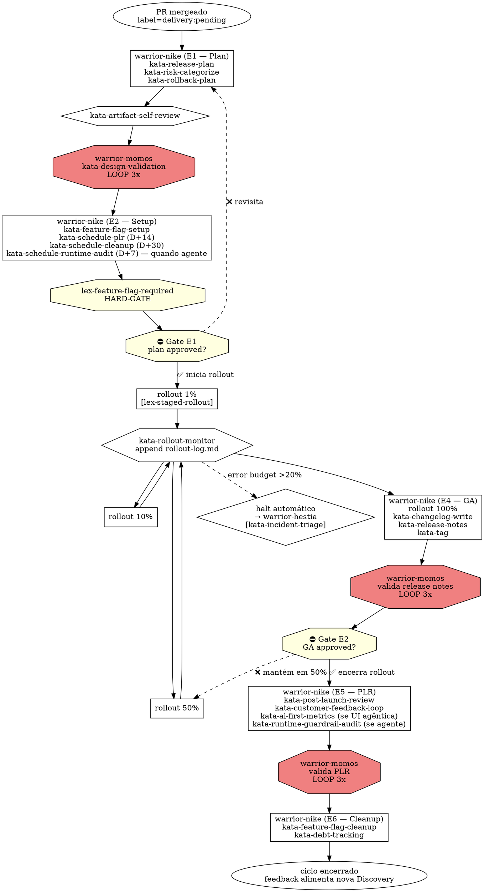

# Product Delivery — do DoD ao cliente

> **Status:** proposta v3 (refinada com 6 sub-fases + 2 Gates, Mômos validador, auto-schedule, AI-First metrics, delivery diferenciado para agentes da plataforma) · **Escopo:** Plataforma Guardia · **Fase:** PR mergeado → release plan → setup → rollout → GA → PLR → cleanup

---

## 1. Escopo

Cobre tudo que acontece **depois** que o PR é mergeado e **até** a feature estar estável em produção, com flag removida e impacto medido. Entrada: PR mergeado com DoD atendido (saída de [Product Development](product-development.md)). Saída: feature em GA, métrica de sucesso validada, débito de feature flag zerado.

**Mudanças vs. v2:**

1. **6 sub-fases (E1–E6) + 2 Gates internos.** Mesmo padrão de [warrior-athena](../framework/pt-BR/engineering/workflow/warriors/warrior-athena.md) (7 fases / 2 gates) e [Product Discovery](product-discovery.md) (5 fases / 2 gates) — concentra decisão humana onde realmente importa.
2. **Mômos valida release plan e PLR** em loop 3x antes de submeter a humano. Mesmo padrão de Development.
3. **Delivery diferenciado para agentes da plataforma.** Quando a feature criou ou alterou agente via Hécate Modo B, Delivery aplica checks adicionais (verificação de guard-rails em runtime, métricas específicas).
4. **Auto-schedule é first-class.** Niké agenda PLR (D+14), cleanup (D+30) e — quando agente — Mômos runtime audit (D+7) via `/schedule` no momento E2 (Setup).
5. **Self-review antes do humano.** `kata-artifact-self-review` aplicado em release plan e PLR — reduz iteração.
6. **AI-First metrics no PLR.** Quando feature tem componentes Copilot/Isac, PLR mede uso de conversa, transparência do raciocínio, controle graduado.

---

## 2. Princípios da fase

1. **Merge ≠ entrega.** PR mergeado é marco intermediário. A feature só está entregue quando o cliente usa e a métrica de sucesso confirma o resultado.
2. **Rollout gradual por padrão.** Features com risco de regressão MUST ter feature flag e progressão 1% → 10% → 50% → 100%, com gate de SLO entre etapas. Reforçado por [lex-staged-rollout](#62-lex-staged-rollout-novo).
3. **PLR é obrigatório.** Toda feature relevante MUST ter Post-Launch Review em até 14 dias após GA — ou ela não foi entregue, foi abandonada.
4. **Flag é débito, não infraestrutura.** Feature flag tem deadline de remoção (30 dias após GA estável). Sem isso, vira complexidade permanente.
5. **Decisão de rollout segue evidência, não intuição.** Métricas durante rollout decidem progressão; halt automático se SLO degrada.
6. **Spec de agente da plataforma se comporta diferente em rollout.** Mudança de prompt/guard-rail é mais perigosa que mudança de código (efeito sutil, difícil de testar). Exige rollout mais conservador e Mômos runtime audit.
7. **Self-review e validação adversarial antes do humano.** `kata-artifact-self-review` + Mômos antes de submeter artefatos importantes a humano.
8. **HARD-GATEs explícitos.** Aplicação consistente do [lex-hard-gate-pattern](product-development.md#61-lex-hard-gate-pattern-meta-lex) em decisões irreversíveis ou de alto impacto.

---

## 3. As 6 sub-fases internas + 2 Gates

| Sub-fase | Nome | Executor principal | Saída |
|---|---|---|---|
| **E1** | Plan | Niké | `docs/releases/{feature}/plan.md` (validado por Mômos) |
| **E2** | Setup | Niké | feature flag criada + auto-schedule de PLR / cleanup |
| ⛔ **Gate E1** | **Plan approved** (humano) | (decisão humana) | autorização para iniciar rollout |
| **E3** | Rollout | Niké + [warrior-hestia](../framework/pt-BR/engineering/sre/warriors/warrior-hestia.md) (incidentes) | `docs/releases/{feature}/rollout-log.md` (append-only) |
| **E4** | GA | Niké | feature em 100% + tag de release |
| ⛔ **Gate E2** | **GA approved** (humano) | (decisão humana) | autorização para fechar rollout |
| **E5** | PLR + Feedback | Niké | `docs/releases/{feature}/plr.md` (validado por Mômos) |
| **E6** | Cleanup | Niké | flag removida + débito zerado |

**Gate E1 — Plan approved** (entre E2 e E3):
- Apresenta ao humano: release plan + feature flag configurada + auto-schedules + categoria de risco
- Critério de passagem: aprovação explícita humana
- Se falhar: volta para E1 com feedback (ex.: "estratégia muito agressiva para essa categoria de risco")

**Gate E2 — GA approved** (entre E4 e E5):
- Apresenta ao humano: rollout-log completo + métricas de sucesso observadas + incidentes ocorridos
- Critério de passagem: aprovação explícita humana para encerrar rollout
- Se falhar: volta para E3 com feedback (ex.: "mantém em 50% mais 7 dias antes de GA")

---

## 4. Warriors

### 4.1 `warrior-nike` — Delivery Orchestrator (refinado)

**Mitologia:** Niké = vitória. Encaixa com "delivery bem-sucedido". Não confundir com Atena (sabedoria/processo) — Niké é o desfecho.

**Posicionamento:** orquestrador master de Delivery. Acionada quando PR é mergeado em `main` com label `delivery:pending` (aplicada por [kata-pr-prepare](../framework/pt-BR/engineering/workflow/katas/kata-pr-prepare.md) atualizado).

**Não confundir com [warrior-hestia](../framework/pt-BR/engineering/sre/warriors/warrior-hestia.md):** Hestia é SRE/incident response (atua **reativamente** quando algo quebra). Niké é Delivery (atua **proativamente** durante o rollout). Cooperam: Niké monitora SLO durante rollout; se quebra, escala para Hestia via [kata-incident-triage](../framework/pt-BR/engineering/sre/katas/kata-incident-triage.md).

**Não confundir com [warrior-momos](product-development.md#43-warrior-momos--validador-adversarial-novo):** Mômos valida artefatos de Niké (release plan, PLR) antes de submeter a humano. Mesma máquina de loop 3x usada em Development.

**Responsabilidades:**

| Faz | Não faz |
|---|---|
| Orquestra as 6 sub-fases (E1–E6) e aplica Gates E1, E2 | Implementa código (PR já está mergeado) |
| E1 — coordena release plan via `kata-release-plan` | Faz incident response (delega para [warrior-hestia](../framework/pt-BR/engineering/sre/warriors/warrior-hestia.md)) |
| E2 — configura feature flag via `kata-feature-flag-setup` + auto-schedules via `/schedule` | Decide priorização de novas features (volta para Calíope) |
| E3 — monitora rollout via `kata-rollout-monitor` (1% → 10% → 50% → 100%) | Pula etapas de rollout sob pressão de prazo |
| E3 — escala para Hestia em halt automático | Aprova GA sem PLR registrado |
| E4 — gera changelog via `kata-changelog-write` e tag via [kata-tag](../framework/pt-BR/_foundation/contributing/katas/kata-tag.md) | Mantém flag indefinidamente |
| E4 — gera release notes via `kata-release-notes` (pt-BR/en/es) | Pula Mômos sobre release plan ou PLR |
| E5 — faz PLR via `kata-post-launch-review` | Modifica artefatos depois de fechar |
| E5 — coleta feedback via `kata-customer-feedback-loop` | |
| E6 — limpa flag via `kata-feature-flag-cleanup` | |
| Invoca [warrior-momos](product-development.md#43-warrior-momos--validador-adversarial-novo) sobre release plan (E1→E2) e PLR (antes de E5 fechar) | |
| Invoca `kata-artifact-self-review` antes de submeter qualquer artefato a humano | |

**Persona:** estrategista cauteloso — prefere progressão gradual a big bang, escala SLO antes de UX, encerra ciclo formalmente.

---

### 4.2 `warrior-momos` — Validador adversarial (peer com Development)

Mesmo warrior definido em [Product Development → seção 4.3](product-development.md#43-warrior-momos--validador-adversarial-novo). Em Delivery atua sobre:

| Artefato | Quando | Lexis verificadas |
|---|---|---|
| Release plan (E1) | Antes de Gate E1 | [lex-feature-flag-required](#61-lex-feature-flag-required-novo), [lex-staged-rollout](#62-lex-staged-rollout-novo), [lex-slo-required](../framework/pt-BR/engineering/sre/lexis/lex-slo-required.md), [lex-aws-cost](../framework/pt-BR/engineering/devops/lexis/lex-aws-cost.md) |
| PLR (E5) | Antes de submeter humano | [lex-post-launch-review-required](#63-lex-post-launch-review-required-novo), [lex-success-metrics](product-development.md#68-lex-success-metrics), [lex-evidence-required](product-discovery.md#71-lex-evidence-required-novo) |
| Release notes (E4) | Antes de publicar | [lex-release-notes-required](#64-lex-release-notes-required-novo), [lex-brand-voice](../framework/pt-BR/design/brand/lexis/lex-brand-voice.md), [lex-language](../framework/pt-BR/documentation/i18n/lexis/lex-language.md) |

**Loop 3x canônico:** mesma máquina de Development. Após 3ª iteração com desvios remanescentes, escala humano com relatório consolidado.

---

### 4.3 `warrior-hestia` — SRE / Incident Response (existente, sem mudança de papel)

[warrior-hestia](../framework/pt-BR/engineering/sre/warriors/warrior-hestia.md) é invocada por Niké quando halt automático é acionado em E3. Continua atuando per [kata-incident-triage](../framework/pt-BR/engineering/sre/katas/kata-incident-triage.md) e [codex-incident-response](../framework/pt-BR/engineering/sre/codex/codex-incident-response.md). Decisão de continuar rollout ou rollback é dela em conjunto com Niké.

---

## 5. Katas

### 5.1 E1 — Plan (executados por Niké)

| Kata | Função | Saída |
|---|---|---|
| `kata-release-plan` | Plano de release: estratégia (canary/feature flag/staged/dark launch), audiência por etapa, gates de SLO, plano de rollback | `docs/releases/{feature}/plan.md` |
| `kata-risk-categorize` | Classifica feature em categorias de risco — informa estratégia de rollout | seção do `plan.md` |
| `kata-rollback-plan` | Plano de rollback estruturado: passos, decisor, tempo, ponto sem retorno, comunicação | seção do `plan.md` |

**Mômos valida** o release plan antes do Gate E1.

### 5.2 E2 — Setup (executados por Niké)

| Kata | Função | Saída |
|---|---|---|
| `kata-feature-flag-setup` | Configura feature flag respeitando convenção do stack | configuração no provedor + commit do snippet |
| `kata-schedule-plr` | Auto-agenda PLR para D+14 via `/schedule` | task agendada |
| `kata-schedule-cleanup` | Auto-agenda flag cleanup para D+30 via `/schedule` | task agendada |
| `kata-schedule-runtime-audit` (novo) | Quando feature inclui agente — agenda Mômos runtime audit para D+7 | task agendada |
| `kata-rollout-monitor-init` | Configura dashboards e alertas específicos do rollout | dashboard live |

### 5.3 E3 — Rollout (executados por Niké, com Hestia em halt)

| Kata | Função | Saída |
|---|---|---|
| `kata-rollout-progress` | Promove rollout entre etapas (1% → 10% → 50% → 100%) com verificação de SLO | append em `rollout-log.md` |
| `kata-rollout-monitor` | Monitora SLOs e métricas de sucesso continuamente; decide promoção ou halt | leitura contínua + decisão |
| [kata-incident-triage](../framework/pt-BR/engineering/sre/katas/kata-incident-triage.md) (existente) | Invocado em halt automático; entrega para [warrior-hestia](../framework/pt-BR/engineering/sre/warriors/warrior-hestia.md) | `docs/incidents/INC-{n}.md` |

### 5.4 E4 — GA (executados por Niké)

| Kata | Função | Saída |
|---|---|---|
| `kata-changelog-write` | Gera changelog técnico a partir dos commits da release | `CHANGELOG.md` atualizado |
| `kata-release-notes` | Release notes para cliente (pt-BR/en/es) — tom de produto | `docs/releases/{feature}/notes-{lang}.md` |
| [kata-tag](../framework/pt-BR/_foundation/contributing/katas/kata-tag.md) (existente) | Tag semver | tag pushada |
| `kata-customer-comms` | Anúncio interno (Slack) e externo (blog/e-mail) — opcional | mensagens publicadas |

**Mômos valida** release notes antes de publicar.

### 5.5 E5 — PLR + Feedback (executados por Niké)

| Kata | Função | Saída |
|---|---|---|
| `kata-post-launch-review` | PLR estruturado: métricas bateram? aprendizados? próximos passos? | `docs/releases/{feature}/plr.md` |
| `kata-customer-feedback-loop` | Coleta de feedback (NPS, CSAT, in-app, suporte) | seção do `plr.md` + tickets de melhoria |
| `kata-ai-first-metrics` (novo) | Quando feature tem componente Copilot/Isac — métricas específicas (uso de conversa, transparência, controle graduado) | seção do `plr.md` |
| `kata-runtime-guardrail-audit` (novo) | Quando feature inclui agente — audita logs de violação de guard-rail em runtime | seção do `plr.md` |

**Mômos valida** PLR antes de submeter a humano.

### 5.6 E6 — Cleanup (executado por Niké)

| Kata | Função | Saída |
|---|---|---|
| `kata-feature-flag-cleanup` | Remove feature flag após 30 dias estáveis | PR de cleanup |
| `kata-debt-tracking` | Garante que débitos identificados no PLR viraram issues do backlog | issues criadas |

### 5.7 Cross-fase

| Kata | Função |
|---|---|
| `kata-artifact-self-review` | Cross-fase — scan de placeholders, contradições, ambiguidade. Invocado antes de submeter qualquer artefato (release plan, PLR) a humano |

---

## 6. Lexis

### 6.1 `lex-feature-flag-required` (novo)

> Toda feature com risco de regressão (mudanças em pricing, billing, autenticação, compliance, fluxos críticos de cliente, agentes da plataforma) MUST ser ligada por trás de feature flag. Deploy direto sem flag é FORBIDDEN para essa categoria.

**Categorias que sempre exigem flag:**
- Mudanças em billing / pricing
- Mudanças em autenticação / autorização
- Mudanças em fluxos visíveis ao cliente externo
- Migrações de dados que tocam produção
- Integrações com sistemas externos críticos
- Features cobertas por [lex-ai-first-experience](../framework/pt-BR/design/system/lexis/lex-ai-first-experience.md)
- **Mudanças em agente da plataforma** (system prompt, tools, guard-rails) — adicionado em v3

**HARD-GATE textual:**

```
<HARD-GATE>
warrior-nike NÃO MAY iniciar rollout de feature em categoria
listada acima sem que kata-feature-flag-setup tenha:
  (a) flag criada no provedor
  (b) snippet de uso commitado no código (ou spec do agente referenciando flag)
  (c) plano de rollback documentado em docs/releases/{feature}/plan.md
  (d) cleanup auto-agendado para 30 dias após GA
  (e) [quando agente] runtime audit auto-agendado para 7 dias após GA

Esta regra se aplica independentemente de:
  - tamanho percebido da mudança
  - confiança do time ("já testamos muito")
  - urgência ("cliente está esperando")
</HARD-GATE>
```

### 6.2 `lex-staged-rollout` (novo)

> Features que afetam >5% da base ativa (ou são tier-1/2 per [lex-slo-required](../framework/pt-BR/engineering/sre/lexis/lex-slo-required.md)) MUST seguir rollout gradual: 1% → 10% → 50% → 100%, com gate de SLO entre etapas. Tempo mínimo entre etapas: 24h. Halt automático se error budget consome >20% durante a etapa.

**Para agentes da plataforma:** rollout mais conservador — 0.5% → 5% → 25% → 100%, com tempo mínimo de 48h entre etapas. Razão: mudança de prompt/guard-rail tem efeito sutil e difícil de detectar via SLO técnico.

### 6.3 `lex-post-launch-review-required` (novo)

> Toda feature relevante (qualquer feature com PRD em `docs/product/{feature}/prd.md`) MUST ter Post-Launch Review em até 14 dias após GA (100% rollout). PLR sem registro = feature considerada **não entregue** para fins de planejamento.

**Critérios mínimos do PLR:**
1. Métrica de sucesso (leading + lagging per [lex-success-metrics](product-development.md#68-lex-success-metrics)) — observada vs. prevista
2. Incidentes ocorridos durante rollout
3. Feedback de cliente coletado
4. **Métricas AI-First** quando feature tem componente Copilot/Isac (uso de conversa, transparência, controle graduado)
5. **Audit de guard-rails em runtime** quando feature inclui agente da plataforma — taxa de violação por guard-rail
6. Aprendizados (positivos e negativos)
7. Débitos pós-launch identificados (lista de issues a abrir)
8. Decisão: feature mantida / iterada / descontinuada

### 6.4 `lex-release-notes-required` (novo)

> Toda feature visível ao cliente externo MUST ter release notes em todos os idiomas listados em `language.i18n` em `.ahrena/.directives` (atualmente pt-BR, en, es) antes de iniciar rollout >10%.

**Conexão:** estende [lex-language](../framework/pt-BR/documentation/i18n/lexis/lex-language.md) e usa [warrior-translator](../framework/pt-BR/documentation/i18n/warriors/warrior-translator.md) para tradução automatizada com revisão humana.

### 6.5 `lex-flag-cleanup-deadline` (novo)

> Feature flag MUST ser removida em até 30 dias após GA estável (100% rollout sem incidente atribuído). Flag pendente >30 dias é débito técnico bloqueante — nova feature da mesma área não pode iniciar até resolver.

**HARD-GATE:**

```
<HARD-GATE>
warrior-calliope NÃO MAY iniciar PRD para nova feature em área
de produto que tem flag pendente de cleanup há mais de 45 dias.

Exceção: flag retida intencionalmente como kill-switch
permanente (raro; exige ADR explícito justificando).
</HARD-GATE>
```

### 6.6 `lex-runtime-guardrail-audit` (novo)

> Toda feature que criou ou alterou agente da plataforma Guardia MUST ter runtime guard-rail audit executado em até 7 dias após GA. Audit verifica: taxa de violação por guard-rail, falsos positivos, falsos negativos, ações bloqueadas legitimamente vs. ações que deveriam ter sido bloqueadas.

**Conexão direta com [lex-runtime-guardrail-from-lexis](product-development.md#611-lex-runtime-guardrail-from-lexis-novo):** se Lexis design-time vira guard-rail runtime, audit verifica que guard-rail funcionou conforme spec.

**HARD-GATE:**

```
<HARD-GATE>
warrior-nike NÃO MAY fechar E5 (PLR) de feature que envolve
agente da plataforma sem que kata-runtime-guardrail-audit
tenha sido executado e seu resultado esteja registrado em
docs/releases/{feature}/plr.md (seção "Runtime Guard-rail Audit").
</HARD-GATE>
```

### 6.7 `lex-ai-first-success-metrics` (novo)

> Features que incluem componente AI-First (conversa com Isac, workspace reativo, widget reativo) MUST declarar e medir, no mínimo, 3 métricas específicas no PLR:
> 1. **Uso de conversa vs. UI tradicional** — % de tarefas iniciadas via diálogo
> 2. **Transparência do raciocínio** — usuário visualizou plano/fontes em pelo menos 70% das execuções
> 3. **Controle graduado** — % de ações irreversíveis que tiveram confirmação explícita

**Conexão com [lex-ai-first-experience](../framework/pt-BR/design/system/lexis/lex-ai-first-experience.md):** lei design-time exige experiência agêntica; lei delivery-time exige medir aderência em produção.

---

## 7. Codex

| Codex | Conteúdo |
|---|---|
| `codex-release-strategy` | Blue-green, canary, feature flag, dark launch, kill switch — quando usar cada; matriz de decisão |
| `codex-rollout-monitoring` | Métricas de saúde durante rollout (error rate, p99, business metrics, conversion); thresholds de halt |
| `codex-post-launch-review` | Formato e cadência de PLRs; templates por tipo de feature |
| `codex-customer-feedback` | Canais (NPS, CSAT, in-app, suporte) e estruturação; ligação com discovery futura |
| `codex-feature-flag-providers` | Padrões da Guardia para LaunchDarkly / Unleash / in-house; convenção de nomenclatura |
| `codex-changelog-format` | Formato canônico do `CHANGELOG.md`; agrupamento por tipo de [lex-conventional-commits](../framework/pt-BR/_foundation/contributing/lexis/lex-conventional-commits.md) |
| `codex-release-notes-tone` | Tom de release notes para cliente — segue [lex-brand-voice](../framework/pt-BR/design/brand/lexis/lex-brand-voice.md) |
| `codex-ai-first-metrics` (novo) | Como medir uso de conversa, transparência, controle graduado em produção |
| `codex-runtime-guardrail-audit` (novo) | Como audit funciona; padrões de violação; remediação |
| `codex-platform-agent-rollout` (novo) | Rollout específico de mudança em agente; por que é mais conservador; o que monitorar |

---

## 8. Cries (entry points)

| Cry | Invoca | Uso |
|---|---|---|
| `cry-release` | Niké | "PR mergeado, iniciar delivery" |
| `cry-rollout-status` | `kata-rollout-monitor` | "Como está o rollout da feature X?" |
| `cry-promote-rollout` | `kata-rollout-progress` | "Promover rollout para próxima etapa" |
| `cry-post-launch-review` | `kata-post-launch-review` | "Hora de fazer PLR da feature X" |
| `cry-flag-cleanup` | `kata-feature-flag-cleanup` | "Remover flag da feature X" |
| `cry-release-notes` | `kata-release-notes` | "Gerar release notes para feature X" |
| `cry-runtime-audit` (novo) | `kata-runtime-guardrail-audit` | "Audita guard-rails do agente X em produção" |
| [cry-tag](../framework/pt-BR/_foundation/contributing/cries/cry-tag.md) (existente) | [kata-tag](../framework/pt-BR/_foundation/contributing/katas/kata-tag.md) | Continua para tags semver |

---

## 9. Fluxo end-to-end com gates



---

## 10. Conexões com o framework atual

### 10.1 Lexis existentes — uso e extensão

| Lexis existente | Como Delivery se conecta |
|---|---|
| [lex-slo-required](../framework/pt-BR/engineering/sre/lexis/lex-slo-required.md) | Error budget é a moeda do staged rollout. [lex-staged-rollout](#62-lex-staged-rollout-novo) aplica concretamente |
| [lex-runbook-for-every-alert](../framework/pt-BR/engineering/sre/lexis/lex-runbook-for-every-alert.md) | `kata-rollout-monitor` consulta runbooks ao detectar degradação; halt invoca [kata-incident-triage](../framework/pt-BR/engineering/sre/katas/kata-incident-triage.md) |
| [lex-observability-required](../framework/pt-BR/_foundation/quality/lexis/lex-observability-required.md) | Métricas instrumentadas durante DoD são consumidas por `kata-rollout-monitor` |
| [lex-conventional-commits](../framework/pt-BR/_foundation/contributing/lexis/lex-conventional-commits.md) | `kata-changelog-write` agrupa commits por type |
| [lex-semantic-version](../framework/pt-BR/_foundation/contributing/lexis/lex-semantic-version.md) | Tag de release segue semver |
| [lex-signed-commits](../framework/pt-BR/_foundation/contributing/lexis/lex-signed-commits.md) | Commits de cleanup e tag seguem GPG signing |
| [lex-brand-voice](../framework/pt-BR/design/brand/lexis/lex-brand-voice.md) | `kata-release-notes` aplica tom Guardia; Mômos verifica |
| [lex-language](../framework/pt-BR/documentation/i18n/lexis/lex-language.md) + [lex-language-en](../framework/pt-BR/documentation/i18n/lexis/lex-language-en.md) + [lex-language-es](../framework/pt-BR/documentation/i18n/lexis/lex-language-es.md) + [lex-language-ptbr](../framework/pt-BR/documentation/i18n/lexis/lex-language-ptbr.md) | `kata-release-notes` produz nos 3 idiomas; usa [warrior-translator](../framework/pt-BR/documentation/i18n/warriors/warrior-translator.md) |
| [lex-data-retention](../framework/pt-BR/engineering/data/lexis/lex-data-retention.md) | Logs de rollout (`rollout-log.md`) seguem retenção de operational-logs (90 dias mínimo) |
| [lex-aws-cost](../framework/pt-BR/engineering/devops/lexis/lex-aws-cost.md) | Decisão de feature flag provider tem impacto declarado |
| [lex-ai-first-experience](../framework/pt-BR/design/system/lexis/lex-ai-first-experience.md) | Verificada em runtime via [lex-ai-first-success-metrics](#67-lex-ai-first-success-metrics-novo) |
| [lex-success-metrics](product-development.md#68-lex-success-metrics) | Métrica definida em Development é input principal de PLR |
| [lex-runtime-guardrail-from-lexis](product-development.md#611-lex-runtime-guardrail-from-lexis-novo) | Verificada por [lex-runtime-guardrail-audit](#66-lex-runtime-guardrail-audit-novo) em D+7 |
| [lex-platform-agent-via-ahrena](product-development.md#610-lex-platform-agent-via-ahrena-novo) | Spec de agente em `docs/agents/{agent}/` é fonte da verdade durante rollout |
| [lex-design-validation-loop](product-development.md#63-lex-design-validation-loop-novo) | Mômos aplica em Delivery sobre release plan e PLR |
| [lex-platforms-rules](../framework/pt-BR/_foundation/process/lexis/lex-platforms-rules.md) | Cada novo lex/codex desta fase entra em `framework/platforms.yaml` |
| [lex-checkpoint](../framework/pt-BR/_foundation/process/lexis/lex-checkpoint.md) | Niké persiste checkpoint em `.ahrena/workflow/release-{feature}/checkpoint.md` |

### 10.2 Codex existentes — uso

| Codex existente | Uso em Delivery |
|---|---|
| [codex-incident-response](../framework/pt-BR/engineering/sre/codex/codex-incident-response.md) | Halt automático escala para [warrior-hestia](../framework/pt-BR/engineering/sre/warriors/warrior-hestia.md) |
| [codex-aws-services](../framework/pt-BR/engineering/devops/codex/codex-aws-services.md), [codex-aws-well-architected](../framework/pt-BR/engineering/devops/codex/codex-aws-well-architected.md) | Release plan considera região, AZ, blast radius |
| [codex-language-en](../framework/pt-BR/documentation/i18n/codex/codex-language-en.md), [codex-language-es](../framework/pt-BR/documentation/i18n/codex/codex-language-es.md), [codex-language-ptbr](../framework/pt-BR/documentation/i18n/codex/codex-language-ptbr.md) | Release notes traduzidas |
| [codex-tone](../framework/pt-BR/_foundation/quality/codex/codex-tone.md) | Aplicado em changelog, release notes e PLR |
| [codex-brand-voice](../framework/pt-BR/design/brand/codex/codex-brand-voice.md) | Aplicado em release notes destinadas ao cliente |
| [codex-ai-first-experience](../framework/pt-BR/design/system/codex/codex-ai-first-experience.md) | Manual consultado para validar métricas AI-First no PLR |

### 10.3 Warriors existentes — interação detalhada

| Warrior existente | Relação com Niké |
|---|---|
| [warrior-athena](../framework/pt-BR/engineering/workflow/warriors/warrior-athena.md) | **Upstream.** Entrega PR mergeado com label `delivery:pending` |
| [warrior-hestia](../framework/pt-BR/engineering/sre/warriors/warrior-hestia.md) | **Cooperação durante E3.** Niké monitora SLO; se quebra, escala para Hestia. Hestia decide rollback ou continuação |
| [warrior-momos](product-development.md#43-warrior-momos--validador-adversarial-novo) | **Crítico residente.** Valida release plan (E1), release notes (E4), PLR (E5) em loop 3x |
| [warrior-translator](../framework/pt-BR/documentation/i18n/warriors/warrior-translator.md) | **Sob demanda.** Niké invoca para traduzir release notes |
| [warrior-atlas](../framework/pt-BR/engineering/devops/warriors/warrior-atlas.md) | **Sob demanda.** Niké invoca quando release plan exige mudança de infra |
| [warrior-calliope](product-development.md#41-warrior-calliope--product-manager-orquestrador-master) | **Cooperação no PLR.** Feedback alimenta nova Discovery — fechando o ciclo |
| [warrior-hecate](product-development.md#46-warrior-hecate--meta-engenharia-de-agentes-novo) | **Sob demanda.** Quando PLR identifica que agente precisa evoluir, Niké aciona Calíope que aciona Hécate Modo B |
| Demais (Apollo, Hephaestus, Iris, Demeter, Daedalus, Theseus, Kronos, Hera, Prometheus, Eos) | Sem interação direta — feature já está mergeada |

### 10.4 Katas existentes que ganham contexto

| Kata existente | Mudança |
|---|---|
| [kata-pr-prepare](../framework/pt-BR/engineering/workflow/katas/kata-pr-prepare.md) | Aplica label `delivery:pending` no PR ao merge para acionar Niké |
| [kata-tag](../framework/pt-BR/_foundation/contributing/katas/kata-tag.md) | Invocado por Niké após `kata-changelog-write` em E4 |
| [kata-incident-triage](../framework/pt-BR/engineering/sre/katas/kata-incident-triage.md) | Invocado pelo halt automático em E3 |
| [kata-create-codex](../framework/pt-BR/_foundation/authoring/katas/kata-create-codex.md), [kata-create-lexis](../framework/pt-BR/_foundation/authoring/katas/kata-create-lexis.md) | Quando PLR identifica novo padrão recorrente, Niké aciona Hécate para criar lexis ou codex novo |

### 10.5 Cries existentes — destino atualizado

- [cry-tag](../framework/pt-BR/_foundation/contributing/cries/cry-tag.md): continua para tags semver, agora invocado tipicamente por Niké em E4.

### 10.6 Delivery diferenciado quando feature inclui agente da plataforma

Quando a feature criou ou alterou agente via [warrior-hecate](product-development.md#46-warrior-hecate--meta-engenharia-de-agentes-novo) Modo B, Delivery aplica **checks adicionais** sem mudar a estrutura das 6 sub-fases:

| Sub-fase | Check adicional |
|---|---|
| **E1 — Plan** | Release plan referencia `docs/agents/{agent}/` como artefato sendo deployado; rollout mais conservador (0.5% / 5% / 25% / 100%) per [lex-staged-rollout](#62-lex-staged-rollout-novo) |
| **E2 — Setup** | `kata-schedule-runtime-audit` agenda Mômos runtime audit para D+7 |
| **E3 — Rollout** | Métricas adicionais: taxa de violação de guard-rail, taxa de aprovação humana, latência de resposta do agente |
| **E4 — GA** | Release notes mencionam mudança de comportamento do agente — tom específico (cliente precisa entender o que mudou no agente, não no app) |
| **E5 — PLR** | `kata-runtime-guardrail-audit` executado per [lex-runtime-guardrail-audit](#66-lex-runtime-guardrail-audit-novo) — verifica que Lexis aplicáveis foram respeitadas em runtime |
| **E6 — Cleanup** | Flag pode controlar versão do prompt/spec do agente; cleanup remove versão antiga da spec |

**Conexão crítica:**
- [lex-platform-agent-via-ahrena](product-development.md#610-lex-platform-agent-via-ahrena-novo) — spec em `docs/agents/{agent}/` é fonte da verdade durante rollout
- [lex-runtime-guardrail-from-lexis](product-development.md#611-lex-runtime-guardrail-from-lexis-novo) — Lexis design-time vira guard-rail runtime que Mômos audita

---

## 11. Templates de artefatos gerados

### 11.1 `docs/releases/{feature}/plan.md`

```markdown
# Release Plan — {feature}

> **Owner:** @user · **Created:** YYYY-MM-DD · **Status:** [draft | momos-validated | gate-d1-approved | active | completed]
> **Issue:** #N · **PR:** #M · **Capability Spec:** docs/product/{feature}/capability-spec.md
> **Agente afetado (se aplicável):** docs/agents/{agent}/

## Estratégia

[Marcar uma:]
- [ ] Feature flag + staged rollout (default)
- [ ] Dark launch (deploy sem ativar)
- [ ] Big bang (justificativa obrigatória — ADR)
- [ ] Canary por região
- [ ] Blue-green

## Categoria de risco

- [ ] Mudança em billing / pricing
- [ ] Mudança em auth / authorization
- [ ] Mudança em fluxo visível ao cliente
- [ ] Migração de dados
- [ ] Integração externa crítica
- [ ] UX agêntica ([lex-ai-first-experience])
- [ ] **Mudança em agente da plataforma** (rollout conservador)

## Etapas de rollout

[Para feature normal:]
| Etapa | % audiência | Duração mínima | Gate de SLO |
|---|---|---|---|
| 1 | 1% | 24h | error budget < 20% consumido |
| 2 | 10% | 24h | idem |
| 3 | 50% | 48h | idem |
| 4 | 100% | — | GA |

[Para agente da plataforma — substitui acima:]
| Etapa | % audiência | Duração mínima | Gate adicional |
|---|---|---|---|
| 1 | 0.5% | 48h | taxa de violação de guard-rail = baseline |
| 2 | 5% | 48h | idem + feedback qualitativo |
| 3 | 25% | 72h | idem + audit intermediário |
| 4 | 100% | — | GA |

## Métricas monitoradas durante rollout

- **SLO:** [referência ao SLO declarado]
- **Sucesso (leading):** [da feature]
- **Sucesso (lagging):** [idem]
- **Saúde geral:** error rate, p99 latency, business metric afetado
- **AI-First (se UI agêntica):** taxa de uso de conversa, transparência observada
- **Agente (se aplicável):** taxa de violação por guard-rail, latência de resposta

## Plano de rollback

[Passos exatos. Quem decide. Em quanto tempo. Comunicação ao cliente.]

[Para agente: como reverter spec do agente para versão anterior; impacto em sessões em andamento.]

## Comunicação

- [ ] Release notes em pt-BR / en / es geradas (E4)
- [ ] Anúncio interno (Slack)
- [ ] Anúncio externo (blog, e-mail) — opcional

## Auto-agendamento

- [ ] Cleanup de flag agendado para D+30 via /schedule
- [ ] PLR agendado para D+14 via /schedule
- [ ] [Quando agente] Runtime guard-rail audit agendado para D+7 via /schedule

## Validação Mômos

- [ ] Iteração 1: [resultado]
- [ ] Iteração 2: [resultado]
- [ ] Iteração 3 (se necessária): [resultado]
- [ ] APROVADO por warrior-momos
```

### 11.2 `docs/releases/{feature}/plr.md`

```markdown
# Post-Launch Review — {feature}

> **Owner:** @user · **GA date:** YYYY-MM-DD · **PLR date:** YYYY-MM-DD · **Status:** [draft | momos-validated | approved]
> **PRD:** docs/product/{feature}/prd.md · **Capability Spec:** docs/product/{feature}/capability-spec.md
> **Agente afetado (se aplicável):** docs/agents/{agent}/

## Resumo executivo

[3-5 frases. Decisão: feature mantida / iterada / descontinuada.]

## Métricas de sucesso (per lex-success-metrics)

### Leading — observada vs. prevista
- **Prevista:** [da PRD]
- **Observada:** [valor real em D+7]
- **Análise:** [bateu? não? por quê?]

### Lagging — observada vs. prevista
- **Prevista:** [da PRD]
- **Observada:** [valor real em D+30 ou D+90]
- **Análise:** ...

## Métricas AI-First (quando feature tem componente Copilot/Isac, per lex-ai-first-success-metrics)

- **Uso de conversa vs. UI tradicional:** X%
- **Transparência do raciocínio:** Y% das execuções com plano/fontes visualizados
- **Controle graduado:** Z% das ações irreversíveis com confirmação explícita

## Runtime Guard-rail Audit (quando feature inclui agente, per lex-runtime-guardrail-audit)

| Lexis (guard-rail) | Violações | Falsos positivos | Falsos negativos | Status |
|---|---|---|---|---|
| [lex-X] | N | M | K | OK / Revisar |
| ... | | | | |

**Análise:** [interpretação dos números; mudanças necessárias na spec do agente]

## Saúde técnica

- Error budget consumido durante rollout: X%
- Incidentes atribuídos à feature: lista de [INC-{n}]
- p99 latency no caminho da feature: ...
- [Se agente] Latência de resposta do agente: p50/p99

## Feedback de cliente

- **NPS impacto:** ...
- **Tickets de suporte:** [contagem antes vs. depois]
- **Citações representativas:** [3-5 quotes]

## Aprendizados

### O que funcionou
- ...

### O que não funcionou
- ...

### Surpresas
- ...

## Débitos pós-launch

- [ ] Issue #X — [descrição]
- [ ] Issue #Y — [descrição]
- [ ] Cleanup de flag — agendado para D+30
- [ ] [Se agente com violações] Iteração na spec do agente — agendada via cry-update-platform-agent

## Decisão

- [ ] Feature mantida sem mudanças
- [ ] Feature iterada (lista de melhorias acima)
- [ ] Feature descontinuada (justificativa: ...)

## Validação Mômos

- [ ] APROVADO por warrior-momos

## Feedback alimenta nova Discovery

[Linkar para `docs/discovery/{novo-topic}/insights.md` se aplicável.]
```

### 11.3 Estrutura de pastas (atualizada)

```
docs/
├── adr/
├── discovery/
├── product/
├── domain/
├── oas/
├── events/
├── agents/                             ← Hécate Modo B (Development)
├── design/
├── validation/                         ← Mômos (Development + Delivery)
│   └── {feature}/
│       ├── design-validation-*.md      ← Development
│       ├── release-plan-validation-{n}.md   ← Delivery NOVO
│       └── plr-validation-{n}.md            ← Delivery NOVO
├── issues/
└── releases/                           ← Niké
    └── {feature}/
        ├── plan.md
        ├── rollout-log.md
        ├── plr.md
        ├── notes-pt-BR.md
        ├── notes-en.md
        ├── notes-es.md
        └── runtime-audit.md            ← quando agente da plataforma
```

---

## 12. Auto-schedule pattern

Niké usa o `/schedule` (skill agendável do harness) para garantir que ações tardias não sejam esquecidas. Configurado em E2:

| Auto-schedule | Quando | Ação |
|---|---|---|
| **PLR D+14** | Sempre | Notifica owner, abre `docs/releases/{feature}/plr.md` em rascunho, pre-popula com métricas observadas |
| **Cleanup D+30** | Sempre | Verifica se rollout estável; se sim, abre PR de remoção da flag; se não, posterga +7 dias e re-agenda |
| **Runtime audit D+7** | Quando feature inclui agente | Executa `kata-runtime-guardrail-audit` automaticamente; se >5% de violação inesperada, escala para humano via `cry-update-platform-agent` |
| **Iteração no agente D+90** | Quando feature inclui agente novo | Re-avalia se spec do agente precisa evoluir baseado em padrões observados em 3 meses |

**Conexão com framework atual:** já documentado em [lex-checkpoint](../framework/pt-BR/_foundation/process/lexis/lex-checkpoint.md) que sessões podem retomar via checkpoint. Auto-schedule é a versão proativa — Niké marca "volta aqui no D+14" ao invés de esperar humano lembrar.

---

## 13. Onda de implementação sugerida

| Onda | Entrega | Justificativa |
|---|---|---|
| **A** | [lex-feature-flag-required](#61-lex-feature-flag-required-novo) + [codex-feature-flag-providers](#7-codex) + escolha de provedor | Sem flag, nada do resto funciona |
| **B** | `kata-release-plan` + `kata-risk-categorize` + `kata-rollback-plan` + [codex-release-strategy](#7-codex) + label `delivery:pending` em [kata-pr-prepare](../framework/pt-BR/engineering/workflow/katas/kata-pr-prepare.md) | Plano formal antes de orquestrador |
| **C** | `kata-rollout-monitor` + `kata-rollout-progress` + [lex-staged-rollout](#62-lex-staged-rollout-novo) + integração com dashboards existentes | Monitoramento ativo durante rollout |
| **D** | Auto-schedule pattern (`kata-schedule-plr`, `kata-schedule-cleanup`) integrado a `/schedule` | Garante que cleanup e PLR não esqueçam — débito controlado |
| **E** | [warrior-nike](#41-warrior-nike--delivery-orchestrator-refinado) (orquestrador) + Mômos sobre release plan | Orquestrador master |
| **F** | `kata-post-launch-review` + [lex-post-launch-review-required](#63-lex-post-launch-review-required-novo) + [codex-post-launch-review](#7-codex) + Mômos sobre PLR | Fecha o ciclo de aprendizado |
| **G** | `kata-release-notes` + `kata-changelog-write` + [lex-release-notes-required](#64-lex-release-notes-required-novo) + Mômos sobre release notes | Comunicação formal ao cliente |
| **H** | `kata-feature-flag-cleanup` + [lex-flag-cleanup-deadline](#65-lex-flag-cleanup-deadline-novo) | Zera débito de flag |
| **I** | `kata-customer-feedback-loop` | Estrutura formal de coleta — depende de canais maduros |
| **J** | Delivery de agentes da plataforma: `kata-runtime-guardrail-audit` + `kata-schedule-runtime-audit` + [lex-runtime-guardrail-audit](#66-lex-runtime-guardrail-audit-novo) + [codex-platform-agent-rollout](#7-codex) | **Onda crítica para Guardia.** Depende de Hécate Modo B (Development Onda 1.5) estar entregue |
| **K** | `kata-ai-first-metrics` + [lex-ai-first-success-metrics](#67-lex-ai-first-success-metrics-novo) + [codex-ai-first-metrics](#7-codex) | Mede aderência à experiência agêntica em produção |

---

## 14. Decisões abertas

| # | Decisão | Recomendação |
|---|---|---|
| D1 | Feature flag provider (LaunchDarkly vs. Unleash self-hosted vs. in-house) | Decisão de produto/custo. Impacta [lex-aws-cost](../framework/pt-BR/engineering/devops/lexis/lex-aws-cost.md). ADR necessário |
| D2 | Threshold de "feature relevante" para PLR | **Toda feature com PRD** — chore/refactor isentos |
| D3 | Halt automático ou apenas alerta? | **Halt automático** quando error budget consome >20% |
| D4 | Release notes — Niké ou Calíope escreve? | **Niké orquestra, Calíope revisa** se feature tem implicação de produto |
| D5 | Cleanup de flag — auto via `/schedule` ou manual? | **Auto-agendado** com aprovação humana antes do PR |
| D6 | Feedback de cliente — qual canal? | Decisão de produto. Recomendo NPS + tickets + in-app micro-survey |
| D7 | Loop 3x do Mômos em Delivery — mesmo limite que Development? | **Sim, mesmo padrão.** 3 iterações + escalonamento humano |
| D8 | Rollout conservador para agentes (0.5% / 5% / 25% / 100%) — bom para todos os tipos de mudança ou só para mudança de comportamento? | **Para toda mudança de prompt, tools ou guard-rail.** Mudança apenas em codex (knowledge base) pode usar rollout normal |
| D9 | Quem aprova Gate E1 e Gate E2? | Owner do produto + Engineering Lead. Em features tier-1, adicionar SRE Lead |
| D10 | Métricas AI-First — como medir "transparência do raciocínio" tecnicamente? | Instrumentação de eventos no client: `isac.plan_shown`, `isac.sources_clicked`, `isac.action_confirmed`. A definir em [lex-success-metrics](product-development.md#68-lex-success-metrics) por feature |
| D11 | Runtime guard-rail audit — `kata-runtime-guardrail-audit` faz amostragem ou audita 100% das execuções? | **Amostragem** por default (5-10%); 100% em features tier-1 ou agentes que tocam billing/auth |
| D12 | E quando audit identifica que Lexis está mal especificada (não o agente)? | Niké aciona Hécate Modo A para evoluir a Lexis no framework + Hécate Modo B para atualizar agente |

---

## 15. Próximos passos

1. **Validar D1–D12** com time de produto, engenharia e SRE.
2. **Decidir D1** (feature flag provider) — bloqueia tudo o resto.
3. **Rascunhar [lex-feature-flag-required](#61-lex-feature-flag-required-novo)** após D1 resolvido.
4. **Atualizar [kata-pr-prepare](../framework/pt-BR/engineering/workflow/katas/kata-pr-prepare.md)** para aplicar label `delivery:pending` no merge — pequena mudança que conecta Athena → Niké sem warrior dedicado ainda.
5. **Implementar Onda B + C** (release plan + rollout monitor) primeiro — entrega valor antes de Niké orquestrador.
6. **Onda J + K** depois que Hécate Modo B estiver implementada — rollout específico de agentes da plataforma é a peça que diferencia delivery da Guardia de delivery convencional.

---

> **Documento anterior:** [Product Development](product-development.md) — Calíope orquestra; Prometheus + Mômos fazem design técnico em loop 3x; Hécate Modo B spec agentes da plataforma; Eos faz design visual.
> **Início do ciclo:** [Product Discovery](product-discovery.md) — feedback de PLR e runtime audit alimentam nova Discovery, fechando o loop.
