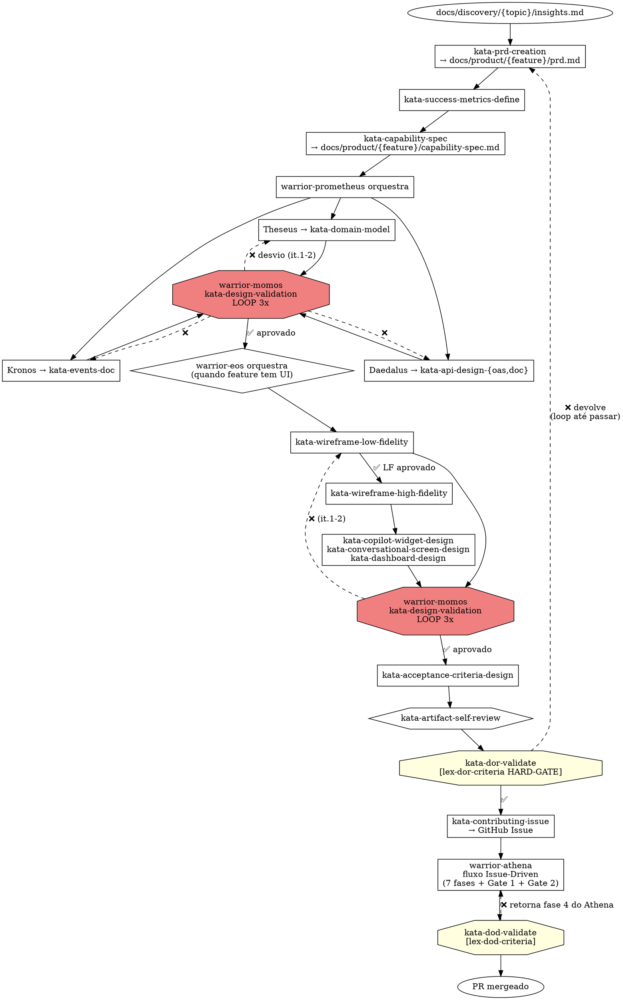

# Product Development — do DoR ao DoD

> **Status:** proposta v3 (reordenada com Prometheus antes de Athena, Mômos validador, Eos para design visual, Hécate meta-engenharia) · **Escopo:** Plataforma Guardia · **Fase:** PRD → Capability Spec → Design Técnico (com loop validador 3x) → Design Visual → Issue criada → fluxo Issue-Driven → Definition of Done

---

## 1. Escopo

Cobre tudo que acontece **entre** insights de [Product Discovery](product-discovery.md) e o merge do PR para `main`. Entrada: insight evidenciado em `docs/discovery/{topic}/insights.md`. Saída: PR mergeado com DoD atendido, pronto para [Product Delivery](product-delivery.md).

**Mudanças vs. v2:**

1. **Prometheus vem ANTES de Athena.** O output de Prometheus (domínio + API + eventos + design visual) **é** a issue no GitHub. Athena recebe uma issue já completamente especificada.
2. **Mômos** é o novo warrior validador que opera dentro de Prometheus, fazendo **feedback loop 3x** sobre Theseus/Daedalus/Kronos antes do output ser aceito.
3. **Eos** orquestra design visual (wireframe LF → HF) quando a feature tem UI, antes da issue ser criada.
4. **Hécate** é a meta-engenheira de agentes — usa o Ahrena como linguagem comum para especificar **dois tipos** de agentes:
   - Agentes do framework (Athena, Apollo, etc. — warriors que organizam o dev workflow)
   - **Agentes da plataforma Guardia** (Isac, sub-agentes especializados em reconciliação/fiscal/financeiro — warriors que rodam em produção). A spec em Markdown vira system prompt + lista de tools + guard-rails de runtime.

**Insight central:** o Ahrena é **dual-use**. Os mesmos pilares (Lexis / Codex / Katas / Warriors / Cries) que descrevem os agentes que coordenam o team também descrevem os agentes que entregam valor ao cliente final na plataforma. Hécate é a única que opera nessa fronteira.

---

## 2. Princípios da fase

1. **Issue é output, não input.** A issue do GitHub é criada **depois** que PRD + Capability Spec + design técnico + design visual estão prontos. Athena não fica "esperando o domínio aparecer durante a fase 3".
2. **Validação adversarial em loop limitado.** Design técnico passa por crítico dedicado (Mômos) que aponta desvios. Loop de até 3 iterações. Após 3, escala para humano com relatório.
3. **DoR é HARD-GATE.** Sem DoR atendido, a issue não é criada e Athena não inicia fluxo.
4. **Wireframe LF antes de HF.** Markdown ASCII/estruturado precede pixel-perfect — economia de iteração.
5. **AI-First por default.** Todo design visual respeita [lex-ai-first-experience](../framework/pt-BR/design/system/lexis/lex-ai-first-experience.md) — Isac é interface primária, workspace é reativo.
6. **DS é não-negociável.** Componentes consomem [@guardia/design-system](../framework/pt-BR/design/system/lexis/lex-design-system-library.md). Reimplementar primitivo é violação.
7. **Spec self-review antes do review humano.** Reduz iteração.

---

## 3. Posição no fluxo

```
[ PRODUCT DISCOVERY ]  → docs/discovery/{topic}/insights.md
   (Calíope orquestra Argos/Métis/Têmis/Asclépio + 2 Gates)
     │
     ▼
┌──────────────────────────────────────────────────────────┐
│  PRODUCT DEVELOPMENT (este doc)                          │
│                                                          │
│  Fase 1 — Calíope                                        │
│    ├─ kata-prd-creation                                  │
│    ├─ kata-success-metrics-define                        │
│    └─ kata-capability-spec                               │
│                                                          │
│  Fase 2 — Prometheus (orquestra design técnico)          │
│    ├─ Theseus  → kata-domain-model                       │
│    ├─ Daedalus → kata-api-design-{oas,doc}               │
│    ├─ Kronos   → kata-events-doc                         │
│    └─ Mômos    → kata-design-validation (LOOP 3x)        │
│                                                          │
│  Fase 2.5 — Hécate (quando feature inclui agente da     │
│             plataforma — Isac, sub-agente novo, etc.)    │
│    ├─ kata-platform-agent-spec                           │
│    ├─ kata-create-warrior  (spec do agente em produção)  │
│    ├─ kata-create-kata     (procedimentos do agente)     │
│    ├─ kata-create-lexis    (guard-rails de runtime)      │
│    ├─ kata-create-codex    (knowledge base do agente)    │
│    └─ Mômos    → kata-design-validation (LOOP 3x)        │
│                                                          │
│  Fase 3 — Eos (quando feature tem UI)                    │
│    ├─ kata-wireframe-low-fidelity     (markdown)         │
│    ├─ kata-wireframe-high-fidelity    (Claude Design)    │
│    ├─ kata-copilot-widget-design                         │
│    ├─ kata-dashboard-design                              │
│    └─ Mômos    → kata-design-validation (LOOP 3x)        │
│                                                          │
│  Fase 4 — Calíope retoma                                 │
│    ├─ kata-acceptance-criteria-design                    │
│    ├─ kata-dor-validate     ← HARD-GATE                  │
│    └─ kata-contributing-issue   ← Issue no GitHub        │
│                                                          │
│  ────── handoff para Athena ──────                       │
│                                                          │
│  Fase 5 — Athena (fluxo Issue-Driven existente)          │
│    fases 1–7 + Gate 1 + Gate 2                           │
│    delega para Apolo / Hephaestus / Iris                 │
│                                                          │
│  Fase 6 — DoD validation                                 │
│    ├─ kata-quality-gate (existente, 7 checks)            │
│    └─ kata-dod-validate (8º check)                       │
│                                                          │
│  PR mergeado                                             │
└──────────────────────────────────────────────────────────┘
     │
     ▼
[ PRODUCT DELIVERY ]  → ver product-delivery.md
```

**Mudanças críticas:**

1. **Prometheus antes de Athena.** Deixa de ser delegação interna do fluxo Issue-Driven (fase 3 do Athena) e vira fase **anterior** à criação da issue. Elimina o anti-pattern de "issue aberta vazia esperando domínio aparecer".

2. **Fase 2.5 condicional para agentes da plataforma.** Quando a feature envolve criar ou modificar um agente que roda em produção (Isac, sub-agente especializado), Hécate usa o Ahrena para spec — `warrior-{nome}.md` vira system prompt do agente, `kata-*` vira procedimentos, `lex-*` vira guard-rails de runtime, `codex-*` vira knowledge base. Mesma linguagem, dois ambientes (framework + produto).

---

## 4. Warriors

### 4.1 `warrior-calliope` — Product Manager (orquestrador master)

**Mitologia:** Calíope = musa da eloquência e da narrativa épica. Encaixa duplamente: (a) orquestra Discovery + Development; (b) executa as fases narrativas-chave (D5 em Discovery; PRD/Capability Spec em Development).

**Posicionamento:** orquestrador master de Produto. Cobre dois blocos:

- **Em Discovery (D0–D5):** delega para Argos / Métis / Têmis / Asclépio. Aplica Gates D1, D2. Executa D5 (`insights.md`). Ver [Product Discovery](product-discovery.md).
- **Em Development (este documento):** executa PRD + Capability Spec; delega design técnico para Prometheus; delega design visual para Eos; valida DoR; cria a issue no GitHub. Faz handoff para Athena.

**Responsabilidades em Development:**

| Faz | Não faz |
|---|---|
| Escreve PRD via `kata-prd-creation` | Modela domínio (delega para Prometheus → Theseus) |
| Produz Capability Spec via `kata-capability-spec` | Desenha API (delega para Prometheus → Daedalus) |
| Define métricas via `kata-success-metrics-define` | Documenta eventos (delega para Prometheus → Kronos) |
| Delega Fase 2 a [warrior-prometheus](#42-warrior-prometheus--feature-design-lead-reposicionado) com Capability Spec como input | Valida design técnico (Mômos faz isso dentro de Prometheus) |
| Delega Fase 3 a [warrior-eos](#44-warrior-eos--design-visual-novo) quando feature tem UI | Desenha wireframe (delega para Eos) |
| Desenha ACs via `kata-acceptance-criteria-design` na Fase 4 | Implementa código (Athena → Apolo/Hephaestus) |
| Valida DoR via `kata-dor-validate` antes de criar issue | Pula gates sob pressão de prazo |
| Verifica issues existentes (abertas e recém-fechadas) cobrindo o mesmo escopo antes de criar nova, per cláusula anti-duplicação de [lex-issue-first](../framework/pt-BR/_foundation/contributing/lexis/lex-issue-first.md) | Cria issue paralela quando issue ativa já cobre o escopo |
| Cria a issue via [kata-contributing-issue](../framework/pt-BR/_foundation/contributing/katas/kata-contributing-issue.md) com TUDO linkado | Modifica artefatos depois que Athena começou |

**Persona:** narradora estratégica + orquestradora rigorosa.

---

### 4.2 `warrior-prometheus` — Feature Design Lead (reposicionado)

**Mudança vs. estado atual:**

[warrior-prometheus](../framework/pt-BR/engineering/platform/warriors/warrior-prometheus.md) hoje se intitula "Technical Product Manager" e opera **durante** a fase 3 do Athena. Mudanças propostas:

| Antes | Depois |
|---|---|
| Título: "Technical Product Manager" | Título: "Feature Design Lead" |
| Invocado por Athena na fase 3 | Invocado por Calíope na Fase 2, **antes** da issue existir |
| Coordena Theseus → Daedalus → Kronos sequencialmente, com aprovação humana entre cada | Coordena os 3 + **Mômos validador em loop 3x** |
| Output entregue ao Athena que continua o fluxo | Output entregue ao Calíope que valida DoR e cria a issue |

**Missão atualizada:**

> Coordenar o ciclo completo de design técnico (domínio + API + eventos), invocando [Mômos](#43-warrior-momos--validador-adversarial-novo) após cada artefato para detecção de desvios e correção em loop limitado a 3 iterações. Entregar pacote técnico consolidado e validado para Calíope.

**Fluxo interno revisado:**

```
1. Recebe Capability Spec de Calíope
2. Invoca Theseus → kata-domain-model
3. Mômos → kata-design-validation no domínio (loop 3x)
4. Invoca Daedalus → kata-api-design-oas + kata-api-design-doc
5. Mômos → kata-design-validation na API (loop 3x)
6. Invoca Kronos → kata-events-doc
7. Mômos → kata-design-validation nos eventos (loop 3x)
8. Verifica consistência cruzada (entity_type, naming, etc.)
9. Mômos → kata-design-validation cross-document (loop 3x)
10. Entrega pacote técnico ao Calíope
```

**Conexão com framework existente:** mantém [lex-entity-naming](../framework/pt-BR/engineering/platform/lexis/lex-entity-naming.md), [lex-entities](../framework/pt-BR/engineering/platform/lexis/lex-entities.md), [lex-restful-apis](../framework/pt-BR/engineering/platform/lexis/lex-restful-apis.md), [lex-cloudevents](../framework/pt-BR/engineering/platform/lexis/lex-cloudevents.md), [lex-idempotency](../framework/pt-BR/engineering/platform/lexis/lex-idempotency.md), [lex-error-handling](../framework/pt-BR/engineering/platform/lexis/lex-error-handling.md), [lex-auth](../framework/pt-BR/engineering/platform/lexis/lex-auth.md) como leis aplicadas. Mômos verifica conformidade.

---

### 4.3 `warrior-momos` — Validador adversarial (novo)

**Mitologia:** Mômos = deus da crítica, censura, sátira. Inspetor dos deuses. Foi expulso do Olimpo por criticar excessivamente o trabalho dos outros — exatamente o comportamento que queremos: um agente que não economiza crítica, busca falhas ativamente, prefere recusar do que aceitar.

**Missão:**

> Receber artefatos de Theseus / Daedalus / Kronos / Eos, verificar conformidade com Lexis aplicáveis, detectar inconsistências internas e cross-document, devolver para correção. Operar em loop de até **3 iterações**. Após a 3ª iteração com desvios, escalar para humano com relatório estruturado.

**Posicionamento:** Mômos é invocado **dentro** de Prometheus (design técnico) e **dentro** de Eos (design visual). Não opera isoladamente fora desses contextos. É o crítico residente.

**Responsabilidades:**

| Faz | Não faz |
|---|---|
| Lê artefato submetido + Capability Spec + Lexis aplicáveis | Produz domínio / API / eventos / wireframe |
| Aplica `kata-design-validation` com checklist por tipo de artefato | Decide priorização de produto |
| Identifica desvios: violação de Lexis, gaps, inconsistências, naming errado | Recusa por gosto pessoal — só por desvio rastreável |
| Devolve relatório estruturado: `{desvio, lex/regra violada, evidência, sugestão de correção}` | Reescreve o artefato — apenas aponta, não corrige |
| Mantém contador de iterações por artefato | Estende loop além da 3ª iteração sem aprovação humana |
| Aprova quando 0 desvios detectados | Aprova com "warning" — é binário |

**Loop 3x — formato canônico:**

```
Iteração 1:
  Mômos → relatório de desvios → especialista corrige
Iteração 2:
  Mômos → relatório de desvios remanescentes → especialista corrige
Iteração 3:
  Mômos → última verificação
  - Se 0 desvios: ✅ aprovado, segue fluxo
  - Se >0 desvios: ❌ ESCALA para humano com relatório consolidado
                   das 3 iterações + recomendação (corrigir manualmente,
                   abrir ADR justificando o desvio, ou rejeitar feature)
```

**Persona:** crítico construtivo, busca falsificação, prefere binário (aprovado / com desvios) a "quase aprovado". Inspirado no padrão de [obra/superpowers](https://github.com/obra/superpowers) `verification-before-completion` e nas verificações de [kata-quality-gate](../framework/pt-BR/engineering/workflow/katas/kata-quality-gate.md).

**Katas que executa:**

| Kata | Função |
|---|---|
| `kata-design-validation` | Validação canônica, parametrizado por tipo de artefato (domínio / API / eventos / wireframe / componente) |

**Conexão com framework existente:** Mômos consulta TODAS as Lexis técnicas aplicáveis ao artefato. Para domínio: [lex-entity-naming](../framework/pt-BR/engineering/platform/lexis/lex-entity-naming.md), [lex-entities](../framework/pt-BR/engineering/platform/lexis/lex-entities.md). Para API: [lex-restful-apis](../framework/pt-BR/engineering/platform/lexis/lex-restful-apis.md), [lex-error-handling](../framework/pt-BR/engineering/platform/lexis/lex-error-handling.md), [lex-idempotency](../framework/pt-BR/engineering/platform/lexis/lex-idempotency.md), [lex-auth](../framework/pt-BR/engineering/platform/lexis/lex-auth.md). Para eventos: [lex-cloudevents](../framework/pt-BR/engineering/platform/lexis/lex-cloudevents.md). Para wireframes: [lex-ai-first-experience](../framework/pt-BR/design/system/lexis/lex-ai-first-experience.md), [lex-design-system-library](../framework/pt-BR/design/system/lexis/lex-design-system-library.md), [lex-brand-colors](../framework/pt-BR/design/brand/lexis/lex-brand-colors.md), [lex-brand-typography](../framework/pt-BR/design/brand/lexis/lex-brand-typography.md), [lex-brand-logo](../framework/pt-BR/design/brand/lexis/lex-brand-logo.md), [lex-brand-voice](../framework/pt-BR/design/brand/lexis/lex-brand-voice.md), [lex-frontend-accessibility](../framework/pt-BR/engineering/frontend/lexis/lex-frontend-accessibility.md).

---

### 4.4 `warrior-eos` — Design Visual (novo)

**Mitologia:** Eos = aurora, primeira luz do dia. Encaixa com "primeira visualização" — wireframe que ilumina a feature antes da implementação.

**Missão:**

> Quando a feature tem UI, transformar Capability Spec em design visual completo: wireframe de baixa fidelidade em Markdown (ASCII / estruturado), depois alta fidelidade via Claude Design / Canva MCP, com componentes específicos para AI-First Experience (widgets de Copilot/Isac, telas conversacionais, dashboards reativos). Garantir conformidade com brand e DS, validada por Mômos em loop 3x.

**Quando é invocada:** Calíope decide na Fase 2 / 3 se a feature precisa de design visual. Critério: feature tem qualquer superfície renderizada ao usuário (web, mobile, e-mail, embed). Backend puro pula esta fase.

**Responsabilidades:**

| Faz | Não faz |
|---|---|
| Constrói wireframe LF em Markdown via `kata-wireframe-low-fidelity` | Implementa código (Hephaestus / Iris fazem na Fase 5) |
| Escala para wireframe HF via `kata-wireframe-high-fidelity` (Claude Design / Canva MCP) | Define modelo de domínio (Theseus) |
| Desenha widgets do Copilot/Isac via `kata-copilot-widget-design` | Decide priorização de feature |
| Desenha telas conversacionais e dashboards via `kata-dashboard-design` | Pula validação de Mômos |
| Aplica [@guardia/design-system](../framework/pt-BR/design/system/lexis/lex-design-system-library.md) — não reimplementa primitivo | Inventa componente novo sem ADR |
| Garante conformidade com [lex-ai-first-experience](../framework/pt-BR/design/system/lexis/lex-ai-first-experience.md) | Trata feature como SaaS clássico (sidebar de módulos, modal bloqueante) |
| Invoca Mômos após cada artefato para validação | Aceita "ok" do humano sem validação técnica de brand/DS |

**Fluxo interno:**

```
1. Recebe Capability Spec de Calíope
2. kata-wireframe-low-fidelity → wireframe LF em Markdown
3. Mômos → kata-design-validation (LOOP 3x) — verifica conformidade conceitual
4. Aprovação humana (Calíope apresenta ao usuário)
5. kata-wireframe-high-fidelity → HF via Claude Design ou Canva MCP
6. Mômos → kata-design-validation (LOOP 3x) — verifica brand, DS, acessibilidade
7. Quando feature inclui Copilot/Isac:
   kata-copilot-widget-design → especificação de widgets reativos
8. Quando feature inclui dashboard:
   kata-dashboard-design → especificação de painéis
9. Mômos → kata-design-validation final (LOOP 3x)
10. Entrega pacote visual a Calíope
```

**Persona:** primeira luz — desbasta antes de polir, prefere markdown rabiscado ao Figma travado, defende AI-First Experience contra UI clássica.

**Conexão com framework existente:** consulta [codex-ai-first-experience](../framework/pt-BR/design/system/codex/codex-ai-first-experience.md), [codex-design-system](../framework/pt-BR/design/system/codex/codex-design-system.md), [codex-design-system-components](../framework/pt-BR/design/system/codex/codex-design-system-components.md), [codex-brand-colors](../framework/pt-BR/design/brand/codex/codex-brand-colors.md), [codex-brand-typography](../framework/pt-BR/design/brand/codex/codex-brand-typography.md), [codex-brand-logo](../framework/pt-BR/design/brand/codex/codex-brand-logo.md), [codex-brand-voice](../framework/pt-BR/design/brand/codex/codex-brand-voice.md), [codex-brand-essence](../framework/pt-BR/design/brand/codex/codex-brand-essence.md). Output alimenta [warrior-hephaestus](../framework/pt-BR/engineering/frontend/warriors/warrior-hephaestus.md) e [warrior-iris](../framework/pt-BR/engineering/mobile/warriors/warrior-iris.md) na Fase 5.

---

### 4.5 `warrior-athena` — Implementation Orchestrator (sem mudança de papel, com novos pré-requisitos)

[warrior-athena](../framework/pt-BR/engineering/workflow/warriors/warrior-athena.md) continua orquestrando o fluxo Issue-Driven. Mudanças:

- **Pré-condição reforçada (HARD-GATE):** issue MUST referenciar `docs/product/{feature}/capability-spec.md`, pacote técnico aprovado por Mômos, e wireframes aprovados (quando UI). Sem isso, recusa e devolve.
- **Fase 3 do Athena (Architecture Brief) muda:** em vez de **gerar** design técnico, agora apenas **valida** que o pacote produzido por Prometheus continua coerente com decisões emergentes da implementação. Caso surja conflito, escala para Calíope (não modifica Capability Spec sozinha).
- **Gate 2 ampliado:** [kata-quality-gate](../framework/pt-BR/engineering/workflow/katas/kata-quality-gate.md) ganha 8º check via `kata-dod-validate`.

---

### 4.6 `warrior-hecate` — Meta-engenharia de agentes (novo)

**Mitologia:** Hécate = deusa da magia, fronteiras, encruzilhadas, conhecimento oculto. Encaixa com meta-programação: warrior que sabe modelar **outros agentes**, em qualquer ambiente.

**Missão:**

> Especificar agentes — do framework Ahrena (warriors do dev workflow) **e da plataforma Guardia** (Isac e sub-agentes que rodam em produção) — usando a linguagem comum do Ahrena: warriors (identidade + papel), katas (procedimentos), lexis (guard-rails invioláveis), codex (knowledge base). Garantir que a mesma spec seja deployável como artefato de framework ou como agente de runtime.

**Posicionamento:** Hécate opera em **dois modos** com a mesma toolbox:

#### Modo A — Meta-engenharia do framework

Cria/evolui warriors, katas, lexis, codex e cries do próprio Ahrena. Aciona-se quando o framework precisa crescer — por exemplo, materializar Calíope, Argos, Mômos, Eos e os artefatos desta proposta. Vai para `framework/{lang}/{clade}/{subclade}/{pilar}/`.

#### Modo B — Spec de agentes da plataforma Guardia

Cria/evolui agentes que rodam **dentro do produto Guardia** — Isac e sub-agentes especializados (reconciliação, fiscal, financeiro, contábil). Vai para diretório do produto, mas a estrutura é a mesma: `warrior-isac.md`, `warrior-reconciliation-agent.md`, `kata-reconcile-transactions.md`, `lex-no-payment-without-confirmation.md`, etc.

A spec **é executável**:

| Pilar Ahrena | Vira em produção |
|---|---|
| `warrior-{agente}.md` (Identidade, Missão, Persona) | System prompt + papel do agente |
| `kata-{procedimento}.md` (passos, inputs, outputs) | Procedimentos / tools que o agente invoca |
| `lex-{regra}.md` (HARD-GATE, MUST/MUST NOT) | Guard-rail de runtime — o agente recusa ações que violem |
| `codex-{domínio}.md` (manual de referência) | Knowledge base que o agente consulta em runtime |

Isso significa que toda Lexis técnica que hoje vale para o team — [lex-idempotency](../framework/pt-BR/engineering/platform/lexis/lex-idempotency.md), [lex-error-handling](../framework/pt-BR/engineering/platform/lexis/lex-error-handling.md), [lex-auth](../framework/pt-BR/engineering/platform/lexis/lex-auth.md), [lex-data-retention](../framework/pt-BR/engineering/data/lexis/lex-data-retention.md) — pode ser reaproveitada como guard-rail dos agentes da plataforma. **Linguagem comum entre quem desenha o produto e o produto.**

**Quando Hécate é invocada no fluxo de feature:**

| Caso | Quem invoca | Quando |
|---|---|---|
| Modo A — novo warrior do framework | [cry-new-warrior](../framework/pt-BR/_foundation/authoring/cries/cry-new-warrior.md) etc. | Fora do fluxo de feature, quando framework evolui |
| Modo B — feature inclui agente novo na plataforma | Calíope na **Fase 2.5** | Após design técnico (Prometheus) e antes de design visual (Eos), quando a feature envolve Isac ou sub-agente |
| Modo B — feature modifica agente existente | Calíope na **Fase 2.5** | Idem, quando a mudança afeta papel, procedimentos ou guard-rails do agente |

**Responsabilidades:**

| Faz | Não faz |
|---|---|
| **Modo A:** cria warriors/katas/lexis/codex do framework via [kata-create-*](../framework/pt-BR/_foundation/authoring/katas/) | Implementa runtime do agente (delega para [warrior-apollo](../framework/pt-BR/engineering/backend/warriors/warrior-apollo.md) na Fase 5) |
| **Modo B:** spec agentes da plataforma via `kata-platform-agent-spec` | Decide priorização de produto |
| Lista tools/MCPs que o agente usa em runtime via `kata-platform-agent-tools` | Cria pilar novo (definidos em [lex-pilars](../framework/pt-BR/_foundation/authoring/lexis/lex-pilars.md)) |
| Lista lexis aplicáveis como guard-rail de runtime via `kata-platform-agent-guardrails` | Modifica Lexis em status `accepted` sem ADR |
| Garante registro em `framework/platforms.yaml` per [lex-platforms-rules](../framework/pt-BR/_foundation/process/lexis/lex-platforms-rules.md) | Pula validação de Mômos sobre suas saídas |
| Aplica [kata-push-to-framework](../framework/pt-BR/_foundation/authoring/katas/kata-push-to-framework.md) ao final | Cria artefato em idioma único quando `language.i18n` exige múltiplos |
| Invoca [warrior-translator](../framework/pt-BR/documentation/i18n/warriors/warrior-translator.md) para localização obrigatória | Cria spec de agente sem Capability Spec aprovado por Calíope |

**Persona:** mística das fronteiras — opera entre framework e produto, conhece a anatomia dos pilares, prefere reusar Lexis existentes a criar novas.

**Conexão com framework existente:**

- Consulta todo o clade [_foundation/authoring/](../framework/pt-BR/_foundation/authoring/) e [_foundation/quality/](../framework/pt-BR/_foundation/quality/)
- Usa [kata-create-warrior](../framework/pt-BR/_foundation/authoring/katas/kata-create-warrior.md), [kata-create-kata](../framework/pt-BR/_foundation/authoring/katas/kata-create-kata.md), [kata-create-lexis](../framework/pt-BR/_foundation/authoring/katas/kata-create-lexis.md), [kata-create-codex](../framework/pt-BR/_foundation/authoring/katas/kata-create-codex.md), [kata-create-cry](../framework/pt-BR/_foundation/authoring/katas/kata-create-cry.md) como toolbox base
- É invocada por [cry-new-warrior](../framework/pt-BR/_foundation/authoring/cries/cry-new-warrior.md), [cry-new-kata](../framework/pt-BR/_foundation/authoring/cries/cry-new-kata.md), [cry-new-lex](../framework/pt-BR/_foundation/authoring/cries/cry-new-lex.md), [cry-new-codex](../framework/pt-BR/_foundation/authoring/cries/cry-new-codex.md), [cry-new-cry](../framework/pt-BR/_foundation/authoring/cries/cry-new-cry.md) (Modo A) e por novo `cry-new-platform-agent` (Modo B)
- Suas saídas no Modo B são validadas por Mômos antes de virarem input do DoR

**Aplicação imediata (Modo A):** quando esta proposta v3 for aceita, Hécate é o warrior que materializa todos os artefatos novos (Calíope, Argos, Métis, Têmis, Asclépio, Eos, Mômos + katas / lexis / codex de cada um).

**Aplicação contínua (Modo B):** sempre que a plataforma Guardia ganhar novo agente — por exemplo, "agente de auditoria fiscal", "agente de fechamento mensal", "sub-agente de reconciliação bancária" — Hécate o especifica usando os mesmos pilares.

---

## 5. Katas

### 5.1 Katas executados por Calíope

| Kata | Função | Saída |
|---|---|---|
| `kata-prd-creation` | PRD focado em WHAT/WHY; respeita [lex-ai-first-experience](../framework/pt-BR/design/system/lexis/lex-ai-first-experience.md) | `docs/product/{feature}/prd.md` |
| `kata-capability-spec` | 8 seções rígidas (CAPABILITY / CONSTRAINTS / IMPLEMENTATION CONTRACT / NON-GOALS / OPEN QUESTIONS / HANDOFF / ALTERNATIVES / EVIDENCE) | `docs/product/{feature}/capability-spec.md` |
| `kata-success-metrics-define` | Métrica leading + lagging | seção do PRD |
| `kata-acceptance-criteria-design` | ACs numeradas (AC-1, ...) testáveis | seção do Capability Spec |
| `kata-feature-map` | Relacionamentos entre features | `docs/product/feature-map.md` |
| `kata-dor-validate` | Checagem automatizada do DoR canônico | inline; bloqueia ou aprova |
| [kata-contributing-issue](../framework/pt-BR/_foundation/contributing/katas/kata-contributing-issue.md) (existente) | Cria issue no GitHub com tudo linkado | issue criada |

### 5.2 Katas orquestrados por Prometheus

| Kata | Executor | Função |
|---|---|---|
| [kata-domain-model](../framework/pt-BR/engineering/platform/katas/kata-domain-model.md) (existente) | Theseus | Modelagem de domínio DDD |
| [kata-event-storm](../framework/pt-BR/engineering/platform/katas/kata-event-storm.md) (existente) | Theseus | Event storming |
| [kata-api-design-oas](../framework/pt-BR/engineering/platform/katas/kata-api-design-oas.md) (existente) | Daedalus | OpenAPI Spec |
| [kata-api-design-doc](../framework/pt-BR/engineering/platform/katas/kata-api-design-doc.md) (existente) | Daedalus | Documento estruturado de API |
| [kata-api-design-review](../framework/pt-BR/engineering/platform/katas/kata-api-design-review.md) (existente) | Daedalus / Mômos | Review de contrato HTTP existente |
| [kata-events-doc](../framework/pt-BR/engineering/platform/katas/kata-events-doc.md) (existente) | Kronos | CloudEvents Documentation |
| `kata-design-validation` (novo) | **Mômos** | Validação adversarial canônica, parametrizada por tipo de artefato |

### 5.3 Katas executados por Eos

| Kata | Função | Saída |
|---|---|---|
| `kata-wireframe-low-fidelity` | Wireframe em Markdown ASCII / estruturado; foco em fluxo, não em pixel | `docs/design/{feature}/wireframe-lf.md` |
| `kata-wireframe-high-fidelity` | HF via Claude Design ou Canva MCP; brand + DS aplicados | `docs/design/{feature}/wireframe-hf/` (imagens + spec) |
| `kata-copilot-widget-design` | Widgets reativos do Isac/Copilot per [codex-ai-first-experience](../framework/pt-BR/design/system/codex/codex-ai-first-experience.md) | `docs/design/{feature}/widgets.md` |
| `kata-conversational-screen-design` | Telas onde Isac é interface primária (chat + workspace reativo) | `docs/design/{feature}/screens.md` |
| `kata-dashboard-design` | Dashboards on-demand (não permanentes — gerados por intenção do usuário) | `docs/design/{feature}/dashboards.md` |
| `kata-component-spec` | Especificação de componente novo quando DS não cobre (raro — gera ADR) | `docs/design/{feature}/components.md` + ADR |

### 5.4 Katas executados por Mômos (cross-Prometheus / Eos)

| Kata | Função | Modos |
|---|---|---|
| `kata-design-validation` | Loop 3x adversarial sobre artefato de design | `--type=domain` / `--type=api` / `--type=events` / `--type=wireframe-lf` / `--type=wireframe-hf` / `--type=widget` / `--type=dashboard` / `--type=cross-document` |

**Saída do `kata-design-validation`** (formato canônico):

```markdown
# Design Validation Report — {artefato}

> **Validador:** warrior-momos · **Iteração:** 1/3 · **Resultado:** [APROVADO | DESVIOS DETECTADOS | ESCALAR]

## Desvios

### D-1: {título}
- **Lex/regra violada:** [link para lex-X]
- **Evidência:** [trecho/linha do artefato]
- **Sugestão de correção:** [ação concreta]
- **Severidade:** bloqueante | aviso

### D-2: ...

## Verificações executadas

- [x] [lex-X] — ✅ conforme
- [x] [lex-Y] — ❌ violação D-1
- [x] [lex-Z] — ✅ conforme

## Decisão

[APROVADO — pode seguir]
[DEVOLVIDO — corrigir desvios e retornar para iteração 2]
[ESCALAR — 3ª iteração com desvios remanescentes; humano decide]
```

### 5.5 Katas de meta-engenharia (executados por Hécate)

#### Modo A — Framework Ahrena (warriors do dev workflow)

| Kata existente | Mudança |
|---|---|
| [kata-create-warrior](../framework/pt-BR/_foundation/authoring/katas/kata-create-warrior.md) | Invocado por Hécate em vez de direto |
| [kata-create-kata](../framework/pt-BR/_foundation/authoring/katas/kata-create-kata.md) | Idem |
| [kata-create-lexis](../framework/pt-BR/_foundation/authoring/katas/kata-create-lexis.md) | Idem |
| [kata-create-codex](../framework/pt-BR/_foundation/authoring/katas/kata-create-codex.md) | Idem |
| [kata-create-cry](../framework/pt-BR/_foundation/authoring/katas/kata-create-cry.md) | Idem |
| [kata-diff-artifacts](../framework/pt-BR/_foundation/authoring/katas/kata-diff-artifacts.md) (existente) | Hécate roda antes de aceitar artefato |
| [kata-push-to-framework](../framework/pt-BR/_foundation/authoring/katas/kata-push-to-framework.md) (existente) | Hécate roda ao final |

#### Modo B — Plataforma Guardia (agentes que rodam em produção)

| Kata (novo) | Função | Saída |
|---|---|---|
| `kata-platform-agent-spec` | Orquestra spec completa de novo agente da plataforma — invoca os katas de criação abaixo na sequência correta | `docs/agents/{agent}/` |
| `kata-platform-agent-identity` | Spec do warrior do agente: identidade, missão, papel, persona | `docs/agents/{agent}/warrior-{name}.md` |
| `kata-platform-agent-procedures` | Procedimentos que o agente executa (cada um vira kata) | `docs/agents/{agent}/katas/kata-*.md` |
| `kata-platform-agent-guardrails` | Lista lexis aplicáveis como guard-rail de runtime; cria novas se gap detectado | `docs/agents/{agent}/lexis/lex-*.md` + reuso de lexis do framework |
| `kata-platform-agent-knowledge` | Knowledge base do agente — codex que consulta em runtime | `docs/agents/{agent}/codex/codex-*.md` |
| `kata-platform-agent-tools` | Lista MCPs e tools que o agente usa em runtime | seção do `warrior-{name}.md` |
| `kata-platform-agent-deploy-spec` | Empacota a spec em formato deployável (system prompt + tools + guard-rails) | `docs/agents/{agent}/deploy.json` ou similar |

**Reuso entre Modo A e Modo B:** Lexis do framework podem ser reaproveitadas como guard-rails de agentes da plataforma sem duplicação. Exemplo: um agente de pagamento da Guardia pode ter como guard-rail `lex-no-payment-without-confirmation` (nova, modo B) **e** [lex-idempotency](../framework/pt-BR/engineering/platform/lexis/lex-idempotency.md) (existente, framework). A spec do agente referencia ambas via path relativo.

### 5.6 Cross-fase

| Kata | Função |
|---|---|
| `kata-artifact-self-review` | Scan de placeholders, contradições, ambiguidade. Inspirado em [obra/superpowers](https://github.com/obra/superpowers) `brainstorming`. Invocado antes de submeter qualquer artefato a humano |
| `kata-dod-validate` | Estende [kata-quality-gate](../framework/pt-BR/engineering/workflow/katas/kata-quality-gate.md) com 8º check (métricas instrumentadas) |

---

## 6. Lexis

### 6.1 `lex-hard-gate-pattern` (meta-lex)

> Quando uma Lexis exige bloqueio de fluxo, MUST conter bloco `<HARD-GATE>` literal com ação proibida + pré-condições + escopo. Padroniza a sintaxe de bloqueios. Inspirado em [obra/superpowers](https://github.com/obra/superpowers).

### 6.2 `lex-dor-criteria`

> Toda issue de feature MUST atender DoR canônico antes de existir. DoR atendido é pré-condição inviolável para [warrior-athena](../framework/pt-BR/engineering/workflow/warriors/warrior-athena.md).

**Critérios canônicos:**

1. Discovery referenciada (`docs/discovery/{topic}/insights.md`)
2. PRD em `docs/product/{feature}/prd.md` aprovado
3. Capability Spec em `docs/product/{feature}/capability-spec.md` aprovado (8 seções)
4. Pacote técnico aprovado por Mômos: `domain-model.md`, OAS + doc API, events doc
5. Pacote visual aprovado por Mômos (quando UI): wireframe LF + HF + widgets/screens/dashboards
6. ACs numeradas presentes
7. Métricas leading + lagging declaradas e instrumentação planejada
8. Dependências mapeadas
9. **Busca anti-duplicação executada** — Calíope verificou issues abertas e recém-fechadas (`gh issue list --search "<termos>"` ou UI) e nenhuma issue ativa cobre o mesmo escopo, per cláusula anti-duplicação de [lex-issue-first](../framework/pt-BR/_foundation/contributing/lexis/lex-issue-first.md). Caso contrário, usa issue existente como anchor (`Closes #N` / `Refs #N`) em vez de criar nova

**HARD-GATE:**

```
<HARD-GATE>
warrior-athena NÃO MAY iniciar fluxo Issue-Driven sem que
kata-dor-validate retorne ✅ em TODOS os 9 critérios.

Exceção única: hotfix com label `incident:p0` — exige
DoR retroativo em até 5 dias.
</HARD-GATE>
```

### 6.3 `lex-design-validation-loop` (novo)

> Todo artefato de design técnico (Theseus / Daedalus / Kronos) ou design visual (Eos) MUST passar por validação Mômos em loop limitado a 3 iterações antes de ser aceito como input de DoR. Após a 3ª iteração com desvios remanescentes, escalonamento para humano é OBRIGATÓRIO.

**HARD-GATE:**

```
<HARD-GATE>
Calíope NÃO MAY aceitar artefato técnico ou visual como
DoR-ready sem que warrior-momos tenha emitido relatório
APROVADO (0 desvios) em iteração de 1 a 3.

Especialista (Theseus, Daedalus, Kronos, Eos) NÃO MAY
ignorar relatório de Mômos por discordância — disagreement
deve virar ADR explícito justificando o desvio aceito.

Loop estende além de 3 iterações APENAS com aprovação
humana explícita registrada no checkpoint.
</HARD-GATE>
```

### 6.4 `lex-wireframe-required` (novo)

> Toda feature com superfície renderizada (web, mobile, e-mail, embed) MUST ter wireframe LF em Markdown antes da issue ser criada, e wireframe HF antes da implementação iniciar. Implementar UI sem wireframe aprovado é FORBIDDEN.

**Conexão:** estende [lex-frontend-accessibility](../framework/pt-BR/engineering/frontend/lexis/lex-frontend-accessibility.md), [lex-design-system-library](../framework/pt-BR/design/system/lexis/lex-design-system-library.md), [lex-ai-first-experience](../framework/pt-BR/design/system/lexis/lex-ai-first-experience.md). Wireframes são input para [warrior-hephaestus](../framework/pt-BR/engineering/frontend/warriors/warrior-hephaestus.md) e [warrior-iris](../framework/pt-BR/engineering/mobile/warriors/warrior-iris.md).

### 6.5 `lex-ai-first-component-pattern` (novo)

> Componentes que aparecem em superfícies AI-First (workspace reativo, widgets do Copilot, telas conversacionais) MUST seguir o padrão Conversa + Workspace definido em [codex-ai-first-experience](../framework/pt-BR/design/system/codex/codex-ai-first-experience.md): renderizados como resposta do agente, reativos ao diálogo, sem viver como menu permanente.

**HARD-GATE:**

```
<HARD-GATE>
Eos NÃO MAY emitir spec de componente AI-First que:
  (a) viva como menu permanente independente de conversa
  (b) bloqueie o usuário com modal antes da conversa
  (c) imite arquitetura SaaS clássica (sidebar de módulos como navegação primária)
  (d) esconda o que o agente está fazendo atrás de loader genérico
Exceção: views operacionais sem usuário (admin/superuser)
documentadas com proposta no Notion + aprovação do CEO ou
Brand owner designado.
</HARD-GATE>
```

### 6.6 `lex-dod-criteria`

> Toda feature MUST atender DoD antes de PR ser mergeado. DoD = Gate 2 do Athena + critérios de produto.

**Critérios:**

1. [kata-quality-gate](../framework/pt-BR/engineering/workflow/katas/kata-quality-gate.md) retorna `go` (7 checks atuais)
2. Métricas de sucesso instrumentadas em produção e emitindo
3. Observabilidade per [lex-observability-required](../framework/pt-BR/_foundation/quality/lexis/lex-observability-required.md) plugada
4. Release plan rascunhado (input para [Product Delivery](product-delivery.md))
5. Documentação de cliente atualizada quando feature visível
6. ADRs gerados quando aplicável
7. Componentes UI consomem [@guardia/design-system](../framework/pt-BR/design/system/lexis/lex-design-system-library.md) — 0 reimplementação de primitivo

### 6.7 `lex-capability-spec-required`

> Toda feature com impacto em contrato, UX, compliance, segurança ou cliente externo MUST ter Capability Spec antes de virar issue. Features de manutenção (chore, refactor sem mudança de comportamento) são isentas.

### 6.8 `lex-success-metrics`

> Toda feature relevante MUST declarar métrica leading + lagging antes de implementar, e a métrica MUST estar instrumentada em produção como pré-condição de mergear o PR. Estende [lex-observability-required](../framework/pt-BR/_foundation/quality/lexis/lex-observability-required.md).

### 6.9 `lex-meta-engineering-via-hecate` (novo)

> Toda criação ou evolução de warrior, kata, lexis, codex ou cry — seja no **framework Ahrena** (warriors do dev workflow) ou na **plataforma Guardia** (agentes que rodam em produção) — MUST ser orquestrada por [warrior-hecate](#46-warrior-hecate--meta-engenharia-de-agentes-novo). Invocação direta de [kata-create-*](../framework/pt-BR/_foundation/authoring/katas/) sem Hécate é FORBIDDEN para evitar artefatos fora do padrão dos pilares.

### 6.10 `lex-platform-agent-via-ahrena` (novo)

> Todo agente que roda dentro da plataforma Guardia (Isac, sub-agentes especializados) MUST ser especificado usando o framework Ahrena: identidade como **warrior**, procedimentos como **katas**, guard-rails como **lexis**, knowledge base como **codex**. Linguagem comum entre design e runtime é mandatória — não há atalho que defina agente "só com prompt" sem warrior associado.

**Razão:** evita drift entre o que está documentado e o que o agente realmente faz em produção. Lexis viram guard-rails executáveis; codex vira knowledge base consultada em runtime; warrior é a fonte da verdade do papel do agente.

**HARD-GATE:**

```
<HARD-GATE>
Apolo / Hephaestus / Iris NÃO MAY implementar runtime de agente
da plataforma Guardia sem que docs/agents/{agent}/ contenha
spec completa produzida por Hécate e validada por Mômos:
  (a) warrior-{name}.md com identidade
  (b) katas/kata-*.md com procedimentos
  (c) lexis/lex-*.md com guard-rails (ou referências a lexis do framework)
  (d) codex/codex-*.md com knowledge base
  (e) deploy.json (ou equivalente) com tools/MCPs

Esta regra se aplica a todo agente novo OU mudança em agente
existente que afete papel, procedimentos ou guard-rails.
</HARD-GATE>
```

### 6.11 `lex-runtime-guardrail-from-lexis` (novo)

> Toda Lexis aplicável a um agente da plataforma MUST ser referenciada na spec do agente (`docs/agents/{agent}/warrior-*.md` na seção "Guard-rails"). O runtime do agente MUST verificar conformidade antes de executar ação que potencialmente viola a Lexis. Lexis em design-time = guard-rail em runtime.

**Conexão:** isso transforma Lexis existentes em **comportamento do produto**. Por exemplo, [lex-idempotency](../framework/pt-BR/engineering/platform/lexis/lex-idempotency.md) hoje é regra que o team segue ao desenhar API — passa também a ser regra que um agente da plataforma respeita ao chamar API externa em runtime.

---

## 7. Codex

| Codex | Conteúdo |
|---|---|
| `codex-prd-structure` | Anatomia de PRD bom |
| `codex-capability-spec` | Anatomia das 8 seções com exemplos bons e ruins |
| `codex-dor-dod` | Manual operacional dos critérios canônicos |
| `codex-acceptance-criteria` | Formatos aceitos (Given/When/Then, lista numerada) |
| `codex-success-metrics` | Como definir leading/lagging; armadilhas |
| `codex-prd-vs-capability-vs-adr` | Quando usar cada artefato |
| `codex-design-validation-loop` (novo) | Como Mômos opera; tipos de desvio; quando escalar |
| `codex-wireframe-low-fidelity` (novo) | Convenção de Markdown ASCII para wireframe; exemplos |
| `codex-wireframe-high-fidelity` (novo) | Uso de Claude Design e Canva MCP; pipeline LF→HF |
| `codex-ai-first-components` (novo) | Padrões de widget de Copilot, tela conversacional, dashboard reativo |
| `codex-meta-engineering` (novo) | Como Hécate opera no Modo A (framework); quando criar warrior vs. kata vs. lexis vs. codex |
| `codex-platform-agent-spec` (novo) | Como Hécate opera no Modo B (plataforma); como spec vira system prompt + tools + guard-rails; como Lexis vira runtime check |
| `codex-ahrena-dual-use` (novo) | Visão estratégica: Ahrena como linguagem comum entre framework de team e framework de produto; padrões de reuso de Lexis design-time → runtime |

---

## 8. Cries (entry points)

| Cry | Invoca | Uso |
|---|---|---|
| `cry-new-prd` | Calíope | "PRD para feature X" |
| `cry-new-capability-spec` | Calíope | "Capability Spec a partir do PRD" |
| `cry-validate-dor` | `kata-dor-validate` direto | "Esta issue está pronta?" |
| `cry-validate-dod` | `kata-dod-validate` direto | "Este PR está pronto para merge?" |
| `cry-design-feature` (renomeação de [cry-feature-design](../framework/pt-BR/engineering/platform/cries/cry-feature-design.md) atual) | Prometheus | "Design técnico da feature X" |
| `cry-design-visual` (novo) | Eos | "Design visual da feature X" |
| `cry-validate-design` (novo) | Mômos direto | "Valida este artefato isolado" |
| `cry-new-warrior` (existente, atualizada) | Hécate em Modo A | "Cria warrior do framework" |
| `cry-new-kata`, `cry-new-lex`, `cry-new-codex`, `cry-new-cry` (existentes, atualizadas) | Hécate em Modo A | Idem |
| `cry-new-platform-agent` (novo) | Hécate em Modo B | "Spec novo agente da plataforma Guardia (ex.: sub-agente de fechamento mensal)" |
| `cry-update-platform-agent` (novo) | Hécate em Modo B | "Atualiza papel/procedimentos/guard-rails de agente existente" |
| [cry-implement-issue](../framework/pt-BR/engineering/workflow/cries/cry-implement-issue.md) (existente, sem mudança) | Athena | Continua sendo entrada do Issue-Driven, agora com pré-condição DoR |

---

## 9. Fluxo end-to-end com loops de validação



---

## 10. Conexões com o framework atual

### 10.1 Lexis existentes — uso e extensão

| Lexis existente | Como Development se conecta |
|---|---|
| [lex-issue-driven](../framework/pt-BR/engineering/workflow/lexis/lex-issue-driven.md) | Pré-condição nova: issue MUST ter Capability Spec + design técnico aprovado por Mômos + wireframes (quando UI) |
| [lex-issue-first](../framework/pt-BR/_foundation/contributing/lexis/lex-issue-first.md) | Sem mudança |
| [lex-issue-quality](../framework/pt-BR/_foundation/contributing/lexis/lex-issue-quality.md) | Estendida pelo [lex-dor-criteria](#62-lex-dor-criteria) |
| [lex-pr-quality](../framework/pt-BR/_foundation/contributing/lexis/lex-pr-quality.md) | Estendida pelo [lex-dod-criteria](#66-lex-dod-criteria) |
| [lex-entity-naming](../framework/pt-BR/engineering/platform/lexis/lex-entity-naming.md), [lex-entities](../framework/pt-BR/engineering/platform/lexis/lex-entities.md) | Verificadas por Mômos sobre output de Theseus |
| [lex-restful-apis](../framework/pt-BR/engineering/platform/lexis/lex-restful-apis.md), [lex-error-handling](../framework/pt-BR/engineering/platform/lexis/lex-error-handling.md), [lex-idempotency](../framework/pt-BR/engineering/platform/lexis/lex-idempotency.md), [lex-auth](../framework/pt-BR/engineering/platform/lexis/lex-auth.md) | Verificadas por Mômos sobre output de Daedalus |
| [lex-cloudevents](../framework/pt-BR/engineering/platform/lexis/lex-cloudevents.md) | Verificada por Mômos sobre output de Kronos |
| [lex-ai-first-experience](../framework/pt-BR/design/system/lexis/lex-ai-first-experience.md) | Verificada por Mômos sobre output de Eos |
| [lex-design-system-library](../framework/pt-BR/design/system/lexis/lex-design-system-library.md) | Idem |
| [lex-brand-colors](../framework/pt-BR/design/brand/lexis/lex-brand-colors.md), [lex-brand-typography](../framework/pt-BR/design/brand/lexis/lex-brand-typography.md), [lex-brand-logo](../framework/pt-BR/design/brand/lexis/lex-brand-logo.md), [lex-brand-voice](../framework/pt-BR/design/brand/lexis/lex-brand-voice.md) | Idem (Mômos sobre Eos) |
| [lex-frontend-accessibility](../framework/pt-BR/engineering/frontend/lexis/lex-frontend-accessibility.md), [lex-frontend-security](../framework/pt-BR/engineering/frontend/lexis/lex-frontend-security.md), [lex-frontend-typing](../framework/pt-BR/engineering/frontend/lexis/lex-frontend-typing.md), [lex-frontend-testing](../framework/pt-BR/engineering/frontend/lexis/lex-frontend-testing.md) | Verificadas por Mômos no wireframe HF / spec de componente; verificadas no Gate 2 sobre código de Hephaestus |
| [lex-mobile-platform-parity](../framework/pt-BR/engineering/mobile/lexis/lex-mobile-platform-parity.md), [lex-mobile-offline-first](../framework/pt-BR/engineering/mobile/lexis/lex-mobile-offline-first.md) | Verificadas no wireframe quando feature é mobile |
| [lex-observability-required](../framework/pt-BR/_foundation/quality/lexis/lex-observability-required.md) | Estendida por [lex-success-metrics](#68-lex-success-metrics) |
| [lex-template-usage](../framework/pt-BR/_foundation/quality/lexis/lex-template-usage.md) | Aplicada a todos os novos templates |
| [lex-pilars](../framework/pt-BR/_foundation/authoring/lexis/lex-pilars.md) | Aplicada por Hécate ao criar artefatos do framework |
| [lex-platforms-rules](../framework/pt-BR/_foundation/process/lexis/lex-platforms-rules.md) | Aplicada por Hécate em cada novo lex/codex |
| [lex-checkpoint](../framework/pt-BR/_foundation/process/lexis/lex-checkpoint.md) | Calíope persiste checkpoint em `.ahrena/workflow/feature-{slug}/checkpoint.md` |

### 10.2 Codex existentes — uso

| Codex existente | Uso em Development |
|---|---|
| [codex-issue-workflow](../framework/pt-BR/engineering/workflow/codex/codex-issue-workflow.md) | Calíope conhece o fluxo Athena para preparar input adequado |
| [codex-contributing](../framework/pt-BR/_foundation/contributing/codex/codex-contributing.md), [codex-labels](../framework/pt-BR/_foundation/contributing/codex/codex-labels.md) | Calíope segue ao criar issue |
| [codex-ai-first-experience](../framework/pt-BR/design/system/codex/codex-ai-first-experience.md) | Manual consultado por Eos |
| [codex-design-system](../framework/pt-BR/design/system/codex/codex-design-system.md), [codex-design-system-components](../framework/pt-BR/design/system/codex/codex-design-system-components.md) | Manual consultado por Eos |
| [codex-brand-colors](../framework/pt-BR/design/brand/codex/codex-brand-colors.md), [codex-brand-typography](../framework/pt-BR/design/brand/codex/codex-brand-typography.md), [codex-brand-logo](../framework/pt-BR/design/brand/codex/codex-brand-logo.md), [codex-brand-voice](../framework/pt-BR/design/brand/codex/codex-brand-voice.md), [codex-brand-essence](../framework/pt-BR/design/brand/codex/codex-brand-essence.md) | Manuais consultados por Eos e por Mômos na validação |
| [codex-restful-apis](../framework/pt-BR/engineering/platform/codex/codex-restful-apis.md), [codex-cloudevents](../framework/pt-BR/engineering/platform/codex/codex-cloudevents.md), [codex-entities](../framework/pt-BR/engineering/platform/codex/codex-entities.md), [codex-error-handling](../framework/pt-BR/engineering/platform/codex/codex-error-handling.md), [codex-idempotency](../framework/pt-BR/engineering/platform/codex/codex-idempotency.md), [codex-auth](../framework/pt-BR/engineering/platform/codex/codex-auth.md), [codex-known-errors](../framework/pt-BR/engineering/platform/codex/codex-known-errors.md), [codex-oas-structure](../framework/pt-BR/engineering/platform/codex/codex-oas-structure.md), [codex-restful-headers](../framework/pt-BR/engineering/platform/codex/codex-restful-headers.md), [codex-restful-pagination](../framework/pt-BR/engineering/platform/codex/codex-restful-pagination.md), [codex-restful-payload](../framework/pt-BR/engineering/platform/codex/codex-restful-payload.md), [codex-restful-sorting](../framework/pt-BR/engineering/platform/codex/codex-restful-sorting.md), [codex-restful-status-codes](../framework/pt-BR/engineering/platform/codex/codex-restful-status-codes.md) | Consultados por Daedalus/Kronos/Theseus e por Mômos |
| [codex-frontend-architecture](../framework/pt-BR/engineering/frontend/codex/codex-frontend-architecture.md), [codex-mobile-architecture](../framework/pt-BR/engineering/mobile/codex/codex-mobile-architecture.md) | Consultados por Eos e por Mômos |

### 10.3 Warriors existentes — interação detalhada

| Warrior existente | Relação |
|---|---|
| [warrior-athena](../framework/pt-BR/engineering/workflow/warriors/warrior-athena.md) | **Downstream.** Recebe issue de Calíope com tudo pronto, recusa se DoR não atendido |
| [warrior-prometheus](../framework/pt-BR/engineering/platform/warriors/warrior-prometheus.md) | **Reposicionado.** Agora é Fase 2 (antes da issue), não fase 3 do Athena. Coordena Theseus/Daedalus/Kronos + Mômos |
| [warrior-theseus](../framework/pt-BR/engineering/platform/warriors/warrior-theseus.md), [warrior-daedalus](../framework/pt-BR/engineering/platform/warriors/warrior-daedalus.md), [warrior-kronos](../framework/pt-BR/engineering/platform/warriors/warrior-kronos.md) | Sem mudança de papel — operam dentro de Prometheus, agora com Mômos como crítico em loop 3x |
| [warrior-apollo](../framework/pt-BR/engineering/backend/warriors/warrior-apollo.md), [warrior-hephaestus](../framework/pt-BR/engineering/frontend/warriors/warrior-hephaestus.md), [warrior-iris](../framework/pt-BR/engineering/mobile/warriors/warrior-iris.md), [warrior-demeter](../framework/pt-BR/engineering/data/warriors/warrior-demeter.md), [warrior-atlas](../framework/pt-BR/engineering/devops/warriors/warrior-atlas.md), [warrior-hera](../framework/pt-BR/engineering/quality/warriors/warrior-hera.md) | Indireto — invocados por Athena depois da issue criada. Hephaestus e Iris recebem wireframes HF + spec de componentes de Eos |
| [warrior-translator](../framework/pt-BR/documentation/i18n/warriors/warrior-translator.md) | Sob demanda — tradução de PRD/Capability Spec/wireframes |
| [warrior-hestia](../framework/pt-BR/engineering/sre/warriors/warrior-hestia.md) | Sem interação direta nesta fase |

### 10.4 Katas existentes que ganham contexto

| Kata existente | Mudança |
|---|---|
| [kata-architecture-brief](../framework/pt-BR/engineering/workflow/katas/kata-architecture-brief.md) | Em vez de gerar design técnico, agora **lê** o pacote produzido por Prometheus. Se Athena detecta conflito durante implementação, escala para Calíope |
| [kata-issue-analysis](../framework/pt-BR/engineering/workflow/katas/kata-issue-analysis.md) | Lê Capability Spec linkado em vez de partir só do corpo da issue |
| [kata-requirements-brief](../framework/pt-BR/engineering/workflow/katas/kata-requirements-brief.md) | Considera ACs já desenhadas em `kata-acceptance-criteria-design`; valida e formaliza |
| [kata-quality-gate](../framework/pt-BR/engineering/workflow/katas/kata-quality-gate.md) | Ganha 8º check via `kata-dod-validate` |
| [kata-pr-prepare](../framework/pt-BR/engineering/workflow/katas/kata-pr-prepare.md) | Body do PR referencia automaticamente PRD + Capability Spec + design técnico + wireframes + insights |
| [kata-contributing-issue](../framework/pt-BR/_foundation/contributing/katas/kata-contributing-issue.md) | Calíope é invocador principal; passa pacote completo |
| [kata-adr-write](../framework/pt-BR/engineering/workflow/katas/kata-adr-write.md) | Continua para decisões puramente técnicas; também usado quando Mômos detecta desvio aceito como justificável |

### 10.5 Ahrena dual-use — implicação para o framework atual

A introdução do Modo B de Hécate (spec de agentes da plataforma) tem implicações no framework existente:

| Artefato existente | Como passa a ser usado |
|---|---|
| Toda Lexis técnica ([lex-idempotency](../framework/pt-BR/engineering/platform/lexis/lex-idempotency.md), [lex-error-handling](../framework/pt-BR/engineering/platform/lexis/lex-error-handling.md), [lex-auth](../framework/pt-BR/engineering/platform/lexis/lex-auth.md), [lex-data-retention](../framework/pt-BR/engineering/data/lexis/lex-data-retention.md), [lex-cloudevents](../framework/pt-BR/engineering/platform/lexis/lex-cloudevents.md), etc.) | **Reusável como guard-rail de runtime de agente da plataforma**, sem reescrita. Hécate referencia por path |
| Codex de domínio ([codex-entities](../framework/pt-BR/engineering/platform/codex/codex-entities.md), [codex-restful-apis](../framework/pt-BR/engineering/platform/codex/codex-restful-apis.md), [codex-known-errors](../framework/pt-BR/engineering/platform/codex/codex-known-errors.md), [codex-aws-services](../framework/pt-BR/engineering/devops/codex/codex-aws-services.md)) | **Reusável como knowledge base de agente** que consulta em runtime |
| [warrior-translator](../framework/pt-BR/documentation/i18n/warriors/warrior-translator.md) | Padrão de "warrior implementado" — pode virar referência arquitetural para warriors da plataforma (skill agente isolada com I/O claro) |
| [lex-pilars](../framework/pt-BR/_foundation/authoring/lexis/lex-pilars.md) | Continua sendo a lei estrutural — agentes da plataforma respeitam os mesmos 5 pilares |
| Templates em [paths.samples](../framework/pt-BR/_foundation/authoring/lexis/lex-pilars.md) | Servem para artefatos de framework **e** de plataforma sem mudança |

**Princípio:** o investimento que o team já fez em Lexis e Codex do framework é **alavancado duas vezes** — uma vez na qualidade do design técnico (Mômos valida), outra na conformidade dos agentes em runtime. Cada nova Lexis técnica é potencialmente um guard-rail novo para agentes da plataforma.

### 10.6 Cries existentes — destino atualizado

- [cry-implement-issue](../framework/pt-BR/engineering/workflow/cries/cry-implement-issue.md): sem mudança de invocação, mas agora pré-condicionado a DoR atendido.
- [cry-feature-design](../framework/pt-BR/engineering/platform/cries/cry-feature-design.md): renomear destino — invoca Prometheus com loop Mômos.
- [cry-full-design](../framework/pt-BR/engineering/platform/cries/cry-full-design.md): atualizar para invocar Prometheus + Eos quando UI.
- [cry-api-design](../framework/pt-BR/engineering/platform/cries/cry-api-design.md), [cry-event-storm](../framework/pt-BR/engineering/platform/cries/cry-event-storm.md): continuam invocando katas direto (uso isolado fora do fluxo Calíope).
- [cry-new-warrior](../framework/pt-BR/_foundation/authoring/cries/cry-new-warrior.md), [cry-new-kata](../framework/pt-BR/_foundation/authoring/cries/cry-new-kata.md), [cry-new-lex](../framework/pt-BR/_foundation/authoring/cries/cry-new-lex.md), [cry-new-codex](../framework/pt-BR/_foundation/authoring/cries/cry-new-codex.md), [cry-new-cry](../framework/pt-BR/_foundation/authoring/cries/cry-new-cry.md): invocam Hécate, que orquestra os katas atuais com validação adicional.

---

## 11. Templates de artefatos gerados

### 11.1 Estrutura de pastas (atualizada)

```
docs/
├── adr/                                ← existente
├── discovery/                          ← Discovery
│   └── {topic}/...
├── product/                            ← Calíope (Fase 1 + 4)
│   └── {feature}/
│       ├── prd.md
│       └── capability-spec.md
├── domain/                             ← Theseus (Fase 2) — existente
│   └── {feature}-domain-model.md
├── oas/                                ← Daedalus (Fase 2) — existente
│   ├── {feature}-api.yaml
│   └── {feature}-api.md
├── events/                             ← Kronos (Fase 2) — existente
│   └── {feature}-events.md
├── agents/                             ← Hécate Modo B (Fase 2.5) NOVO
│   └── {agent-name}/
│       ├── warrior-{name}.md           ← identidade do agente em produção
│       ├── katas/
│       │   └── kata-*.md               ← procedimentos do agente
│       ├── lexis/
│       │   └── lex-*.md                ← guard-rails específicos
│       ├── codex/
│       │   └── codex-*.md              ← knowledge base
│       └── deploy.json                 ← formato deployável
├── design/                             ← Eos (Fase 3) NOVO
│   └── {feature}/
│       ├── wireframe-lf.md
│       ├── wireframe-hf/
│       ├── widgets.md
│       ├── screens.md
│       ├── dashboards.md
│       └── components.md
├── validation/                         ← Mômos (Fase 2 + 2.5 + 3) NOVO
│   └── {feature}/
│       ├── design-validation-domain-{n}.md
│       ├── design-validation-api-{n}.md
│       ├── design-validation-events-{n}.md
│       ├── design-validation-agent-{n}.md
│       └── design-validation-visual-{n}.md
└── issues/                             ← Athena (Fase 5)
    └── issue-{n}/...
```

**Importante:** `docs/agents/` é peer de `docs/issues/`, `docs/adr/`, `docs/product/`. A spec do agente vive **fora** de `framework/{lang}/` porque não é artefato do framework Ahrena — é spec de produto que **usa a estrutura do Ahrena**. O framework vira "schema" para o produto.

### 11.2 Template `wireframe-lf.md`

```markdown
# Wireframe LF — {feature}

> **Owner:** warrior-eos · **Iteração:** N · **Validação:** [pending | approved by warrior-momos]

## Tela / Surface principal

### Layout (ASCII)

\`\`\`
┌────────────────────────────────────────────────────┐
│  [Logo Guardia]                  [Avatar usuário] │
├──────────────┬─────────────────────────────────────┤
│              │                                     │
│  CONVERSA    │      WORKSPACE REATIVO              │
│  com Isac    │      (renderiza output do agente)   │
│              │                                     │
│  > Histórico │   [Tabela / Gráfico / Documento /  │
│    da sessão │    Painel — gerados pela conversa] │
│              │                                     │
│  [Input]     │                                     │
└──────────────┴─────────────────────────────────────┘
\`\`\`

## Estados

- **Inicial:** workspace vazio, conversa convida
- **Carregando:** Isac mostra plano + fontes consultadas
- **Resposta:** workspace renderiza artefato
- **Confirmação:** ação irreversível pede confirmação explícita

## Fluxos cobertos

- F-1: usuário inicia tarefa via conversa
- F-2: usuário pausa Isac no meio da execução
- F-3: usuário aprova ação irreversível

## Componentes do DS usados

- `<Logo />`
- `<ChatPanel />`
- `<Workspace />`
- `<ActionConfirmation />`

## Conformidade AI-First

- [x] Conversa como interface primária
- [x] Workspace reativo ao diálogo
- [x] Transparência do raciocínio (plano + fontes)
- [x] Controle graduado (pausa, intervenção, aprovação)
```

### 11.3 Template `widgets.md` (Copilot)

```markdown
# Widgets do Copilot — {feature}

> **Owner:** warrior-eos · **Validação:** [pending | approved by warrior-momos]

## Widget 1: {nome}

- **Quando renderiza:** [intenção do usuário que o invoca]
- **Componente DS:** [referência]
- **Dados consumidos:** [endpoints / eventos]
- **Interações:** [aprovar / pausar / detalhar / exportar]
- **Comportamento offline:** [conforme lex-mobile-offline-first quando mobile]

## Widget 2: ...
```

---

## 12. Onda de implementação sugerida

| Onda | Entrega | Justificativa |
|---|---|---|
| **0** | [lex-hard-gate-pattern](#61-lex-hard-gate-pattern-meta-lex) + `kata-artifact-self-review` | Padrão validado em escopo pequeno antes de propagar |
| **1** | [warrior-hecate](#46-warrior-hecate--meta-engenharia-de-agentes-novo) Modo A + [lex-meta-engineering-via-hecate](#69-lex-meta-engineering-via-hecate-novo) | Bootstrap. Toda Onda seguinte depende de Hécate para criar artefatos do framework |
| **1.5** | Hécate Modo B + `kata-platform-agent-spec` + [lex-platform-agent-via-ahrena](#610-lex-platform-agent-via-ahrena-novo) + [lex-runtime-guardrail-from-lexis](#611-lex-runtime-guardrail-from-lexis-novo) + [codex-platform-agent-spec](#7-codex) + [codex-ahrena-dual-use](#7-codex) | Spec executável de agentes da plataforma. **Onda crítica para Guardia** — sem isso, agentes em produção drift do design |
| **2** | [lex-dor-criteria](#62-lex-dor-criteria) + `kata-dor-validate` | Filtra entrada do Athena imediatamente — alívio de backlog |
| **3** | `kata-capability-spec` + [codex-capability-spec](#7-codex) + [lex-capability-spec-required](#67-lex-capability-spec-required) | Substitui PRD+TRD informais por artefato canônico |
| **4** | `kata-prd-creation` + `kata-success-metrics-define` + [lex-success-metrics](#68-lex-success-metrics) | PRD formal — depende da Onda 3 estável |
| **5** | [warrior-momos](#43-warrior-momos--validador-adversarial-novo) + `kata-design-validation` + [lex-design-validation-loop](#63-lex-design-validation-loop-novo) | Loop validador 3x sobre os outputs de Theseus / Daedalus / Kronos atuais |
| **6** | Reposicionamento de [warrior-prometheus](../framework/pt-BR/engineering/platform/warriors/warrior-prometheus.md) — antes da issue, com Mômos integrado | Cosmético + integração de Mômos. Depende da Onda 5 |
| **7** | [warrior-eos](#44-warrior-eos--design-visual-novo) + katas LF/HF + [lex-wireframe-required](#64-lex-wireframe-required-novo) + [lex-ai-first-component-pattern](#65-lex-ai-first-component-pattern-novo) | Design visual entra quando há volume de features com UI |
| **8** | [warrior-calliope](#41-warrior-calliope--product-manager-orquestrador-master) (orquestrador full Discovery + Development) | Orquestrador master entra quando todas as peças anteriores existem |
| **9** | `kata-dod-validate` + [lex-dod-criteria](#66-lex-dod-criteria) + 8º check no Gate 2 | Fecha o ciclo Development; depende de [lex-success-metrics](#68-lex-success-metrics) instrumentável |

---

## 13. Decisões abertas

| # | Decisão | Recomendação |
|---|---|---|
| D1 | Capability Spec único vs PDR + TRD | **Único** — alinha com ECC |
| D2 | DoR/DoD configuráveis por projeto via `.directives`? | **Critérios canônicos fixos.** Apenas thresholds configuráveis |
| D3 | Calíope cria a issue ou só prepara o body? | **Cria via [kata-contributing-issue](../framework/pt-BR/_foundation/contributing/katas/kata-contributing-issue.md)** após DoR ✅ |
| D4 | Hotfix de incidente — como tratar DoR? | Exceção: `incident:p0` skip do DoR com Capability Spec retroativo em 5 dias |
| D5 | Prometheus passa a vir antes da issue — quebra invocações existentes? | **Não quebra.** [cry-feature-design](../framework/pt-BR/engineering/platform/cries/cry-feature-design.md) continua existindo; agora Calíope o invoca antes de criar a issue |
| D6 | Mômos é warrior dedicado ou kata reusável? | **Warrior dedicado.** Tem máquina de estados (3 iterações + escalonamento) e responsabilidade clara — justifica warrior |
| D7 | Loop 3x — número fixo ou configurável? | **3 fixo** por default. Configurável via `.directives` para projetos específicos |
| D8 | Eos cria Figma ou só Markdown + Claude Design? | **Markdown LF + Claude Design / Canva MCP HF.** Figma fica para sync manual com time externo via export |
| D9 | Hécate substitui completamente invocação direta dos `kata-create-*`? | **Sim**, exceto para Hécate criar a si mesma (paradoxo bootstrap — primeira invocação é manual) |
| D10 | "Claude Design" — qual ferramenta exatamente? | A definir. Opções: Claude Artifacts/Canvas para renderizar componentes em chat, Canva via MCP, ferramenta interna a desenvolver |
| D11 | Spec de agente da plataforma fica em `docs/agents/` (este repo) ou em repo do produto? | **Repo do produto Guardia** quando spec for deployável; `docs/agents/` é placeholder até estrutura definitiva existir |
| D12 | `deploy.json` (formato deployável) — schema canônico? | A definir conforme runtime de agentes evolui. Recomendo começar com {system_prompt: warrior.md, tools: [], guardrails: [lex-paths]} |
| D13 | Agente da plataforma referencia Lexis do framework por path absoluto ou via cópia? | **Path absoluto** (ex.: `framework/pt-BR/engineering/platform/lexis/lex-idempotency.md`). Cópia drift; path mantém single source of truth |
| D14 | E quando o agente da plataforma precisa de Lexis específica que **não existe** no framework? | Hécate cria nova Lexis no `docs/agents/{agent}/lexis/`. Se a Lexis tem aplicabilidade ampla, é promovida para o framework via [kata-push-to-framework](../framework/pt-BR/_foundation/authoring/katas/kata-push-to-framework.md) |
| D15 | Como Mômos valida agente em runtime (não só design)? | **Fora do escopo de Development.** Validação design-time = Mômos no Modo B. Validação runtime = monitoração via [lex-observability-required](../framework/pt-BR/_foundation/quality/lexis/lex-observability-required.md) e [lex-runbook-for-every-alert](../framework/pt-BR/engineering/sre/lexis/lex-runbook-for-every-alert.md). Tema futuro: agente "Mômos runtime" auditando outras agentes em produção |

---

## 14. Próximos passos

1. **Validar D1–D10** com time de produto, design e engenharia.
2. **Onda 0 + 1** primeiro — validar padrão HARD-GATE e bootstrap Hécate.
3. **Decidir D10** (ferramenta de Claude Design) — bloqueia Onda 7.
4. **Implementar Mômos (Onda 5) sobre o fluxo Prometheus existente** — entrega valor antes do reposicionamento da Onda 6.

---

> **Documento anterior:** [Product Discovery](product-discovery.md) — Calíope orquestra Argos / Métis / Têmis / Asclépio em 5 fases + 2 Gates.
> **Próximo documento:** [Product Delivery](product-delivery.md) — depois do PR mergeado, Niké orquestra release plan + feature flag + rollout + PLR.
