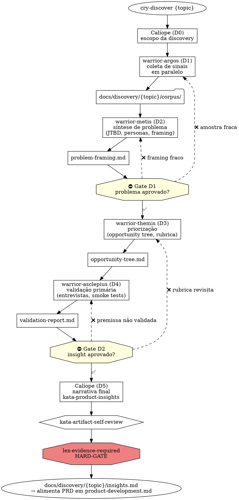

# Product Discovery — da incerteza ao DoR

> **Status:** proposta v2 (quebrada em gates) · **Escopo:** Plataforma Guardia · **Fase:** descoberta de problema, validação com evidência, síntese de insights até a feature ter Definition of Ready (DoR) atendido

---

## 1. Escopo

Cobre tudo que acontece **antes** de uma issue de implementação existir. Entrada: dor/oportunidade não estruturada. Saída: insight evidenciado pronto para virar PRD/Capability Spec na fase [Product Development](product-development.md).

**Mudança vs. v1:** Discovery agora é **fase composta** com 5 sub-fases (D1–D5), 2 Gates de aprovação humana, e 4 warriors especialistas orquestrados por Calíope. O motivo: o ciclo é longo demais e tem decisões estratégicas demais para concentrar em um único agente. O padrão segue [warrior-athena](../framework/pt-BR/engineering/workflow/warriors/warrior-athena.md) (orquestra → delega → 2 Gates) e [warrior-prometheus](../framework/pt-BR/engineering/platform/warriors/warrior-prometheus.md) (Theseus → Daedalus → Kronos).

---

## 2. Princípios da fase

Adotados dos estudos de [obra/superpowers](https://github.com/obra/superpowers) e [affaan-m/everything-claude-code](https://github.com/affaan-m/everything-claude-code):

1. **Evidência precede opinião.** Toda hipótese tem fonte rastreável.
2. **Decisão, não relatório.** Toda saída de discovery aponta uma recomendação acionável.
3. **Contraprova obrigatória.** Toda hipótese inclui pelo menos um argumento ou dado que a enfraquece.
4. **Recência sinalizada.** Dados >12 meses são marcados como "possivelmente desatualizados".
5. **Fato, inferência e recomendação separados.** Nunca misturar nas mesmas seções.
6. **Uma pergunta por vez.** Discovery interativo — multiple-choice quando possível.
7. **HARD-GATE para PRD.** Sem discovery declarada, não há PRD.
8. **Especialização por sub-fase.** Cada estágio do funil de discovery tem rigor diferente; warrior especialista por sub-fase reduz contexto e aumenta qualidade.

---

## 3. As 5 fases internas + 2 Gates

| Fase | Nome | Warrior responsável | Saída principal |
|---|---|---|---|
| **D1** | Coleta de sinais | [warrior-argos](#51-warrior-argos--coleta-de-sinais-novo) | `docs/discovery/{topic}/corpus/` |
| **D2** | Síntese de problema | [warrior-metis](#52-warrior-metis--síntese-de-problema-novo) | `docs/discovery/{topic}/problem-framing.md` |
| ⛔ **Gate D1** | **Problema aprovado** (humano) | (decisão humana) | aprovação para avançar |
| **D3** | Priorização de oportunidade | [warrior-themis](#53-warrior-themis--priorização-novo) | `docs/discovery/{topic}/opportunity-tree.md` |
| **D4** | Validação de hipótese | [warrior-asclepius](#54-warrior-asclepius--validação-novo) | `docs/discovery/{topic}/validation-report.md` |
| ⛔ **Gate D2** | **Insight aprovado** (humano) | (decisão humana) | aprovação para virar PRD |
| **D5** | Narrativa final | [warrior-calliope](#55-warrior-calliope--narrativa-final-orquestrador) | `docs/discovery/{topic}/insights.md` |

**Por que apenas 2 Gates e não 5:** segue o mesmo padrão de [warrior-athena](../framework/pt-BR/engineering/workflow/warriors/warrior-athena.md) (7 fases, 2 Gates). Concentra decisão humana onde realmente importa (problema bem definido / hipótese validada), evita reunião-fadiga, e permite execução fluida dentro de cada bloco.

**Gate D1 — Problema aprovado** (entre D2 e D3):
- Apresenta ao humano: corpus de evidência + problem framing + JTBD + personas
- Critério de passagem: aprovação explícita humana
- Se falhar: volta para D1 ou D2 com feedback (ex.: "amostra pequena demais, precisa mais entrevistas")

**Gate D2 — Insight aprovado** (entre D4 e D5):
- Apresenta ao humano: opportunity tree + validation report + recomendação
- Critério de passagem: aprovação explícita humana
- Se falhar: volta para D3 ou D4 (ex.: "premissa A ainda não validada, precisa rodar mais teste")

---

## 4. Posição no fluxo geral

```
[ INCERTEZA ]
     │
     ▼
┌──────────────────────────────────────────────────────┐
│  PRODUCT DISCOVERY — orquestrado por Calíope         │
│                                                      │
│   D1: Argos     → coleta de sinais                   │
│   D2: Métis     → síntese de problema                │
│   ⛔ Gate D1: humano aprova problema                 │
│   D3: Têmis     → priorização de oportunidade        │
│   D4: Asclépio  → validação de hipótese              │
│   ⛔ Gate D2: humano aprova insight                  │
│   D5: Calíope   → narrativa final (insights.md)      │
│                                                      │
│   Saída: docs/discovery/{topic}/insights.md          │
└──────────────────────────────────────────────────────┘
     │
     ▼
[ PRODUCT DEVELOPMENT ]  → ver product-development.md
     │
     ▼
[ PRODUCT DELIVERY ]  → ver product-delivery.md
```

---

## 5. Warriors

### 5.1 `warrior-argos` — Coleta de sinais (novo)

**Mitologia:** Argos Panoptes = gigante de cem olhos, o vigia que tudo vê. Encaixa com varredura paralela de múltiplas fontes sem perder sinal.

**Missão:** dado um tema, varre todas as fontes disponíveis em paralelo (Slack, Notion, e-mail, transcrições, OSS, web, mercado) e produz um corpus organizado, deduplicado e com atribuição de fonte. Não interpreta — coleta.

**Responsabilidades:**

| Faz | Não faz |
|---|---|
| Decide quais fontes explorar baseado no tema | Sintetiza problema (delega para Métis) |
| Invoca katas de coleta em paralelo | Prioriza oportunidades |
| Deduplica sinais entre fontes | Conduz entrevistas com cliente |
| Atribui fonte e data a cada sinal | Recomenda solução |
| Aplica [lex-evidence-required](#71-lex-evidence-required-novo) na fonte (data, autor, link) | Decide se o corpus é representativo (humano decide no Gate D1) |

**Katas que executa:**

| Kata | Função |
|---|---|
| `kata-content-explorer` | Varre Slack, Notion, e-mail por dores não resolvidas |
| `kata-transcriptions-analysis` | Extrai sinais de transcrições de calls e entrevistas existentes |
| `kata-deep-research` | Multi-source web research via firecrawl/exa MCP |
| `kata-market-research` | TAM/SAM/SOM, competitive analysis, posicionamento |
| `kata-clean-room-engineering` | Análise de soluções similares sem leakage |
| `kata-oss-feature-discovery` | Varre repos OSS por padrões relevantes |

**Persona:** rigoroso, paralelo, agnóstico — coleta tudo o que cabe, deixa interpretação para Métis.

**Conexão com o framework atual:**
- Consulta [lex-mcp](../framework/pt-BR/_foundation/tooling/lexis/lex-mcp.md), [codex-mcp-common](../framework/pt-BR/_foundation/tooling/codex/codex-mcp-common.md), [codex-mcp-notion](../framework/pt-BR/_foundation/tooling/codex/codex-mcp-notion.md), [codex-mcp-github](../framework/pt-BR/_foundation/tooling/codex/codex-mcp-github.md)
- Aplica [lex-evidence-required](#71-lex-evidence-required-novo) na atribuição de fonte
- Persiste checkpoint per [lex-checkpoint](../framework/pt-BR/_foundation/process/lexis/lex-checkpoint.md)

---

### 5.2 `warrior-metis` — Síntese de problema (novo)

**Mitologia:** Métis = titânide da sabedoria, primeira esposa de Zeus, mãe de Atena. Engolida por Zeus, simboliza "consumir e digerir conhecimento". Encaixa com transformar corpus bruto em entendimento.

**Missão:** dado o corpus produzido por Argos, transforma sinais em **entendimento** — JTBD, personas, problem framing. Aplica framework adequado ao tipo de evidência. Não decide priorização — apenas estrutura o problema.

**Responsabilidades:**

| Faz | Não faz |
|---|---|
| Aplica JTBD framework (job statements, forces of progress) | Coleta sinais (já feito por Argos) |
| Define personas baseadas em evidência | Decide qual oportunidade priorizar |
| Constrói problem statement(s) com dados | Roda entrevistas validatórias |
| Identifica padrões (clusters de dor, frequência, intensidade) | Recomenda solução |
| Prepara apresentação para Gate D1 | Aprova o próprio output (humano decide no Gate D1) |

**Katas que executa:**

| Kata | Função |
|---|---|
| `kata-jobs-to-be-done` | Mapeia JTBD a partir do corpus |
| `kata-persona-mapping` | Personas evidenciadas (não inventadas) |
| `kata-problem-framing` | Problem statements com dados |
| `kata-pattern-clustering` | Clusters de dor, frequência, intensidade |

**Persona:** sintética, framework-driven, paciente com nuance — prefere estruturar dúvida do que forçar conclusão.

**Conexão com o framework atual:**
- Consulta [codex-jobs-to-be-done](#8-codex), [codex-research-methods](#8-codex), [codex-insight-quality](#8-codex)
- Output alimenta [Product Development](product-development.md) — problem statement vira base do PRD via [kata-prd-creation](product-development.md#5-katas)

---

### 5.3 `warrior-themis` — Priorização (novo)

**Mitologia:** Têmis = titânide da lei, ordem, justiça divina, conselheira dos deuses. Encaixa com julgamento — pesar, comparar, decidir.

**Missão:** dado o problem framing aprovado no Gate D1, constrói opportunity solution tree e aplica rubrica de priorização (impacto × confiança × esforço). Recomenda **uma** oportunidade para validar (não três). Não valida com cliente — só prioriza.

**Responsabilidades:**

| Faz | Não faz |
|---|---|
| Constrói opportunity solution tree (Teresa Torres) | Sintetiza problema (já feito por Métis) |
| Aplica rubrica impacto × confiança × esforço | Conduz validação com cliente (delega para Asclépio) |
| Identifica assumption tests necessários | Decide go/no-go (humano decide no Gate D2) |
| Recomenda **uma** oportunidade para avançar | Considera múltiplas oportunidades em paralelo (uma por vez) |
| Lista assumption gaps que Asclépio deve testar | Escreve PRD |

**Katas que executa:**

| Kata | Função |
|---|---|
| `kata-opportunity-tree` | Opportunity solution tree estruturada |
| `kata-priority-rubric` | Aplicação da rubrica impacto × confiança × esforço |
| `kata-assumption-mapping` | Lista premissas a validar com cliente |

**Persona:** julgadora, decisiva, foca em uma aposta — recusa "vamos validar tudo".

**Conexão com o framework atual:**
- Consulta [codex-insight-quality](#8-codex)
- Output alimenta [warrior-asclepius](#54-warrior-asclepius--validação-novo) — lista de assumption tests

---

### 5.4 `warrior-asclepius` — Validação (novo)

**Mitologia:** Asclépio = deus da medicina, diagnóstico, cura. Filho de Apolo. Encaixa com "diagnosticar o problema com o cliente" — testar, observar, confirmar.

**Missão:** dado a oportunidade priorizada por Têmis, valida com **evidência primária** (entrevistas, assumption tests, smoke tests, dual-track). Produz validation report decision-oriented. Não escreve insight final — só valida.

**Responsabilidades:**

| Faz | Não faz |
|---|---|
| Gera roteiro de entrevista non-leading (`kata-customer-interview-script`) | Prioriza oportunidade (já feito por Têmis) |
| Conduz ou orquestra entrevistas com cliente | Escreve insight final (Calíope faz no D5) |
| Roda assumption tests (smoke test, fake door, concierge) | Decide go/no-go (humano decide no Gate D2) |
| Mede falsificação ou confirmação de cada premissa | Coleta sinais novos sem foco (já feito por Argos) |
| Produz validation report com fato/inferência/recomendação separados | |

**Katas que executa:**

| Kata | Função |
|---|---|
| `kata-customer-interview-script` | Gera roteiro non-leading a partir das premissas de Têmis |
| `kata-customer-interview-conduct` | Conduz entrevista (ou prepara humano para conduzir) |
| `kata-assumption-test` | Smoke test, fake door, concierge — design e leitura |
| `kata-validation-report` | Sintetiza resultado em report decision-oriented |

**Persona:** cético construtivo, busca falsificação ativamente — prefere matar uma hipótese cedo do que carregá-la para o PRD.

**Conexão com o framework atual:**
- Consulta [lex-evidence-required](#71-lex-evidence-required-novo) — validation report exige fato/inferência/recomendação separados
- Output é insumo direto do Gate D2

---

### 5.5 `warrior-calliope` — Narrativa final (orquestrador)

**Mitologia:** Calíope = musa da eloquência e da narrativa épica. Encaixa duplamente: (a) **orquestra** todo o ciclo (similar a Atena no Issue-Driven), (b) **executa** a fase D5 escrevendo a narrativa final.

**Missão dupla:**

**Como orquestradora (D0):**
- Recebe a invocação inicial (`cry-discover {topic}`)
- Decide o escopo da discovery (quais katas Argos deve rodar, se Têmis precisa fazer rubrica completa, etc.)
- Coordena handoffs entre Argos → Métis → Têmis → Asclépio
- Aplica os 2 Gates (D1, D2) com humano
- Mantém checkpoint em `.ahrena/workflow/discovery-{topic}/checkpoint.md` per [lex-checkpoint](../framework/pt-BR/_foundation/process/lexis/lex-checkpoint.md)
- Escala para humano em hotspots ou inconsistências entre fases

**Como executora (D5):**
- Após Gate D2, agrega outputs de todas as fases
- Invoca `kata-product-insights` para escrever `docs/discovery/{topic}/insights.md`
- Aplica `kata-artifact-self-review` antes de declarar concluído
- Aplica HARD-GATE de [lex-evidence-required](#71-lex-evidence-required-novo) — nenhum insight passa sem fonte + contraprova

**Continuidade no fluxo:**
Calíope **continua** orquestrando após Discovery — em [Product Development](product-development.md) ela escreve PRD, Capability Spec, valida DoR e cria a issue. Discovery (D0–D5) é a "fase 0" dela; depois entram as fases 1–4 de Development.

**Persona:** narradora estratégica + orquestradora rigorosa — formaliza decisão e narrativa, defende rigor de evidência, aplica gates sem exceção.

**Conexão com o framework atual:**
- Posicionamento idêntico a [warrior-athena](../framework/pt-BR/engineering/workflow/warriors/warrior-athena.md) (orquestrador master de fluxo) e [warrior-prometheus](../framework/pt-BR/engineering/platform/warriors/warrior-prometheus.md) (orquestrador master de design técnico)
- **Hierarquia inversa interessante:** mitologicamente Métis é mãe de Atena. No framework, Calíope (musa) coordena Métis (titânide). Não há contradição — são contextos distintos
- **Continua em Development:** ver [Product Development → seção 4.1](product-development.md#41-warrior-calliope--product-manager-novo)

---

## 6. Katas

Organizados por fase. **Todos** os katas seguem [lex-template-usage](../framework/pt-BR/_foundation/quality/lexis/lex-template-usage.md) e produzem artefato com path canônico.

### 6.1 Katas da fase D1 (executados por Argos)

| Kata | Inspiração | Saída |
|---|---|---|
| `kata-content-explorer` | Ring `pre-dev-research` | `docs/discovery/{topic}/corpus/content-scan.md` |
| `kata-transcriptions-analysis` | Ring `pre-dev-research` | `docs/discovery/{topic}/corpus/transcripts-analysis.md` |
| `kata-deep-research` | ECC `deep-research` | `docs/discovery/{topic}/corpus/research-{slug}.md` |
| `kata-market-research` | ECC `market-research` | `docs/discovery/{topic}/corpus/market-{slug}.md` |
| `kata-clean-room-engineering` | Ring `pre-dev-research` | `docs/discovery/{topic}/corpus/clean-room.md` |
| `kata-oss-feature-discovery` | Ring `pre-dev-research` | `docs/discovery/{topic}/corpus/oss-scan.md` |

### 6.2 Katas da fase D2 (executados por Métis)

| Kata | Função | Saída |
|---|---|---|
| `kata-jobs-to-be-done` | Mapeia JTBD a partir do corpus | `docs/discovery/{topic}/jtbd.md` |
| `kata-persona-mapping` | Personas evidenciadas | seção do `problem-framing.md` |
| `kata-problem-framing` | Problem statements com dados | `docs/discovery/{topic}/problem-framing.md` |
| `kata-pattern-clustering` | Clusters de dor/frequência/intensidade | seção do `problem-framing.md` |

### 6.3 Katas da fase D3 (executados por Têmis)

| Kata | Função | Saída |
|---|---|---|
| `kata-opportunity-tree` | Opportunity solution tree (Torres) | `docs/discovery/{topic}/opportunity-tree.md` |
| `kata-priority-rubric` | Rubrica impacto × confiança × esforço | seção do `opportunity-tree.md` |
| `kata-assumption-mapping` | Lista de premissas a validar | seção do `opportunity-tree.md` |

### 6.4 Katas da fase D4 (executados por Asclépio)

| Kata | Função | Saída |
|---|---|---|
| `kata-customer-interview-script` | Roteiro non-leading | `docs/discovery/{topic}/interviews/script-{n}.md` |
| `kata-customer-interview-conduct` | Conduz ou prepara entrevista | `docs/discovery/{topic}/interviews/{date}-{participant}.md` |
| `kata-assumption-test` | Smoke test, fake door, concierge | `docs/discovery/{topic}/tests/{slug}.md` |
| `kata-validation-report` | Relatório decision-oriented | `docs/discovery/{topic}/validation-report.md` |

### 6.5 Katas da fase D5 (executados por Calíope)

| Kata | Função | Saída |
|---|---|---|
| `kata-product-insights` | Síntese final decision-oriented | `docs/discovery/{topic}/insights.md` |
| `kata-artifact-self-review` | Cross-fase — scan de qualidade pré-review humano | inline ou `.review-{date}.md` |

---

## 7. Lexis

### 7.1 `lex-evidence-required` (novo)

**Lei:**

> Toda hipótese, alegação ou recomendação produzida em discovery MUST ter evidência rastreável. Opinião sem fonte é FORBIDDEN como premissa de PRD ou Capability Spec.

**Regras (adotadas literal de [affaan-m/everything-claude-code](https://github.com/affaan-m/everything-claude-code) `market-research`):**
- Toda alegação importante MUST ter fonte rastreável (entrevista citada, dado com link, transcrição com timestamp)
- Dados >12 meses MUST ser sinalizados como possivelmente desatualizados
- Toda hipótese MUST ter seção "Evidência contrária" — pelo menos um argumento ou dado que a enfraquece
- Output MUST ser orientado a decisão (recomendação acionável), não resumo neutro
- Fato, inferência e recomendação MUST estar em seções separadas

**HARD-GATE textual:**

```
<HARD-GATE>
Calíope NÃO MAY emitir docs/discovery/{topic}/insights.md como concluído
sem que CADA insight tenha:
  (a) fonte citada e linkada
  (b) data da fonte explícita
  (c) seção "Contraprova" preenchida (mesmo que com "evidência contrária
      não encontrada — confiança reduzida")
  (d) classificação fato/inferência/recomendação
Esta regra se aplica independentemente da pressão de prazo ou da
percepção de "óbvio".
</HARD-GATE>
```

### 7.2 `lex-discovery-before-prd` (novo)

**Lei:**

> Nenhum PRD ou Capability Spec MAY ser iniciado sem fase de discovery declarada e documentada em `docs/discovery/{topic}/`. A discovery pode ser mínima (uma única evidência rastreável) mas MUST existir.

**Conexão:** estende [lex-issue-quality](../framework/pt-BR/_foundation/contributing/lexis/lex-issue-quality.md).

### 7.3 `lex-discovery-gates` (novo)

**Lei:**

> Toda discovery com escopo >5 dias-pessoa MUST passar pelos Gates D1 (problema aprovado) e D2 (insight aprovado) com aprovação humana explícita registrada no checkpoint. Saltar Gate é FORBIDDEN — discoveries que pulam acabam reescrevendo PRD depois.

**Exceção:** discoveries pequenas (<2 dias-pessoa) podem ter Gate D1 e D2 fundidos em um único Gate final, registrado da mesma forma.

---

## 8. Codex

| Codex | Conteúdo |
|---|---|
| `codex-product-discovery` | Continuous discovery (Torres), dual-track agile, fundamentos da fase |
| `codex-research-methods` | Métodos qualitativos / quantitativos; quando usar cada |
| `codex-insight-quality` | Sinais de insight forte vs ruído; rubrica de priorização |
| `codex-jobs-to-be-done` | Framework JTBD aplicado ao contexto agentic accounting |
| `codex-evidence-attribution` | Como citar fonte (entrevista, dado, transcrição); formato canônico |
| `codex-discovery-gates` | Como conduzir Gates D1 e D2; o que apresentar; o que não aprovar |

---

## 9. Cries (entry points)

| Cry | Invoca | Uso |
|---|---|---|
| `cry-discover` | [warrior-calliope](#55-warrior-calliope--narrativa-final-orquestrador) (orquestra D0–D5) | "Quero entender o problema X" |
| `cry-collect` | [warrior-argos](#51-warrior-argos--coleta-de-sinais-novo) | "Só varre as fontes para mim — sem síntese" |
| `cry-frame-problem` | [warrior-metis](#52-warrior-metis--síntese-de-problema-novo) | "Já tenho corpus, sintetiza problema" |
| `cry-prioritize` | [warrior-themis](#53-warrior-themis--priorização-novo) | "Já tenho problema, prioriza oportunidade" |
| `cry-validate` | [warrior-asclepius](#54-warrior-asclepius--validação-novo) | "Já tenho oportunidade, roda validação primária" |
| `cry-deep-research` | `kata-deep-research` direto | "Pesquisa profunda sobre Y, sem ciclo completo" |
| `cry-market-research` | `kata-market-research` direto | "Levanta cenário competitivo de Z" |

**Princípio:** cada warrior pode ser invocado isoladamente, fora do ciclo orquestrado. Útil para discoveries parciais ou re-entrada em fase específica.

---

## 10. Fluxo end-to-end com gates



---

## 11. Conexões com o framework atual

### 11.1 Lexis existentes que esta fase consulta ou estende

| Lexis existente | Como Discovery se conecta |
|---|---|
| [lex-directives](../framework/pt-BR/_foundation/process/lexis/lex-directives.md) | Calíope lê `.ahrena/.directives` (paths, language, mcp.servers) |
| [lex-mcp](../framework/pt-BR/_foundation/tooling/lexis/lex-mcp.md) | Argos consome MCPs declarados (firecrawl, exa, GitHub, Notion) |
| [lex-issue-quality](../framework/pt-BR/_foundation/contributing/lexis/lex-issue-quality.md) | Estendida: campo "Why" passa a exigir link para `insights.md` quando feature |
| [lex-tone](../framework/pt-BR/_foundation/quality/lexis/lex-tone.md) | Saídas seguem tom Guardia |
| [lex-template-usage](../framework/pt-BR/_foundation/quality/lexis/lex-template-usage.md) | Todo kata produz artefato baseado em template |
| [lex-brand-voice](../framework/pt-BR/design/brand/lexis/lex-brand-voice.md) | Insights destinados a uso público seguem voz Guardia |
| [lex-language](../framework/pt-BR/documentation/i18n/lexis/lex-language.md) | Saídas em `language.default`; tradução por demanda |
| [lex-platforms-rules](../framework/pt-BR/_foundation/process/lexis/lex-platforms-rules.md) | Cada novo lex/codex entra em `framework/platforms.yaml` |
| [lex-checkpoint](../framework/pt-BR/_foundation/process/lexis/lex-checkpoint.md) | Calíope persiste checkpoint em `.ahrena/workflow/discovery-{topic}/checkpoint.md` |

### 11.2 Codex existentes que esta fase referencia

| Codex existente | Uso em Discovery |
|---|---|
| [codex-mcp-common](../framework/pt-BR/_foundation/tooling/codex/codex-mcp-common.md) | Padrões de uso e fallback de MCPs |
| [codex-mcp-notion](../framework/pt-BR/_foundation/tooling/codex/codex-mcp-notion.md) | Argos via `kata-content-explorer` |
| [codex-mcp-github](../framework/pt-BR/_foundation/tooling/codex/codex-mcp-github.md) | Argos via `kata-oss-feature-discovery` |
| [codex-tone](../framework/pt-BR/_foundation/quality/codex/codex-tone.md) | Manual de aplicação do tom Guardia |
| [codex-ai-first-experience](../framework/pt-BR/design/system/codex/codex-ai-first-experience.md) | Insights destinados ao produto consideram restrições agênticas |

### 11.3 Warriors existentes — interação detalhada

| Warrior existente | Relação com Discovery |
|---|---|
| [warrior-athena](../framework/pt-BR/engineering/workflow/warriors/warrior-athena.md) | **Downstream.** Recebe issue de Calíope após DoR atendido em Development |
| [warrior-prometheus](../framework/pt-BR/engineering/platform/warriors/warrior-prometheus.md) | **Downstream.** Consome Capability Spec produzido em Development (que usa `insights.md` como input) |
| [warrior-translator](../framework/pt-BR/documentation/i18n/warriors/warrior-translator.md) | **Sob demanda.** Traduz `insights.md` para outros idiomas quando aplicável |
| [warrior-apollo](../framework/pt-BR/engineering/backend/warriors/warrior-apollo.md), [warrior-hephaestus](../framework/pt-BR/engineering/frontend/warriors/warrior-hephaestus.md), [warrior-iris](../framework/pt-BR/engineering/mobile/warriors/warrior-iris.md), [warrior-demeter](../framework/pt-BR/engineering/data/warriors/warrior-demeter.md), [warrior-atlas](../framework/pt-BR/engineering/devops/warriors/warrior-atlas.md), [warrior-hera](../framework/pt-BR/engineering/quality/warriors/warrior-hera.md), [warrior-hestia](../framework/pt-BR/engineering/sre/warriors/warrior-hestia.md), [warrior-theseus](../framework/pt-BR/engineering/platform/warriors/warrior-theseus.md), [warrior-daedalus](../framework/pt-BR/engineering/platform/warriors/warrior-daedalus.md), [warrior-kronos](../framework/pt-BR/engineering/platform/warriors/warrior-kronos.md) | Sem interação direta — atuam em [Product Development](product-development.md) ou [Product Delivery](product-delivery.md) |

### 11.4 Cries existentes que ganham contexto

- [cry-new-feature-request](../framework/pt-BR/_foundation/contributing/cries/cry-new-feature-request.md), [cry-new-epic](../framework/pt-BR/_foundation/contributing/cries/cry-new-epic.md), [cry-new-user-story-api](../framework/pt-BR/_foundation/contributing/cries/cry-new-user-story-api.md), [cry-new-user-story-frontend](../framework/pt-BR/_foundation/contributing/cries/cry-new-user-story-frontend.md): templates passam a aceitar campo `discovery: docs/discovery/{topic}/insights.md`. Quando feature relevante, campo torna-se obrigatório por [lex-discovery-before-prd](#72-lex-discovery-before-prd-novo).
- **Busca anti-duplicação embutida:** todos os cries de criação de issue acima passam a embutir verificação automática por issues existentes (abertas e recém-fechadas) cobrindo o mesmo escopo, antes de criar a issue, per cláusula anti-duplicação de [lex-issue-first](../framework/pt-BR/_foundation/contributing/lexis/lex-issue-first.md). Quando issue compatível é encontrada, o cry recomenda usá-la como anchor (`Closes #N` / `Refs #N`) em vez de criar nova. Calíope ([Product Development](product-development.md#41-warrior-calliope--product-manager-orquestrador-master)) é a invocadora primária desses cries no fluxo de Discovery → Development.

---

## 12. Templates de artefatos gerados

### 12.1 `docs/discovery/{topic}/problem-framing.md` (saída de Métis — D2)

```markdown
# Problem Framing — {topic}

> **Owner:** @user · **Created:** YYYY-MM-DD · **Status:** [draft | gate-d1-approved]
> **Corpus:** docs/discovery/{topic}/corpus/

## Problem statements

### PS-1: {título}
- **Quem sofre:** [persona evidenciada]
- **Do quê:** [dor com dado]
- **Frequência:** [intensidade observada no corpus]
- **Evidência:** [3-5 fontes citadas]
- **Contraprova:** [argumento que enfraquece]

### PS-2: ...

## Personas evidenciadas

[Personas baseadas em entrevistas/dados, não em arquétipo abstrato.]

## JTBD principal

- **Job statement:** When [situação], I want to [motivação], so I can [outcome].
- **Forces of progress:** [pushes / pulls / anxieties / habits]

## Padrões observados

[Clusters de dor: o que se repete, frequência, intensidade.]

## Lacunas conhecidas

[O que ainda não sabemos. O que custaria descobrir.]
```

### 12.2 `docs/discovery/{topic}/opportunity-tree.md` (saída de Têmis — D3)

```markdown
# Opportunity Tree — {topic}

> **Owner:** @user · **Created:** YYYY-MM-DD · **Status:** [draft | recommended]
> **Problem framing:** docs/discovery/{topic}/problem-framing.md

## Outcome alvo

[Métrica de outcome que esta discovery quer mover.]

## Oportunidades

### O-1: {título}
- **Vínculo com PS-N:** ...
- **Impacto estimado:** alto | médio | baixo
- **Confiança:** alta | média | baixa
- **Esforço estimado:** S | M | L
- **Score:** [valor da rubrica]

### O-2: ...

## Soluções candidatas (por oportunidade priorizada)

### Para O-1:
- S-1.1: ...
- S-1.2: ...
- S-1.3: ...

## Recomendação

[Uma oportunidade recomendada para validar. Justificativa.]

## Premissas a validar

[Lista de assumption tests que Asclépio deve rodar.]
```

### 12.3 `docs/discovery/{topic}/validation-report.md` (saída de Asclépio — D4)

```markdown
# Validation Report — {topic}

> **Owner:** @user · **Created:** YYYY-MM-DD · **Status:** [draft | gate-d2-approved]
> **Opportunity tree:** docs/discovery/{topic}/opportunity-tree.md

## Premissas testadas

### Premissa 1: {enunciado}
- **Método:** [entrevista | smoke test | fake door | concierge]
- **Amostra:** [N participantes / período]
- **Resultado:** [confirmada | falsificada | inconclusiva]
- **Evidência:** [link para entrevistas/dados]

### Premissa 2: ...

## Recomendação

[Avançar para PRD com solução X | iterar discovery | descartar oportunidade.]

## Riscos remanescentes

[Premissas não testadas que viram OPEN QUESTIONS no Capability Spec.]
```

### 12.4 `docs/discovery/{topic}/insights.md` (saída final — D5)

Mesmo template da v1 deste documento, mantido. É a saída canônica que alimenta o PRD em [Product Development](product-development.md).

### 12.5 Estrutura de pastas

```
docs/
└── discovery/
    └── {topic}/
        ├── insights.md              ← saída canônica (D5)
        ├── problem-framing.md       ← D2
        ├── opportunity-tree.md      ← D3
        ├── validation-report.md     ← D4
        ├── jtbd.md
        ├── corpus/                  ← D1 (Argos)
        │   ├── content-scan.md
        │   ├── transcripts-analysis.md
        │   ├── research-{slug}.md
        │   ├── market-{slug}.md
        │   ├── clean-room.md
        │   └── oss-scan.md
        ├── interviews/              ← D4 (Asclépio)
        │   ├── script-{n}.md
        │   └── {date}-{participant}.md
        └── tests/                   ← D4 (Asclépio)
            └── {slug}.md
```

---

## 13. Onda de implementação sugerida

| Onda | Entrega | Justificativa |
|---|---|---|
| **2.0** | [lex-evidence-required](#71-lex-evidence-required-novo) + [codex-evidence-attribution](#8-codex) | Regra precede tooling |
| **2.1** | [warrior-argos](#51-warrior-argos--coleta-de-sinais-novo) + katas D1 (`kata-deep-research`, `kata-market-research`, `kata-content-explorer`) | Maior leverage imediato — coleta atende demanda externa de pesquisa |
| **2.2** | [warrior-metis](#52-warrior-metis--síntese-de-problema-novo) + katas D2 (`kata-jobs-to-be-done`, `kata-problem-framing`) | Síntese fecha primeira metade do funil |
| **2.3** | Gate D1 formalizado em [codex-discovery-gates](#8-codex) + [lex-discovery-gates](#73-lex-discovery-gates-novo) | Antes de criar Têmis e Asclépio, consolida o Gate intermediário |
| **2.4** | [warrior-themis](#53-warrior-themis--priorização-novo) + katas D3 | Priorização entra quando há volume de oportunidades para escolher |
| **2.5** | [warrior-asclepius](#54-warrior-asclepius--validação-novo) + katas D4 | Validação primária exige time treinado em entrevista — última peça |
| **2.6** | [warrior-calliope](#55-warrior-calliope--narrativa-final-orquestrador) (orquestrador D0+D5) | Tudo acima funciona invocado direto via `cry-{collect|frame|prioritize|validate}`; orquestrador unifica quando há volume |

**Princípio:** cada warrior é entregável isolado. Argos sozinho já entrega valor (`cry-collect`). Metis sozinho idem (`cry-frame-problem`). Calíope só vira necessária quando o ciclo completo é frequente — não bloquear adoção parcial.

---

## 14. Decisões abertas

| # | Decisão | Recomendação |
|---|---|---|
| D1 | 5 fases ou 4? (mesclar D3+D4 em uma) | **5 fases.** Gates explícitos entre priorização e validação evitam validar oportunidade errada |
| D2 | Têmis recomenda 1 oportunidade ou 3? | **1 oportunidade.** Discovery em paralelo bagunça o ciclo. Se sobra capacidade, abrir nova discovery |
| D3 | Calíope orquestra E executa D5, ou warrior dedicado para D5? | **Calíope faz ambos** — segue padrão Athena (orquestra + invoca [kata-pr-prepare](../framework/pt-BR/engineering/workflow/katas/kata-pr-prepare.md) na fase 7 ela mesma) |
| D4 | `kata-deep-research` requer firecrawl + exa MCP. Vamos contratar? | Decisão de produto/custo. Sem MCPs, kata escala fallback ao usuário |
| D5 | Onde fica `docs/discovery/`: repo do produto ou repo separado? | Mesmo repo — coerente com [lex-issue-driven](../framework/pt-BR/engineering/workflow/lexis/lex-issue-driven.md) |
| D6 | Quem aprova encerramento da discovery? | Owner do tema + sign-off do Product (Calíope formaliza, humano aprova nos Gates D1, D2, e final) |
| D7 | Discovery mínima — quão mínima? | Pelo menos 1 evidência rastreável + 1 contraprova + Gate D2 (mesmo que fundido com D1) |
| D8 | Asclépio conduz entrevista ou só prepara humano? | **Prepara humano** por default (entrevista exige presença); pode conduzir quando agente conversacional já está em produção |

---

## 15. Próximos passos

1. **Validar D1–D8** com time de produto.
2. **Rascunhar [lex-evidence-required](#71-lex-evidence-required-novo)** como protótipo.
3. **Implementar `kata-deep-research` + `kata-market-research`** como Onda 2.1 (Argos isolado, sem warrior dedicado ainda — provando o valor antes de formalizar).
4. **Atualizar [lex-issue-quality](../framework/pt-BR/_foundation/contributing/lexis/lex-issue-quality.md)** para referenciar `docs/discovery/{topic}/insights.md` no campo "Why".

---

> **Próximo documento:** [Product Development](product-development.md) — Calíope continua orquestrando (PRD → Capability Spec → DoR), [warrior-athena](../framework/pt-BR/engineering/workflow/warriors/warrior-athena.md) entra para o fluxo Issue-Driven, e [warrior-prometheus](../framework/pt-BR/engineering/platform/warriors/warrior-prometheus.md) faz design técnico quando aplicável.
