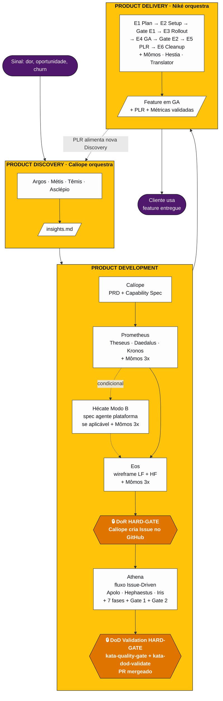
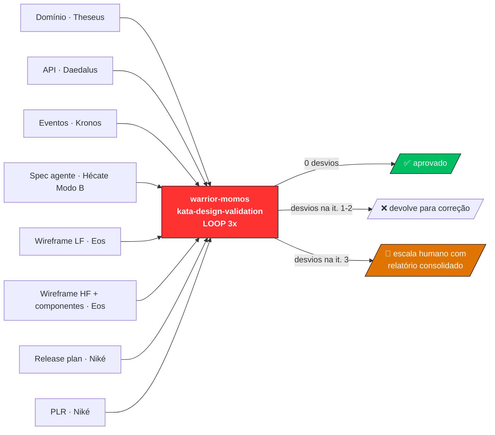

# Product Flow — Visão End-to-End

> **Status:** proposta v3 · **Escopo:** ciclo completo de produto na Plataforma Guardia · **Origem:** [Discovery](product-discovery.md) → [Development](product-development.md) → [Delivery](product-delivery.md)

---

## 1. Resumo em uma frase

Uma feature da Guardia nasce de um sinal de incerteza, atravessa três blocos orquestrados (**Discovery** com Calíope, **Development** com Calíope + Prometheus, **Delivery** com Niké), passa por **6 Gates humanos** e por **validação adversarial de Mômos em loop 3x**, e fecha o ciclo realimentando nova Discovery via PLR.

---

## 2. Diagrama macro

Os 3 blocos com seus orquestradores e marcos principais. Athena, DoR e DoD Validation visíveis no fluxo interno de Development.



**Leitura:** Calíope abre PRD/Capability Spec → Prometheus faz design técnico (com Hécate Modo B condicional para agentes da plataforma) → Eos faz design visual quando UI → **DoR HARD-GATE** valida pacote pronto e Calíope cria a Issue no GitHub → **Athena** orquestra implementação (Apolo/Hephaestus/Iris) através das 7 fases do Issue-Driven → **DoD Validation HARD-GATE** ([kata-quality-gate](../framework/pt-BR/engineering/workflow/katas/kata-quality-gate.md) + `kata-dod-validate`) gate o merge → handoff para Niké em Delivery.

---

## 3. Quem faz o quê — tabela mestre

| Fase | Warrior orquestrador | Warriors especialistas | Output canônico |
|---|---|---|---|
| **Discovery** | [Calíope](product-discovery.md#55-warrior-calliope--narrativa-final-orquestrador) | [Argos](product-discovery.md#51-warrior-argos--coleta-de-sinais-novo) (coleta) · [Métis](product-discovery.md#52-warrior-metis--síntese-de-problema-novo) (síntese) · [Têmis](product-discovery.md#53-warrior-themis--priorização-novo) (priorização) · [Asclépio](product-discovery.md#54-warrior-asclepius--validação-novo) (validação) | `docs/discovery/{topic}/insights.md` |
| **Development** | [Calíope](product-development.md#41-warrior-calliope--product-manager-orquestrador-master) | [Prometheus](product-development.md#42-warrior-prometheus--feature-design-lead-reposicionado) (Theseus + Daedalus + Kronos) · [Eos](product-development.md#44-warrior-eos--design-visual-novo) (visual) · [Hécate](product-development.md#46-warrior-hecate--meta-engenharia-de-agentes-novo) (agente plataforma) · [Mômos](product-development.md#43-warrior-momos--validador-adversarial-novo) (validador) · [Athena](../framework/pt-BR/engineering/workflow/warriors/warrior-athena.md) (implementação) · Apolo/Hephaestus/Iris/Hera/Atlas/Demeter | `docs/product/{feature}/` + `docs/agents/{agent}/` + PR mergeado |
| **Delivery** | [Niké](product-delivery.md#41-warrior-nike--delivery-orchestrator-refinado) | [Mômos](product-development.md#43-warrior-momos--validador-adversarial-novo) (validador) · [Hestia](../framework/pt-BR/engineering/sre/warriors/warrior-hestia.md) (incidentes) · [Translator](../framework/pt-BR/documentation/i18n/warriors/warrior-translator.md) (release notes) | `docs/releases/{feature}/` |

---

## 4. Diagrama detalhado — sub-fases e gates

```mermaid
flowchart TB
    Sinal([Sinal de produto])

    subgraph PD["PRODUCT DISCOVERY"]
        direction TB
        D1[D1 · Argos<br/>coleta de sinais]
        D2[D2 · Métis<br/>síntese de problema]
        GD1{{⛔ Gate D1<br/>problema aprovado}}
        D3[D3 · Têmis<br/>priorização]
        D4[D4 · Asclépio<br/>validação primária]
        GD2{{⛔ Gate D2<br/>insight aprovado}}
        D5[D5 · Calíope<br/>insights.md]

        D1 --> D2 --> GD1 --> D3 --> D4 --> GD2 --> D5
    end

    subgraph PDV["PRODUCT DEVELOPMENT"]
        direction TB
        F1[Fase 1 · Calíope<br/>PRD + Capability Spec]
        F2[Fase 2 · Prometheus<br/>domínio + API + eventos<br/>+ Mômos LOOP 3x]
        F25[Fase 2.5 · Hécate Modo B<br/>spec agente plataforma<br/>+ Mômos LOOP 3x]
        F3[Fase 3 · Eos<br/>wireframe LF + HF<br/>+ Mômos LOOP 3x]
        F4[Fase 4 · Calíope<br/>ACs + DoR validate]
        DoR{{🔒 DoR HARD-GATE}}
        F5[Fase 5 · Athena<br/>fluxo Issue-Driven<br/>Apolo/Hephaestus/Iris]
        DoD{{🔒 DoD HARD-GATE}}

        F1 --> F2
        F2 -.condicional.-> F25
        F25 -.-> F3
        F2 --> F3
        F3 --> F4 --> DoR --> F5 --> DoD
    end

    subgraph PDL["PRODUCT DELIVERY"]
        direction TB
        DEL1[E1 · Niké · Plan<br/>+ Mômos LOOP 3x]
        DEL2[E2 · Niké · Setup<br/>flag + auto-schedule<br/>PLR/cleanup/audit]
        GDEL1{{⛔ Gate E1<br/>plan approved}}
        DEL3[E3 · Niké · Rollout<br/>1% → 10% → 50%<br/>halt → Hestia]
        DEL4[E4 · Niké · GA 100%<br/>changelog + release notes<br/>+ Mômos]
        GDEL2{{⛔ Gate E2<br/>GA approved}}
        DEL5[E5 · Niké · PLR<br/>+ AI-First metrics<br/>+ runtime audit<br/>+ Mômos LOOP 3x]
        DEL6[E6 · Niké · Cleanup<br/>flag removida]

        DEL1 --> DEL2 --> GDEL1 --> DEL3 --> DEL4 --> GDEL2 --> DEL5 --> DEL6
    end

    Sinal --> D1
    D5 --> F1
    DoD --> DEL1
    DEL6 --> Cliente([Feature em GA<br/>cliente usa])
    DEL5 -.feedback alimenta.-> D1

    classDef phase fill:#FFC30A,stroke:#0E1016,color:#0E1016
    classDef gate fill:#FF3131,stroke:#0E1016,color:#FDFDFD,font-weight:bold
    classDef hardgate fill:#E07400,stroke:#0E1016,color:#FDFDFD,font-weight:bold
    classDef terminal fill:#4F186D,stroke:#0E1016,color:#FDFDFD
    class GD1,GD2,GDEL1,GDEL2 gate
    class DoR,DoD hardgate
    class Sinal,Cliente terminal
```



---

## 5. Os 6 Gates humanos do fluxo

| # | Gate | Fase | Quem aprova | Critério |
|---|---|---|---|---|
| 1 | **Gate D1** — problema aprovado | Discovery, entre D2 e D3 | Owner do tema + Product | Problem framing tem evidência rastreável |
| 2 | **Gate D2** — insight aprovado | Discovery, entre D4 e D5 | Owner do tema + Product | Premissas validadas; recomendação fundamentada |
| 3 | **DoR HARD-GATE** | Development, antes da issue | Calíope formaliza, humano confirma | 8 critérios canônicos atendidos |
| 4 | **DoD HARD-GATE** | Development, antes do merge | [kata-quality-gate](../framework/pt-BR/engineering/workflow/katas/kata-quality-gate.md) + `kata-dod-validate` | 7+1 checks aprovados |
| 5 | **Gate E1** — plan approved | Delivery, antes do rollout | Product + Engineering Lead | Release plan robusto, rollback claro |
| 6 | **Gate E2** — GA approved | Delivery, antes de fechar rollout | Product + Engineering Lead (+ SRE em tier-1) | Métricas saudáveis em 50% por tempo mínimo |

**Observação:** os "HARD-GATEs" (DoR, DoD) são bloqueios automáticos por Lexis. Os "Gates" numerados (D1, D2, E1, E2) são decisões humanas explícitas — o agente apresenta artefato e aguarda aprovação.

---

## 6. O loop adversarial Mômos — onde atua

[Mômos](product-development.md#43-warrior-momos--validador-adversarial-novo) é o crítico residente que opera em loop 3x sobre artefatos importantes. Atua em **8 pontos** do fluxo:



---

## 7. Loop de feedback — como o ciclo se realimenta

```
                    ┌──────────────────────────────────┐
                    │                                  │
                    ▼                                  │
         ┌─────────────────┐                           │
         │   DISCOVERY     │                           │
         │  (incerteza →   │                           │
         │   insight)      │                           │
         └────────┬────────┘                           │
                  │ insights.md                        │
                  ▼                                    │
         ┌─────────────────┐                           │
         │  DEVELOPMENT    │                           │
         │  (DoR → DoD)    │                           │
         └────────┬────────┘                           │
                  │ PR mergeado                        │
                  ▼                                    │
         ┌─────────────────┐                           │
         │   DELIVERY      │                           │
         │  (DoD → cliente)│                           │
         └────────┬────────┘                           │
                  │                                    │
                  │ PLR + customer feedback            │
                  │ + runtime guard-rail audit         │
                  │ + AI-First metrics                 │
                  │                                    │
                  └────────────────────────────────────┘
                         alimenta nova Discovery
```

**3 mecanismos de realimentação:**

1. **PLR** ([E5 do Delivery](product-delivery.md#55-e5--plr--feedback-executados-por-niké)) → identifica oportunidade de iteração ou nova feature → vira tema de [Discovery](product-discovery.md)
2. **Runtime guard-rail audit** (D+7 quando agente da plataforma) → identifica Lexis mal especificada → Hécate Modo A evolui Lexis no framework + Modo B atualiza agente
3. **Customer feedback loop** ([kata-customer-feedback-loop](product-delivery.md#55-e5--plr--feedback-executados-por-niké)) → estrutura sinais contínuos que viram corpus para nova Discovery via [warrior-argos](product-discovery.md#51-warrior-argos--coleta-de-sinais-novo)

---

## 8. Onde cada tipo de decisão acontece

| Tipo de decisão | Quem decide | Onde |
|---|---|---|
| Estratégica de produto | Humano nos Gates D1, D2, E1, E2 | Apresentação de artefato + aprovação explícita |
| Conformidade técnica | Mômos em loop 3x | `kata-design-validation` parametrizado por tipo |
| Conformidade automatizada | [lex-*-pattern](product-development.md#61-lex-hard-gate-pattern-meta-lex) HARD-GATE | Bloqueio textual nas Lexis (`<HARD-GATE>...</HARD-GATE>`) |
| Implementação técnica | Apolo / Hephaestus / Iris (delegados por Athena) | Fase 5 do Development, dentro do Issue-Driven |
| Operacional de rollout | Niké automatizada + halt automático | `kata-rollout-monitor` + dashboards |
| Incidente em produção | Hestia (escalada por Niké) | [kata-incident-triage](../framework/pt-BR/engineering/sre/katas/kata-incident-triage.md) |
| Evolução do framework | Hécate Modo A (humano dispara) | Quando Lexis/Codex/Warrior precisa nascer ou evoluir |
| Spec de agente da plataforma | Hécate Modo B (humano dispara via Calíope) | Fase 2.5 do Development, condicional |

---

## 9. Os 4 padrões transversais

Estes padrões se repetem em todas as 3 fases — entender 1 vez é entender 3 vezes:

### 9.1 Orquestrador master + warriors especialistas

Cada fase tem 1 orquestrador e N especialistas. Mesma mecânica de [warrior-athena](../framework/pt-BR/engineering/workflow/warriors/warrior-athena.md) hoje:

| Fase | Orquestrador | Especialistas |
|---|---|---|
| Discovery | Calíope | Argos, Métis, Têmis, Asclépio |
| Development | Calíope (continua) | Prometheus, Theseus, Daedalus, Kronos, Hécate, Eos, Mômos, Athena (Apolo, Hephaestus, Iris, ...) |
| Delivery | Niké | Mômos, Hestia, Translator |

### 9.2 Gates humanos (decisão estratégica)

Cada fase tem 2 Gates principais. Concentra decisão humana onde realmente importa, evita reunião-fadiga.

### 9.3 Mômos validador adversarial (decisão técnica)

Loop 3x sobre artefatos importantes. Mesma máquina em todas as fases. Após 3ª iteração com desvios → escala humano.

### 9.4 HARD-GATE textual nas Lexis (decisão automatizada)

Quando Lexis exige bloqueio, usa `<HARD-GATE>` literal — não basta dizer MUST. Inspirado em [obra/superpowers](https://github.com/obra/superpowers).

---

## 10. Ahrena dual-use — insight central

O framework Ahrena descreve **dois tipos de agentes** com a mesma linguagem:

```mermaid
flowchart LR
    Ahrena[Ahrena Framework<br/>Lexis · Codex · Katas · Warriors · Cries]

    subgraph A[" Modo A — Framework "]
        FA[Warriors do dev workflow<br/>Athena, Apolo, Calíope, Niké, Mômos, Hécate, ...]
    end

    subgraph B[" Modo B — Plataforma Guardia "]
        FB[Agentes em produção<br/>Isac, sub-agente fiscal,<br/>sub-agente reconciliação, ...]
    end

    Ahrena --> A
    Ahrena --> B

    A -.warrior + kata + lex + codex.-> SpecA[Spec do framework<br/>framework/pt-BR/...]
    B -.warrior + kata + lex + codex.-> SpecB[Spec deployável<br/>docs/agents/{agent}/<br/>vira system prompt + tools + guard-rails]

    classDef framework fill:#4F186D,stroke:#0E1016,color:#FDFDFD
    classDef modeA fill:#FFC30A,stroke:#0E1016,color:#0E1016
    classDef modeB fill:#E07400,stroke:#0E1016,color:#FDFDFD
    class Ahrena framework
    class A,FA,SpecA modeA
    class B,FB,SpecB modeB
```

[Hécate](product-development.md#46-warrior-hecate--meta-engenharia-de-agentes-novo) é o único warrior que opera nessa fronteira. Lexis técnica (ex.: [lex-idempotency](../framework/pt-BR/engineering/platform/lexis/lex-idempotency.md)) reusa entre Modo A (regra do team) e Modo B (guard-rail de runtime).

---

## 11. Para onde ir

| Quero entender... | Documento |
|---|---|
| Como Discovery funciona em detalhe | [product-discovery.md](product-discovery.md) |
| Como Development funciona em detalhe | [product-development.md](product-development.md) |
| Como Delivery funciona em detalhe | [product-delivery.md](product-delivery.md) |
| Como warriors são especificados | [framework/pt-BR/_foundation/authoring/codex/codex-warriors.md](../framework/pt-BR/_foundation/authoring/codex/codex-warriors.md) |
| Como o fluxo Issue-Driven existente opera | [framework/pt-BR/engineering/workflow/codex/codex-issue-workflow.md](../framework/pt-BR/engineering/workflow/codex/codex-issue-workflow.md) |
| Lei base de Discovery before PRD | [Discovery seção 7.2](product-discovery.md#72-lex-discovery-before-prd-novo) |
| Lei base de DoR | [Development seção 6.2](product-development.md#62-lex-dor-criteria) |
| Lei base de DoD | [Development seção 6.6](product-development.md#66-lex-dod-criteria) |
| Lei de feature flag | [Delivery seção 6.1](product-delivery.md#61-lex-feature-flag-required-novo) |
| Padrão HARD-GATE | [Development seção 6.1](product-development.md#61-lex-hard-gate-pattern-meta-lex) |
| Loop 3x de Mômos | [Development seção 4.3](product-development.md#43-warrior-momos--validador-adversarial-novo) |
| Hécate dual-use | [Development seção 4.6](product-development.md#46-warrior-hecate--meta-engenharia-de-agentes-novo) |
