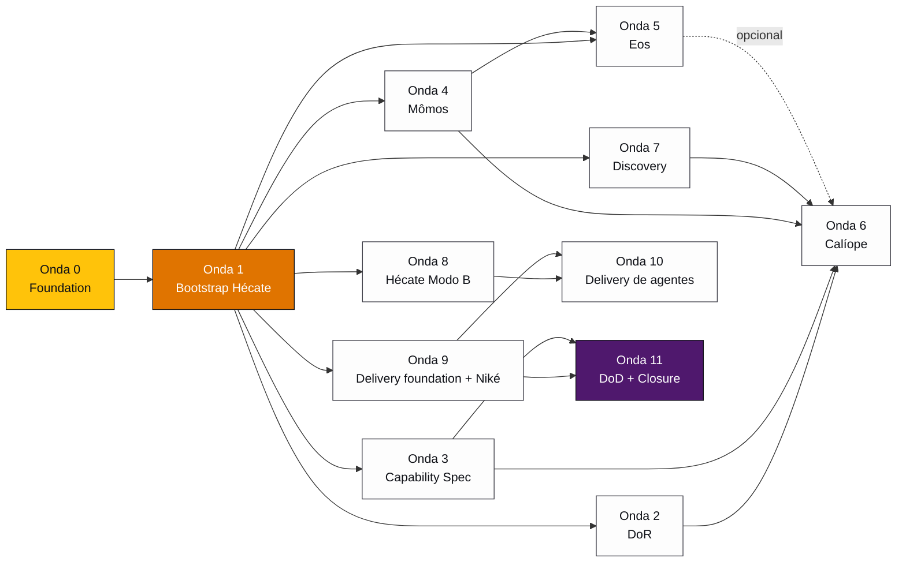

# Plano de Trabalho — Construção do Processo de Produto

> **Status:** proposta · **Escopo:** consolidação executável de [Discovery](product-discovery.md) + [Development](product-development.md) + [Delivery](product-delivery.md) + [Flow](product-flow.md) · **Formato:** ondas com dependências, entregáveis, validação e critério de aceitação

---

## 1. Visão executiva

O que estamos construindo: **um processo end-to-end de produto** orquestrado por agentes (warriors) usando o framework Ahrena, cobrindo desde a captura de incerteza (Discovery) até a feature em GA com métrica validada (Delivery), com gates humanos e validação adversarial em cada handoff.

**ROI principal por fase:**

| Onda inicial | Entrega valor imediato em |
|---|---|
| Onda 0 (Foundation) | Bloqueio explícito pré-fluxo evita issues mal definidas chegarem ao Athena |
| Onda 2 (DoR) | Athena recusa issues incompletas — alívio de backlog |
| Onda 3 (Capability Spec) | Substitui PRD/TRD informais por artefato canônico — reduz reuniões |
| Onda 4 (Mômos) | Validação adversarial sobre Theseus/Daedalus/Kronos existentes — 0 issues novos artefatos, ROI imediato |
| Onda 9 (Delivery foundation) | Feature flag + rollout estruturado evita big bangs e regressões |

**Investimento:** 11 ondas. Cada uma é entregável e gera valor isolada. Não há "ciclo completo ou nada" — adoção incremental é first-class.

---

## 2. Status atual vs. estado-alvo

### O que existe hoje no framework

| Categoria | Já temos | Cobertura |
|---|---|---|
| **Warriors** | Athena, Apollo, Hephaestus, Iris, Demeter, Atlas, Hera, Hestia, Theseus, Daedalus, Kronos, Prometheus, Translator | 100% de Implementação + Design Técnico + SRE |
| **Lexis técnicas** | 50+ ([lex-issue-driven](../framework/pt-BR/engineering/workflow/lexis/lex-issue-driven.md), [lex-entity-naming](../framework/pt-BR/engineering/platform/lexis/lex-entity-naming.md), [lex-restful-apis](../framework/pt-BR/engineering/platform/lexis/lex-restful-apis.md), [lex-cloudevents](../framework/pt-BR/engineering/platform/lexis/lex-cloudevents.md), [lex-idempotency](../framework/pt-BR/engineering/platform/lexis/lex-idempotency.md), etc.) | 100% de regras do dev workflow |
| **Codex** | 30+ codex de domínio técnico | 100% de manuais técnicos |
| **Katas** | 50+ ([kata-domain-model](../framework/pt-BR/engineering/platform/katas/kata-domain-model.md), [kata-api-design-oas](../framework/pt-BR/engineering/platform/katas/kata-api-design-oas.md), [kata-events-doc](../framework/pt-BR/engineering/platform/katas/kata-events-doc.md), [kata-issue-analysis](../framework/pt-BR/engineering/workflow/katas/kata-issue-analysis.md), etc.) | 100% de procedimentos técnicos |
| **Cries** | 25+ entry points | 100% de uso interativo |

### O que falta (gaps mapeados)

| Categoria | O que precisa ser construído |
|---|---|
| **Warriors de Produto** | Calíope (PM), Argos (coleta), Métis (síntese), Têmis (priorização), Asclépio (validação), Eos (design visual), Mômos (validador), Hécate (meta-engenharia), Niké (delivery) — **9 warriors novos** |
| **Lexis de Produto** | DoR/DoD criteria, evidence-required, capability-spec-required, success-metrics, hard-gate-pattern, design-validation-loop, wireframe-required, ai-first-component-pattern, feature-flag-required, staged-rollout, post-launch-review-required, release-notes-required, flag-cleanup-deadline, runtime-guardrail-audit, ai-first-success-metrics, meta-engineering-via-hecate, platform-agent-via-ahrena, runtime-guardrail-from-lexis, discovery-before-prd, discovery-gates — **20 lexis novas** |
| **Codex de Produto** | dor-dod, capability-spec, prd-structure, success-metrics, design-validation-loop, wireframe-low-fidelity, wireframe-high-fidelity, ai-first-components, meta-engineering, platform-agent-spec, ahrena-dual-use, product-discovery, research-methods, insight-quality, jobs-to-be-done, evidence-attribution, discovery-gates, release-strategy, rollout-monitoring, post-launch-review, customer-feedback, feature-flag-providers, changelog-format, release-notes-tone, ai-first-metrics, runtime-guardrail-audit, platform-agent-rollout — **27 codex novos** |
| **Katas de Produto** | ~40 novos katas (lista completa em [Discovery seção 6](product-discovery.md#6-katas), [Development seção 5](product-development.md#5-katas), [Delivery seção 5](product-delivery.md#5-katas)) |
| **Cries** | ~15 novos cries de entrada |

**Volume total:** ~110 artefatos novos. Crescer o framework em ~50% a partir da base atual.

---

## 3. Princípios de execução

1. **Hécate é a única que cria artefatos novos** (depois do bootstrap manual da própria Hécate). Toda criação passa por [lex-meta-engineering-via-hecate](product-development.md#69-lex-meta-engineering-via-hecate-novo).
2. **Mômos valida o output de Hécate** em loop 3x antes de consolidar. Mesmo padrão de Development.
3. **Cada onda é entregável isolada.** Onda N pode entregar valor mesmo sem Onda N+1.
4. **Adotar antes de orquestrar.** Os warriors orquestradores (Calíope, Niké) entram **depois** que seus katas já existem isolados — invocação direta primeiro, orquestrador quando há volume.
5. **DAG, não timeline.** Ondas têm dependências, não datas. Executa em paralelo onde for possível.
6. **Bootstrap por exceção.** A primeira invocação manual é só para Hécate Modo A criar a si mesma — o paradoxo bootstrap.

---

## 4. Mapa de dependências entre ondas

**Caminho crítico (depende uma da outra):** O0 → O1 → (O2 + O3 + O4) → O6 → ... → O11

**Paralelizável após O1:** Ondas 2, 3, 4, 5, 7, 8, 9 podem rodar em paralelo (apenas dependem de Hécate existir).

---

## 5. Onda 0 — Foundation

> **Objetivo:** estabelecer padrões transversais antes de criar qualquer warrior novo.

| Dependência | Nada — primeira onda |
|---|---|
| **Bloqueia** | Toda onda seguinte (definem padrões aplicados em tudo) |
| **Owner** | Humano (criação manual) |
| **Validador** | Code review humano |

**Entregáveis:**

| Artefato | Tipo | Path destino |
|---|---|---|
| `lex-hard-gate-pattern` | Lexis (meta) | `framework/{lang}/_foundation/quality/lexis/lex-hard-gate-pattern.md` |
| `kata-artifact-self-review` | Kata cross-fase | `framework/{lang}/_foundation/quality/katas/kata-artifact-self-review.md` |
| Atualização retroativa de [lex-issue-quality](../framework/pt-BR/_foundation/contributing/lexis/lex-issue-quality.md) | Edit | adicionar HARD-GATE textual |
| Atualização retroativa de [lex-pr-quality](../framework/pt-BR/_foundation/contributing/lexis/lex-pr-quality.md) | Edit | adicionar HARD-GATE textual |

**Critério de aceitação:**
- HARD-GATE pattern aplicado em pelo menos 2 lexis existentes (issue-quality, pr-quality)
- `kata-artifact-self-review` invocável e testado em pelo menos 1 artefato

**Issue inicial sugerida:** "feat(framework): add lex-hard-gate-pattern + kata-artifact-self-review (Onda 0 — foundation transversal)"

---

## 6. Onda 1 — Bootstrap Hécate

> **Objetivo:** ter a meta-engenheira que constrói tudo o resto.

| Dependência | Onda 0 |
|---|---|
| **Bloqueia** | Ondas 2–11 (todas dependem de Hécate criar artefatos) |
| **Owner** | Humano (paradoxo bootstrap — primeira invocação é manual) |
| **Validador** | Humano + Mômos (após Onda 4) |

**Entregáveis:**

| Artefato | Tipo |
|---|---|
| `warrior-hecate` | Warrior (criação manual) |
| `lex-meta-engineering-via-hecate` | Lexis |
| `codex-meta-engineering` | Codex (Modo A) |
| Atualização de [cry-new-warrior](../framework/pt-BR/_foundation/authoring/cries/cry-new-warrior.md), [cry-new-kata](../framework/pt-BR/_foundation/authoring/cries/cry-new-kata.md), [cry-new-lex](../framework/pt-BR/_foundation/authoring/cries/cry-new-lex.md), [cry-new-codex](../framework/pt-BR/_foundation/authoring/cries/cry-new-codex.md), [cry-new-cry](../framework/pt-BR/_foundation/authoring/cries/cry-new-cry.md) | Edit — passam a invocar Hécate |

**Critério de aceitação:**
- Hécate consegue criar 1 warrior novo de teste de ponta a ponta usando apenas a si mesma + os katas existentes ([kata-create-*](../framework/pt-BR/_foundation/authoring/katas/))
- Validação automática via [kata-diff-artifacts](../framework/pt-BR/_foundation/authoring/katas/kata-diff-artifacts.md) e [kata-push-to-framework](../framework/pt-BR/_foundation/authoring/katas/kata-push-to-framework.md)
- Conformidade verificada com [lex-pilars](../framework/pt-BR/_foundation/authoring/lexis/lex-pilars.md), [lex-template-usage](../framework/pt-BR/_foundation/quality/lexis/lex-template-usage.md), [lex-platforms-rules](../framework/pt-BR/_foundation/process/lexis/lex-platforms-rules.md)

**Issue inicial sugerida:** "feat(framework): bootstrap warrior-hecate as meta-engineer (Onda 1)"

---

## 7. Onda 2 — DoR foundation

> **Objetivo:** filtrar entrada do Athena com critério canônico.

| Dependência | Onda 1 |
|---|---|
| **Bloqueia** | Onda 6 (Calíope) |
| **Desbloqueio paralelo** | Pode rodar com Ondas 3, 4, 5, 7, 8, 9 |
| **Owner** | Hécate Modo A |
| **Validador** | Mômos (quando Onda 4 estiver pronta) |

**Entregáveis:**

| Artefato | Tipo |
|---|---|
| `lex-dor-criteria` (HARD-GATE) | Lexis |
| `kata-dor-validate` | Kata |
| `codex-dor-dod` | Codex |
| `cry-validate-dor` | Cry |
| Atualização de [lex-issue-driven](../framework/pt-BR/engineering/workflow/lexis/lex-issue-driven.md) — pré-condição DoR | Edit |

**Critério de aceitação:**
- `kata-dor-validate` retorna ✅/❌ por critério individual + decisão final
- HARD-GATE bloqueia [warrior-athena](../framework/pt-BR/engineering/workflow/warriors/warrior-athena.md) quando DoR não atendido
- Critérios canônicos cobertos: Discovery referenciada, PRD aprovado, Capability Spec, ACs numeradas, métricas, design refs, dependências, busca anti-duplicação

**Issue inicial:** "feat(framework): add lex-dor-criteria + kata-dor-validate (Onda 2)"

---

## 8. Onda 3 — Capability Spec

> **Objetivo:** substituir PRD/TRD informais por artefato canônico de 8 seções (CAPABILITY / CONSTRAINTS / IMPLEMENTATION CONTRACT / NON-GOALS / OPEN QUESTIONS / HANDOFF / ALTERNATIVES / EVIDENCE).

| Dependência | Onda 1 |
|---|---|
| **Bloqueia** | Onda 6 (Calíope), Onda 11 (DoD depende de Capability Spec existir) |
| **Owner** | Hécate Modo A |
| **Validador** | Mômos |

**Entregáveis:**

| Artefato | Tipo |
|---|---|
| `kata-capability-spec` | Kata |
| `codex-capability-spec` | Codex |
| `lex-capability-spec-required` (HARD-GATE) | Lexis |
| `kata-prd-creation` | Kata |
| `codex-prd-structure` | Codex |
| `kata-success-metrics-define` | Kata |
| `lex-success-metrics` | Lexis |
| `codex-success-metrics` | Codex |
| `codex-prd-vs-capability-vs-adr` | Codex (matriz de decisão) |
| `kata-acceptance-criteria-design` | Kata |
| `codex-acceptance-criteria` | Codex |
| `cry-new-prd`, `cry-new-capability-spec` | Cries |

**Critério de aceitação:**
- 1 Capability Spec real produzido para feature de validação (idealmente esta proposta v3)
- 8 seções rígidas verificáveis por linter
- Aprovação humana + Mômos antes de consolidar

**Issue inicial:** "feat(framework): add Capability Spec + PRD foundation (Onda 3)"

---

## 9. Onda 4 — Mômos validador

> **Objetivo:** validador adversarial em loop 3x sobre todos os artefatos importantes.

| Dependência | Onda 1 |
|---|---|
| **Bloqueia** | Onda 5 (Eos), Onda 6 (Calíope), Onda 9 (Niké também usa Mômos) |
| **ROI imediato** | Aplica sobre Theseus/Daedalus/Kronos existentes — 0 artefatos novos para gerar valor |
| **Owner** | Hécate Modo A |
| **Validador** | Humano (paradoxo: quem valida o validador) |

**Entregáveis:**

| Artefato | Tipo |
|---|---|
| `warrior-momos` | Warrior |
| `kata-design-validation` (parametrizado por tipo) | Kata |
| `lex-design-validation-loop` (HARD-GATE) | Lexis |
| `codex-design-validation-loop` | Codex |
| `cry-validate-design` | Cry |

**Critério de aceitação:**
- Mômos aplicado sobre [kata-domain-model](../framework/pt-BR/engineering/platform/katas/kata-domain-model.md) saída de teste — detecta violação de [lex-entity-naming](../framework/pt-BR/engineering/platform/lexis/lex-entity-naming.md) plantada propositalmente
- Loop 3x funciona: it.1 detecta, it.2 detecta menos, it.3 aprova ou escala
- Relatório estruturado conforme template em [Development seção 5.4](product-development.md#54-katas-executados-por-mômos-cross-prometheus--eos)

**Issue inicial:** "feat(framework): add warrior-momos adversarial validator (Onda 4)"

---

## 10. Onda 5 — Eos design visual

> **Objetivo:** wireframe LF/HF + componentes AI-First.

| Dependência | Onda 1, Onda 4 (Mômos), Decisão D10 (ferramenta de Claude Design) |
|---|---|
| **Bloqueia** | Não bloqueia ondas seguintes — features sem UI não dependem de Eos |
| **Owner** | Hécate Modo A |
| **Validador** | Mômos |

**Entregáveis:**

| Artefato | Tipo |
|---|---|
| `warrior-eos` | Warrior |
| `kata-wireframe-low-fidelity` | Kata |
| `kata-wireframe-high-fidelity` | Kata (depende de D10 — ver seção 13) |
| `kata-copilot-widget-design` | Kata |
| `kata-conversational-screen-design` | Kata |
| `kata-dashboard-design` | Kata |
| `kata-component-spec` | Kata |
| `lex-wireframe-required` (HARD-GATE) | Lexis |
| `lex-ai-first-component-pattern` (HARD-GATE) | Lexis |
| `codex-wireframe-low-fidelity` | Codex |
| `codex-wireframe-high-fidelity` | Codex |
| `codex-ai-first-components` | Codex |
| `cry-design-visual` | Cry |

**Critério de aceitação:**
- Wireframe LF em Markdown produzido para 1 feature de teste com componentes AI-First
- Wireframe HF gerado via ferramenta escolhida (D10) — Mômos verifica brand + DS + acessibilidade
- 0 reimplementação de primitivo (consome [@guardia/design-system](../framework/pt-BR/design/system/lexis/lex-design-system-library.md))

**Bloqueio:** Decisão D10 ([Development seção 13](product-development.md#13-decisões-abertas)) — qual ferramenta exatamente é "Claude Design"? Sem isso, `kata-wireframe-high-fidelity` fica em hold.

**Issue inicial:** "feat(framework): add warrior-eos + AI-first design (Onda 5)"

---

## 11. Onda 6 — Calíope orquestradora

> **Objetivo:** unificar Discovery + Development sob orquestrador master.

| Dependência | Onda 2 (DoR), Onda 3 (Capability Spec), Onda 4 (Mômos), Onda 7 (Discovery) — opcional Onda 5 (Eos) |
|---|---|
| **Bloqueia** | Onda 11 (closure depende de Calíope existir) |
| **Owner** | Hécate Modo A |
| **Validador** | Mômos |

**Entregáveis:**

| Artefato | Tipo |
|---|---|
| `warrior-calliope` | Warrior |
| `kata-feature-map` | Kata |
| Reposicionamento de [warrior-prometheus](../framework/pt-BR/engineering/platform/warriors/warrior-prometheus.md) — título + missão | Edit |
| Atualização de [kata-architecture-brief](../framework/pt-BR/engineering/workflow/katas/kata-architecture-brief.md) — passa a ler Capability Spec em vez de gerar design | Edit |
| `cry-discover` (entry point unificado) | Cry |

**Critério de aceitação:**
- Calíope conduz 1 feature real do início (Discovery) até criação da issue (handoff para Athena), invocando todos os warriors especialistas e validando DoR
- Mômos aprova outputs em todos os Gates internos

**Issue inicial:** "feat(framework): add warrior-calliope as Product Manager orchestrator (Onda 6)"

---

## 12. Onda 7 — Discovery

> **Objetivo:** 4 warriors especialistas para coleta → síntese → priorização → validação.

| Dependência | Onda 1 |
|---|---|
| **Bloqueia** | Onda 6 (Calíope) |
| **Owner** | Hécate Modo A |
| **Validador** | Mômos |

**Sub-entregáveis (paralelo):**

### 7.1 Discovery foundation (Lexis + Codex)

| Artefato | Tipo |
|---|---|
| `lex-evidence-required` (HARD-GATE) | Lexis |
| `lex-discovery-before-prd` | Lexis |
| `lex-discovery-gates` | Lexis |
| `codex-product-discovery` | Codex |
| `codex-research-methods` | Codex |
| `codex-insight-quality` | Codex |
| `codex-jobs-to-be-done` | Codex |
| `codex-evidence-attribution` | Codex |
| `codex-discovery-gates` | Codex |

### 7.2 Argos (D1 — Coleta)

| Artefato | Tipo |
|---|---|
| `warrior-argos` | Warrior |
| `kata-deep-research` (depende de MCP firecrawl/exa) | Kata |
| `kata-market-research` | Kata |
| `kata-content-explorer` | Kata |
| `kata-transcriptions-analysis` | Kata |
| `kata-clean-room-engineering` | Kata |
| `kata-oss-feature-discovery` | Kata |
| `cry-collect`, `cry-deep-research`, `cry-market-research` | Cries |

### 7.3 Métis (D2 — Síntese)

| Artefato | Tipo |
|---|---|
| `warrior-metis` | Warrior |
| `kata-jobs-to-be-done` | Kata |
| `kata-persona-mapping` | Kata |
| `kata-problem-framing` | Kata |
| `kata-pattern-clustering` | Kata |
| `cry-frame-problem` | Cry |

### 7.4 Têmis (D3 — Priorização)

| Artefato | Tipo |
|---|---|
| `warrior-themis` | Warrior |
| `kata-opportunity-tree` | Kata |
| `kata-priority-rubric` | Kata |
| `kata-assumption-mapping` | Kata |
| `cry-prioritize` | Cry |

### 7.5 Asclépio (D4 — Validação)

| Artefato | Tipo |
|---|---|
| `warrior-asclepius` | Warrior |
| `kata-customer-interview-script` | Kata |
| `kata-customer-interview-conduct` | Kata |
| `kata-assumption-test` | Kata |
| `kata-validation-report` | Kata |
| `cry-validate` | Cry |

### 7.6 Síntese final (D5)

| Artefato | Tipo |
|---|---|
| `kata-product-insights` | Kata |

**Critério de aceitação:**
- 1 ciclo Discovery completo executado em tema real, gerando `docs/discovery/{topic}/insights.md`
- Gates D1 e D2 testados com aprovação humana

**Bloqueio parcial:** Decisão D2 ([Discovery seção 14](product-discovery.md#14-decisões-abertas)) — contratar firecrawl + exa MCPs ou aceitar fallback manual em `kata-deep-research`?

**Issue inicial:** "feat(framework): add Discovery warriors (Argos, Métis, Têmis, Asclépio) (Onda 7)"

---

## 13. Onda 8 — Hécate Modo B (agentes da plataforma)

> **Objetivo:** **onda crítica para Guardia.** Spec executável de agentes que rodam dentro do produto (Isac, sub-agentes).

| Dependência | Onda 1 |
|---|---|
| **Bloqueia** | Onda 10 (delivery de agentes) |
| **Owner** | Hécate Modo A construindo Modo B (meta-recursivo) |
| **Validador** | Mômos |

**Entregáveis:**

| Artefato | Tipo |
|---|---|
| `lex-platform-agent-via-ahrena` (HARD-GATE) | Lexis |
| `lex-runtime-guardrail-from-lexis` | Lexis |
| `kata-platform-agent-spec` | Kata |
| `kata-platform-agent-identity` | Kata |
| `kata-platform-agent-procedures` | Kata |
| `kata-platform-agent-guardrails` | Kata |
| `kata-platform-agent-knowledge` | Kata |
| `kata-platform-agent-tools` | Kata |
| `kata-platform-agent-deploy-spec` | Kata |
| `codex-platform-agent-spec` | Codex |
| `codex-ahrena-dual-use` | Codex |
| `cry-new-platform-agent`, `cry-update-platform-agent` | Cries |

**Critério de aceitação:**
- 1 agente real spec'ado: **Isac** (warrior + katas + lexis + codex em `docs/agents/isac/`)
- `deploy.json` gerado e validado conforme schema (D12)
- Lexis técnicas existentes (ex.: [lex-idempotency](../framework/pt-BR/engineering/platform/lexis/lex-idempotency.md), [lex-error-handling](../framework/pt-BR/engineering/platform/lexis/lex-error-handling.md)) referenciadas como guard-rails sem reescrita

**Bloqueio:** Decisão D11 ([Development seção 13](product-development.md#13-decisões-abertas)) — `docs/agents/` aqui ou em repo do produto Guardia?

**Issue inicial:** "feat(framework): add Hécate Modo B for platform agents (Onda 8 — crítica para Guardia)"

---

## 14. Onda 9 — Delivery foundation + Niké

> **Objetivo:** release plan + rollout monitorado + PLR estruturado.

| Dependência | Onda 1, Onda 4 (Mômos) — Decisão D1 (provider de feature flag) |
|---|---|
| **Bloqueia** | Onda 10 (delivery de agentes), Onda 11 (closure) |
| **Owner** | Hécate Modo A |
| **Validador** | Mômos |

**Sub-entregáveis (em sequência interna):**

### 9.1 Lexis foundation

| Artefato | Tipo |
|---|---|
| `lex-feature-flag-required` (HARD-GATE) | Lexis |
| `lex-staged-rollout` | Lexis |
| `lex-post-launch-review-required` | Lexis |
| `lex-release-notes-required` | Lexis |
| `lex-flag-cleanup-deadline` (HARD-GATE) | Lexis |

### 9.2 Codex

| Artefato | Tipo |
|---|---|
| `codex-release-strategy` | Codex |
| `codex-rollout-monitoring` | Codex |
| `codex-post-launch-review` | Codex |
| `codex-customer-feedback` | Codex |
| `codex-feature-flag-providers` | Codex |
| `codex-changelog-format` | Codex |
| `codex-release-notes-tone` | Codex |

### 9.3 Katas

| Artefato | Tipo |
|---|---|
| `kata-release-plan`, `kata-risk-categorize`, `kata-rollback-plan` | Katas |
| `kata-feature-flag-setup` | Kata |
| `kata-rollout-monitor`, `kata-rollout-progress`, `kata-rollout-monitor-init` | Katas |
| `kata-changelog-write`, `kata-release-notes`, `kata-customer-comms` | Katas |
| `kata-post-launch-review`, `kata-customer-feedback-loop` | Katas |
| `kata-feature-flag-cleanup`, `kata-debt-tracking` | Katas |
| `kata-schedule-plr`, `kata-schedule-cleanup` (auto-schedule via `/schedule`) | Katas |
| Atualização de [kata-pr-prepare](../framework/pt-BR/engineering/workflow/katas/kata-pr-prepare.md) — aplica label `delivery:pending` no merge | Edit |

### 9.4 Niké orquestradora

| Artefato | Tipo |
|---|---|
| `warrior-nike` | Warrior |
| `cry-release`, `cry-rollout-status`, `cry-promote-rollout`, `cry-post-launch-review`, `cry-flag-cleanup`, `cry-release-notes` | Cries |

**Critério de aceitação:**
- 1 feature real entregue ponta a ponta com rollout 1% → 10% → 50% → 100% e PLR registrado
- Auto-schedule de PLR (D+14) e cleanup (D+30) testado
- Mômos valida release plan e PLR com loop 3x

**Bloqueio:** Decisão D1 ([Delivery seção 14](product-delivery.md#14-decisões-abertas)) — provider de feature flag (LaunchDarkly vs. Unleash vs. in-house).

**Issue inicial:** "feat(framework): add Delivery foundation + warrior-nike (Onda 9)"

---

## 15. Onda 10 — Delivery de agentes + AI-First metrics

> **Objetivo:** delivery diferenciado para agentes da plataforma + medição de aderência AI-First em produção.

| Dependência | Onda 8 (Hécate Modo B), Onda 9 (Niké) |
|---|---|
| **Bloqueia** | — |
| **Owner** | Hécate Modo A |
| **Validador** | Mômos |

**Entregáveis:**

| Artefato | Tipo |
|---|---|
| `lex-runtime-guardrail-audit` (HARD-GATE) | Lexis |
| `lex-ai-first-success-metrics` | Lexis |
| `kata-runtime-guardrail-audit` | Kata |
| `kata-schedule-runtime-audit` | Kata |
| `kata-ai-first-metrics` | Kata |
| `codex-ai-first-metrics` | Codex |
| `codex-runtime-guardrail-audit` | Codex |
| `codex-platform-agent-rollout` | Codex |
| `cry-runtime-audit` | Cry |

**Critério de aceitação:**
- Rollout conservador (0.5% → 5% → 25% → 100%) testado em mudança real de agente
- Runtime guard-rail audit em D+7 detecta violações de Lexis em produção
- 3 métricas AI-First instrumentadas: uso de conversa, transparência, controle graduado

**Issue inicial:** "feat(framework): add platform agent delivery + AI-first metrics (Onda 10)"

---

## 16. Onda 11 — DoD + Closure

> **Objetivo:** fechar o ciclo Development com DoD canônico + reciclar feedback para nova Discovery.

| Dependência | Onda 3 (Capability Spec), Onda 9 (Niké tem PLR) |
|---|---|
| **Bloqueia** | — (última onda) |
| **Owner** | Hécate Modo A |
| **Validador** | Mômos |

**Entregáveis:**

| Artefato | Tipo |
|---|---|
| `lex-dod-criteria` | Lexis |
| `kata-dod-validate` (8º check no Gate 2) | Kata |
| Atualização de [kata-quality-gate](../framework/pt-BR/engineering/workflow/katas/kata-quality-gate.md) — adiciona 8º check | Edit |
| `cry-validate-dod` | Cry |
| Loop de retroalimentação Delivery → Discovery formalizado em [codex-customer-feedback](#9-codex) | Codex |

**Critério de aceitação:**
- Gate 2 do Athena passa a executar 8 checks (7 atuais + DoD)
- 1 PLR real gera issue de discovery nova via [warrior-argos](product-discovery.md#51-warrior-argos--coleta-de-sinais-novo)

**Issue inicial:** "feat(framework): close the loop with DoD + customer feedback (Onda 11)"

---

## 17. Decisões bloqueantes

Estas decisões abertas precisam ser tomadas para destravar ondas específicas:

| # | Decisão | Bloqueia | Recomendação |
|---|---|---|---|
| **D1** | Provider de feature flag (LaunchDarkly / Unleash / in-house) | Onda 9 | ADR específico — impacta [lex-aws-cost](../framework/pt-BR/engineering/devops/lexis/lex-aws-cost.md) |
| **D2 (Discovery)** | Contratar firecrawl + exa MCPs? | Onda 7.2 (parcial — `kata-deep-research`) | Sem MCPs, kata escala fallback ao usuário; pode adiar |
| **D10 (Development)** | Qual ferramenta exatamente é "Claude Design"? | Onda 5 (parcial — `kata-wireframe-high-fidelity`) | Opções: Claude Artifacts/Canvas, Canva via MCP, ferramenta interna |
| **D11 (Development)** | `docs/agents/` neste repo ou em repo do produto Guardia? | Onda 8 | Recomendo repo do produto quando estrutura definitiva existir |
| **D12 (Development)** | Schema canônico do `deploy.json` | Onda 8 | Começar simples: `{system_prompt, tools, guardrails}` |

---

## 18. Métricas de progresso

Para medir avanço do plano:

| Métrica | Como calcular | Meta |
|---|---|---|
| **Cobertura de warriors** | warriors novos criados / warriors planejados (9) | 100% |
| **Cobertura de Lexis** | lexis novas criadas / lexis planejadas (20) | 100% |
| **Cobertura de Codex** | codex novos / codex planejados (27) | 100% |
| **Cobertura de Katas** | katas novos / katas planejados (~40) | 100% |
| **HARD-GATEs ativos** | lexis com `<HARD-GATE>` literal validadas / lexis que devem ter | 100% |
| **Mômos coverage** | tipos de artefato com validação Mômos / total de tipos validáveis | 100% |
| **Conformidade DoR** | features com DoR validado / features que entraram fluxo | >95% |
| **Conformidade DoD** | PRs com DoD validado / PRs mergeados | >95% |
| **Cobertura de PLR** | PLRs em D+14 / features que foram para GA | >90% |
| **Débito de feature flag** | flags pendentes >30 dias / total de flags ativas | <10% |
| **Reuso de Lexis em runtime** | lexis do framework referenciadas em `docs/agents/*/warrior-*.md` | aumenta com Onda 8 |

---

## 19. Ordem recomendada de execução

### 19.1 Caminho rápido (MVP do framework — entrega valor em ~3 ondas)

> Foco: dar a Athena um filtro de qualidade na entrada e melhorar design técnico existente.

**Sequência:**
1. **Onda 0** — Foundation
2. **Onda 1** — Bootstrap Hécate
3. **Onda 4** — Mômos validador (aplica sobre Theseus/Daedalus/Kronos atuais — ROI imediato)

Após estas 3 ondas, o ciclo atual já melhora significativamente sem precisar criar Calíope, Eos, Niké, etc.

### 19.2 Caminho crítico de Produto (Discovery → Issue)

> Foco: ter Calíope orquestrando Discovery → Capability Spec → Issue.

**Sequência (depois do MVP):**
4. **Onda 2** — DoR
5. **Onda 3** — Capability Spec
6. **Onda 7** — Discovery (4 warriors)
7. **Onda 6** — Calíope orquestradora

Após estas 4 ondas, o lado **upstream** do produto está completo — features chegam ao Athena com Discovery + PRD + Capability Spec + DoR validado.

### 19.3 Caminho crítico de Plataforma (agentes da Guardia)

> Foco: spec executável de agentes em produção.

**Sequência paralela à anterior:**
- **Onda 8** — Hécate Modo B (independente das outras)

Após esta onda, é possível spec'ar Isac e sub-agentes. **Onda 8 é a peça que diferencia a Guardia** — vale priorizar mesmo antes de fechar o ciclo de design completo.

### 19.4 Caminho crítico de Delivery (DoD → cliente)

> Foco: fechar entrega com rollout monitorado e PLR.

**Sequência (paralela ou após upstream):**
8. **Onda 9** — Delivery foundation + Niké
9. **Onda 5** — Eos (quando há volume de features com UI)
10. **Onda 10** — Delivery de agentes + AI-First metrics
11. **Onda 11** — DoD + Closure

### 19.5 Sugestão de roadmap em 3 horizontes

| Horizonte | Ondas | Resultado |
|---|---|---|
| **Curto prazo** (próximo ciclo) | 0, 1, 4 | MVP do framework — Mômos validando design técnico atual |
| **Médio prazo** | 2, 3, 6, 7, 8 | Calíope orquestra produto fim-a-fim + Hécate Modo B para Isac |
| **Longo prazo** | 5, 9, 10, 11 | Design visual + Delivery completo + closure |

**Onda 8 é candidata a "puxar para curto prazo"** se a Guardia quiser materializar Isac como warrior antes do resto.

---

## 20. Próximos passos imediatos

1. **Validar este plano** com time de produto e engenharia (decisões D1, D2, D10, D11, D12).
2. **Onda 0** — abrir issue mãe para Foundation (criação manual; não depende de Hécate).
3. **Onda 1** — abrir issue mãe para Bootstrap Hécate (criação manual; primeira invocação).
4. Após Onda 1 estável, **abrir issues para Ondas 2, 3, 4 em paralelo** — todas dependem só de Hécate.
5. Em paralelo às issues técnicas, **decidir D10 (Claude Design)** para destravar Onda 5.

---

## 21. Referências

| Documento | Conteúdo |
|---|---|
| [Product Discovery](product-discovery.md) | Detalhe das 5 sub-fases + 4 warriors especialistas + 2 Gates |
| [Product Development](product-development.md) | Detalhe das 6 fases + Mômos loop 3x + Hécate dual-use + DoR HARD-GATE |
| [Product Delivery](product-delivery.md) | Detalhe das 6 sub-fases + 2 Gates + delivery diferenciado para agentes |
| [Product Flow](product-flow.md) | Diagramas Mermaid macro/detalhado + tabelas mestre |
| [framework/pt-BR/](../framework/pt-BR/) | Todos os warriors, lexis, codex, katas e cries existentes |
| [framework/pt-BR/_foundation/authoring/codex/codex-warriors.md](../framework/pt-BR/_foundation/authoring/codex/codex-warriors.md) | Como warriors são especificados |
| [lex-pilars](../framework/pt-BR/_foundation/authoring/lexis/lex-pilars.md) | Estrutura inviolável dos pilares |
