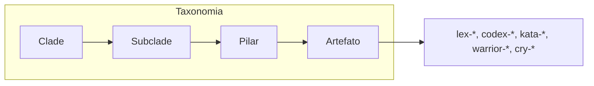
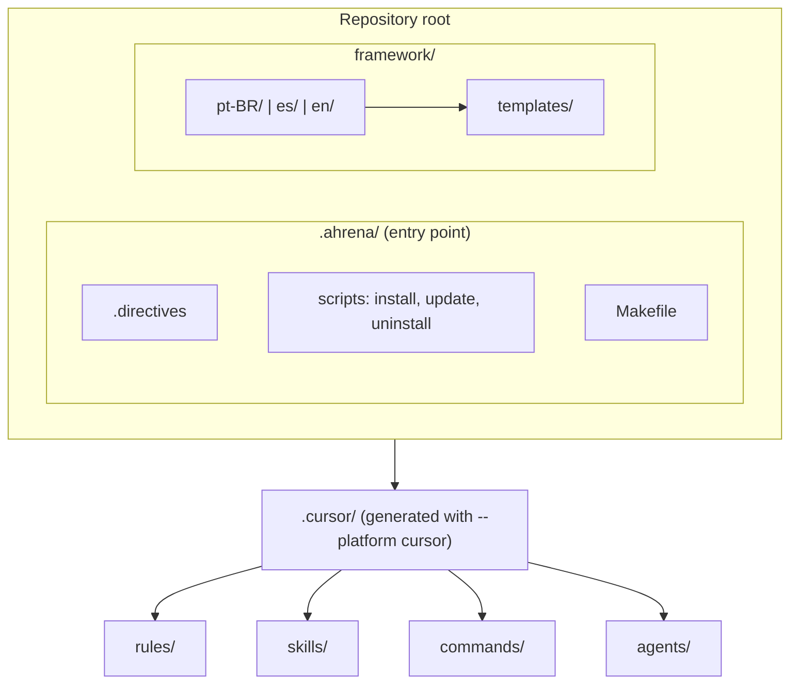
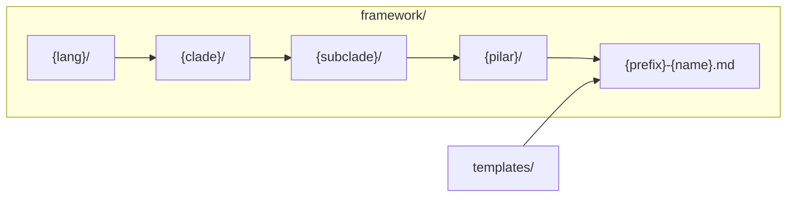

# Framework — Developer Guide

🇧🇷 [Português](../pt-BR/README.md) | 🇪🇸 [Español](../es/README.md)

> Full documentation: **[guardiatechnology.github.io/ahrena](https://guardiatechnology.github.io/ahrena/)**
>
> Practical guide for contributors to the Ahrena repository. For using the framework in projects, see the [main README](../../README.en.md).

## Structure

```
framework/
├── .directives.sample           # Directives template (copied to .ahrena/.directives on install)
├── templates/                   # Base template per Pilar
│   ├── lex-sample.md
│   ├── codex-sample.md
│   ├── kata-sample.md
│   ├── warrior-sample.md
│   └── cry-sample.md
│
├── pt-BR/
│   ├── _foundation/
│   │   ├── authoring/           # Artifact creation guides
│   │   ├── contributing/        # Contribution flow and commit
│   │   ├── process/             # Process conventions (checkpoints, directives)
│   │   ├── quality/             # Minimum quality standards
│   │   ├── tooling/             # Makefile automation
│   │   └── i18n/                # Framework language structure
│   ├── engineering/
│   │   └── platform/            # Guardia platform specs (API, events, Lexis, Codex, Katas, Warriors, Cries)
│   └── documentation/
│       └── i18n/                # Translation system (Hermes)
│
├── en/                          # English (same structure)
└── es/                          # Spanish (same structure)
```

The default language (`pt-BR`) is the **source of truth**. Changes start there and are translated to other languages via `/cry-translate`.

## Framework architecture

### Taxonomy

Knowledge is organized as **Clade** (discipline) → **Subclade** (area) → **Pilar** (capability type). The canonical artifact address is:

`{lang}/{clade}/{subclade}/{pilar}/{prefix}-{name}.{ext}` — e.g. `pt-BR/engineering/platform/lexis/lex-restful-apis.md`.



### Overview



### Canonical paths in `framework/`

**Language is the first level** of navigation. Each language folder contains the full Clade → Subclade → Pilar tree.



**Path tree**

```
.ahrena/
├── .directives
├── install.py, update.py, uninstall.py
└── Makefile

framework/
├── .directives.sample
├── templates/
│   ├── lex-sample.md
│   ├── codex-sample.md
│   ├── kata-sample.md
│   ├── warrior-sample.md
│   └── cry-sample.md
├── pt-BR/
│   ├── _foundation/
│   ├── engineering/platform/
│   └── documentation/i18n/
├── es/
└── en/
```

Example artifact: `framework/pt-BR/engineering/platform/lexis/lex-restful-apis.md`.

### From `framework/` to `.cursor/`

When installing with `--platform cursor`, the installer generates `.cursor/` from `framework/` (language set by `language.cursor` in `.directives`).

| Pilar | Cursor resource | Destination |
|-------|-----------------|-------------|
| Lexis | Rules (`.mdc`) | `.cursor/rules/<clade>/<subclade>/lex-*.mdc` |
| Codex | Rules (`.mdc`) | `.cursor/rules/<clade>/<subclade>/codex-*.mdc` |
| Katas | Skills (`SKILL.md`) | `.cursor/skills/kata-*/SKILL.md` |
| Warriors | Skills + Agents | `.cursor/skills/warrior-*/SKILL.md` + `.cursor/agents/warrior-*.md` |
| Cries | Commands (`.md`) | `.cursor/commands/<clade>/<subclade>/cry-*.md` |

**`.cursor/` folder structure**

```
.cursor/
├── rules/
│   ├── _foundation/
│   │   ├── authoring/
│   │   ├── contributing/
│   │   ├── process/
│   │   ├── quality/
│   │   ├── tooling/
│   │   └── i18n/
│   ├── documentation/i18n/
│   └── engineering/platform/
├── skills/
│   ├── kata-commit/
│   ├── kata-contribute/
│   ├── kata-create-*/
│   ├── kata-translate/
│   ├── kata-api-design-oas/, kata-api-design-doc/, kata-events-doc/
│   ├── warrior-translator/
│   ├── warrior-daedalus/
│   └── warrior-kronos/
├── commands/
│   ├── _foundation/
│   ├── documentation/i18n/
│   └── engineering/platform/
└── agents/
    ├── warrior-translator.md
    ├── warrior-daedalus.md
    └── warrior-kronos.md
```

## Development flow

### 1. Edit artifacts in `framework/`

Edit `.md` files under `framework/{lang}/`. Follow:

- **Addressing:** `{lang}/{clade}/{subclade}/{pilar}/{prefix}-{name}.md`
- **Templates:** use `framework/templates/` as base (`lex-template-usage`)
- **i18n:** any change in the default language must be propagated to other languages

### 2. Test locally

After editing, regenerate the local install to confirm Cursor artifacts are generated correctly:

```bash
make dev-install PLATFORM=cursor
```

This copies `framework/` to `.ahrena/framework/`, generates `.cursor/` (rules, skills, commands, agents) and keeps the existing `.directives`.

### 3. Verify generated artifacts

The installer maps each Pilar to Cursor’s native format:

| Pilar | Origin | Cursor destination |
|-------|--------|---------------------|
| Lexis | `framework/{lang}/.../lexis/lex-*.md` | `.cursor/rules/.../lex-*.mdc` |
| Codex | `framework/{lang}/.../codex/codex-*.md` | `.cursor/rules/.../codex-*.mdc` |
| Katas | `framework/{lang}/.../katas/kata-*.md` | `.cursor/skills/kata-*/SKILL.md` |
| Warriors | `framework/{lang}/.../warriors/warrior-*.md` | `.cursor/skills/warrior-*/SKILL.md` + `.cursor/agents/warrior-*.md` |
| Cries | `framework/{lang}/.../cries/cry-*.md` | `.cursor/commands/.../cry-*.md` |

The language used to generate Cursor artifacts is set by `language.cursor` in `.directives` (default: `en`).

### 4. Commit

Use `/cry-commit` to create compliant commits. The four commit Lexis are:

- `lex-conventional-commits` — format `type(scope): description`
- `lex-small-commits` — one purpose per commit
- `lex-commit-language` — subject in English
- `lex-signed-commits` — GPG signature required

### 5. Release versioning (tags)

Use `/cry-tag` to create or list SemVer release tags. `kata-tag` applies `lex-semantic-version` and `lex-signed-commits`. See `_foundation/contributing/README.md` for the full list.

### 6. Contribute

Use `/cry-contribute pr` to open the Pull Request. `kata-contribute` guides the full flow via MCP.

## Creating new artifacts

### Via commands (recommended)

```
/cry-new-lex          # New Lexis
/cry-new-codex        # New Codex
/cry-new-kata         # New Kata
/cry-new-warrior      # New Warrior
/cry-new-cry          # New Cry
```

Each command runs the corresponding kata (`kata-create-*`) which:
1. Uses the official template as base
2. Places the artifact in the correct taxonomy
3. Creates it in all three required languages

### Manually

1. Copy the template from `framework/templates/{pilar}-sample.md`
2. Place at `framework/pt-BR/{clade}/{subclade}/{pilar}/{prefix}-{name}.md`
3. Fill required sections
4. Translate to `en/` and `es/` (via `/cry-translate`)
5. Run `make dev-install PLATFORM=cursor` to validate

## Conventions

| Aspect | Default |
|--------|---------|
| File casing | `kebab-case` (`lex-no-secrets.md`) |
| Directory casing | `kebab-case` (`engineering/backend/`) |
| Extension in framework | `.md` |
| Extension in Cursor | `.mdc` (rules), `.md` (skills, commands, agents) |
| Prefixes | `lex-`, `codex-`, `kata-`, `warrior-`, `cry-` |
| Reserved clades | `_foundation` (prefix `_`) |

## Makefile targets

| Target | Description |
|--------|-------------|
| `make dev-install PLATFORM=cursor` | Install using local sources |
| `make bootstrap PLATFORM=cursor` | First-time install (downloads from GitHub) |
| `make install PLATFORM=cursor` | Reinstall from `.ahrena/install.py` |
| `make update` | Update to latest version |
| `make clean` | Remove installed files |

## References

- [Main README](../../README.en.md) — Ahrena public documentation
- [Translation system](documentation/i18n/README.md) — Hermes documentation
- `.ahrena/.directives` — Framework canonical directives
- `_foundation/contributing/codex/codex-contributing` — Contribution flow
- `_foundation/contributing/katas/kata-contribute` — PR procedure
