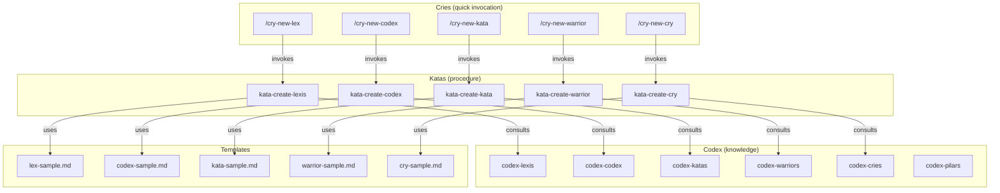
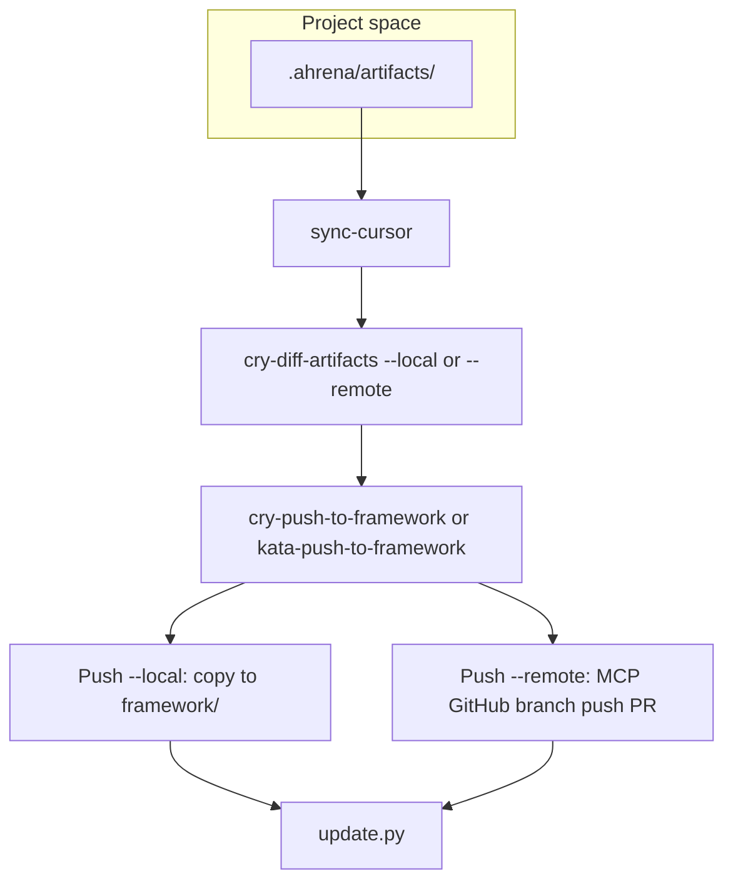

# Authoring — Artifact Creation System

> Documentation for the Ahrena self-sufficient artifact creation system.

## Overview

Ahrena uses its own artifacts to create new artifacts. The `authoring` Subclade contains the **Creation Kit** for each Pilar: a Codex (what it is and how to write it well), a Kata (step-by-step procedure), and a Cry (quick shortcut to trigger creation).

The execution chain is:

```
/cry-new-{pilar} → kata-create-{pilar} → codex-{pilar} + template + lexis
```

## Architecture



## Creation in project (.ahrena) and Push to framework

Artifacts can be created first in the project space (`.ahrena/artifacts/`), specific to the repository. Creation Katas accept the **Destination** input ("framework" or "project"). Canonical flow in five steps:

1. **Create in project:** use the creation Katas with destination **project** — the artifact is saved under `.ahrena/artifacts/{lang}/{clade}/{subclade}/{pilar}/`.
2. **Sync .cursor local:** run `python .ahrena/update.py --sync-cursor` (or `make sync-cursor`) to regenerate `.cursor/` from `.ahrena/framework/` and `.ahrena/artifacts/`.
3. **Validate and compare (optional):** use `cry-diff-artifacts --local` to see differences between `.ahrena/artifacts` and local `framework/`; use `cry-diff-artifacts --remote` to compare with the latest version of the framework on the remote (via GitHub MCP).
4. **Push to framework:** run `cry-push-to-framework` or `kata-push-to-framework` with **--local** (copy to `framework/` in the current repo) or **--remote** (sync with the framework repository on GitHub via GitHub MCP).
5. **Update installation:** run `python .ahrena/update.py` (and optionally `--sync-cursor`) to bring in the latest version of the framework.

### Push and Diff flow

**Push** can be **--local** (copy to `framework/` on disk) or **--remote** (send to the framework repository on GitHub, via GitHub MCP). **Diff** (`kata-diff-artifacts` / `cry-diff-artifacts`) compares artifacts in **--local** mode (vs local framework) or **--remote** mode (vs latest version on the remote, via GitHub MCP).



## Artifact Inventory

### Codex (knowledge per Pilar)

| Artifact | Description |
|----------|-------------|
| `codex-pilars` | Central reference on the Pilar system, hierarchy, and relations |
| `codex-lexis` | How to write a good Lexis |
| `codex-codex` | How to write a good Codex |
| `codex-katas` | How to write a good Kata |
| `codex-warriors` | How to write a good Warrior |
| `codex-cries` | How to write a good Cry |

### Katas (creation procedures)

| Artifact | Description |
|----------|-------------|
| `kata-create-lexis` | Procedure to create a new Lexis (destination: framework or project) |
| `kata-create-codex` | Procedure to create a new Codex (destination: framework or project) |
| `kata-create-kata` | Procedure to create a new Kata (destination: framework or project) |
| `kata-create-warrior` | Procedure to create a new Warrior (destination: framework or project) |
| `kata-create-cry` | Procedure to create a new Cry (destination: framework or project) |
| `kata-push-to-framework` | Procedure to incorporate artifacts from `.ahrena/artifacts/` into the framework (local or remote mode; remote via GitHub MCP) |
| `kata-diff-artifacts` | Procedure to compare project artifacts with the framework (local and remote modes; remote via GitHub MCP) |

### Cries (creation shortcuts)

| Artifact | Description |
|----------|-------------|
| `cry-new-lex` | Quick shortcut to create a new Lexis |
| `cry-new-codex` | Quick shortcut to create a new Codex |
| `cry-new-kata` | Quick shortcut to create a new Kata |
| `cry-new-warrior` | Quick shortcut to create a new Warrior |
| `cry-new-cry` | Quick shortcut to create a new Cry |
| `cry-push-to-framework` | Shortcut to incorporate project artifacts into the framework (--local or --remote) |
| `cry-diff-artifacts` | Shortcut to compare project artifacts with the framework (--local or --remote) |

## How to Use

**Create in framework (default):**

```
/cry-new-lex
```

The agent will read the Pilar codex, run the creation kata, use the template, place in the correct Clade/Subclade, and create versions in all required languages.

**Create in project (repository-specific):**

When invoking a creation kata (or cry), specify **Destination: project**. The artifact will be saved under `.ahrena/artifacts/{lang}/{clade}/{subclade}/{pilar}/`. Run `python .ahrena/update.py --sync-cursor` so Cursor uses the artifact. Optionally use `cry-diff-artifacts --local` to see differences before pushing. Incorporate it into the framework with:

```
/cry-push-to-framework --local
```

(or `cry-push-to-framework --remote all` to send to the framework repository on GitHub via MCP; or `--local all --remove` to incorporate all into the local framework and remove from the project).

## References

- `codex-pilars` — Central reference on Pilares and project artifacts (.ahrena) and Push flow
- `lex-template-usage` — Mandatory template usage Lexis
- `framework/templates/` — Official templates per Pilar
- `kata-push-to-framework` — Incorporation of artifacts from `.ahrena/artifacts/` into the framework
