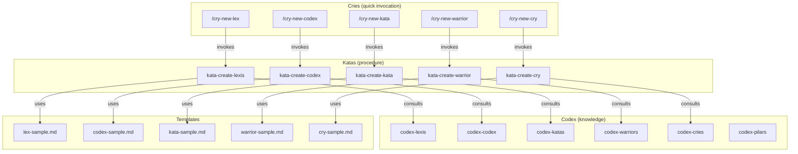
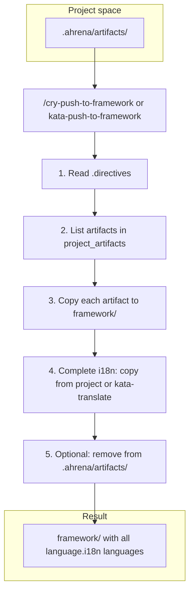

# Authoring — Artifact Creation System

> Documentation for the Ahrena self-sufficient artifact creation system.

## Overview

Ahrena uses its own artifacts to create new artifacts. The `authoring` Subclade contains the **Creation Kit** for each Pilar: a Codex (what it is and how to write it well), a Kata (step-by-step procedure), and a Cry (quick shortcut to trigger creation).

The execution chain is:

```
/cry-new-{pilar} → kata-create-{pilar} → codex-{pilar} + template + lexis
```

## Architecture



## Creation in project (.ahrena) and Push to framework

Artifacts can be created first in the project space (`.ahrena/artifacts/`), specific to the repository. Creation Katas accept the **Destination** input ("framework" or "project"). If "project", the artifact is saved under `.ahrena/artifacts/{lang}/{clade}/{subclade}/{pilar}/` and may exist only in the default language. For Cursor to use those artifacts (rules, skills, commands), run `python .ahrena/update.py --sync-cursor` or `make sync-cursor` after creating or editing in `.ahrena/artifacts/`. After validating, you can incorporate them into the framework with `/cry-push-to-framework` or by running `kata-push-to-framework` (skill at `.cursor/skills/kata-push-to-framework`).

### Push to framework flow

When artifacts are created in the project (Destination: project), they stay in `.ahrena/artifacts/` and may exist only in the default language. **Push to framework** is the procedure that incorporates them into the canonical repository: `kata-push-to-framework` (or the Cry `/cry-push-to-framework`) reads the directives, lists artifacts in `paths.project_artifacts`, copies each to `framework/` with the same structure, completes the required languages (copying from the project or generating with `kata-translate`), and optionally removes the copies in `.ahrena/artifacts/`. The diagram below summarizes that flow.



## Artifact Inventory

### Codex (knowledge per Pilar)

| Artifact | Description |
|----------|-------------|
| `codex-pilars` | Central reference on the Pilar system, hierarchy, and relations |
| `codex-lexis` | How to write a good Lexis |
| `codex-codex` | How to write a good Codex |
| `codex-katas` | How to write a good Kata |
| `codex-warriors` | How to write a good Warrior |
| `codex-cries` | How to write a good Cry |

### Katas (creation procedures)

| Artifact | Description |
|----------|-------------|
| `kata-create-lexis` | Procedure to create a new Lexis (destination: framework or project) |
| `kata-create-codex` | Procedure to create a new Codex (destination: framework or project) |
| `kata-create-kata` | Procedure to create a new Kata (destination: framework or project) |
| `kata-create-warrior` | Procedure to create a new Warrior (destination: framework or project) |
| `kata-create-cry` | Procedure to create a new Cry (destination: framework or project) |
| `kata-push-to-framework` | Procedure to incorporate artifacts from `.ahrena/artifacts/` into `framework/` (with i18n) |

### Cries (creation shortcuts)

| Artifact | Description |
|----------|-------------|
| `cry-new-lex` | Quick shortcut to create a new Lexis |
| `cry-new-codex` | Quick shortcut to create a new Codex |
| `cry-new-kata` | Quick shortcut to create a new Kata |
| `cry-new-warrior` | Quick shortcut to create a new Warrior |
| `cry-new-cry` | Quick shortcut to create a new Cry |
| `cry-push-to-framework` | Shortcut to incorporate project artifacts into the framework |

## How to Use

**Create in framework (default):**

```
/cry-new-lex
```

The agent will read the Pilar codex, run the creation kata, use the template, place in the correct Clade/Subclade, and create versions in all required languages.

**Create in project (repository-specific):**

When invoking a creation kata (or cry), specify **Destination: project**. The artifact will be saved under `.ahrena/artifacts/{lang}/{clade}/{subclade}/{pilar}/` and may exist only in the default language. After validating, incorporate it into the framework with:

```
/cry-push-to-framework
```

(or `cry-push-to-framework all --remove` to incorporate all and remove from the project).

## References

- `codex-pilars` — Central reference on Pilares and project artifacts (.ahrena) and Push flow
- `lex-template-usage` — Mandatory template usage Lexis
- `framework/templates/` — Official templates per Pilar
- `kata-push-to-framework` — Incorporation of artifacts from `.ahrena/artifacts/` into the framework
