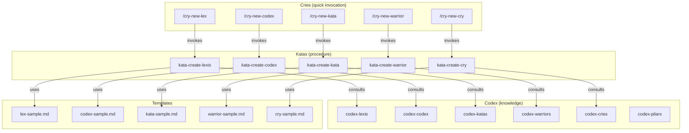

# Authoring — Artifact Creation System

> Documentation for the Ahrena self-sufficient artifact creation system.

## Overview

Ahrena uses its own artifacts to create new artifacts. The `authoring` Subclade contains the **Creation Kit** for each Pilar: a Codex (what it is and how to write it well), a Kata (step-by-step procedure), and a Cry (quick shortcut to trigger creation).

The execution chain is:

```
/cry-new-{pilar} → kata-create-{pilar} → codex-{pilar} + template + lexis
```

## Architecture



## Artifact Inventory

### Codex (knowledge per Pilar)

| Artifact | Description |
|----------|-------------|
| `codex-pilars` | Central reference on the Pilar system, hierarchy, and relations |
| `codex-lexis` | How to write a good Lexis |
| `codex-codex` | How to write a good Codex |
| `codex-katas` | How to write a good Kata |
| `codex-warriors` | How to write a good Warrior |
| `codex-cries` | How to write a good Cry |

### Katas (creation procedures)

| Artifact | Description |
|----------|-------------|
| `kata-create-lexis` | Procedure to create a new Lexis |
| `kata-create-codex` | Procedure to create a new Codex |
| `kata-create-kata` | Procedure to create a new Kata |
| `kata-create-warrior` | Procedure to create a new Warrior |
| `kata-create-cry` | Procedure to create a new Cry |

### Cries (creation shortcuts)

| Artifact | Description |
|----------|-------------|
| `cry-new-lex` | Quick shortcut to create a new Lexis |
| `cry-new-codex` | Quick shortcut to create a new Codex |
| `cry-new-kata` | Quick shortcut to create a new Kata |
| `cry-new-warrior` | Quick shortcut to create a new Warrior |
| `cry-new-cry` | Quick shortcut to create a new Cry |

## How to Use

Create a new artifact with a single command:

```
/cry-new-lex
```

The agent will:
1. Read `codex-lexis` to understand structure and best practices
2. Execute `kata-create-lexis` step by step
3. Use the `lex-sample.md` template as base
4. Place the artifact in the correct Clade/Subclade
5. Create versions in all required languages

## References

- `codex-pilars` — Central reference on Pilares
- `lex-template-usage` — Mandatory template usage Lexis
- `framework/templates/` — Official templates per Pilar
