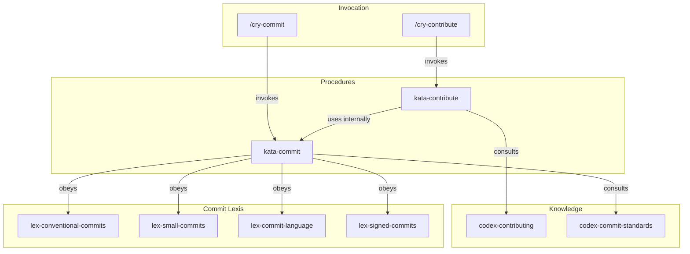

# Contributing — Contribution Flow

> Documentation for the contribution system, commit standards, and Pull Request creation.

## Overview

The `contributing` Subclade defines Guardia's unified contribution flow. It covers commit Lexis through the PR opening procedure via MCP. The process is the same for all contributors (internal and external), ensuring transparency and traceability.

## Architecture



## Artifact Inventory

### Lexis (commit laws)

| Artifact | Description |
|----------|-------------|
| `lex-conventional-commits` | Mandatory format `type(scope): description` |
| `lex-small-commits` | One purpose per commit, atomic changes |
| `lex-commit-language` | Subject in English |
| `lex-signed-commits` | Mandatory GPG signature |

### Codex (knowledge)

| Artifact | Description |
|----------|-------------|
| `codex-contributing` | Full contribution flow (from discussion to merge) |
| `codex-commit-standards` | Detailed structure of commit messages |

### Katas (procedures)

| Artifact | Description |
|----------|-------------|
| `kata-commit` | Procedure to create compliant commits |
| `kata-contribute` | Procedure to open Pull Requests via MCP |

### Cries (shortcuts)

| Artifact | Description |
|----------|-------------|
| `cry-commit` | Shortcut to commit following the 4 Lexis |
| `cry-contribute` | Shortcut to open PR or contribute to the framework |

## How to Use

### Commit changes

```
/cry-commit
```

The agent analyzes changes, creates atomic commits following Conventional Commits, with subject in English and GPG signature.

### Open a Pull Request

```
/cry-contribute pr
```

The agent executes `kata-contribute`, which creates the PR in the origin repository via GitKraken MCP tools.

### Full contribution flow

The `codex-contributing` defines the step-by-step process:

1. Open discussion in GitHub Discussions (Ideas category)
2. Approved discussion becomes an issue
3. Create branch from main (`feat/name`, `fix/name`, `docs/name`)
4. Implement (following commit Lexis)
5. Open PR filling the template
6. Keep CI green and respond to review
7. Merge by maintainer

## References

- [Guardia CONTRIBUTING](https://hub.guardia.finance/docs/community/CONTRIBUTING/)
- `.github/pull_request_template.md` — PR template
- `.github/CODEOWNERS` — Codeowners file
