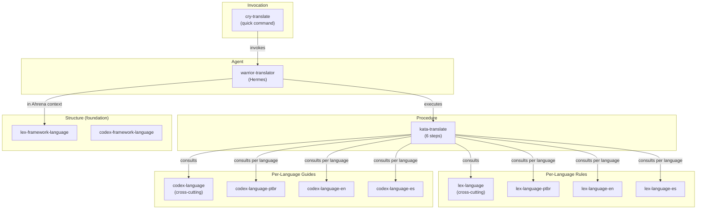

# Ahrena Translation System

> Complete documentation of the internationalization and technical documentation translation system.

## Overview

Ahrena's translation system is a set of artifacts that enables consistent translation of any Markdown technical documentation, with language-specific rules and guides. It was designed to be **generic** — it works for Ahrena framework documentation, project documentation, and any other technical content.

The system is composed of **Lexis** (laws), **Codex** (guides), a **Kata** (procedure), a **Warrior** (agent), and a **Cry** (command), organized in the `documentation/i18n/` Clade.

## Architecture



## Artifact Inventory

### `documentation/i18n/` (generic translation)

| Artifact | Type | Description |
|----------|------|-------------|
| `lex-language` | Lexis | **Cross-cutting** translation rules |
| `lex-language-ptbr` | Lexis | Rules for translating **to pt-BR** |
| `lex-language-en` | Lexis | Rules for translating **to English** |
| `lex-language-es` | Lexis | Rules for translating **to Spanish** |
| `codex-language` | Codex | **Cross-cutting** translation guide |
| `codex-language-ptbr` | Codex | Guide for translating **to pt-BR** |
| `codex-language-en` | Codex | Guide for translating **to English** |
| `codex-language-es` | Codex | Guide for translating **to Spanish** |
| `kata-translate` | Kata | **6-step** translation procedure |
| `warrior-translator` | Warrior | Agent **Hermes** — translation specialist |
| `cry-translate` | Cry | Quick command with **translation order** |

### `_foundation/i18n/` (framework structure)

| Artifact | Type | Description |
|----------|------|-------------|
| `lex-framework-language` | Lexis | Language as navigation root in `framework/` |
| `codex-framework-language` | Codex | Language folder organization manual |

## How to Use

### Translate a document to all languages

```
/cry-translate framework/pt-BR/_foundation/process/lexis/lex-directives.md
```

The `cry-translate` will:
1. Read `.ahrena/.directives` for required languages
2. Identify the source language as pt-BR
3. Translate to es (consulting Spanish-specific rules)
4. Translate to en (consulting English-specific rules)

### Translate to a specific language

```
/cry-translate docs/architecture.md en
```

### Translate with custom order

```
/cry-translate docs/api.md es,en --order en,es
```

## Extensibility: Adding a New Language

To add a new language (e.g., Japanese `ja`):

1. **Update `.ahrena/.directives`:** add `ja` to `language.i18n`
2. **Create translation artifacts:** `lex-language-ja` and `codex-language-ja`
3. **Create the language folder:** `framework/ja/` with mirrored structure
4. **Translate existing artifacts:** use `cry-translate` for each document

The cross-cutting artifacts (`lex-language`, `codex-language`, `kata-translate`, `warrior-translator`, `cry-translate`) **do not need changes** — they already support any language via `lex-language-{lang}`.

## Relationship with `_foundation/i18n/`

| Clade | Responsibility |
|-------|----------------|
| `_foundation/i18n/` | **Structure:** how language folders are organized, navigation rules, mirroring |
| `documentation/i18n/` | **Translation:** how to translate content, per-language linguistic rules, agent, command |

`_foundation/i18n/` defines the **skeleton** (folders and addressing). `documentation/i18n/` defines the **content** (how to translate with quality).

## References

- `.ahrena/.directives` — Source of truth for languages and addressing
- `lex-framework-language` — Framework language structure law
- `codex-framework-language` — Framework language structure manual
