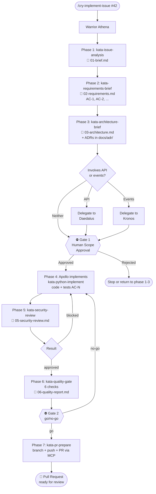

# Engineering / Workflow — Issue-Driven Development

This clade contains all artifacts that make up Ahrena's **Issue-Driven Development** flow — a structured process for turning GitHub issues into high-quality Pull Requests, with full traceability, approval gates, and automatic Architecture Decision Record generation.

## 1. Introduction

The **Issue-Driven Development** flow addresses a common problem: how to ensure that features and bugfixes implemented by AI agents (or by human+AI hybrid teams) are traceable, auditable, and of consistent quality? The answer is a process with mandatory phases, human gates at critical points, automated validation before the PR, and documentation structured under `docs/`.

**Use this flow when:**
- Implementing a new feature
- Fixing a bug that is more than a trivial change
- Changing existing behavior in a production component
- Adding endpoints, events, or external integrations

**Do not use this flow for:**
- Urgent production hotfixes (where the human gate would delay too much)
- Purely local refactors without behavior change
- Experimentation/spike (where the flow overhead exceeds the value)
- Tasks that do not start from an existing issue

The orchestrator is **Warrior Athena**, invoked by the **Cry `/cry-implement-issue`**.

## 2. Overview



## 3. Prerequisites

### Active MCPs

In `.ahrena/.directives`:

```yaml
mcp:
  servers:
    - github    # required
    - notion    # optional (enriches Phase 1)
```

### Environment Variables

- `GITHUB_PAT` — **required** (for GitHub MCP)
- `NOTION_API_KEY` — optional (for Notion context in Phase 1)

### Configuration

In `.ahrena/.directives` (optional `quality` section):

```yaml
quality:
  coverage_threshold: 80      # default if omitted

knowledge:
  notion:
    root_page: "page-id-or-url"   # optional: Notion search prioritization
```

### Existing issue

The flow starts from an already-created GitHub issue — the orchestrator **does not create issues**. If the issue does not exist, Athena stops.

## 4. The 7 Phases

### Phase 1 — Issue Analysis

**Kata:** [`kata-issue-analysis`](katas/kata-issue-analysis.md)
**Output:** `docs/issues/issue-{n}/01-brief.md`

Athena reads the issue (title, body, labels, comments) via GitHub MCP and, if Notion is active, searches related pages (product specs, prior ADRs). Consolidates everything into a structured brief including: problem, additional context, work type, risks and unknowns.

**Sample brief excerpt:**

```markdown
## Problem

The payments module does not support refunds. Customers who need
to cancel a purchase must contact support, who runs the refund
manually via the admin panel. This causes latency and risk of error.

## Additional Context

### From Notion
- **[Refund Spec v2](https://notion.so/...):** defines a 30-day window
  and total vs. partial refund rules by payment type.
```

### Phase 2 — Requirements Elicitation (PO perspective)

**Kata:** [`kata-requirements-brief`](katas/kata-requirements-brief.md)
**Output:** `docs/issues/issue-{n}/02-requirements.md`

Athena turns the brief into a numbered list of **Acceptance Criteria** (ACs) in Given/When/Then format. Asks the user clarifying questions when unknowns remain. Defines Definition of Done and explicitly lists the **out of scope**.

**Example:**

```markdown
### AC-1: Create total refund via POST /v1/refunds

- **Given** a payment P with status "captured" less than 30 days ago
- **When** POST /v1/refunds is called with payment_id = P.id
- **Then** the system creates a refund with status "processing" and returns 201
```

### Phase 3 — Architecture Brief

**Kata:** [`kata-architecture-brief`](katas/kata-architecture-brief.md)
**Output:** `docs/issues/issue-{n}/03-architecture.md` + ADRs in `docs/adr/`

Athena maps affected components (new/modified files, external contracts) in a table that defines the **exact scope** of the PR. Proposes a technical approach. Delegates to **Daedalus** if REST API is involved and/or **Kronos** if events are involved. Invokes **`kata-adr-write`** for each relevant architectural decision.

### Gate 1 — Scope Approval (human-in-the-loop)

Athena presents to the human:
- Brief
- AC list
- Component table
- Proposed ADRs (in `proposed` status)

The human approves, rejects, or asks for adjustments. **Without approval, Athena does not code.**

### Phase 4 — Implementation

Athena delegates to **Apollo** (or an equivalent stack warrior) via `kata-python-implement`. The implementation must:
- Cover every AC
- Tag each test with the corresponding `AC-N` (traceability convention — see §6)
- Stay confined to the components declared in Phase 3

### Phase 5 — Security Review

**Kata:** [`kata-security-review`](katas/kata-security-review.md)
**Output:** `docs/issues/issue-{n}/05-security-review.md`

Athena invokes review against OWASP Top 10, authentication/authorization, sensitive data, and CVE scan on dependencies. Critical findings return to Phase 4.

### Phase 6 — Quality Gate 2

**Kata:** [`kata-quality-gate`](katas/kata-quality-gate.md)
**Output:** `docs/issues/issue-{n}/06-quality-report.md`

**This is the validation core.** Runs 6 checks (detailed in §5). Result is `go` or `no-go`.

### Phase 7 — PR Preparation

**Kata:** [`kata-pr-prepare`](katas/kata-pr-prepare.md)

Athena creates the branch, pushes, and opens the PR via GitHub MCP. The PR body is structured with references to all artifacts under `docs/`. ADRs transition from `proposed` to `accepted`.

## 5. The 2 Gates

### Gate 1 — Scope Approval

**When:** between Phase 3 and Phase 4.
**Who:** human.
**What is presented:** brief, ACs, architecture, proposed ADRs.
**What is validated:** whether the issue understanding, acceptance criteria, and proposed architecture are correct and sufficient.
**On failure:** Athena returns to the phase indicated by the human or stops the flow.

### Gate 2 — Implementation Quality

**When:** between Phase 6 and Phase 7.
**Who:** `kata-quality-gate` (automated).
**What is validated:** 6 mandatory checks:

| # | Check | What it verifies |
|:-:|---|---|
| 1 | **AC ↔ Test Traceability** | Each AC has at least one test; each new test references an AC |
| 2 | **Scope creep** | No modified file outside the Phase 3 component table |
| 3 | **Best practices** | Adherence to applicable Lexis (typing, testing, security, immutability, error-handling, conventional-commits) |
| 4 | **Tests pass** | `pytest` runs without failures |
| 5 | **Coverage** | `pytest --cov` ≥ threshold (default 80%) |
| 6 | **Types** | `mypy --strict` without new errors |

**On failure:** a detailed report is generated, the flow returns to Phase 4. **There is no manual override** — you cannot flip to `go` if a check failed.

## 6. AC ↔ Test Traceability Matrix

Each new test in Phase 4 **must** reference the AC(s) it covers. Three accepted forms:

**Form 1 — test name:**
```python
def test_create_refund_returns_201_AC_1():
    response = client.post("/v1/refunds", json={"payment_id": "p123"})
    assert response.status_code == 201
```

**Form 2 — docstring:**
```python
def test_refund_idempotency():
    """AC-2: repeated calls with the same Idempotency-Key return the same result."""
    ...
```

**Form 3 — pytest marker:**
```python
@pytest.mark.ac("AC-3")
def test_refund_after_window_returns_422():
    ...
```

In the Gate 2 report, the result appears as a table:

| AC | Description | Covering tests | Status |
|---|---|---|:-:|
| AC-1 | Create total refund | `test_create_refund_returns_201_AC_1` | ✅ |
| AC-2 | Idempotency | `test_refund_idempotency` | ✅ |
| AC-3 | 30-day window | `test_refund_after_window_returns_422` | ✅ |

**Test without AC → scope creep detected → Gate 2 fails.**

## 7. When to Generate an ADR

During Phase 3, Athena evaluates each design decision. Use the checklist:

| Situation | Generate ADR? |
|---|:-:|
| New tech choice (framework, library, pattern) | ✅ Yes |
| Deviation from existing pattern in the codebase | ✅ Yes |
| Significant trade-off between alternatives | ✅ Yes |
| Decision affecting multiple components | ✅ Yes |
| Decision affecting external contract (API, event) | ✅ Yes |
| Localized bug fix without pattern change | ❌ No |
| Local refactor following existing pattern | ❌ No |
| Adding an endpoint following codebase pattern | ❌ No |

When applicable, `kata-architecture-brief` invokes `kata-adr-write`, which creates `docs/adr/ADR-{n}-{slug}.md` in simplified MADR format (Context, Decision, Consequences, Alternatives). ADRs are born with `proposed` status and transition to `accepted` at the end of the flow (Phase 7) after surviving Gate 2.

## 8. `docs/` Structure after the Flow

```
docs/
├── adr/
│   ├── ADR-001-use-event-sourcing-for-ledger.md
│   ├── ADR-007-use-fastapi-routers.md
│   └── ADR-008-use-event-sourcing-for-refund-audit-trail.md
└── issues/
    └── issue-42/
        ├── 01-brief.md              # Issue analysis
        ├── 02-requirements.md       # Numbered ACs
        ├── 03-architecture.md       # Design + affected components
        ├── 05-security-review.md    # OWASP + CVE report
        └── 06-quality-report.md     # Gate 2 + traceability matrix
```

Ephemeral orchestration state lives at `.ahrena/workflow/issue-{n}/checkpoint.md` — never under `docs/`.

## 9. End-to-End Example: Issue #42 "Add refund endpoint"

**Invocation:**
```
/cry-implement-issue 42 guardiafinance/ahrena
```

**Phase 1 — Brief** (`docs/issues/issue-42/01-brief.md`):
> Problem: customers cannot cancel purchases autonomously. Notion context: "Refund Spec v2" defines a 30-day window, total vs. partial refunds.

**Phase 2 — Requirements** (5 ACs):
- AC-1: POST /v1/refunds creates total refund with 201
- AC-2: Refund is idempotent via `Idempotency-Key`
- AC-3: Refund after 30 days returns 422 with `refund_window_exceeded`
- AC-4: Each refund emits `refund.created` event
- AC-5: Audit log records actor, timestamp, amount, reason

**Phase 3 — Architecture:**
- Affected components: `src/refunds/service.py` (new), `src/refunds/repository.py` (new), `openapi/refunds.yaml` (new), `events/refund.created.md` (new)
- Delegation: Daedalus produces OAS for `/v1/refunds`; Kronos documents `refund.created`
- ADR-008 generated: "Use event sourcing for refund audit trail"

**Gate 1:** human reviews and approves.

**Phase 4:** Apollo implements. Tests tagged with `AC-1` through `AC-5`.

**Phase 5 — Security:** 0 critical findings, 1 medium (log without CPF masking — fixed). Result: `approved`.

**Phase 6 — Gate 2:** 6 checks ✅, coverage 87%. Result: `go`.

**Phase 7 — PR:**
- Branch: `feat/issue-42-add-refund-endpoint`
- PR: `feat(refunds): add refund creation endpoint (#42)`
- ADR-008 transitioned to `accepted`

## 10. FAQ

**Can I skip Gate 1?**
No. `lex-issue-driven` forbids it — Athena refuses to proceed without explicit human approval.

**What if the issue lacks enough detail?**
Athena detects unknowns in Phase 1 and turns them into questions in Phase 2. If the human cannot answer, the question becomes a "Pending Questions" item and the corresponding AC stays `PENDING` — the flow can wait.

**How do I customize the coverage threshold?**
Edit `.ahrena/.directives`:
```yaml
quality:
  coverage_threshold: 90
```

**What if I want to add code beyond the scope declared in Phase 3?**
The Gate 2 scope creep check blocks. Two options:
1. **Expand ACs** — return to Phase 2, update requirements, rerun Gate 1 and Gate 2.
2. **Revert** — remove the extra code from the current PR and open a new issue for it.

**Can the flow be paused and resumed?**
Yes — `.ahrena/workflow/issue-{n}/checkpoint.md` preserves state. A new invocation of `/cry-implement-issue` with the same issue number resumes from where it stopped.

**Can I use it without Notion?**
Yes. If `notion` is not in `mcp.servers`, Phase 1 skips enrichment and advances using only the GitHub issue content.

**What happens if Gate 2 fails repeatedly?**
Athena presents the report; the human decides between fixing (new Phase 4 iteration) or escalating (ACs poorly defined → renegotiate at Gate 1). The flow does not impose an iteration limit.

## 11. Cross-References

- **Cry:** [`cry-implement-issue`](cries/cry-implement-issue.md)
- **Warrior:** [`warrior-athena`](warriors/warrior-athena.md)
- **Lexis:** [`lex-issue-driven`](lexis/lex-issue-driven.md)
- **Codex:** [`codex-issue-workflow`](codex/codex-issue-workflow.md)
- **Katas:**
  - [`kata-issue-analysis`](katas/kata-issue-analysis.md) — Phase 1
  - [`kata-requirements-brief`](katas/kata-requirements-brief.md) — Phase 2
  - [`kata-architecture-brief`](katas/kata-architecture-brief.md) — Phase 3
  - [`kata-adr-write`](katas/kata-adr-write.md) — ADRs
  - [`kata-security-review`](katas/kata-security-review.md) — Phase 5
  - [`kata-quality-gate`](katas/kata-quality-gate.md) — Phase 6 (Gate 2)
  - [`kata-pr-prepare`](katas/kata-pr-prepare.md) — Phase 7
- **Delegated warriors:**
  - `warrior-apollo` (Python) — in `engineering/backend/warriors/`
  - `warrior-hephaestus` (Frontend) — in `engineering/frontend/warriors/`
  - `warrior-daedalus` (API) — in `engineering/platform/warriors/`
  - `warrior-kronos` (Events) — in `engineering/platform/warriors/`
  - `warrior-atlas` (AWS) — in `engineering/devops/warriors/`
- **MCPs used:**
  - `kata-mcp-github-read`, `codex-mcp-github` — issue reading + PR creation
  - `kata-mcp-notion-read`, `codex-mcp-notion` — Notion context (optional)
