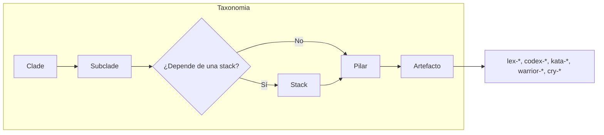
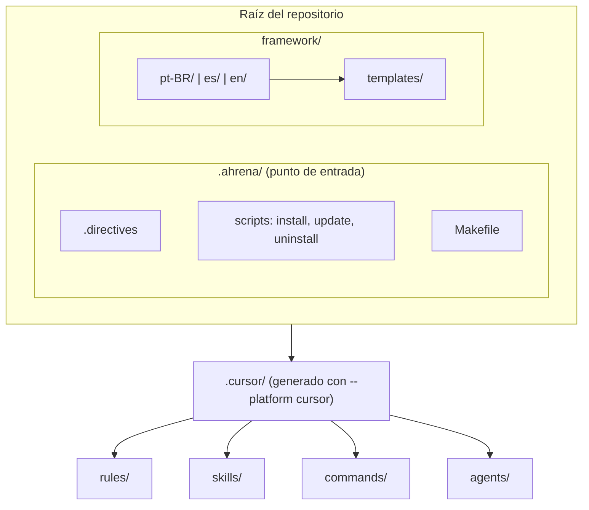
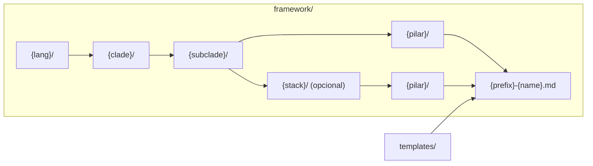

# Framework — Guía del desarrollador

🇧🇷 [Português](../pt-BR/README.md) | 🇺🇸 [English](../en/README.md)

> Documentación completa: **[guardiatechnology.github.io/ahrena](https://guardiatechnology.github.io/ahrena/)**
>
> Guía práctica para quienes contribuyen al repositorio de Ahrena. Para usar el framework en proyectos, consulte el [README principal](../../README.es.md).

## Estructura

```
framework/
├── .directives.sample           # Plantilla de directivas (copiada a .ahrena/.directives en la instalación)
├── templates/                   # Plantilla base por Pilar
│   ├── lex-sample.md
│   ├── codex-sample.md
│   ├── kata-sample.md
│   ├── warrior-sample.md
│   └── cry-sample.md
│
├── pt-BR/
│   ├── _foundation/
│   │   ├── authoring/           # Guías de creación de artefactos
│   │   ├── contributing/        # Flujo de contribución y commit
│   │   ├── process/             # Convenciones de proceso (checkpoints, directivas)
│   │   ├── quality/             # Estándares mínimos de calidad
│   │   ├── tooling/             # Automatización (Makefile)
│   │   └── i18n/                # Estructura de idiomas del framework
│   ├── engineering/
│   │   └── platform/            # Especificaciones de la plataforma Guardia (API, eventos, Lexis, Codex, Katas, Warriors, Cries)
│   └── documentation/
│       └── i18n/                # Sistema de traducción (Hermes)
│
├── en/                          # Inglés (misma estructura)
└── es/                          # Español (misma estructura)
```

Los cambios en el idioma por defecto se traducen al resto de idiomas mediante `/cry-translate`.

## Arquitectura del framework

### Taxonomía

El conocimiento se organiza en **Clade** (disciplina) → **Subclade** (área) → **Stack opcional** → **Pilar** (tipo de capacidad). Use el nivel de stack solo cuando el artefacto dependa de una tecnología específica; las capacidades transversales permanecen directamente en el subclade. Las direcciones canónicas son:

`{lang}/{clade}/{subclade}/{pilar}/{prefixo}-{nome}.{ext}` o `{lang}/{clade}/{subclade}/{stack}/{pilar}/{prefixo}-{nome}.{ext}` — por ejemplo `es/engineering/backend/dotnet/lexis/lex-dotnet-testing.md`.



### Visión general



### Paths canónicos en `framework/`

El **idioma es el primer nivel** de navegación. Cada carpeta de idioma contiene el árbol Clade → Subclade → Stack opcional → Pilar.



**Árbol de paths**

```
.ahrena/
├── .directives
├── install.py, update.py, uninstall.py
└── Makefile

framework/
├── .directives.sample
├── templates/
│   ├── lex-sample.md
│   ├── codex-sample.md
│   ├── kata-sample.md
│   ├── warrior-sample.md
│   └── cry-sample.md
├── pt-BR/
│   ├── _foundation/
│   ├── engineering/platform/
│   └── documentation/i18n/
├── es/
└── en/
```

Ejemplo de artefato: `framework/pt-BR/engineering/platform/lexis/lex-restful-apis.md`.

### De `framework/` a `.cursor/`

Al instalar con `--platform cursor`, el instalador genera `.cursor/` a partir de `framework/` (idioma definido por `language.cursor` en `.directives`).

| Pilar | Recurso Cursor | Destino |
|-------|----------------|---------|
| Lexis | Rules (`.mdc`) | `.cursor/rules/<clade>/<subclade>/lex-*.mdc` |
| Codex | Rules (`.mdc`) | `.cursor/rules/<clade>/<subclade>/codex-*.mdc` |
| Katas | Skills (`SKILL.md`) | `.cursor/skills/kata-*/SKILL.md` |
| Warriors | Skills + Agents | `.cursor/skills/warrior-*/SKILL.md` + `.cursor/agents/warrior-*.md` |
| Cries | Commands (`.md`) | `.cursor/commands/<clade>/<subclade>/cry-*.md` |

**Estructura de carpetas de `.cursor/`**

```
.cursor/
├── rules/
│   ├── _foundation/
│   │   ├── authoring/
│   │   ├── contributing/
│   │   ├── process/
│   │   ├── quality/
│   │   ├── tooling/
│   │   └── i18n/
│   ├── documentation/i18n/
│   └── engineering/platform/
├── skills/
│   ├── kata-commit/
│   ├── kata-contribute/
│   ├── kata-create-*/
│   ├── kata-translate/
│   ├── kata-api-design-oas/, kata-api-design-doc/, kata-events-doc/
│   ├── warrior-translator/
│   ├── warrior-daedalus/
│   └── warrior-kronos/
├── commands/
│   ├── _foundation/
│   ├── documentation/i18n/
│   └── engineering/platform/
└── agents/
    ├── warrior-translator.md
    ├── warrior-daedalus.md
    └── warrior-kronos.md
```

## Flujo de desarrollo

### 1. Editar artefactos en `framework/`

Edite los archivos `.md` dentro de `framework/{lang}/`. Respete:

- **Direccionamiento:** `{lang}/{clade}/{subclade}/{pilar}/{prefixo}-{nome}.md`
- **Templates:** use los de `framework/templates/` como base (`lex-template-usage`)
- **i18n:** todo cambio en el idioma por defecto debe propagarse a los demás idiomas

### 2. Probar en local

Tras editar, regenere la instalación local para comprobar que los artefactos Cursor se generan correctamente:

```bash
make dev-install PLATFORM=cursor
```

Esto copia `framework/` a `.ahrena/framework/`, genera `.cursor/` (rules, skills, commands, agents) y conserva el `.directives` existente.

### 3. Verificar artefactos generados

El instalador convierte cada Pilar al formato nativo de Cursor:

| Pilar | Origen | Destino Cursor |
|-------|--------|----------------|
| Lexis | `framework/{lang}/.../lexis/lex-*.md` | `.cursor/rules/.../lex-*.mdc` |
| Codex | `framework/{lang}/.../codex/codex-*.md` | `.cursor/rules/.../codex-*.mdc` |
| Katas | `framework/{lang}/.../katas/kata-*.md` | `.cursor/skills/kata-*/SKILL.md` |
| Warriors | `framework/{lang}/.../warriors/warrior-*.md` | `.cursor/skills/warrior-*/SKILL.md` + `.cursor/agents/warrior-*.md` |
| Cries | `framework/{lang}/.../cries/cry-*.md` | `.cursor/commands/.../cry-*.md` |

El idioma usado para generar los artefactos Cursor lo define `language.cursor` en `.directives` (por defecto: `en`).

### 4. Hacer commit

Use `/cry-commit` para crear commits conformes. Las 4 Lexis de commit son:

- `lex-conventional-commits` — formato `type(scope): description`
- `lex-small-commits` — un propósito por commit
- `lex-commit-language` — asunto en inglés
- `lex-signed-commits` — firma GPG obligatoria

### 5. Versionar release (tags)

Use `/cry-tag` para crear o listar tags de release en formato SemVer. `kata-tag` aplica `lex-semantic-version` y `lex-signed-commits`. Ver `_foundation/contributing/README.md` para el inventario completo.

### 6. Contribuir

Use `/cry-contribute pr` para abrir el Pull Request. `kata-contribute` guía todo el flujo vía MCP.

## Crear nuevos artefactos

### Por comandos (recomendado)

```
/cry-new-lex          # Nueva Lexis
/cry-new-codex        # Nuevo Codex
/cry-new-kata         # Nuevo Kata
/cry-new-warrior      # Nuevo Warrior
/cry-new-cry          # Nuevo Cry
```

Cada comando invoca el kata correspondiente (`kata-create-*`) que:
1. Usa el template oficial como base
2. Coloca el artefacto en la taxonomía correcta
3. Lo crea en los 3 idiomas obligatorios

### Manualmente

1. Copiar el template de `framework/templates/{pilar}-sample.md`
2. Colocarlo en `framework/pt-BR/{clade}/{subclade}/{pilar}/{prefixo}-{nome}.md`
3. Rellenar las secciones obligatorias
4. Traducir a `en/` y `es/` (vía `/cry-translate`)
5. Ejecutar `make dev-install PLATFORM=cursor` para validar

## Convenciones

| Aspecto | Por defecto |
|---------|-------------|
| Casing de archivos | `kebab-case` (`lex-no-secrets.md`) |
| Casing de directorios | `kebab-case` (`engineering/backend/`) |
| Extensión en framework | `.md` |
| Extensión en Cursor | `.mdc` (rules), `.md` (skills, commands, agents) |
| Prefijos | `lex-`, `codex-`, `kata-`, `warrior-`, `cry-` |
| Clades reservados | `_foundation` (prefijo `_`) |

## Targets del Makefile

| Target | Descripción |
|--------|-------------|
| `make dev-install PLATFORM=cursor` | Instala usando fuentes locales |
| `make bootstrap PLATFORM=cursor` | Primera instalación (descarga de GitHub) |
| `make install PLATFORM=cursor` | Reinstala desde `.ahrena/install.py` |
| `make update` | Actualiza a la última versión |
| `make clean` | Elimina archivos instalados |

## Referencias

- [README principal](../../README.es.md) — Documentación pública de Ahrena
- [Sistema de traducción](documentation/i18n/README.md) — Documentación de Hermes
- `.ahrena/.directives` — Directivas canónicas del framework
- `_foundation/contributing/codex/codex-contributing` — Flujo de contribución
- `_foundation/contributing/katas/kata-contribute` — Procedimiento de PR
