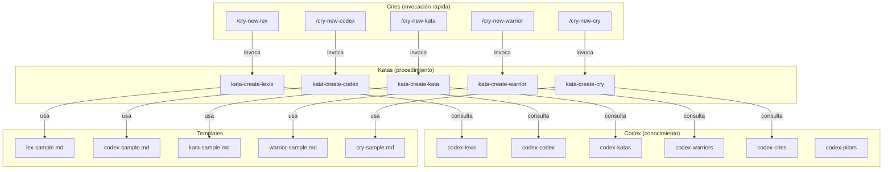

# Authoring — Sistema de Creación de Artefactos

> Documentación del sistema autosuficiente de creación de artefactos del Ahrena.

## Visión General

El Ahrena usa sus propios artefactos para crear nuevos artefactos. El Subclade `authoring` contiene el **Kit de Creación** de cada Pilar: un Codex (qué es y cómo escribir bien), un Kata (procedimiento paso a paso) y un Cry (atajo rápido para disparar la creación).

La cadena de ejecución es:

```
/cry-new-{pilar} → kata-create-{pilar} → codex-{pilar} + template + lexis
```

## Arquitectura



## Inventario de Artefactos

### Codex (conocimiento por Pilar)

| Artefacto | Descripción |
|-----------|-------------|
| `codex-pilars` | Referencia central sobre el sistema de Pilares, jerarquía y relaciones |
| `codex-lexis` | Cómo escribir una buena Lexis |
| `codex-codex` | Cómo escribir un buen Codex |
| `codex-katas` | Cómo escribir un buen Kata |
| `codex-warriors` | Cómo escribir un buen Warrior |
| `codex-cries` | Cómo escribir un buen Cry |

### Katas (procedimientos de creación)

| Artefacto | Descripción |
|-----------|-------------|
| `kata-create-lexis` | Procedimiento para crear una nueva Lexis |
| `kata-create-codex` | Procedimiento para crear un nuevo Codex |
| `kata-create-kata` | Procedimiento para crear un nuevo Kata |
| `kata-create-warrior` | Procedimiento para crear un nuevo Warrior |
| `kata-create-cry` | Procedimiento para crear un nuevo Cry |

### Cries (atajos de creación)

| Artefacto | Descripción |
|-----------|-------------|
| `cry-new-lex` | Atajo rápido para crear una nueva Lexis |
| `cry-new-codex` | Atajo rápido para crear un nuevo Codex |
| `cry-new-kata` | Atajo rápido para crear un nuevo Kata |
| `cry-new-warrior` | Atajo rápido para crear un nuevo Warrior |
| `cry-new-cry` | Atajo rápido para crear un nuevo Cry |

## Cómo Usar

Crear un nuevo artefacto con un único comando:

```
/cry-new-lex
```

El agente:
1. Lee el `codex-lexis` para entender la estructura y buenas prácticas
2. Ejecuta el `kata-create-lexis` paso a paso
3. Usa el template `lex-sample.md` como base
4. Posiciona el artefacto en el Clade/Subclade correcto
5. Crea versiones en todos los idiomas obligatorios

## Referencias

- `codex-pilars` — Referencia central sobre los Pilares
- `lex-template-usage` — Lexis de uso obligatorio de templates
- `framework/templates/` — Templates oficiales de cada Pilar
