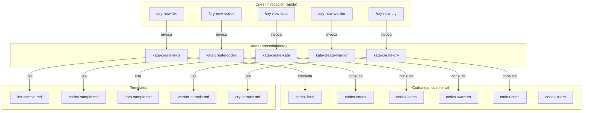
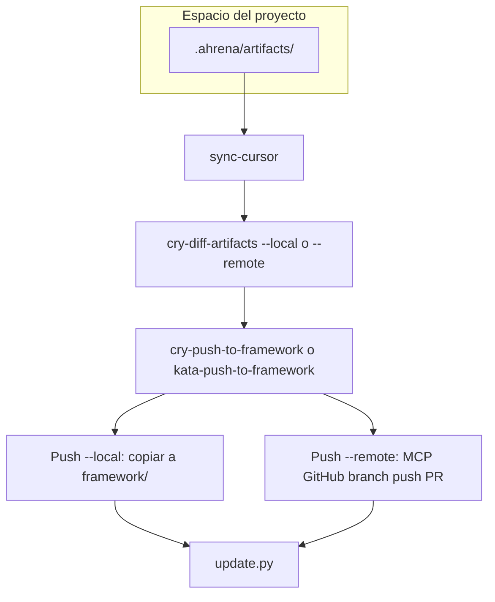

# Authoring — Sistema de Creación de Artefactos

> Documentación del sistema autosuficiente de creación de artefactos del Ahrena.

## Visión General

El Ahrena usa sus propios artefactos para crear nuevos artefactos. El Subclade `authoring` contiene el **Kit de Creación** de cada Pilar: un Codex (qué es y cómo escribir bien), un Kata (procedimiento paso a paso) y un Cry (atajo rápido para disparar la creación).

La cadena de ejecución es:

```
/cry-new-{pilar} → kata-create-{pilar} → codex-{pilar} + template + lexis
```

## Arquitectura



## Creación en el proyecto (.ahrena) y Push al framework

Los artefactos pueden crearse primero en el espacio del proyecto (`.ahrena/artifacts/`), específicos del repositorio. Los Katas de creación aceptan el input **Destino** ("framework" o "proyecto"). Flujo canónico en cinco pasos:

1. **Crear en el proyecto:** use los Katas de creación con Destino **proyecto** — el artefacto se guarda en `.ahrena/artifacts/{lang}/{clade}/{subclade}/{pilar}/`.
2. **Sincronizar .cursor local:** ejecute `python .ahrena/update.py --sync-cursor` (o `make sync-cursor`) para regenerar `.cursor/` a partir de `.ahrena/framework/` y `.ahrena/artifacts/`.
3. **Validar y comparar (opcional):** use `cry-diff-artifacts --local` para ver diferencias entre `.ahrena/artifacts` y `framework/` local; use `cry-diff-artifacts --remote` para comparar con la versión más reciente del framework en el remoto (vía MCP de GitHub).
4. **Push al framework:** ejecute `cry-push-to-framework` o `kata-push-to-framework` con **--local** (copia a `framework/` en el repo actual) o **--remote** (sincronización con el repositorio del framework en GitHub vía MCP de GitHub).
5. **Actualizar instalación:** ejecute `python .ahrena/update.py` (y opcionalmente `--sync-cursor`) para traer la versión más reciente del framework.

### Flujo del Push y del Diff

El **Push** puede ser **--local** (copia a `framework/` en disco) o **--remote** (envío al repositorio del framework en GitHub, obligatoriamente vía MCP de GitHub). El **Diff** (`kata-diff-artifacts` / `cry-diff-artifacts`) compara artefactos en modo **--local** (vs framework local) o **--remote** (vs versión más reciente en el remoto, vía MCP de GitHub).



## Inventario de Artefactos

### Codex (conocimiento por Pilar)

| Artefacto | Descripción |
|-----------|-------------|
| `codex-pilars` | Referencia central sobre el sistema de Pilares, jerarquía y relaciones |
| `codex-lexis` | Cómo escribir una buena Lexis |
| `codex-codex` | Cómo escribir un buen Codex |
| `codex-katas` | Cómo escribir un buen Kata |
| `codex-warriors` | Cómo escribir un buen Warrior |
| `codex-cries` | Cómo escribir un buen Cry |

### Katas (procedimientos de creación)

| Artefacto | Descripción |
|-----------|-------------|
| `kata-create-lexis` | Procedimiento para crear una nueva Lexis (destino: framework o proyecto) |
| `kata-create-codex` | Procedimiento para crear un nuevo Codex (destino: framework o proyecto) |
| `kata-create-kata` | Procedimiento para crear un nuevo Kata (destino: framework o proyecto) |
| `kata-create-warrior` | Procedimiento para crear un nuevo Warrior (destino: framework o proyecto) |
| `kata-create-cry` | Procedimiento para crear un nuevo Cry (destino: framework o proyecto) |
| `kata-push-to-framework` | Procedimiento para incorporar artefactos de `.ahrena/artifacts/` al framework (modo local o remoto; remoto vía MCP de GitHub) |
| `kata-diff-artifacts` | Procedimiento para comparar artefactos del proyecto con el framework (modos local y remoto; remoto vía MCP de GitHub) |

### Cries (atajos de creación)

| Artefacto | Descripción |
|-----------|-------------|
| `cry-new-lex` | Atajo rápido para crear una nueva Lexis |
| `cry-new-codex` | Atajo rápido para crear un nuevo Codex |
| `cry-new-kata` | Atajo rápido para crear un nuevo Kata |
| `cry-new-warrior` | Atajo rápido para crear un nuevo Warrior |
| `cry-new-cry` | Atajo rápido para crear un nuevo Cry |
| `cry-push-to-framework` | Atajo para incorporar artefactos del proyecto al framework (--local o --remote) |
| `cry-diff-artifacts` | Atajo para comparar artefactos del proyecto con el framework (--local o --remote) |

## Cómo Usar

**Crear en el framework (por defecto):**

```
/cry-new-lex
```

El agente leerá el codex del Pilar, ejecutará el kata de creación, usará el template, posicionará en el Clade/Subclade correcto y creará versiones en todos los idiomas obligatorios.

**Crear en el proyecto (específico del repositorio):**

Al invocar un kata de creación (o cry), indique **Destino: proyecto**. El artefacto se guardará en `.ahrena/artifacts/{lang}/{clade}/{subclade}/{pilar}/`. Ejecute `python .ahrena/update.py --sync-cursor` para que Cursor use el artefacto. Opcionalmente use `cry-diff-artifacts --local` para ver diferencias antes del push. Incorpórelo al framework con:

```
/cry-push-to-framework --local
```

(o `cry-push-to-framework --remote todos` para enviar al repositorio del framework en GitHub vía MCP; o `--local todos --remove` para incorporar todos al framework local y eliminar del proyecto).

## Referencias

- `codex-pilars` — Referencia central sobre los Pilares y flujo de artefactos en el proyecto (.ahrena) y Push
- `lex-template-usage` — Lexis de uso obligatorio de templates
- `framework/templates/` — Templates oficiales de cada Pilar
- `kata-push-to-framework` — Incorporación de artefactos de `.ahrena/artifacts/` al framework
