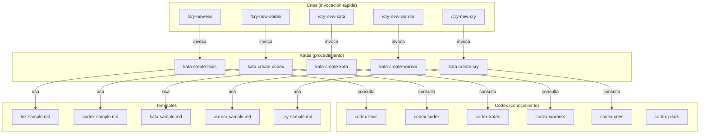
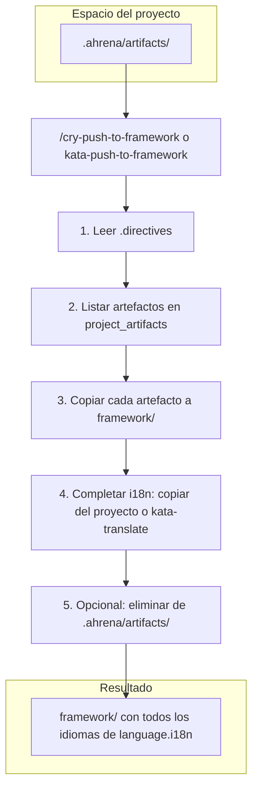

# Authoring — Sistema de Creación de Artefactos

> Documentación del sistema autosuficiente de creación de artefactos del Ahrena.

## Visión General

El Ahrena usa sus propios artefactos para crear nuevos artefactos. El Subclade `authoring` contiene el **Kit de Creación** de cada Pilar: un Codex (qué es y cómo escribir bien), un Kata (procedimiento paso a paso) y un Cry (atajo rápido para disparar la creación).

La cadena de ejecución es:

```
/cry-new-{pilar} → kata-create-{pilar} → codex-{pilar} + template + lexis
```

## Arquitectura



## Creación en el proyecto (.ahrena) y Push al framework

Los artefactos pueden crearse primero en el espacio del proyecto (`.ahrena/artifacts/`), específicos del repositorio. Los Katas de creación aceptan el input **Destino** ("framework" o "proyecto"). Si es "proyecto", el artefacto se guarda en `.ahrena/artifacts/{lang}/{clade}/{subclade}/{pilar}/` y puede existir solo en el idioma por defecto. Para que Cursor use esos artefactos (rules, skills, commands), ejecute `python .ahrena/update.py --sync-cursor` o `make sync-cursor` tras crear o editar en `.ahrena/artifacts/`. Después de validar, puede incorporarlos al framework con `/cry-push-to-framework` o ejecutando `kata-push-to-framework` (skill en `.cursor/skills/kata-push-to-framework`).

### Flujo del Push al framework

Cuando los artefactos se crean en el proyecto (Destino: proyecto), quedan en `.ahrena/artifacts/` y pueden existir solo en el idioma por defecto. El **Push al framework** es el procedimiento que los incorpora al repositorio canónico: `kata-push-to-framework` (o el Cry `/cry-push-to-framework`) lee las directivas, lista los artefactos en `paths.project_artifacts`, copia cada uno a `framework/` con la misma estructura, completa los idiomas obligatorios (copiando del proyecto o generando con `kata-translate`) y opcionalmente elimina las copias en `.ahrena/artifacts/`. El diagrama siguiente resume ese flujo.



## Inventario de Artefactos

### Codex (conocimiento por Pilar)

| Artefacto | Descripción |
|-----------|-------------|
| `codex-pilars` | Referencia central sobre el sistema de Pilares, jerarquía y relaciones |
| `codex-lexis` | Cómo escribir una buena Lexis |
| `codex-codex` | Cómo escribir un buen Codex |
| `codex-katas` | Cómo escribir un buen Kata |
| `codex-warriors` | Cómo escribir un buen Warrior |
| `codex-cries` | Cómo escribir un buen Cry |

### Katas (procedimientos de creación)

| Artefacto | Descripción |
|-----------|-------------|
| `kata-create-lexis` | Procedimiento para crear una nueva Lexis (destino: framework o proyecto) |
| `kata-create-codex` | Procedimiento para crear un nuevo Codex (destino: framework o proyecto) |
| `kata-create-kata` | Procedimiento para crear un nuevo Kata (destino: framework o proyecto) |
| `kata-create-warrior` | Procedimiento para crear un nuevo Warrior (destino: framework o proyecto) |
| `kata-create-cry` | Procedimiento para crear un nuevo Cry (destino: framework o proyecto) |
| `kata-push-to-framework` | Procedimiento para incorporar artefactos de `.ahrena/artifacts/` a `framework/` (con i18n) |

### Cries (atajos de creación)

| Artefacto | Descripción |
|-----------|-------------|
| `cry-new-lex` | Atajo rápido para crear una nueva Lexis |
| `cry-new-codex` | Atajo rápido para crear un nuevo Codex |
| `cry-new-kata` | Atajo rápido para crear un nuevo Kata |
| `cry-new-warrior` | Atajo rápido para crear un nuevo Warrior |
| `cry-new-cry` | Atajo rápido para crear un nuevo Cry |
| `cry-push-to-framework` | Atajo para incorporar artefactos del proyecto al framework |

## Cómo Usar

**Crear en el framework (por defecto):**

```
/cry-new-lex
```

El agente leerá el codex del Pilar, ejecutará el kata de creación, usará el template, posicionará en el Clade/Subclade correcto y creará versiones en todos los idiomas obligatorios.

**Crear en el proyecto (específico del repositorio):**

Al invocar un kata de creación (o cry), indique **Destino: proyecto**. El artefacto se guardará en `.ahrena/artifacts/{lang}/{clade}/{subclade}/{pilar}/` y puede existir solo en el idioma por defecto. Después de validar, incorpórelo al framework con:

```
/cry-push-to-framework
```

(o `cry-push-to-framework todos --remove` para incorporar todos y eliminar del proyecto).

## Referencias

- `codex-pilars` — Referencia central sobre los Pilares y flujo de artefactos en el proyecto (.ahrena) y Push
- `lex-template-usage` — Lexis de uso obligatorio de templates
- `framework/templates/` — Templates oficiales de cada Pilar
- `kata-push-to-framework` — Incorporación de artefactos de `.ahrena/artifacts/` al framework
