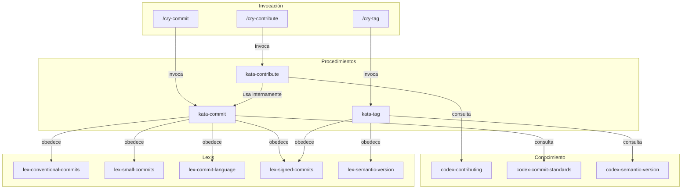

# Contributing — Flujo de Contribución

> Documentación del sistema de contribución, estándares de commit y creación de Pull Requests.

## Visión General

El Subclade `contributing` define el flujo unificado de contribución de Guardia. Abarca desde las Lexis de commit hasta el procedimiento de apertura de PRs vía MCP. El proceso es el mismo para todos los contribuidores (internos y externos), garantizando transparencia y trazabilidad.

## Arquitectura



## Inventario de Artefactos

### Lexis (leyes)

| Artefacto | Descripción |
|-----------|-------------|
| `lex-conventional-commits` | Formato obligatorio `type(scope): description` |
| `lex-small-commits` | Un propósito por commit, cambios atómicos |
| `lex-commit-language` | Subject en inglés |
| `lex-signed-commits` | Firma GPG obligatoria |
| `lex-semantic-version` | Versionado SemVer 2.0 obligatorio para releases y tags |

### Codex (conocimiento)

| Artefacto | Descripción |
|-----------|-------------|
| `codex-contributing` | Flujo completo de contribución (de la discusión al merge) |
| `codex-commit-standards` | Estructura detallada de los mensajes de commit |
| `codex-semantic-version` | Referencia para SemVer y uso de git tags en releases |

### Katas (procedimientos)

| Artefacto | Descripción |
|-----------|-------------|
| `kata-commit` | Procedimiento para crear commits conformes |
| `kata-contribute` | Procedimiento para abrir Pull Requests vía MCP |
| `kata-tag` | Procedimiento para aplicar versionado semántico con git tags |

### Cries (atajos)

| Artefacto | Descripción |
|-----------|-------------|
| `cry-commit` | Atajo para commitear siguiendo las 4 Lexis de commit |
| `cry-contribute` | Atajo para abrir PR o contribuir al framework |
| `cry-tag` | Atajo para crear o listar tags de release (SemVer) |
| `cry-sync` | Atajo para sincronizar repositorio (fetch, pull, push) |
| `cry-rebase` | Atajo para resolver conflictos vía rebase |

## Cómo Usar

### Commitear cambios

```
/cry-commit
```

El agente analiza los cambios, crea commits atómicos siguiendo Conventional Commits, con subject en inglés y firma GPG.

### Abrir un Pull Request

```
/cry-contribute pr
```

El agente ejecuta el `kata-contribute`, que crea el PR en el repositorio origin vía herramientas MCP de GitKraken.

### Versionar release (tags)

```
/cry-tag [versión] [mensaje] [commit]
/cry-tag --list
```

El agente ejecuta el `kata-tag`: crea tag anotada y firmada en formato SemVer o lista los tags existentes. Opcionalmente indicar el commit (ID o mensaje) al que apuntará el tag.

### Flujo completo de contribución

El `codex-contributing` define el proceso paso a paso:

1. Abrir discusión en GitHub Discussions (categoría Ideas)
2. Discusión aprobada se convierte en issue
3. Crear branch a partir de main (`feat/nombre`, `fix/nombre`, `docs/nombre`)
4. Implementar (siguiendo Lexis de commit)
5. Abrir PR completando el template
6. Mantener CI verde y responder al review
7. Merge por el maintainer

## Referencias

- [CONTRIBUTING de Guardia](https://hub.guardia.finance/docs/community/CONTRIBUTING/)
- `.github/pull_request_template.md` — Template de PR
- `.github/CODEOWNERS` — Archivo de codeowners
