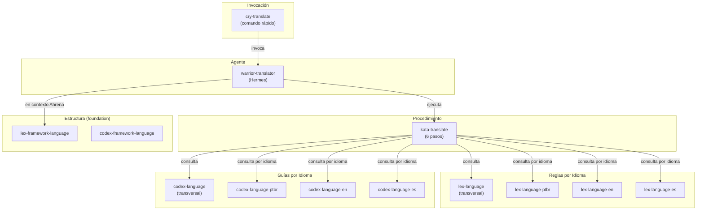

# Sistema de Traducción de Ahrena

> Documentación completa del sistema de internacionalización y traducción de documentación técnica.

## Visión General

El sistema de traducción de Ahrena es un conjunto de artefactos que permite traducir cualquier documentación técnica en Markdown de forma consistente, con reglas y guías específicas por idioma. Fue diseñado para ser **genérico** — funciona para documentación del framework Ahrena, de proyectos y de cualquier otro contenido técnico.

El sistema está compuesto por **Lexis** (leyes), **Codex** (guías), un **Kata** (procedimiento), un **Warrior** (agente) y un **Cry** (comando), organizados en el Clade `documentation/i18n/`.

## Arquitectura



## Inventario de Artefactos

### `documentation/i18n/` (traducción genérica)

| Artefacto | Tipo | Descripción |
|-----------|------|-------------|
| `lex-language` | Lexis | Reglas **transversales** de traducción |
| `lex-language-ptbr` | Lexis | Reglas para traducir **al pt-BR** |
| `lex-language-en` | Lexis | Reglas para traducir **al inglés** |
| `lex-language-es` | Lexis | Reglas para traducir **al español** |
| `codex-language` | Codex | Guía **transversal** de traducción |
| `codex-language-ptbr` | Codex | Guía para traducir **al pt-BR** |
| `codex-language-en` | Codex | Guía para traducir **al inglés** |
| `codex-language-es` | Codex | Guía para traducir **al español** |
| `kata-translate` | Kata | Procedimiento de traducción en **6 pasos** |
| `warrior-translator` | Warrior | Agente **Hermes** — traductor especialista |
| `cry-translate` | Cry | Comando rápido con **orden de traducción** |

### `_foundation/i18n/` (estructura del framework)

| Artefacto | Tipo | Descripción |
|-----------|------|-------------|
| `lex-framework-language` | Lexis | Idioma como raíz de navegación en `framework/` |
| `codex-framework-language` | Codex | Manual de organización de carpetas por idioma |

## Cómo Usar

### Traducir un documento a todos los idiomas

```
/cry-translate framework/pt-BR/_foundation/process/lexis/lex-directives.md
```

### Traducir a un idioma específico

```
/cry-translate docs/architecture.md en
```

### Traducir con orden personalizado

```
/cry-translate docs/api.md es,en --order en,es
```

## Extensibilidad: Agregando un Nuevo Idioma

Para agregar un nuevo idioma (ej: japonés `ja`):

1. **Actualizar `.ahrena/.directives`:** agregar `ja` a `language.i18n`
2. **Crear artefactos de traducción:** `lex-language-ja` y `codex-language-ja`
3. **Crear la carpeta de idioma:** `framework/ja/` con estructura reflejada
4. **Traducir artefactos existentes:** usar `cry-translate` para cada documento

Los artefactos transversales **no necesitan ser alterados** — ya soportan cualquier idioma via `lex-language-{lang}`.

## Relación con `_foundation/i18n/`

| Clade | Responsabilidad |
|-------|-----------------|
| `_foundation/i18n/` | **Estructura:** cómo las carpetas de idioma se organizan |
| `documentation/i18n/` | **Traducción:** cómo traducir contenido con calidad |

## Referencias

- `.ahrena/.directives` — Fuente de verdad para idiomas
- `lex-framework-language` — Ley estructural de idiomas del framework
- `codex-framework-language` — Manual estructural de idiomas del framework
