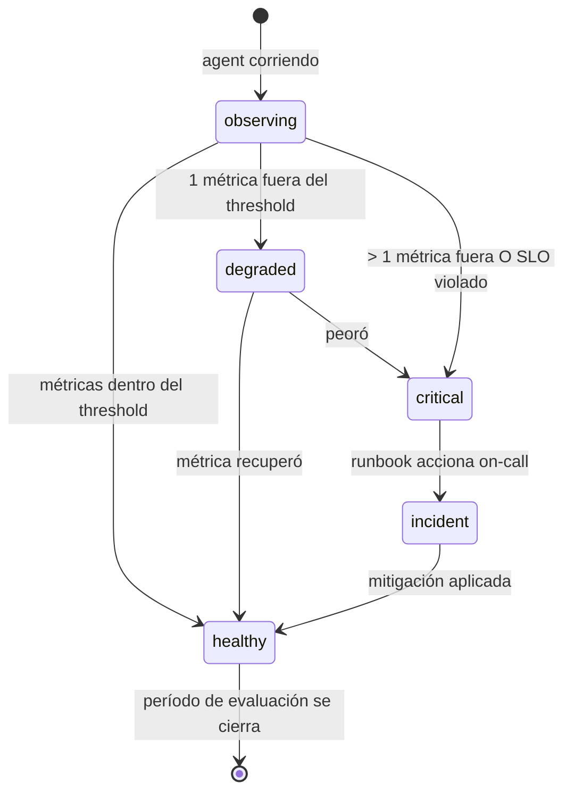

# Kata: Design del Loop de Feedback + Métricas (SLO cuando tier-1/2)

> **Prefijo:** `kata-` | **Tipo:** Skill Repetible | **Alcance:** Ingeniería — Agents: design del loop de feedback (`feedback.md`) y métricas operacionales (`metrics.md`) del agent en `operational-concrete`

## Objetivo

Producir dos archivos canónicos:

- `feedback.md` — modalidades de feedback (HITL para acciones irreversibles, critic LLM, métricas objetivas), gatillos, acciones remediales
- `metrics.md` — catálogo de métricas operacionales + (cuando `tier-1` o `tier-2`) SLO declarado per `lex-slo-required`

Cubre rigurosamente la **Directriz 04 — Loop de Feedback Explícito** de `lex-agent-construction-directives`. En tier-1/2 también satisface la obligación registrada por `kata-dooc-validate::Paso 9`.

## Cuándo Usar

- Tras `kata-agent-memory-design` (métricas observan capas de memoria)
- Cuando el agent necesita revisión de SLO (cambio de tier, cambio de threshold, nuevo runbook)

## Inputs

| Input | Obligatorio | Descripción |
|-------|:-----------:|-------------|
| `context` | Sí | Bounded Context |
| `agent` | Sí | Slug del agent |
| `overview_path` | Sí | `docs/{context}/agents/{agent}/overview.md` (tier + lagging metric + leading metric) |
| `dooc_path` | Sí | `docs/{context}/dooc/{agent}.md` (ítem h — tier) |
| `--from-pov <path>` | No | PoV path; hereda métricas de valor ya probadas |

## Workflow

```
Progreso:
- [ ] 1. Leer overview + dooc + (opcional) PoV
- [ ] 2. Declarar modalidades de feedback (HITL + critic + métricas)
- [ ] 3. Declarar ≥ 3 métricas objetivas
- [ ] 4. Cuando tier-1/2: declarar SLO + error budget policy
- [ ] 5. Declarar runbook(s) per lex-runbook-for-every-alert
- [ ] 6. Validación final
```

### Paso 1: Leer overview + dooc + (opcional) PoV

1. Lee `overview.md` para tier, leading metric, lagging metric
2. Lee `dooc/{agent}.md` para confirmar tier y capturar evidencias de leading metric del PoV
3. En `with-pov`, lee `pov-path/feedback.md` y `pov-path/observability/value-metrics.md` — hereda métricas que probaron valor

### Paso 2: Declarar modalidades de feedback

Template `feedback.md`:

```markdown
# Feedback Loop — {agent}

> **Bounded Context:** {context}
> **Agent:** {agent}
> **Tier:** {tier}

## Modalidades

### HITL (Human-in-the-Loop) para acciones irreversibles

Toda acción que produce efecto irreversible DEBE pasar por confirmación humana. Catálogo:

| Acción | Gatillo | Quién confirma | SLA de respuesta |
|--------|---------|----------------|------------------|
| `criar_lancamento_erp` | Output del agent recomienda creación | Analista contable owner | 4 horas hábiles |
| `enviar_email_cliente` | Output requiere comunicación | Operador on-call | 1 hora hábil |

Cuando no hay confirmación en el SLA → escalamiento vía `escalation.md`.

### Critic LLM

Cuando el agent usa patrón `reflexion` o tier-1/2 con calidad > latencia, un modelo critic revisa el output antes de devolver. Configuración:

- **Modelo:** {nombre del critic LLM}
- **Threshold de aceptación:** {valor}
- **Etapa del orchestrator que invoca:** {referencia a orchestrator.md::Workflow}
- **Acción en rechazo:** {retry con refinement | escalar a humano | abortar con error}

### Métricas objetivas (≥ 3 obligatorias)

Métricas que cierran el loop de aprendizaje cuantitativamente. Listadas en detalle en `metrics.md`. Cada métrica DEBE tener:

- Nombre canónico (snake_case)
- Definición operacional (cómo medida en runtime)
- Threshold (valor esperado en producción)
- Ventana de evaluación
- Acción remedial en desvío

## Estados del loop



## Pivot triggers

Condiciones que disparan revisión estructural del agent (cambio de alcance, retraining de modelo, despromoción a `pre-operational`):

- Leading metric < threshold por ≥ 2 ciclos consecutivos
- Pivot trigger pre-declarado en `value-proof.md` del PoV
- Lagging metric no evoluciona tras {N} días

Pivot DEBE ser registrado en ADR.

## Referencias

- `lex-agent-construction-directives::Directriz 04`
- `metrics.md` — catálogo de métricas + SLO
- `orchestrator.md` — puntos de integración del feedback runtime
- `escalation.md` — camino de escalamiento cuando feedback falla
- `lex-slo-required` (tier-1/2)
- `lex-runbook-for-every-alert`
```

### Paso 3: Declarar ≥ 3 métricas objetivas

Template `metrics.md`:

```markdown
# Metrics — {agent}

> **Bounded Context:** {context}
> **Agent:** {agent}
> **Tier:** {tier}
> **SLO obligatorio:** sí (tier-1/2) | no (tier-3/4)

## Catálogo

### `{metric_name_1}` (LEADING — fuente: DoOC ítem b)

- **Definición:** {cómo medida}
- **Tipo:** counter | gauge | histogram
- **Unidad:** {%, ms, count}
- **Threshold:** {valor}
- **Ventana:** {duración}
- **Source:** {nombre del span/log/decorator}
- **Acción en desvío:** {pivot trigger | degradation alert | incident}

### `{metric_name_2}` (LAGGING — fuente: DoOC ítem c)

(idem)

### `{metric_name_3}` (operacional — latencia, error)

(idem)

## SLO (obligatorio tier-1/2)

> **Aplicabilidad:** este archivo SLO existe cuando `tier ∈ {tier-1, tier-2}`. Para tier-3/4, omitir esta sección.

```yaml
service: {agent}
tier: tier-1 | tier-2
slos:
  - name: availability
    sli: "successful_runs / total_runs (excluding 4xx user-error)"
    objective: 99.9% (tier-1) | 99.5% (tier-2)
    window: 30d
    error_budget_policy: "pause features when ≥ 80% consumed"
  - name: latency_p99
    sli: "agent_turn_duration_seconds{p99}"
    objective: {N}s
    window: 30d
  - name: quality (when measurable)
    sli: "critic_acceptance_rate OR human_approval_rate"
    objective: {%}
    window: 7d
owners:
  - team: {team-name}
    escalation: "@on-call-handle | #channel"
```

> Para tier-3/4, declarar `SLO: none — best effort` y omitir el bloque YAML.

## Runbooks

Cada alerta crítica DEBE tener runbook (per `lex-runbook-for-every-alert`):

| Alert | Runbook |
|-------|---------|
| `{agent}-availability-breach` | `docs/runbooks/{agent}-availability-breach.md` |
| `{agent}-p99-breach` | `docs/runbooks/{agent}-p99-breach.md` |

## Instrumentación

Per `lex-observability-required`:

- 1 trace por turn del agent (span `agent.turn`)
- ≥ 1 métrica de latencia (histogram)
- structured log con `correlation_id`, `org_id`, `client_id`, `agent_id`, `outcome`
- Propagación de `traceparent` a tools downstream

Implementación vía decorator centralizado per `lex-logging-decorator`.

## Referencias

- `lex-slo-required`, `lex-observability-required`, `lex-runbook-for-every-alert`
- `feedback.md` — modalidades de feedback que consumen estas métricas
- `orchestrator.md::Loop de feedback runtime`
- `lex-logging-decorator`
```

### Paso 4: Cuando tier-1/2, declarar SLO + error budget policy

Verificaciones obligatorias:

1. Bloque YAML SLO presente en `metrics.md`
2. ≥ 2 SLOs declarados (availability + latency mínimo)
3. Error budget policy declarada (pause features cuando consumido ≥ 80%)
4. Owners + escalation channel poblados (no placeholders)

### Paso 5: Declarar runbook(s)

Para cada alerta crítica (availability breach, latency breach, error rate breach):

1. Crea entry en `metrics.md::Runbooks`
2. Crea archivo placeholder en `docs/runbooks/{agent}-{alert-name}.md` (template per `lex-runbook-for-every-alert`)
3. Confirma que alert config (CloudWatch, Datadog o equivalente) tiene `runbook_url` apuntando al path

### Validación Final

- [ ] `feedback.md` declara HITL para acciones irreversibles (catálogo concreto)
- [ ] ≥ 3 métricas objetivas declaradas en `metrics.md`
- [ ] Cuando tier-1/2: SLO declarado con error budget policy
- [ ] Runbooks listados para cada alerta crítica
- [ ] Pivot triggers explícitos en `feedback.md`
- [ ] Instrumentación per `lex-observability-required` (trace + metric + log) presente

## Outputs

| Output | Formato | Destino |
|--------|---------|---------|
| `feedback.md` | Markdown | `docs/{context}/agents/{agent}/feedback.md` |
| `metrics.md` | Markdown | `docs/{context}/agents/{agent}/metrics.md` |
| `docs/runbooks/{agent}-*.md` | Markdown | placeholders creados cuando alertas declaradas |

## Restricciones

- HITL para acciones irreversibles es OBLIGATORIO (no negociable)
- < 3 métricas objetivas viola Directriz 04
- tier-1/2 sin SLO viola `lex-slo-required`
- Alerta sin runbook viola `lex-runbook-for-every-alert`
- Pivot trigger ausente en agents con PoV está prohibido (PoV declaraba trigger; mismo trigger DEBE existir en producción)

---

**Modelo:** Kata produce feedback + métricas. En tier-1/2, declara SLO. Cada alerta tiene runbook. Cross-link riguroso con `lex-observability-required` y `lex-slo-required`.
