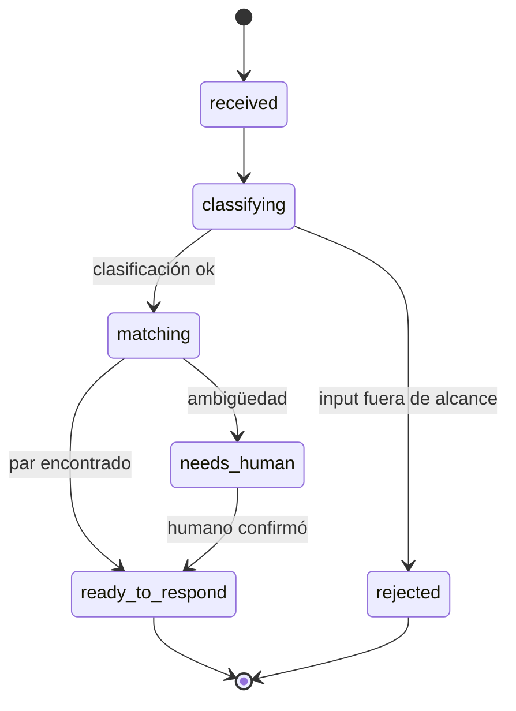
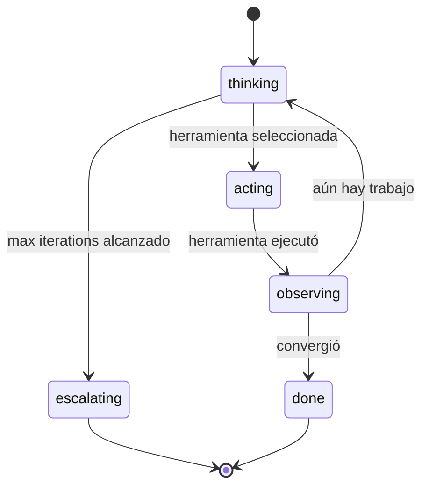

# Kata: Design del Orchestrator y Reasoning Loop

> **Prefijo:** `kata-` | **Tipo:** Skill Repetible | **Alcance:** Ingeniería — Agents: design del orquestador del agent en `operational-concrete`, produciendo `orchestrator.md` y `reasoning-loop.md`

## Objetivo

Producir el orquestador canónico del agent: el componente raíz que recibe el input del usuario, ejecuta el loop de razonamiento, despacha herramientas, delega a specialists cuando aplicable y produce el output. Cubre parte de la **Directriz 04 — Loop de Feedback Explícito** (el lado runtime del loop) y la estructura cognitiva mencionada en `lex-agent-construction-directives`.

Produce dos archivos:

- `orchestrator.md` — persona del orquestador, alcance, estados entre specialists, workflow completo
- `reasoning-loop.md` — patrón de razonamiento elegido (ReAct, Plan-and-Execute, Reflexion, etc.), estados del loop, parámetros operacionales (max iterations, timeout, fallback)

## Cuándo Usar

- Tras `kata-agent-overview-design` haber producido `overview.md` y `system-prompt.md`
- Antes de `kata-agent-specialists-design` (el orchestrator decide si specialists serán delegados a Theseus)
- Cuando hay revisión de arquitectura de razonamiento del agent (ej.: cambio de ReAct a Plan-and-Execute aprobado vía ADR)

## Inputs

| Input | Obligatorio | Descripción |
|-------|:-----------:|-------------|
| `context` | Sí | Bounded Context |
| `agent` | Sí | Slug del agent |
| `overview_path` | Sí | `docs/{context}/agents/{agent}/overview.md` (producido por el kata anterior) |
| `system_prompt_path` | Sí | `docs/{context}/agents/{agent}/system-prompt.md` (producido por el kata anterior) |
| `--from-pov <path>` | No | Path del PoV; orquestador deriva loop y estados del PoV cuando disponible |
| `--pattern` | No | `react` \| `plan-and-execute` \| `reflexion` \| `tool-calling-simple` (default decidido en la fase de design) |

## Workflow

```
Progreso:
- [ ] 1. Leer overview + system-prompt + (opcional) PoV
- [ ] 2. Elegir patrón de razonamiento (con justificación)
- [ ] 3. Decidir specialists (1, varios, o ninguno)
- [ ] 4. Redactar orchestrator.md (persona, alcance, estados, workflow)
- [ ] 5. Redactar reasoning-loop.md (patrón, estados, parámetros)
- [ ] 6. Validación final
```

### Paso 1: Leer overview + system-prompt + (opcional) PoV

1. Carga `overview.md` para extraer caso de uso primario y fuera de alcance
2. Carga `system-prompt.md` para extraer bloques 2 (capacidades + fronteras) y 3 (estilo de razonamiento)
3. En `with-pov`, lee `pov-path/system-prompt.md` y cualquier nota sobre estados del PoV — hereda cuando aplicable, refina para rigor de producción

### Paso 2: Elegir patrón de razonamiento

| Patrón | Cuándo usar | Cuándo NO usar |
|--------|-------------|----------------|
| `tool-calling-simple` | Agent con 1-3 tools y 1 ciclo determinístico (entrada → herramienta → respuesta) | Cuando necesita descomponer en sub-tareas |
| `react` | Agent que itera entre `Thought → Action → Observation` hasta converger | En tareas con plan global fijo (use plan-and-execute) |
| `plan-and-execute` | Agent que necesita descomponer input en N sub-tareas explícitas y ejecutar en orden | En tareas single-shot |
| `reflexion` | Agent que necesita auto-revisar output antes de devolver (calidad > latencia) | En tier-1 con SLO de latencia apretado |

La elección DEBE estar justificada en una sección dedicada de `reasoning-loop.md`. No usar patrón sin justificación.

### Paso 3: Decidir specialists

Specialists son sub-agentes invocados por el orchestrator cuando la tarea se descompone en sub-dominios cognitivos distintos. Reglas:

- **0 specialists** — el orchestrator hace todo. Aceptable cuando el alcance es estrecho y el patrón de razonamiento es `tool-calling-simple` o `react`
- **1 specialist** — overkill en la mayoría de los casos; reevaluar si tiene sentido crear la abstracción
- **2-5 specialists** — caso normal para `plan-and-execute`; cada specialist tiene aggregate propio (delegación a `warrior-theseus` vía `kata-agent-specialists-design`)
- **> 5 specialists** — señala que el alcance del agent está demasiado grande; sugerir split en dos agents

Registra la decisión en `orchestrator.md` sección `Estados (entre specialists)`. Cuando ≥ 2 specialists, marca obligación de invocar `kata-agent-specialists-design` enseguida.

### Paso 4: Redactar orchestrator.md

Template canónico:

```markdown
# Orchestrator — {agent}

> **Bounded Context:** {context}
> **Agent:** {agent}
> **Source of truth:** `system-prompt.md` define la identidad; este archivo define la orquestación runtime.

## Persona

{Persona resumida del orchestrator — es el "hilo conductor" del agent. Directa, alineada a `system-prompt.md::Bloque 1`.}

## Alcance

- **Hace:** orquestar el ciclo de razonamiento, despachar herramientas, delegar a specialists, producir output canónico
- **No hace:** lógica de dominio de los specialists (delegada), persistencia directa (delegada a tools), toma de decisión sobre alcance estructural (escalamiento humano vía `escalation.md`)

## Specialists declarados

| Specialist | Path | Aggregate (Theseus) |
|-----------|------|---------------------|
| `{specialist-1}` | `specialists/{specialist-1}.md` | `{aggregate-name}` |
| `{specialist-2}` | `specialists/{specialist-2}.md` | `{aggregate-name}` |

> Cuando 0 specialists: declarar `Specialists declarados: ninguno (orquestador hace todo)`.

## Estados (entre specialists)



> Sustituir por el diagrama real del agent.

## Workflow (con tools y dependencias)

| Etapa | Lo que hace | Tools usadas | Specialist | Memoria consumida | Errores posibles |
|-------|-------------|--------------|------------|-------------------|------------------|
| 1. Recibir | Recibe input, valida `org_id`/`client_id`, clasifica intención | (ninguna) | — | corta | `ERR400_INVALID_PARAMETER` |
| 2. Clasificar | Decide qué specialist invocar | search histórico | classifier | media | `ERR409_AMBIGUOUS_INTENT` |
| 3. Ejecutar | Delega al specialist apropiado | (depende del specialist) | (variable) | (variable) | (variable) |
| 4. Auto-revisión (opcional, reflexion) | Verifica output antes de devolver | critic LLM | — | (ninguna) | — |
| 5. Responder | Aplica formato de salida | (ninguna) | — | corta | — |

## Loop de feedback runtime

- **HITL para acciones irreversibles:** {lista las acciones que piden confirmación humana — cross-link `feedback.md::HITL irreversibles`}
- **Critic LLM:** {invocado en cuáles etapas, modelo usado, threshold de aceptación}
- **Métricas runtime:** {nombres de métricas emitidas vía decorator de observability — cross-link `metrics.md`}

## Referencias

- `system-prompt.md` — identidad canónica
- `reasoning-loop.md` — patrón de razonamiento + estados internos del loop
- `specialists/` — sub-agentes invocados
- `tools.md` — catálogo de herramientas
- `memory.md` — capas consumidas
- `feedback.md`, `metrics.md` — loop de feedback + SLO
- `guardrails.md` — controles OWASP LLM Top 10 2025 aplicados
- `lex-agent-design-docs`, `lex-agent-construction-directives`
```

### Paso 5: Redactar reasoning-loop.md

```markdown
# Reasoning Loop — {agent}

> **Patrón:** `tool-calling-simple` \| `react` \| `plan-and-execute` \| `reflexion`
> **Justificación de la elección:** {1-3 frases referenciando trade-offs}

## Estados del loop



> Sustituir por el diagrama real del patrón elegido.

## Parámetros operacionales

| Parámetro | Valor | Justificación |
|-----------|-------|---------------|
| `max_iterations` | {N} | trade-off latencia × completud |
| `timeout_per_step` | {N}s | per SLO declarado (tier-1/2) |
| `temperature` | {0.0 - 1.0} | determinismo necesario para conciliación |
| `top_p` | {0.0 - 1.0} | |
| `fallback_action` | {acción} | ej.: `escalate_to_human` cuando exceda max iterations |

## Encadenamiento con otros archivos

- **Identidad cargada:** lee `system-prompt.md` en el boot (snapshot inmutable durante la sesión)
- **Memoria consumida por estado:**
  - `thinking`: corta + media
  - `acting`: ninguna (tool consume lo que necesita)
  - `observing`: corta + (opcional larga)
- **Tools despachadas:** ver `tools.md`
- **Feedback emitido:** ver `feedback.md` + `metrics.md`

## Referencias

- `orchestrator.md` — orquestador que encarna este loop
- `lex-agent-construction-directives::Directriz 04`
```

### Validación Final

- [ ] `orchestrator.md` tiene sección `Specialists declarados` poblada (ninguno, o lista con paths)
- [ ] Cuando ≥ 2 specialists, obligación de `kata-agent-specialists-design` registrada
- [ ] Diagrama Mermaid `stateDiagram-v2` válido y reflejando el caso de uso
- [ ] `reasoning-loop.md::Patrón` es uno de los 4 patrones enumerados, con justificación
- [ ] Parámetros operacionales con valores concretos (no placeholders) y justificación
- [ ] Cross-references con `tools.md`, `memory.md`, `feedback.md`, `metrics.md` declaradas

## Outputs

| Output | Formato | Destino |
|--------|---------|---------|
| `orchestrator.md` | Markdown | `docs/{context}/agents/{agent}/orchestrator.md` |
| `reasoning-loop.md` | Markdown | `docs/{context}/agents/{agent}/reasoning-loop.md` |

## Restricciones

- `orchestrator.md` NO contiene prompt completo — referencia `system-prompt.md`
- `reasoning-loop.md` NO duplica el workflow del orchestrator — queda restricto al loop interno
- Patrón de razonamiento sin justificación está prohibido
- > 5 specialists exige escalamiento humano vía `escalation.md::Criterios de Escalamiento`

---

**Modelo:** Kata produce la estructura de orquestación + loop de razonamiento del agent. Decide si specialists son necesarios y prepara handoff para `kata-agent-specialists-design` cuando aplicable.
