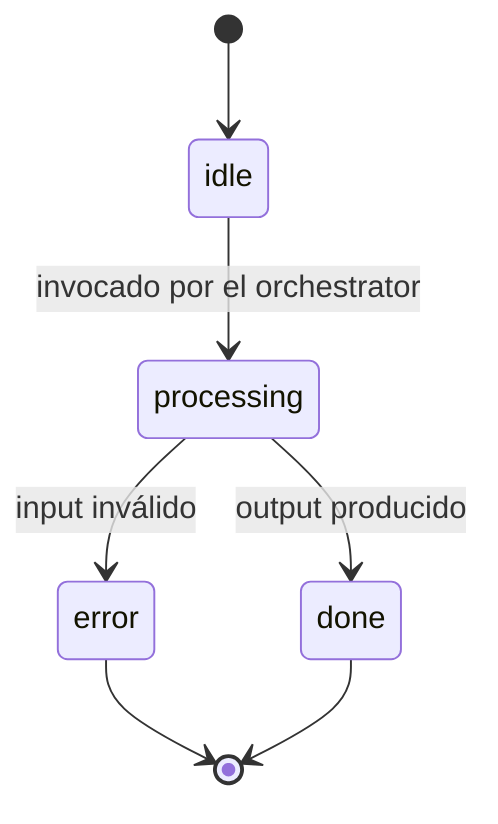

# Kata: Design de los Specialists (con Delegación a Theseus cuando aplicable)

> **Prefijo:** `kata-` | **Tipo:** Skill Repetible | **Alcance:** Ingeniería — Agents: design de sub-agentes especialistas (specialists) del agent en `operational-concrete`, produciendo `specialists/{name}.md`

## Objetivo

Producir los archivos canónicos de cada specialist del agent (máximo 5 per `kata-agent-orchestrator-design`). Cuando los specialists mapean a aggregates del dominio (DDD), **delegar a `warrior-theseus`** vía wrapper para garantizar fronteras alineadas al modelo de dominio. Cuando no hay paralelo con aggregates, el Kata produce los specialists directamente.

Cubre la parte estructural cognitiva de la **Directriz 01 — Identidad Clara** (cada specialist tiene sub-identidad alineada a la del agent) y de la **Directriz 05 — Alcance Restricto** (cada specialist tiene alcance bastante más estrecho que el del agent).

## Cuándo Usar

- Tras `kata-agent-orchestrator-design` declarar `Specialists declarados` con ≥ 2 entradas
- No se ejecuta cuando el orchestrator declara `ningún specialist` (orquestador hace todo)

## Inputs

| Input | Obligatorio | Descripción |
|-------|:-----------:|-------------|
| `context` | Sí | Bounded Context |
| `agent` | Sí | Slug del agent |
| `orchestrator_path` | Sí | `docs/{context}/agents/{agent}/orchestrator.md` |
| `specialists` | Sí | Lista de specialists declarados por el orchestrator (con nombre + aggregate objetivo opcional) |
| `--from-pov <path>` | No | Path del PoV; specialists pueden heredar fronteras experimentadas en el PoV |
| `domain_path` | No | `docs/{context}/entities/` para chequear alineación con aggregates existentes |

## Workflow

```
Progreso:
- [ ] 1. Leer orchestrator + lista de specialists
- [ ] 2. Para cada specialist: evaluar si mapea a aggregate
- [ ] 3. Cuando mapea: delegar a Theseus (kata-domain-model wrapper)
- [ ] 4. Cuando no mapea: redactar specialist directo
- [ ] 5. Validar fronteras entre specialists (sin superposición)
- [ ] 6. Validación final
```

### Paso 1: Leer orchestrator + lista de specialists

1. Carga `orchestrator.md::Specialists declarados`
2. Carga `orchestrator.md::Estados (entre specialists)` para entender el handoff esperado
3. Para cada specialist, identifica: nombre, alcance declarado por el orchestrator, aggregate objetivo (cuando declarado)

### Paso 2: Para cada specialist, evaluar mapeo con aggregate

Criterio de mapeo:

| Señal | Decisión |
|-------|----------|
| Specialist opera sobre una entidad canónica del `docs/{context}/entities/` (ej.: `Transaction`, `Account`) | Mapea a aggregate → delegar a Theseus |
| Specialist representa un sub-caso de uso transversal (ej.: "normalización de descripciones") | No mapea → produce directo |
| Specialist es una capability técnica (ej.: "OCR de PDF") | No mapea → produce directo |

En caso de duda, preferir delegación a Theseus — él puede declinar cuando no encaje.

### Paso 3: Cuando mapea, delegar a Theseus

Invocación:

```
Agent → warrior-theseus
  vía kata-domain-model
  input:
    - context: {context}
    - aggregate-root: {Aggregate}
    - source: docs/{context}/entities/{entity}.md (existente) O PoV-derived
    - usage: specialist of agent {agent}
  output esperado:
    - validación de la frontera del aggregate
    - lista de entidades + value objects + invariantes
    - lista de errors del aggregate per lex-error-handling
```

Theseus devuelve la especificación del aggregate (en `docs/{context}/entities/{entity}.md` si aún no existe). El Kata entonces transcribe el specialist `specialists/{name}.md` referenciando el aggregate.

### Paso 4: Cuando no mapea, producir directo

Template canónico para `specialists/{name}.md`:

```markdown
# Specialist — {SpecialistName}

> **Bounded Context:** {context}
> **Agent owner:** `{agent}`
> **Aggregate objetivo:** `{Aggregate}` (path) | N/A — capability técnica
> **Source of truth:** `system-prompt.md` del agent define identidad padre; este archivo refina alcance

## Por qué existe

{1-3 frases describiendo la sub-tarea cognitiva que el specialist aísla. Por qué tiene sentido aislar — alcance distinto, tools distintas, estados distintos.}

## Responsabilidades

### Hace

- {Responsabilidad 1}
- {Responsabilidad 2}

### No hace

- {Exclusión 1 — ej: no llama tools de escritura; otro specialist responsable}
- {Exclusión 2}

## Estados



## Workflow con tools

| Etapa | Lo que hace | Tools usadas | Memoria |
|-------|-------------|--------------|---------|
| 1. Validar input | Confirma `org_id`/`client_id` + schema del payload | (ninguna) | corta |
| 2. {Etapa N} | {} | {} | {} |
| 3. Producir output | Formatea payload para el orchestrator | (ninguna) | corta |

## Tools consumidas (subset)

| Tool | Por qué | Idempotencia |
|------|---------|--------------|
| `{tool-name}` | {} | sí/no |

Cross-link `tools.md` para detalle.

## Memoria consumida (subset)

- **Corta:** sesión actual
- **Media:** {cuándo consume}
- **Larga:** {cuándo consume}

Cross-link `memory.md`.

## Errores emitidos

| Code | Reason | Cuándo |
|------|--------|--------|
| `ERR400_INVALID_PARAMETER` | `INVALID_TRANSACTION_FORMAT` | input fuera del schema |
| `ERR422_VALIDATION_FAILED` | `AMBIGUOUS_MATCH` | par no se puede desambiguar |

Cross-link `lex-error-handling` + `codex-known-errors`.

## Referencias

- `orchestrator.md` — orquestador padre
- `system-prompt.md` — identidad canónica del agent
- `tools.md` — catálogo completo de tools
- `memory.md` — capas de memoria
- `docs/{context}/entities/{Aggregate}.md` (cuando hay aggregate objetivo)
```

### Paso 5: Validar fronteras entre specialists

Para cada par de specialists `(A, B)`:

1. Verificar que no hay superposición en `Hace` (responsabilidad duplicada entre A y B)
2. Verificar que los estados en `orchestrator.md::Estados (entre specialists)` cubren todos los handoffs posibles entre A y B
3. Verificar que cada error emitido por A es tratado por A o por el orchestrator, no por B (acoplamiento entre specialists vía errores es antipatrón)

Cuando hay superposición, escalar a revisión humana — puede indicar que el split fue prematuro o que falta un specialist intermedio.

### Validación Final

- [ ] Número de specialists en [2, 5]; 0 o 1 viola decisión del orchestrator; > 5 viola alcance
- [ ] Cada specialist tiene `Por qué existe` claro (no vacío)
- [ ] Specialists que mapean a aggregate referencian path en `docs/{context}/entities/`
- [ ] Fronteras entre specialists no se superponen en `Hace`
- [ ] Cada specialist declara tools (subset de `tools.md`) y memoria (subset de `memory.md`) consumidas
- [ ] Cuando hay delegación a Theseus, la invocación está registrada (PR ref o commit ref)

## Outputs

| Output | Formato | Destino |
|--------|---------|---------|
| `specialists/{name}.md` (1 por specialist) | Markdown | `docs/{context}/agents/{agent}/specialists/{name}.md` |
| Actualizaciones en `docs/{context}/entities/` | Markdown | cuando Theseus creó o ajustó aggregates |

## Ejemplo de Ejecución

Para `rec-classifier`, el orchestrator declaró 2 specialists:

1. `statement-parser` — capability técnica (no mapea a aggregate; producido directo)
2. `category-matcher` — mapea al aggregate `TransactionCategory` (delegado a Theseus, que retorna la spec del aggregate y el Kata transcribe el specialist)

Salida final:

```
docs/reconciliation/agents/rec-classifier/specialists/
├── statement-parser.md
└── category-matcher.md

docs/reconciliation/entities/
└── transaction-category.md  (actualizado por Theseus)
```

## Restricciones

- No crear specialist sin `Por qué existe`
- No permitir superposición en `Hace` entre specialists
- No crear specialist que duplica capability del orchestrator
- Theseus es la autoridad en aggregate boundaries; cuando él declina el mapeo, el specialist se produce directo

---

**Modelo:** Kata produce specialists con fronteras nítidas. Delega a Theseus cuando aplicable; produce directo cuando no hay paralelo con dominio. Siempre corre tras `kata-agent-orchestrator-design` declarar ≥ 2 specialists.
