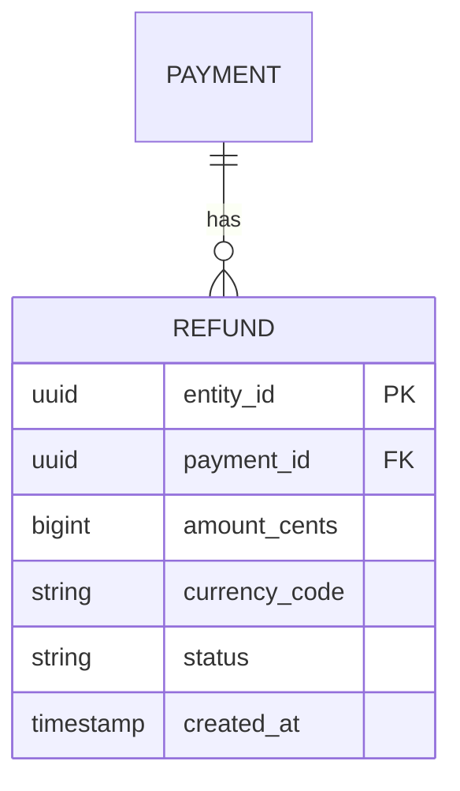
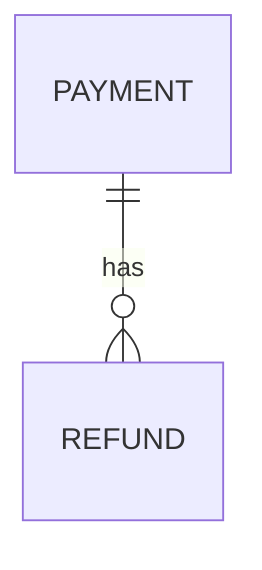

# Kata: Diseñar Schema de Datos

> **Prefijo:** `kata-` | **Tipo:** Skill Repetible | **Alcance:** Diseño de schema para nueva entidad, dominio o expansión de modelo existente — entidades, relaciones, índices, migrations, retención

## Objetivo

Dada la descripción de una entidad o dominio nuevo (ej.: módulo de refund, registro de beneficiarios), producir **propuesta de schema** completa: entidades, atributos, relaciones, índices, estrategia de migration (expand-contract cuando sea necesario), política de retención, y decisión relacional vs. NoSQL. La salida es consumida por el `warrior-apollo` (implementación) y por el `warrior-atlas` (provisión de DB).

## Cuándo Usar

- Feature nueva que persiste datos no modelados antes
- Evolución de entidad existente con cambio estructural (nueva relación, cardinalidad)
- Invocada por `warrior-demeter` o delegada por `warrior-athena` en la Fase 3

## Inputs

| Input | Obligatorio | Descripción |
|-------|:-----------:|-----------|
| Descripción del dominio | Sí | Qué entidades existen, cómo se relacionan, flujos principales |
| Requisitos de escala | Sí | Volumen esperado (rows/mes), patrón de acceso (read-heavy vs. write-heavy), latencia |
| Compliance | No | ¿PII? ¿Retención regulada? ¿Residencia de datos? |
| Stack existente | Sí | ¿Qué DB ya en uso (Aurora? DynamoDB?) para consistencia |

## Workflow

```
Progreso:
- [ ] 1. Identificar entidades, value objects, aggregates
- [ ] 2. Modelar relaciones y cardinalidades
- [ ] 3. Decidir relacional vs. NoSQL
- [ ] 4. Definir atributos y tipos
- [ ] 5. Definir índices para access patterns
- [ ] 6. Clasificar PII y política de retención
- [ ] 7. Estrategia de migration (si es evolución)
- [ ] 8. Persistir documento de schema
```

### Paso 1: Entidades, value objects, aggregates

Usando `codex-data-modeling`:

- Listar entidades con identidad propia (`Refund`, `Payment`).
- Identificar value objects inmutables (`Money`, `Address`).
- Diseñar aggregates: qué entidad es raíz; cuáles son internas del aggregate.

Regla: aggregate = boundary de transacción. Pequeño = concurrencia mayor.

### Paso 2: Relaciones

Para cada par de entidades:

- **1:1**: FK + unique constraint (considerar merge en la misma tabla si siempre juntos).
- **1:N**: FK en la entidad "many".
- **N:M**: tabla de unión con atributos propios cuando hay metadato de la relación.
- **Polimórfico**: evitar; preferir tablas separadas o interface pattern.

Diseñar diagrama ER simple en Mermaid:



### Paso 3: Relacional vs. NoSQL

Decision tree en `codex-data-modeling`:

- **Aurora PostgreSQL** es el default para Guardia (OLTP transaccional).
- **DynamoDB** para access patterns conocidos + escala masiva.
- **Mixto** es válido (OLTP relacional + read model en DynamoDB/OpenSearch).

Si la decisión no es trivial → ADR vía `kata-adr-write`.

### Paso 4: Atributos y tipos

Para cada entidad:

- Atributos base de Ahrena (`codex-entities`): `entity_id`, `entity_type`, `version`, `created_at`, `updated_at`, `created_by`, `updated_by`.
- Campos específicos con tipo explícito y constraints.
- Money: `amount_cents` (bigint) + `currency_code` (char(3)) — nunca float.
- Timestamps: siempre UTC (`timestamp with time zone` en Postgres, epoch en DynamoDB).
- Enums: validar en el código + `CHECK` constraint en DB.

Para cada columna, decidir: ¿NOT NULL? ¿DEFAULT? ¿UNIQUE?

### Paso 5: Índices

Listar queries principales (access patterns):

```
Q1: list refunds by payment_id ordered by created_at DESC
Q2: find refund by idempotency_key (unique)
Q3: count refunds in last 24h for fraud rule
```

Índices derivados:

```sql
CREATE INDEX idx_refund_payment_created ON refund (payment_id, created_at DESC);
CREATE UNIQUE INDEX idx_refund_idempotency ON refund (idempotency_key);
-- Q3 puede usar índice de Q1 (prefijo (created_at DESC)) o necesitar otro
```

Verificar con `EXPLAIN` cuando sea posible.

### Paso 6: PII y retención

Clasificar cada columna:

| Columna | Clase | Retención |
|---|---|---|
| `entity_id` | sistema | 7y (audit) |
| `customer_cpf` | PII | LGPD — soft delete 5y inactive |
| `amount_cents` | transaccional | 7y (legal) |
| `notes` (texto libre) | potencial PII | evitar libre; si es necesario, retención 90d |

Actualizar `docs/data-retention.yaml` (`lex-data-retention`).

### Paso 7: Migration (si es evolución)

Si es evolución de schema existente, aplicar expand-contract (`lex-migrations-reversible`):

1. **Expand**: ADD COLUMN nullable; código escribe en ambos.
2. **Backfill**: job en batches.
3. **Cut-over**: código usa solo nuevo.
4. **Contract**: DROP o NOT NULL aplicado.

Estimar duración por fase; si alguna excede 10min en prod, detallar estrategia (pg_repack, ventana).

### Paso 8: Persistir documento de schema

Estructura en `.issues/{n}/03b-schema.md` (complementa architecture.md):

```markdown
# Schema — Issue #{n}: {título}

## Entidades

### Refund (aggregate root)

| Columna | Tipo | Constraints | Notas |
|---|---|---|---|
| entity_id | UUID | PK | v4 |
| payment_id | UUID | FK → payment.entity_id, NOT NULL | |
| amount_cents | BIGINT | NOT NULL, CHECK > 0 | |
| idempotency_key | TEXT | UNIQUE | |
| ... | ... | ... | ... |

## Relaciones



## Índices

| Nombre | Columnas | Motivo |
|---|---|---|
| idx_refund_payment_created | (payment_id, created_at DESC) | Q1 (lista por payment) |
| ... | ... | ... |

## PII y retención

| Columna | Clase | Retención |
|---|---|---|

## Migration

(si aplica, expand-contract)

## Decisión: DB

Aurora PostgreSQL (OLTP) + Redis caché para idempotency lookups.

ADR referenciado: docs/adr/ADR-XXX-aurora-for-refund.md
```

## Salidas

| Salida | Formato | Destino |
|-------|---------|---------|
| Documento de schema | Markdown | `.issues/{n}/03b-schema.md` |
| Diagrama ER | Mermaid embebido | En el documento |
| Actualización de retención | YAML | `docs/data-retention.yaml` |
| ADR (si es necesario) | Markdown MADR | `docs/adr/ADR-*` |

## Restricciones

- **Sin over-design**: si la entidad es simple, no forzar aggregate pattern.
- **Atributos base obligatorios**: siempre `entity_id`, `created_at`, `updated_at`.
- **Índices justificados**: cada índice tiene access pattern documentado; no especular.
- **Retención declarada**: cada tabla nueva actualiza `docs/data-retention.yaml`.

## Referencias

- `codex-data-modeling`
- `lex-migrations-reversible`, `lex-data-retention`
- `codex-entities` — campos base Ahrena
- `warrior-demeter`
