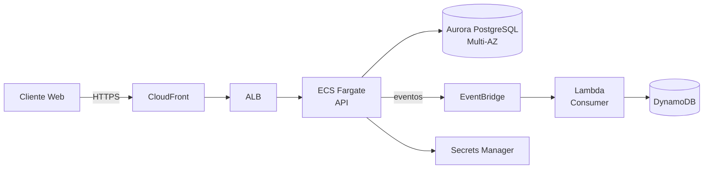

# Kata: Diseñar Arquitectura AWS

> **Prefijo:** `kata-` | **Tipo:** Skill Repetible | **Alcance:** Diseño de arquitectura AWS para una nueva feature, sistema o workload — elección de servicios, diagrama, IaC, estimación de costo y análisis de riesgo

## Objetivo

A partir de requisitos funcionales y no funcionales (tráfico esperado, SLAs, compliance, presupuesto), diseñar una arquitectura AWS completa: elección de servicios justificada por los 6 pilares del Well-Architected, diagrama, lista de recursos, estimación de costo mensual, análisis de riesgos, e IaC inicial (scaffolding) en Terraform o CDK.

## Cuándo Usar

- Nueva feature/sistema que exige infraestructura AWS
- Rediseño de workload existente (migración de arquitectura, escalar, reducir costo)
- Cuando `warrior-athena` delega a Atlas en la Fase 3 del flujo Issue-Driven para definir arquitectura cloud

## Inputs

| Input | Obligatorio | Descripción |
|-------|:-----------:|-----------|
| Descripción funcional | Sí | Lo que el sistema hace, flujos principales |
| Requisitos no funcionales | Sí | Tráfico (req/s, tamaño payload), SLA, RTO/RPO, compliance, presupuesto estimado |
| Stack existente | Sí | Cuentas AWS, VPCs, servicios ya en uso, IaC tool del proyecto |
| Restricciones | No | Región obligatoria, servicios prohibidos, integraciones externas |

## Workflow

```
Progreso:
- [ ] 1. Clarificar requisitos y restricciones
- [ ] 2. Mapear datos, flujos e interacciones
- [ ] 3. Elegir servicios por pilar Well-Architected
- [ ] 4. Diseñar diagrama de arquitectura
- [ ] 5. Analizar riesgos y alternativas
- [ ] 6. Estimar costo mensual
- [ ] 7. Generar scaffolding IaC
- [ ] 8. Producir documento de arquitectura
```

### Paso 1: Clarificar requisitos y restricciones

Consultar `.ahrena/.directives` y hacer preguntas en lote:

1. **Tráfico esperado:** pico y media (requests/s, GB/mes); patrón (constante, spiky, diurnal)?
2. **Latencia exigida:** p50, p95, p99?
3. **Disponibilidad (SLA):** 99% (~3.65 días/año), 99.9% (~8.76h), 99.99% (~52min)?
4. **RTO/RPO:** tiempo aceptable de recuperación y pérdida máxima de datos?
5. **Datos sensibles:** PII, PCI, datos de salud? Compliance aplicable?
6. **Multi-region?** ¿Por qué (latencia global vs DR)?
7. **Presupuesto mensual:** ¿límite aproximado?
8. **Integraciones externas:** APIs terceras, banco legacy, SAP, etc.?
9. **Deadline:** ¿urgencia impacta la decisión (ej.: migrar on-prem en 3 meses vs 12)?

Sin respuestas claras, el diseño queda como suposición — escalar al usuario.

### Paso 2: Mapear datos, flujos e interacciones

1. **Componentes lógicos:** ¿qué módulos/servicios componen el sistema? (ej.: API de refund, motor de eventos, dashboard admin)
2. **Datos manipulados:** ¿qué entidades, dónde persisten, qué volumen, qué patrón de acceso (read-heavy, write-heavy, OLTP vs OLAP)?
3. **Flujos críticos:** trazar el camino de datos en el caso feliz (ej.: cliente → ALB → API → DB → evento → consumer)
4. **Interacciones externas:** integración con Guardia core, providers de pago, email, SMS, etc.
5. **Patrones de tráfico:** síncrono (request/response) vs asíncrono (cola/evento)?

### Paso 3: Elegir servicios por pilar Well-Architected

Consultar `codex-aws-services` y `codex-aws-well-architected`. Para cada componente, responder:

| Pilar | Cuestión guiada |
|---|---|
| **Security** | ¿IAM necesario? ¿Cifrado? ¿Datos sensibles? ¿Auth público/privado? |
| **Reliability** | ¿Multi-AZ? ¿Multi-region? ¿Backup? ¿Failover? |
| **Performance** | ¿Latencia? ¿Escala esperada? ¿Serverless o provisioned? |
| **Cost** | ¿Predictibilidad del workload? ¿Savings Plans tienen sentido? |
| **Operational** | ¿El equipo operará vía CI/CD? ¿Necesita mucho logging? |
| **Sustainability** | ¿Graviton compatible? ¿Región con bajo carbono? |

Registrar la elección de cada servicio **y por qué** (y alternativas consideradas, para eventual ADR).

### Paso 4: Diseñar diagrama de arquitectura

Producir diagrama en Mermaid o draw.io mostrando:

- Componentes (cajas con íconos AWS)
- VPCs y subnets (privada vs pública)
- Flujos de datos (flechas con protocolo: HTTPS, SQL, gRPC)
- Integración externa (nubes o cajas fuera del VPC)
- Multi-AZ/Multi-region si aplica

Ejemplo Mermaid:



### Paso 5: Analizar riesgos y alternativas

Para decisiones clave, registrar:

| Decisión | Elegida | Alternativa | Trade-off |
|---|---|---|---|
| Compute API | ECS Fargate | Lambda | Fargate elegido por tráfico sustained; Lambda consideraría cold start |
| DB primario | Aurora PostgreSQL | DynamoDB | Aurora por queries relacionales; DynamoDB para patrones key-value |
| Streaming | EventBridge | SNS+SQS | EventBridge por schema registry y filtrado avanzado |

Identificar **riesgos técnicos**:

- Single points of failure
- Cuellos de botella de performance previstos
- Dependencias críticas externas
- Límites de servicio AWS que pueden ser alcanzados

Cada decisión estructural que afecta múltiples componentes o contratos **DEBE generar ADR** — invocar `kata-adr-write` (cuando está en el flujo Issue-Driven).

### Paso 6: Estimar costo mensual

1. **AWS Pricing Calculator** para estimación detallada.
2. **Infracost** para integración con Terraform.
3. Descomponer por pilar:
   - Compute (ECS, Lambda, EC2)
   - Storage (S3, EBS, RDS storage)
   - Database (RDS compute, DynamoDB RCU/WCU, ElastiCache)
   - Network (NAT Gateway, data transfer, ALB hours)
   - Other (KMS, Secrets Manager, CloudWatch logs)
4. Considerar **picos de tráfico** y **escenarios de falla** (failover multi-AZ duplica costo momentáneamente).
5. Comparar con budget informado — si excede >20%, revisitar las elecciones.

### Paso 7: Generar scaffolding IaC

Crear **esqueleto inicial** en Terraform o CDK (según herramienta del proyecto):

- Módulo para cada componente principal (VPC, ECS, Aurora, etc.)
- Tags estandarizados (ver `lex-aws-cost`)
- Placeholders para valores de negocio (capacidades, retenciones, tamaños)
- Referencias a secrets vía Secrets Manager (valores poblados fuera del IaC, ver `lex-aws-security`)

El scaffolding **no necesita estar production-ready** — es punto de partida para el equipo de DevOps iterar.

### Paso 8: Producir documento de arquitectura

Estructura (cuando está en el flujo Issue-Driven, este documento **es parte** de `.ahrena/issues/{n}/03-architecture.md` o referenciado desde él):

```markdown
# Arquitectura AWS — {nombre del sistema}

## Contexto y Requisitos
- Descripción funcional
- Requisitos no funcionales (tráfico, SLA, RTO/RPO, compliance)
- Restricciones

## Visión General (Diagrama)
```mermaid
...
```

## Componentes

### {Nombre del Componente}
- **Servicio AWS:** ECS Fargate
- **Por qué:** workload sustained, containers Python, sin ops de K8s necesaria
- **Configuración:** 2 tasks por defecto, ALB, target tracking 70% CPU
- **Alternativas descartadas:** Lambda (rejected: cold start en endpoint síncrono crítico)

### {...}

## Elección de Región
- **Primaria:** sa-east-1 (compliance LGPD + latencia BR)
- **Fallback:** us-east-1 (failover para workload tier-1)

## Seguridad
- IAM roles específicos por componente
- KMS para storage encryption
- Secrets Manager para credenciales
- WAF en CloudFront
- VPC privada + VPC Endpoints

## Reliability
- Multi-AZ para Aurora y ECS
- RTO: 1h / RPO: 5min
- Backup vía AWS Backup con retención de 90 días
- Chaos testing trimestral

## Performance
- Target latency p99: 300ms
- Auto-scaling por CPU + ALB target tracking
- CloudFront para assets estáticos

## Cost Optimization
- Savings Plan 1-year para ECS (cubrir baseline)
- Spot para batch jobs no críticos
- S3 Intelligent-Tiering para bucket de logs
- Budget mensual: US$ {X}

## ADRs Generados
- [ADR-{n}: {decisión}](docs/adr/...)

## Estimación de Costo
| Componente | Mensual (USD) |
|---|---|
| ECS Fargate + ALB | 650 |
| Aurora (r6g.large Multi-AZ) | 540 |
| S3 + Data Transfer | 120 |
| NAT Gateway (2 AZ) | 65 |
| CloudWatch | 45 |
| Other | 80 |
| **Total** | **~1.500** |

## Riesgos y Mitigaciones
- **Riesgo:** pico estacional (Black Friday) excede capacidad
  - **Mitigación:** pre-scaling vía schedule + aumento de max capacity en el auto-scaling
- **Riesgo:** failover de región = RTO fuera del SLA
  - **Mitigación:** runbook pre-testeado; replication lag monitoreado

## IaC Scaffolding
- Localización: `infra/modules/{sistema}/`
- Herramienta: Terraform
- Próximos pasos: DevOps revisa, parametriza, aplica en staging
```

## Salidas

| Salida | Formato | Destino |
|-------|---------|---------|
| Documento de arquitectura | Markdown | `.ahrena/issues/{n}/03-architecture.md` (o archivo dedicado) |
| Diagrama | Mermaid embebido o SVG/PNG | En el documento de arquitectura |
| ADRs | Markdown MADR | `docs/adr/ADR-*` (vía `kata-adr-write`) |
| IaC scaffolding | Archivos `.tf` o `.ts` (CDK) | `infra/modules/{sistema}/` o carpeta equivalente |
| Estimación de costo | Tabla en el documento + planilla del Pricing Calculator | Documento + link |

## Restricciones

- **Sin saltar pilares:** las 6 dimensiones del Well-Architected necesitan ser consideradas aunque sea brevemente.
- **Justificar elecciones:** cada servicio elegido tiene "por qué" + alternativa considerada.
- **Aplicar Lexis:** `lex-aws-security`, `lex-aws-iac`, `lex-aws-cost` son mandatorios desde el diseño.
- **Estimación de costo obligatoria:** arquitectura sin costo es incompleta.
- **ADR para decisiones estructurales:** no dejar decisiones críticas solo en el documento — merecen ADR.

## Referencias

- `lex-aws-security`, `lex-aws-iac`, `lex-aws-cost`
- `codex-aws-well-architected` — 6 pilares
- `codex-aws-services` — catálogo de servicios
- `kata-adr-write` — para decisiones arquitecturales relevantes
- `codex-issue-workflow` — integración en el flujo Issue-Driven
