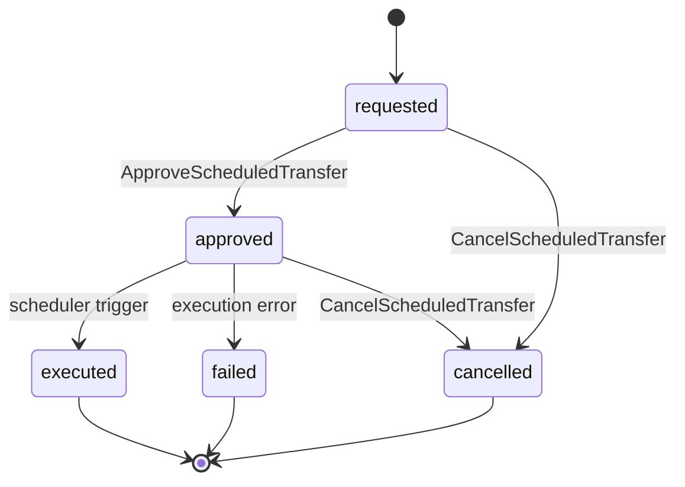

# Codex: Documentos de Diseño de Feature — Estructura y Templates

> **Prefijo:** `codex-` | **Tipo:** Manual de Referencia | **Alcance:** Plataforma Guardia — templates y convenciones para los documentos producidos en el ciclo de diseño de feature

## Visión General

Este Codex es el manual canónico de los documentos de diseño de feature de la plataforma Guardia. Define la estructura de carpetas dentro de `docs/`, el template de cada categoría y las convenciones que `warrior-prometheus`, `warrior-theseus`, `warrior-daedalus`, `warrior-kronos` y cualquier agente que produzca esos documentos DEBE seguir. La Ley correspondiente está en `lex-feature-design-docs`.

## Contexto

- **Dominio:** organización de artefactos de diseño de feature en la plataforma Guardia
- **Público objetivo:** warriors de diseño, autores humanos, revisores de PR
- **Actualización:** ante cada cambio en la estructura o templates (ADR obligatorio cuando cambia categoría reservada)

## Estructura Canónica

```
docs/
└── {context}/                  # Bounded Context en kebab-case
    ├── entities/
    │   └── {entity-name}.md
    ├── oas/
    │   └── openapi.yaml
    ├── events/
    │   └── events.md
    ├── agents/                 # reservado
    └── metrics/                # reservado
```

### Convenciones

| Ítem | Regla |
|------|-------|
| `{context}` | Bounded Context en kebab-case. Ej.: `ScheduledPayments` → `scheduled-payments` |
| Archivos de `entities/` | kebab-case del PascalCase. Ej.: `ScheduledTransfer` → `scheduled-transfer.md` |
| Archivo de `oas/` | `openapi.yaml`; cuando hay múltiples APIs: `openapi-{slug}.yaml` |
| Archivo de `events/` | `events.md` |
| Idioma | conforme a `language.default` en `.ahrena/.directives` |

## Templates

### 1. `entities/{entity-name}.md`

Cada entidad del Bounded Context tiene **un archivo dedicado** en `docs/{context}/entities/`. El template es:

````markdown
# Entity: {NombreDeLaEntidad}

> **Clasificación DDD:** Entity | Aggregate Root | Value Object
> **Bounded Context:** {context}
> **entity_type:** `{UPPER_SNAKE_CASE}`

## Por qué existe

{Describir en 2 a 4 frases el motivo por el que la entidad existe en el dominio. Enfocarse en el problema de negocio que resuelve, no en el esquema técnico. Ejemplo: "Representa una transferencia bancaria ordenada por un contador para ejecución en fecha futura. Existe para separar la intención (programación) de la ejecución (procesamiento) y permitir el ciclo de aprobación obligatorio por supervisor."}

## Campos

| Campo | Tipo | Tamaño | Obligatorio | Descripción |
|-------|------|--------|:-----------:|-------------|
| `entity_id` | UUID v7 | 36 | Sí | Identificador único de la entidad (lex-entities) |
| `entity_type` | string | — | Sí | Valor fijo: `{UPPER_SNAKE_CASE}` |
| `version` | integer | — | Sí | Versión optimista de la entidad |
| `created_at` | datetime (ISO 8601) | — | Sí | Creación |
| `updated_at` | datetime (ISO 8601) | — | Sí | Última actualización |
| `discarded_at` | datetime (ISO 8601) | — | No | Soft delete (lex-entities) |
| `{campo_negocio}` | {tipo} | {tamaño} | Sí/No | {Descripción funcional} |

> **Tipo:** use los tipos canónicos: `string`, `integer`, `decimal`, `boolean`, `datetime`, `date`, `enum<...>`, `UUID v7`, `Money`, `array<...>`, `object<...>`, o referencia a otra Entity/VO.
> **Tamaño:** longitud máxima (string), precisión (decimal), o `—` cuando no aplica.
> **Obligatorio:** Sí cuando el campo es requerido para crear la entidad; No cuando es opcional.

## Reglas de Negocio

Liste numéricamente las reglas de negocio que gobiernan la entidad en lenguaje de dominio (no en SQL/código).

1. **{RN-1 — Nombre corto}:** {regla completa en una frase. Ej.: "Una transferencia solo puede programarse para días hábiles dentro de los 90 días futuros."}
2. **{RN-2}:** {...}
3. **{RN-3}:** {...}

## Invariantes

Las invariantes son condiciones que **siempre son verdaderas** sobre la entidad o el agregado. Difieren de las reglas de negocio porque no admiten excepción en ningún estado.

- **{INV-1}:** {ej.: "`amount` es siempre estrictamente positivo."}
- **{INV-2}:** {ej.: "`status` solo transita por los estados definidos en el diagrama."}
- **{INV-3}:** {ej.: "Una transferencia `executed` nunca puede volver a `requested`."}

## Relaciones

| Relación | Cardinalidad | Tipo | Entidad Objetivo | Observación |
|----------|--------------|------|------------------|-------------|
| owns | 1..N | composición | `{OtraEntidad}` | {ej.: "ScheduledTransfer owns 1..N TransferApproval"} |
| references | N..1 | referencia | `{OtraEntidad}` | {ej.: "Referencia Account por entity_id; no compone."} |

> Use `composición` cuando la entidad objetivo solo existe vía la raíz; `referencia` cuando el objetivo tiene ciclo independiente.

## Errores

Errores emitidos por casos de uso que tocan esta entidad. Cada error DEBE seguir `lex-error-handling` (code, reason, message).

| Code | Reason | Mensaje | Cuándo ocurre |
|------|--------|---------|---------------|
| `ERR400_INVALID_PARAMETER` | `INVALID_SCHEDULED_DATE` | "scheduled_date must be a future business day" | {RN-1 violada} |
| `ERR409_CONFLICT` | `INVALID_STATE_TRANSITION` | "transfer cannot move from {from} to {to}" | Intento de transición inválida |

## Referencias

- `lex-entities` — estructura base obligatoria
- `lex-entity-naming` — UPPER_SNAKE_CASE para entity_type; snake_case para campos; PascalCase en los documentos DDD
- `lex-error-handling` — formato de errores
- `docs/{context}/events/events.md` — eventos emitidos por esta entidad
- `docs/{context}/oas/openapi.yaml` — endpoints REST que exponen esta entidad
````

### 2. `oas/openapi.yaml`

La especificación OpenAPI 3.x del Bounded Context sigue `codex-oas-structure` íntegramente. El archivo `oas/openapi.yaml` es canónico. Esqueleto mínimo:

```yaml
openapi: 3.0.3
info:
  title: {Bounded Context} API
  version: 0.1.0
  description: |
    API REST do bounded context {context}. Esta especificação é a fonte de verdade
    para os endpoints expostos pelas entidades em docs/{context}/entities/.
  contact:
    name: Guardia Platform
servers:
  - url: https://api.guardia.com
    description: Production
  - url: https://api.staging.guardia.com
    description: Staging

tags:
  - name: {EntityName}
    description: Operações sobre {EntityName}

paths:
  /v1/{resource}:
    get:
      summary: Lista {resource}
      operationId: list{Resource}
      tags: [{EntityName}]
      parameters:
        - $ref: '#/components/parameters/PageSize'
        - $ref: '#/components/parameters/PageToken'
      responses:
        '200':
          description: OK
          content:
            application/json:
              schema:
                $ref: '#/components/schemas/{Resource}List'

components:
  parameters:
    PageSize: { ... }
    PageToken: { ... }
  schemas:
    {Resource}: { ... }
    {Resource}List: { ... }
  securitySchemes:
    bearerAuth:
      type: http
      scheme: bearer
      bearerFormat: JWT
```

> Directrices complementarias: orden de operaciones por recurso (`POST → GET list → GET item → PATCH → DELETE`), uso de `$ref` para schemas reutilizables, parámetros canónicos de paginación (`page_size`, `page_token`) conforme a `codex-restful-pagination`, y cabeceras obligatorias (`Idempotency-Key`, `X-Grd-Trace-Id`) conforme a `codex-restful-headers`.

### 3. `events/events.md`

Documenta **todos los eventos del Bounded Context**, organizados por entidad. Para cada entidad, un diagrama de estado en Mermaid y, para cada evento, el payload en formato CloudEvents.

````markdown
# Eventos — {Bounded Context}

> **Bounded Context:** {context}
> **Módulo CloudEvents:** `{module}` (segmento `{module}` en `event.guardia.{module}.{entity_name}.{event_name}`, donde `{entity_name}` es la forma en minúscula de `entity_type` según `lex-entity-naming` Regla 5)

## Visión General

Resumen en 2-4 frases de los eventos publicados por este contexto y sus principales consumidores.

## Catálogo

| entity_type | event_name | type completo | Publicador | Consumidores |
|-------------|------------|---------------|------------|--------------|
| `SCHEDULED_TRANSFER` | `requested` | `event.guardia.financial.scheduled_transfer.requested` | ScheduledPayments | Approval, Audit |
| `SCHEDULED_TRANSFER` | `approved` | `event.guardia.financial.scheduled_transfer.approved` | Approval | ScheduledPayments, Audit |
| `SCHEDULED_TRANSFER` | `executed` | `event.guardia.financial.scheduled_transfer.executed` | BankingIntegration | ScheduledPayments, Ledger |

---

## {NombreDeLaEntidadEnPascalCase}

> `entity_type`: `{UPPER_SNAKE_CASE}`

### Ciclo de Vida



### Eventos

#### `event.guardia.{module}.{entity_name}.requested`

> Emitido cuando el usuario crea la entidad.

```json
{
  "specversion": "1.0",
  "id": "01957f3e-a1b2-7c8d-9e0f-1a2b3c4d5e6f",
  "source": "https://api.guardia.technology/financial/v1/scheduled-transfers/txn:019b9f12-3a4b-7c8d-9e0f-1a2b3c4d5e6f",
  "type": "event.guardia.financial.scheduled_transfer.requested",
  "subject": "scheduled_transfer/{entity_id}",
  "time": "2026-04-26T10:00:00Z",
  "datacontenttype": "application/json",
  "idempotencykey": "01957f3e-a1b2-7c8d-9e0f-1a2b3c4d5e6f",
  "data": {
    "entity_id": "txn:01957f3e-a1b2-7c8d-9e0f-1a2b3c4d5e6f",
    "entity_type": "SCHEDULED_TRANSFER",
    "version": 1,
    "created_at": "2026-04-26T10:00:00Z",
    "updated_at": "2026-04-26T10:00:00Z",
    "scheduled_date": "2026-04-30",
    "amount": 100000,
    "currency": "BRL",
    "source_account_id": "...",
    "target_account_id": "..."
  }
}
```

| Campo de `data` | Tipo | Obligatorio | Descripción |
|-----------------|------|:-----------:|-------------|
| `entity_id` | UUID v7 | Sí | Identificador de la entidad |
| `entity_type` | string | Sí | Siempre `{UPPER_SNAKE_CASE}` |
| `scheduled_date` | date | Sí | Fecha programada para ejecución |
| `amount` | integer (centavos) | Sí | Valor en menor unidad de la moneda |
| `currency` | string (ISO 4217) | Sí | Código de la moneda |

**Idempotencia:** `idempotencykey` igual al `entity_id` de la solicitud original.
**Trigger:** Use Case `RequestScheduledTransfer`.

---

#### `event.guardia.{module}.{entity_name}.approved`

> Emitido cuando el supervisor aprueba.

```json
{ ... payload completo ... }
```

| Campo | Tipo | Obligatorio | Descripción |
|-------|------|:-----------:|-------------|

**Trigger:** Use Case `ApproveScheduledTransfer`.

---

(repita para cada evento de la entidad)

---

## {OtraEntidad}

(se repite la estructura: ciclo de vida → eventos con payload)

## Referencias

- `lex-cloudevents`, `codex-cloudevents` — formato CloudEvents
- `lex-entity-naming` — snake_case en los segmentos del tipo CloudEvents
- `lex-idempotency` — `idempotencykey` obligatorio
- `docs/{context}/entities/` — entidades que emiten estos eventos
````

### 4. `agents/` — reservado

Reservado para documentar agentes (Isac, automatizaciones, integraciones) que actúan en este contexto. Estructura definida en ronda futura.

### 5. `metrics/` — reservado

Reservado para SLI/SLO, dashboards y métricas de producto y operación del contexto. Estructura definida en ronda futura, alineada con `lex-slo-required` y `lex-observability-required`.

## Relaciones Cruzadas

Los tres tipos de documento se referencian:

| De → A | Referencia |
|--------|------------|
| `entities/{e}.md` → `events/events.md` | Lista los eventos emitidos por la entidad en la sección *Referencias* |
| `entities/{e}.md` → `oas/openapi.yaml` | Lista los endpoints REST que exponen la entidad |
| `events/events.md` → `entities/` | Cada sección de la entidad en events.md referencia el archivo de la entidad |
| `oas/openapi.yaml` → `entities/` | Los schemas reflejan el catálogo de campos de las entidades |

La consistencia cruzada se verifica por el `warrior-prometheus` al final del ciclo (Fase 4 — Verificación de Consistencia).

## Restricciones

- **No invertir la jerarquía:** siempre `docs/{context}/{categoria}/`. Categoría como nivel superior (`docs/entities/{context}/...`) está PROHIBIDO.
- **No duplicar campo de entidad en el payload de evento:** el payload referencia el catálogo de la entidad; solo los campos relevantes al evento se reproducen.
- **No crear archivo único de "dominio":** el modelo de dominio se distribuye entre `entities/` (tablas y reglas), `events/` (ciclo de vida) y `oas/` (contrato expuesto). El documento monolítico `domain-model.md` está descontinuado.
- **No usar paths configurables:** `paths.domain`, `paths.oas`, `paths.events` fueron eliminados de `.ahrena/.directives`. La estructura es fija y codificada en esta Lexis/Codex.

## Referencias

- `lex-feature-design-docs` — Ley correspondiente
- `kata-feature-design-docs` — procedimiento operacional
- `lex-entities`, `codex-entities` — estructura base de entidades
- `lex-entity-naming` — convenciones de nomenclatura
- `lex-cloudevents`, `codex-cloudevents` — eventos
- `codex-oas-structure` — estructura del OpenAPI
- `codex-restful-payload`, `codex-restful-headers`, `codex-restful-pagination` — convenciones REST
- `warrior-prometheus`, `warrior-theseus`, `warrior-daedalus`, `warrior-kronos` — agentes que producen estos documentos
