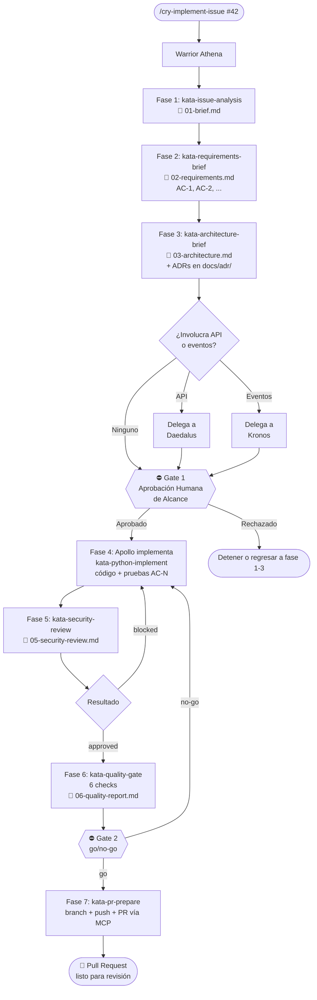

# Engineering / Workflow — Issue-Driven Development

Este clade contiene todos los artefactos que componen el flujo **Issue-Driven Development** de Ahrena — un proceso estructurado para convertir issues de GitHub en Pull Requests de alta calidad, con trazabilidad completa, gates de aprobación y generación automática de Architecture Decision Records.

## 1. Introducción

El flujo **Issue-Driven Development** responde a un problema común: ¿cómo garantizar que las features y bugfixes implementados por agentes IA (o por equipos híbridos humano+IA) sean trazables, auditables y de calidad consistente? La respuesta es un proceso con fases obligatorias, gates humanos en puntos críticos, validación automatizada antes del PR y documentación estructurada en `docs/`.

**Usa este flujo cuando:**
- Implementes una feature nueva
- Corrijas un bug que involucra más que un cambio trivial
- Cambies comportamiento existente en un componente de producción
- Agregues endpoints, eventos o integraciones externas

**No uses este flujo para:**
- Hotfixes urgentes en producción (donde el gate humano demoraría demasiado)
- Refactors puramente locales sin cambio de comportamiento
- Experimentación/spike (donde el overhead del flujo pesa más que el valor)
- Tareas que no parten de una issue existente

El orquestador es el **Warrior Athena**, invocado por el **Cry `/cry-implement-issue`**.

## 2. Visión General



## 3. Requisitos Previos

### MCPs Activos

En `.ahrena/.directives`:

```yaml
mcp:
  servers:
    - github    # obligatorio
    - notion    # opcional (enriquece la Fase 1)
```

### Variables de Entorno

- `GITHUB_PAT` — **obligatoria** (para GitHub MCP)
- `NOTION_API_KEY` — opcional (para contexto Notion en la Fase 1)

### Configuración

En `.ahrena/.directives` (sección opcional `quality`):

```yaml
quality:
  coverage_threshold: 80      # por defecto si se omite

knowledge:
  notion:
    root_page: "page-id-o-url"   # opcional: priorización de búsqueda en Notion
```

### Issue existente

El flujo parte de una issue ya creada en GitHub — el orquestador **no crea issues**. Si la issue no existe, Athena detiene.

## 4. Las 7 Fases

### Fase 1 — Análisis de la Issue

**Kata:** [`kata-issue-analysis`](katas/kata-issue-analysis.md)
**Output:** `docs/issues/issue-{n}/01-brief.md`

Athena lee la issue (título, body, labels, comentarios) vía GitHub MCP y, si Notion está activo, busca páginas relacionadas (specs de producto, ADRs anteriores). Consolida todo en un brief estructurado que incluye: problema, contexto adicional, tipo de trabajo, riesgos e incógnitas.

**Ejemplo de fragmento del brief:**

```markdown
## Problema

El módulo de pagos no soporta reembolso. Los clientes que necesitan
cancelar una compra deben contactar al soporte, que ejecuta el refund
manualmente vía panel admin. Esto genera latencia y riesgo de error.

## Contexto adicional

### De Notion
- **[Refund Spec v2](https://notion.so/...):** define ventana de 30 días
  y reglas de refund total vs. parcial por tipo de pago.
```

### Fase 2 — Elicitación de Requisitos (perspectiva PO)

**Kata:** [`kata-requirements-brief`](katas/kata-requirements-brief.md)
**Output:** `docs/issues/issue-{n}/02-requirements.md`

Athena transforma el brief en una lista numerada de **Criterios de Aceptación** (ACs) en formato Given/When/Then. Hace preguntas de aclaración al usuario cuando hay incógnitas. Define Definition of Done y lista explícitamente el **out of scope**.

**Ejemplo:**

```markdown
### AC-1: Crear refund total vía POST /v1/refunds

- **Dado** que existe un pago P con status "captured" hace menos de 30 días
- **Cuando** se llama POST /v1/refunds con payment_id = P.id
- **Entonces** el sistema crea un refund con status "processing" y retorna 201
```

### Fase 3 — Brief Arquitectónico

**Kata:** [`kata-architecture-brief`](katas/kata-architecture-brief.md)
**Output:** `docs/issues/issue-{n}/03-architecture.md` + ADRs en `docs/adr/`

Athena mapea los componentes afectados (archivos nuevos/modificados, contratos externos) en una tabla que define el **alcance exacto** del PR. Propone enfoque técnico. Delega a **Daedalus** si involucra API REST y/o **Kronos** si involucra eventos. Invoca **`kata-adr-write`** para cada decisión arquitectónica relevante.

### Gate 1 — Aprobación de Alcance (human-in-the-loop)

Athena presenta al humano:
- Brief
- Lista de ACs
- Tabla de componentes
- ADRs propuestos (en status `proposed`)

El humano aprueba, rechaza o pide ajustes. **Sin aprobación, Athena no codifica.**

### Fase 4 — Implementación

Athena delega a **Apollo** (o warrior del stack equivalente) vía `kata-python-implement`. La implementación debe:
- Cubrir todos los ACs
- Marcar cada prueba con `AC-N` correspondiente (convención de trazabilidad — ver §6)
- Quedar restringida a los componentes declarados en la Fase 3

### Fase 5 — Revisión de Seguridad

**Kata:** [`kata-security-review`](katas/kata-security-review.md)
**Output:** `docs/issues/issue-{n}/05-security-review.md`

Athena invoca revisión contra OWASP Top 10, autenticación/autorización, datos sensibles y CVE scan en dependencias. Los hallazgos críticos regresan a la Fase 4.

### Fase 6 — Gate 2 de Calidad

**Kata:** [`kata-quality-gate`](katas/kata-quality-gate.md)
**Output:** `docs/issues/issue-{n}/06-quality-report.md`

**Este es el corazón de la validación.** Ejecuta 6 checks (detallados en §5). El resultado es `go` o `no-go`.

### Fase 7 — Preparación del PR

**Kata:** [`kata-pr-prepare`](katas/kata-pr-prepare.md)

Athena crea branch, hace push y abre PR vía GitHub MCP. El body del PR está estructurado con referencias a todos los artefactos en `docs/`. Los ADRs transicionan de `proposed` a `accepted`.

## 5. Los 2 Gates

### Gate 1 — Aprobación de Alcance

**Cuándo:** entre la Fase 3 y la Fase 4.
**Quién:** humano.
**Qué se presenta:** brief, ACs, arquitectura, ADRs propuestos.
**Qué se valida:** si el entendimiento de la issue, los criterios de aceptación y la arquitectura propuesta son correctos y suficientes.
**En caso de falla:** Athena regresa a la fase indicada por el humano o detiene el flujo.

### Gate 2 — Calidad de la Implementación

**Cuándo:** entre la Fase 6 y la Fase 7.
**Quién:** `kata-quality-gate` (automatizado).
**Qué se valida:** 6 checks obligatorios:

| # | Check | Qué verifica |
|:-:|---|---|
| 1 | **Trazabilidad AC ↔ Prueba** | Cada AC tiene al menos una prueba; cada prueba nueva referencia un AC |
| 2 | **Scope creep** | Ningún archivo modificado fuera de la tabla de componentes de la Fase 3 |
| 3 | **Best practices** | Adherencia a las Lexis aplicables (typing, testing, security, immutability, error-handling, conventional-commits) |
| 4 | **Pruebas pasan** | `pytest` ejecuta sin fallos |
| 5 | **Cobertura** | `pytest --cov` ≥ threshold (por defecto 80%) |
| 6 | **Tipos** | `mypy --strict` sin errores nuevos |

**En caso de falla:** se genera informe detallado, el flujo regresa a la Fase 4. **No hay override manual** — no se puede marcar como `go` si un check falló.

## 6. Matriz de Trazabilidad AC ↔ Prueba

Cada prueba nueva en la Fase 4 **debe** referenciar el/los AC(s) que cubre. Tres formas aceptadas:

**Forma 1 — nombre de la prueba:**
```python
def test_create_refund_returns_201_AC_1():
    response = client.post("/v1/refunds", json={"payment_id": "p123"})
    assert response.status_code == 201
```

**Forma 2 — docstring:**
```python
def test_refund_idempotency():
    """AC-2: llamadas repetidas con el mismo Idempotency-Key retornan el mismo resultado."""
    ...
```

**Forma 3 — marker pytest:**
```python
@pytest.mark.ac("AC-3")
def test_refund_after_window_returns_422():
    ...
```

En el informe del Gate 2, el resultado aparece como tabla:

| AC | Descripción | Pruebas que cubren | Status |
|---|---|---|:-:|
| AC-1 | Crear refund total | `test_create_refund_returns_201_AC_1` | ✅ |
| AC-2 | Idempotencia | `test_refund_idempotency` | ✅ |
| AC-3 | Ventana de 30 días | `test_refund_after_window_returns_422` | ✅ |

**Prueba sin AC → scope creep detectado → Gate 2 falla.**

## 7. Cuándo Generar ADR

Durante la Fase 3, Athena evalúa cada decisión de diseño. Usa el checklist:

| Situación | ¿Generar ADR? |
|---|:-:|
| Nueva elección tecnológica (framework, librería, patrón) | ✅ Sí |
| Desviación de patrón existente en el codebase | ✅ Sí |
| Trade-off significativo entre alternativas | ✅ Sí |
| Decisión que afecta a múltiples componentes | ✅ Sí |
| Decisión que afecta contrato externo (API, evento) | ✅ Sí |
| Bug puntual sin cambio de patrón | ❌ No |
| Refactor localizado siguiendo patrón existente | ❌ No |
| Agregar endpoint siguiendo patrón del codebase | ❌ No |

Cuando aplica, `kata-architecture-brief` invoca `kata-adr-write`, que crea `docs/adr/ADR-{n}-{slug}.md` en formato MADR simplificado (Context, Decision, Consequences, Alternatives). Los ADRs nacen con status `proposed` y transicionan a `accepted` al final del flujo (Fase 7) tras sobrevivir al Gate 2.

## 8. Estructura de `docs/` tras el Flujo

```
docs/
├── adr/
│   ├── ADR-001-use-event-sourcing-for-ledger.md
│   ├── ADR-007-use-fastapi-routers.md
│   └── ADR-008-use-event-sourcing-for-refund-audit-trail.md
└── issues/
    └── issue-42/
        ├── 01-brief.md              # Análisis de la issue
        ├── 02-requirements.md       # ACs numerados
        ├── 03-architecture.md       # Diseño + componentes afectados
        ├── 05-security-review.md    # Informe OWASP + CVE
        └── 06-quality-report.md     # Gate 2 + matriz de trazabilidad
```

El estado efímero de orquestación queda en `.ahrena/workflow/issue-{n}/checkpoint.md` — nunca en `docs/`.

## 9. Ejemplo End-to-End: Issue #42 "Agregar endpoint de refund"

**Invocación:**
```
/cry-implement-issue 42 guardiafinance/ahrena
```

**Fase 1 — Brief** (`docs/issues/issue-42/01-brief.md`):
> Problema: los clientes no pueden cancelar compras de forma autónoma. Contexto Notion: "Refund Spec v2" define ventana de 30 días, refund total vs. parcial.

**Fase 2 — Requisitos** (5 ACs):
- AC-1: POST /v1/refunds crea refund total con 201
- AC-2: Refund es idempotente vía `Idempotency-Key`
- AC-3: Refund tras 30 días retorna 422 con `refund_window_exceeded`
- AC-4: Cada refund genera evento `refund.created`
- AC-5: Audit log registra actor, timestamp, monto, motivo

**Fase 3 — Arquitectura:**
- Componentes afectados: `src/refunds/service.py` (nuevo), `src/refunds/repository.py` (nuevo), `openapi/refunds.yaml` (nuevo), `events/refund.created.md` (nuevo)
- Delegación: Daedalus produce OAS de `/v1/refunds`; Kronos documenta `refund.created`
- ADR-008 generado: "Use event sourcing for refund audit trail"

**Gate 1:** el humano revisa y aprueba.

**Fase 4:** Apollo implementa. Las pruebas se marcan con `AC-1` a `AC-5`.

**Fase 5 — Seguridad:** 0 hallazgos críticos, 1 medio (log sin enmascaramiento de RUT — corregido). Resultado: `approved`.

**Fase 6 — Gate 2:** 6 checks ✅, cobertura 87%. Resultado: `go`.

**Fase 7 — PR:**
- Branch: `feat/issue-42-add-refund-endpoint`
- PR: `feat(refunds): add refund creation endpoint (#42)`
- ADR-008 transicionado a `accepted`

## 10. FAQ

**¿Puedo saltar el Gate 1?**
No. `lex-issue-driven` lo prohíbe — Athena rehúsa avanzar sin aprobación humana explícita.

**¿Y si la issue no tiene detalles suficientes?**
Athena detecta las incógnitas en la Fase 1 y las convierte en preguntas en la Fase 2. Si el humano no puede responder, la pregunta pasa a "Preguntas Pendientes" y el AC correspondiente queda `PENDIENTE` — el flujo puede esperar.

**¿Cómo personalizo el threshold de cobertura?**
Edita `.ahrena/.directives`:
```yaml
quality:
  coverage_threshold: 90
```

**¿Y si quiero agregar código fuera del alcance declarado en la Fase 3?**
El scope creep check del Gate 2 bloquea. Dos opciones:
1. **Ampliar ACs** — regresar a la Fase 2, actualizar requisitos, reejecutar Gate 1 y Gate 2.
2. **Revertir** — remover el código extra del PR actual y abrir una nueva issue para él.

**¿El flujo puede pausarse y reanudarse?**
Sí — el `.ahrena/workflow/issue-{n}/checkpoint.md` preserva el estado. Una nueva invocación de `/cry-implement-issue` con el mismo número de issue reanuda desde donde quedó.

**¿Puedo usar sin Notion?**
Sí. Si `notion` no está en `mcp.servers`, la Fase 1 salta el enriquecimiento y avanza solo con el contenido de la issue de GitHub.

**¿Qué pasa si el Gate 2 falla repetidamente?**
Athena presenta el informe; el humano decide entre corregir (nueva iteración de la Fase 4) o escalar (problema de ACs mal definidos → renegociar en el Gate 1). No hay límite de iteraciones impuesto por el flujo.

## 11. Referencias Cruzadas

- **Cry:** [`cry-implement-issue`](cries/cry-implement-issue.md)
- **Warrior:** [`warrior-athena`](warriors/warrior-athena.md)
- **Lexis:** [`lex-issue-driven`](lexis/lex-issue-driven.md)
- **Codex:** [`codex-issue-workflow`](codex/codex-issue-workflow.md)
- **Katas:**
  - [`kata-issue-analysis`](katas/kata-issue-analysis.md) — Fase 1
  - [`kata-requirements-brief`](katas/kata-requirements-brief.md) — Fase 2
  - [`kata-architecture-brief`](katas/kata-architecture-brief.md) — Fase 3
  - [`kata-adr-write`](katas/kata-adr-write.md) — ADRs
  - [`kata-security-review`](katas/kata-security-review.md) — Fase 5
  - [`kata-quality-gate`](katas/kata-quality-gate.md) — Fase 6 (Gate 2)
  - [`kata-pr-prepare`](katas/kata-pr-prepare.md) — Fase 7
- **Warriors delegados:**
  - `warrior-apollo` (Python) — en `engineering/backend/warriors/`
  - `warrior-hephaestus` (Frontend) — en `engineering/frontend/warriors/`
  - `warrior-daedalus` (API) — en `engineering/platform/warriors/`
  - `warrior-kronos` (Eventos) — en `engineering/platform/warriors/`
  - `warrior-atlas` (AWS) — en `engineering/devops/warriors/`
- **MCPs utilizados:**
  - `kata-mcp-github-read`, `codex-mcp-github` — lectura de issues + creación de PR
  - `kata-mcp-notion-read`, `codex-mcp-notion` — contexto Notion (opcional)
