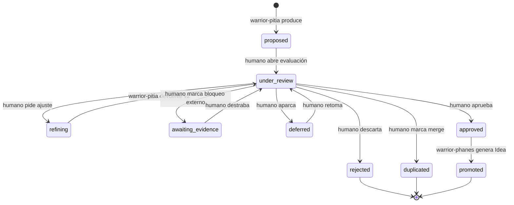

# Codex: Artefactos de Product Discovery — Insights e Ideas

> **Prefijo:** `codex-` | **Tipo:** Manual de Referencia | **Ámbito:** Product Discovery — schema, ciclo de vida y gobernanza de los artefactos `insights/*.md` y `ideas/*.md`

## Visión General

Este Codex es el manual canónico de los artefactos producidos durante la fase de Product Discovery de Ahrena. Define el schema YAML del front-matter de **insights** (producidos por `warrior-pitia`) y de **ideas** (producidas por `warrior-phanes`), la máquina de estados que gobierna el ciclo de vida de los insights, la convención de numeración y el direccionamiento canónico dentro de `docs/discovery/`. La ley correspondiente está en `lex-discovery-flow`.

Los insights son observaciones estructuradas extraídas de fuentes (APIs, docs, procesos, entrevistas, pantallas) que describen oportunidades, dolores o hipótesis sobre un dominio de negocio. Las Ideas son candidatos de solución: insights aprobados sintetizados en problema, hipótesis, usuario objetivo, métrica de éxito y estimación de esfuerzo. El par insight → Idea forma la entrada del ciclo de design (`warrior-prometheus` en adelante).

## Contexto

- **Dominio:** Product Discovery — fase previa al design cycle de Ahrena
- **Público objetivo:** `warrior-pitia`, `warrior-phanes`, Product Managers, stakeholders que evalúan insights, autores humanos
- **Actualización:** después de cada ciclo Discovery → Idea completo (revisión obligatoria después del primer uso real, registrada en ADR cuando el schema cambie)

## Direccionamiento canónico

Los artefactos de ejecución producidos por Pitia y Phanes residen en:

```
docs/
└── discovery/
    └── {topic}/                   # tópico en kebab-case (ej: scheduled-payments-research)
        ├── insights/
        │   └── {NNN}-{slug}.md    # NNN secuencial dentro del topic, zero-padded
        └── ideas/
            └── {NNN}-{slug}.md    # NNN secuencial dentro del topic, zero-padded
```

### Convenciones

| Item | Regla |
|------|-------|
| `{topic}` | Tema de la iniciativa de Discovery en kebab-case. Ej.: `accountant-onboarding`, `scheduled-payments-research` |
| `{NNN}` | Número secuencial **dentro del topic**, zero-padded con 3 dígitos (`001`, `002`, …, `099`, `100`). Sin huecos |
| `{slug}` | Resumen corto en kebab-case del contenido del insight/idea. Ej.: `manual-reconciliation-bottleneck` |
| Idioma | Conforme `language.default` en `.ahrena/.directives` |
| Archivos por insight/idea | **Un archivo por artefacto** — facilita PR-por-insight y granularidad de revisión |

## Schema del Insight

Cada archivo `docs/discovery/{topic}/insights/{NNN}-{slug}.md` debe contener front-matter YAML seguido de cuerpo Markdown libre.

```yaml
---
id: "{topic}/insights/{NNN}-{slug}"
topic: "{topic}"
status: proposed
source_refs:
  - "https://figma.com/file/abc123"
  - "notion://page-id"
  - "docs/transcripts/interview-2026-05-04-accountant-X.md"
tags:
  - reconciliation
  - manual-process
created_at: "2026-05-06T10:00:00Z"
updated_at: "2026-05-06T10:00:00Z"
# Campos completados conforme transiciones de la máquina de estados:
merged_into: null              # completado cuando status: duplicated → "{topic}/insights/{NNN}-{slug}"
idea_ref: null                 # completado cuando status: promoted → "{topic}/ideas/{NNN}-{slug}"
rejected_reason: null          # completado cuando status: rejected
awaiting_evidence_reason: null # completado cuando status: awaiting_evidence
---

# Insight: {Título Humano en Español}

## Observación

{Lo que se observó, en lenguaje directo. 2 a 5 frases.}

## Fuente

{De dónde vino: qué API/doc/entrevista/proceso. Cite fragmentos cuando sea posible.}

## Implicación inicial

{Por qué esto importa para el negocio. Sin proponer solución todavía — la Idea queda para después.}

## Preguntas abiertas

{Lista de preguntas que necesitan evidencia adicional para madurar este insight.}
```

### Campos del front-matter

| Campo | Tipo | Obligatorio | Descripción |
|-------|------|:-----------:|-------------|
| `id` | string | Sí | Identificador estable: `{topic}/insights/{NNN}-{slug}` |
| `topic` | string | Sí | Topic en kebab-case (mismo del directorio padre) |
| `status` | enum | Sí | Uno de los 9 status de la máquina de estados (ver abajo) |
| `source_refs` | array&lt;string&gt; | Sí (≥1) | URLs o paths de las fuentes consultadas |
| `tags` | array&lt;string&gt; | No | Etiquetas para búsqueda/agregación |
| `created_at` | datetime ISO 8601 | Sí | Fecha de creación |
| `updated_at` | datetime ISO 8601 | Sí | Última actualización |
| `merged_into` | string \| null | Condicional | Cuando `status: duplicated` — referencia al insight canónico |
| `idea_ref` | string \| null | Condicional | Cuando `status: promoted` — referencia a la Idea generada |
| `rejected_reason` | string \| null | Condicional | Cuando `status: rejected` — motivo corto |
| `awaiting_evidence_reason` | string \| null | Condicional | Cuando `status: awaiting_evidence` — lo que falta |

## Schema de la Idea

Cada archivo `docs/discovery/{topic}/ideas/{NNN}-{slug}.md` debe contener front-matter YAML con los 5 campos obligatorios de la Idea.

```yaml
---
id: "{topic}/ideas/{NNN}-{slug}"
topic: "{topic}"
problem: "Los contadores pierden en promedio 4h/semana conciliando manualmente lanzamientos divergentes entre el ERP y el extracto bancario."
hypothesis: "Si el sistema sugiere conciliación automática con confianza ≥ 90%, los contadores aceptarán la sugerencia en ≥ 70% de los casos, reduciendo el tiempo manual en ≥ 60%."
target_user: "Contador operacional en oficinas con 50–500 clientes activos"
success_metric: "Tiempo medio de conciliación por mes por cliente: baseline 4h → meta 1.5h en 90 días después del release"
effort_estimate: "M (2–4 sprints; depende de integración con ERP X y del modelo de matching)"
linked_insights:
  - "{topic}/insights/001-manual-reconciliation-bottleneck"
  - "{topic}/insights/003-erp-divergence-patterns"
created_at: "2026-05-10T15:00:00Z"
updated_at: "2026-05-10T15:00:00Z"
---

# Idea: {Título Humano en Español}

## Síntesis

{2 a 4 frases conectando el problema a la hipótesis y al usuario.}

## Insights de origen

{Lista enumerada referenciando cada insight en `linked_insights[]` con 1 frase de resumen.}

## Próximos pasos

{Sugerencias de validación adicional antes del design cycle (ej.: entrevista confirmatoria, prueba de concepto, análisis de datos de telemetría). No es decisión de prioridad — eso queda con `warrior-prometheus`.}
```

### Campos del front-matter

| Campo | Tipo | Obligatorio | Descripción |
|-------|------|:-----------:|-------------|
| `id` | string | Sí | Identificador estable: `{topic}/ideas/{NNN}-{slug}` |
| `topic` | string | Sí | Topic en kebab-case (debe coincidir con el `topic` de los insights en `linked_insights[]`) |
| `problem` | string | Sí | Problema concreto observado, en una frase. Sin solución embebida |
| `hypothesis` | string | Sí | Hipótesis testeable: "Si X, entonces Y, medido por Z" |
| `target_user` | string | Sí | Usuario objetivo específico (no "todos los usuarios") |
| `success_metric` | string | Sí | Métrica leading o lagging con baseline y meta |
| `effort_estimate` | enum | Sí | `XS` \| `S` \| `M` \| `L` \| `XL` con justificación entre paréntesis |
| `linked_insights` | array&lt;string&gt; | Sí (≥1) | IDs de los insights de origen; todos con `topic` igual al de la Idea |
| `created_at` | datetime ISO 8601 | Sí | Fecha de creación |
| `updated_at` | datetime ISO 8601 | Sí | Última actualización |

Los 5 campos de contenido (`problem`, `hypothesis`, `target_user`, `success_metric`, `effort_estimate`) son las **5 precondiciones obligatorias** validadas por el HARD-GATE 1 de la `lex-discovery-flow`.

## Máquina de estados del Insight



### Tabla de transiciones

| De → A | Quién mueve | Precondición | Efecto colateral |
|--------|-------------|--------------|------------------|
| `[*]` → `proposed` | `warrior-pitia` | Síntesis a partir de `source_refs[]` ≥ 1 | Crea archivo del insight |
| `proposed` → `under_review` | humano | — | — |
| `under_review` → `refining` | humano | Feedback accionable proporcionado | — |
| `refining` → `under_review` | `warrior-pitia` | v2 del insight redactada | `updated_at` actualizado |
| `under_review` → `awaiting_evidence` | humano | `awaiting_evidence_reason` completado | — |
| `awaiting_evidence` → `under_review` | humano | Evidencia obtenida | `awaiting_evidence_reason` puesto a cero |
| `under_review` → `deferred` | humano | — | — |
| `deferred` → `under_review` | humano | — | — |
| `under_review` → `duplicated` | humano | `merged_into` apunta a otro insight del mismo topic | Insight canónico recibe nota |
| `under_review` → `rejected` | humano | `rejected_reason` completado | Terminal |
| `under_review` → `approved` | humano | — | Disponible para `warrior-phanes` |
| `approved` → `promoted` | `warrior-phanes` | HARD-GATE 1 de la `lex-discovery-flow` cumplido | Archivo de la Idea creado; `idea_ref` completado |

Status terminales: `rejected`, `duplicated`, `promoted`. Status no terminales que parecen terminales: `deferred` (vuelve a `under_review` cuando se destraba).

## Restricciones

- **Inmutabilidad del `id`:** una vez creado, `id` nunca cambia. Si un insight se renombra, marque el antiguo como `duplicated` apuntando al nuevo.
- **No invertir la jerarquía:** siempre `docs/discovery/{topic}/{insights|ideas}/`. Categoría como nivel superior (`docs/discovery/insights/{topic}/...`) está PROHIBIDO.
- **No consolidar múltiples insights en un archivo:** un insight por archivo, aunque estén relacionados — use `linked_insights[]` en la Idea para agregar.
- **Idea sin insight de origen:** PROHIBIDO en v1. Si una Idea legítimamente nace de investigación no documentada como insight, primero cree el insight, después la Idea.
- **`topic` no cambia entre insight e Idea:** el `topic` de la Idea debe coincidir con el `topic` de todos sus `linked_insights[]`.

## Glosario

| Término | Definición |
|---------|------------|
| Topic | Tema de una iniciativa de Discovery; agrupador de insights e ideas relacionados |
| Insight | Observación estructurada extraída de fuentes; unidad de descubrimiento |
| Idea | Candidato de solución derivado de insights aprobados; unidad de proposición |
| Promotion | Transición `approved → promoted` de un insight, ejecutada por `warrior-phanes` al generar la Idea |
| Refining | Estado en que `warrior-pitia` está iterando el insight tras feedback humano |

## Referencias

- `lex-discovery-flow` — ley correspondiente con HARD-GATEs
- `kata-discovery-synthesis` — procedimiento de producción de insights por `warrior-pitia`
- `kata-ideation-from-insight` — procedimiento de promoción de insight a Idea por `warrior-phanes`
- `warrior-pitia`, `warrior-phanes` — agentes vinculados
- `lex-feature-design-docs`, `codex-feature-design-docs` — destino downstream tras el Discovery (Prometheus consume Ideas)
