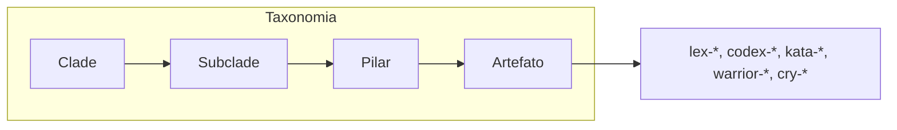
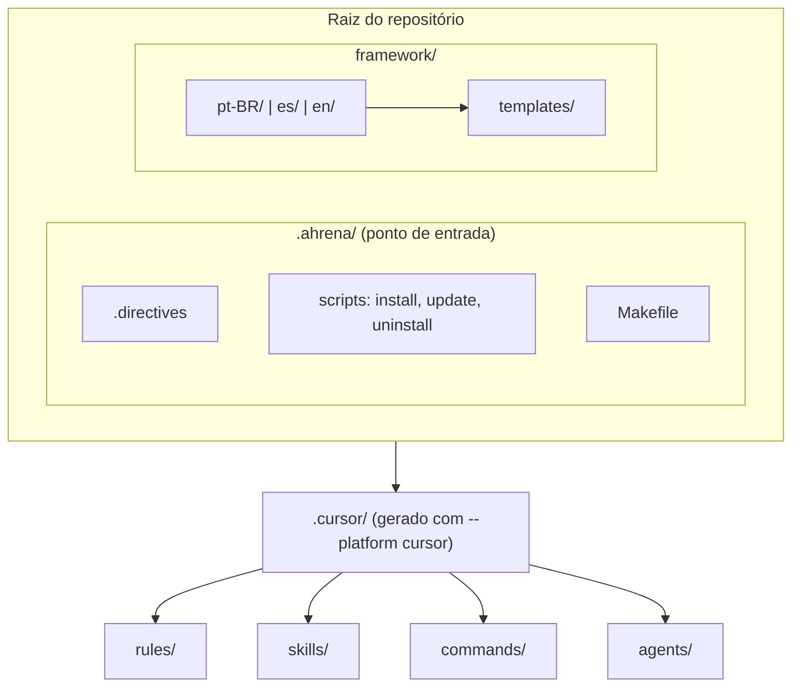
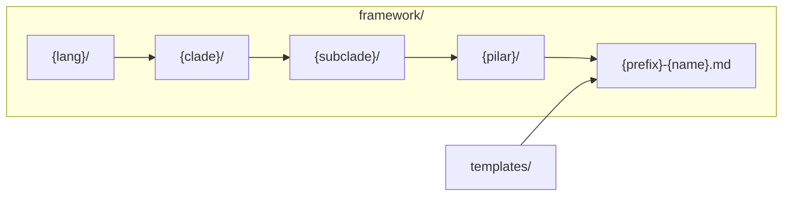

# Framework — Guia do Desenvolvedor

🇺🇸 [English](../en/README.md) | 🇪🇸 [Español](../es/README.md)

> Documentação completa: **[guardiatechnology.github.io/ahrena](https://guardiatechnology.github.io/ahrena/)**
>
> Guia prático para quem contribui com o repositório do Ahrena. Para uso do framework em projetos, consulte o [README principal](../../README.md).

## Estrutura

```
framework/
├── .directives.sample           # Template de diretivas (copiado para .ahrena/.directives na instalação)
├── templates/                   # Templates base de cada Pilar
│   ├── lex-sample.md
│   ├── codex-sample.md
│   ├── kata-sample.md
│   ├── warrior-sample.md
│   └── cry-sample.md
│
├── pt-BR/
│   ├── _foundation/
│   │   ├── authoring/           # Guias de criação de artefatos
│   │   ├── contributing/        # Fluxo de contribuição e commit
│   │   ├── process/             # Convenções de processo (checkpoints, diretivas)
│   │   ├── quality/             # Padrões mínimos de qualidade
│   │   ├── tooling/             # Automação (Makefile)
│   │   └── i18n/                # Estrutura de idiomas do framework
│   ├── engineering/
│   │   └── platform/            # Especificações da plataforma Guardia (API, eventos, Lexis, Codex, Katas, Warriors, Cries)
│   └── documentation/
│       └── i18n/                # Sistema de tradução (Hermes)
│
├── en/                          # Inglês (mesma estrutura)
└── es/                          # Espanhol (mesma estrutura)
```

Mudanças no idioma padrão são traduzidas para os demais idiomas via `/cry-translate`.

## Arquitetura do framework

### Taxonomia

O conhecimento é organizado em **Clade** (disciplina) → **Subclade** (área) → **Pilar** (tipo de capacidade). O endereço canônico de um artefato é:

`{lang}/{clade}/{subclade}/{pilar}/{prefixo}-{nome}.{ext}` — por exemplo `pt-BR/engineering/platform/lexis/lex-restful-apis.md`.



### Visão geral



### Paths canônicos no `framework/`

O **idioma é o primeiro nível** de navegação. Cada pasta de idioma contém a árvore completa Clade → Subclade → Pilar.



**Árvore de paths**

```
.ahrena/
├── .directives
├── install.py, update.py, uninstall.py
└── Makefile

framework/
├── .directives.sample
├── templates/
│   ├── lex-sample.md
│   ├── codex-sample.md
│   ├── kata-sample.md
│   ├── warrior-sample.md
│   └── cry-sample.md
├── pt-BR/
│   ├── _foundation/
│   ├── engineering/platform/
│   └── documentation/i18n/
├── es/
└── en/
```

Exemplo de artefato: `framework/pt-BR/engineering/platform/lexis/lex-restful-apis.md`.

### De `framework/` para `.cursor/`

Ao instalar com `--platform cursor`, o instalador gera o `.cursor/` a partir do `framework/` (idioma definido por `language.cursor` no `.directives`).

| Pilar | Recurso Cursor | Destino |
|-------|----------------|---------|
| Lexis | Rules (`.mdc`) | `.cursor/rules/<clade>/<subclade>/lex-*.mdc` |
| Codex | Rules (`.mdc`) | `.cursor/rules/<clade>/<subclade>/codex-*.mdc` |
| Katas | Skills (`SKILL.md`) | `.cursor/skills/kata-*/SKILL.md` |
| Warriors | Skills + Agents | `.cursor/skills/warrior-*/SKILL.md` + `.cursor/agents/warrior-*.md` |
| Cries | Commands (`.md`) | `.cursor/commands/<clade>/<subclade>/cry-*.md` |

**Estrutura de pastas do `.cursor/`**

```
.cursor/
├── rules/
│   ├── _foundation/
│   │   ├── authoring/
│   │   ├── contributing/
│   │   ├── process/
│   │   ├── quality/
│   │   ├── tooling/
│   │   └── i18n/
│   ├── documentation/i18n/
│   └── engineering/platform/
├── skills/
│   ├── kata-commit/
│   ├── kata-contribute/
│   ├── kata-create-*/
│   ├── kata-translate/
│   ├── kata-api-design-oas/, kata-api-design-doc/, kata-events-doc/
│   ├── warrior-translator/
│   ├── warrior-daedalus/
│   └── warrior-kronos/
├── commands/
│   ├── _foundation/
│   ├── documentation/i18n/
│   └── engineering/platform/
└── agents/
    ├── warrior-translator.md
    ├── warrior-daedalus.md
    └── warrior-kronos.md
```

## Fluxo de Desenvolvimento

### 1. Editar artefatos no `framework/`

Edite os arquivos `.md` dentro de `framework/{lang}/`. Respeite:

- **Endereçamento:** `{lang}/{clade}/{subclade}/{pilar}/{prefixo}-{nome}.md`
- **Templates:** use os templates de `framework/templates/` como base (`lex-template-usage`)
- **i18n:** toda mudança no idioma padrão deve ser propagada para os demais idiomas

### 2. Testar localmente

Após editar, regenere a instalação local para validar que os artefatos Cursor são gerados corretamente:

```bash
make dev-install PLATFORM=cursor
```

Isso copia `framework/` para `.ahrena/framework/`, gera o `.cursor/` (rules, skills, commands, agents) e preserva o `.directives` existente.

### 3. Verificar artefatos gerados

O instalador transforma cada Pilar no formato nativo do Cursor:

| Pilar | Origem | Destino Cursor |
|-------|--------|----------------|
| Lexis | `framework/{lang}/.../lexis/lex-*.md` | `.cursor/rules/.../lex-*.mdc` |
| Codex | `framework/{lang}/.../codex/codex-*.md` | `.cursor/rules/.../codex-*.mdc` |
| Katas | `framework/{lang}/.../katas/kata-*.md` | `.cursor/skills/kata-*/SKILL.md` |
| Warriors | `framework/{lang}/.../warriors/warrior-*.md` | `.cursor/skills/warrior-*/SKILL.md` + `.cursor/agents/warrior-*.md` |
| Cries | `framework/{lang}/.../cries/cry-*.md` | `.cursor/commands/.../cry-*.md` |

O idioma usado para gerar os artefatos Cursor é definido por `language.cursor` no `.directives` (padrão: `en`).

### 4. Commitar

Use `/cry-commit` para criar commits conformes. As 4 Lexis de commit são:

- `lex-conventional-commits` — formato `type(scope): description`
- `lex-small-commits` — um propósito por commit
- `lex-commit-language` — subject em inglês
- `lex-signed-commits` — assinatura GPG obrigatória

### 5. Versionar release (tags)

Use `/cry-tag` para criar ou listar tags de release em formato SemVer. O `kata-tag` aplica `lex-semantic-version` e `lex-signed-commits`. Ver `_foundation/contributing/README.md` para o inventário completo.

### 6. Contribuir

Use `/cry-contribute pr` para abrir o Pull Request. O `kata-contribute` guia todo o fluxo via MCP.

## Criando Novos Artefatos

### Via comandos (recomendado)

```
/cry-new-lex          # Nova Lexis
/cry-new-codex        # Novo Codex
/cry-new-kata         # Novo Kata
/cry-new-warrior      # Novo Warrior
/cry-new-cry          # Novo Cry
```

Cada comando invoca o kata correspondente (`kata-create-*`) que:
1. Usa o template oficial como base
2. Posiciona o artefato na taxonomia correta
3. Cria nos 3 idiomas obrigatórios

### Manualmente

1. Copiar o template de `framework/templates/{pilar}-sample.md`
2. Posicionar em `framework/pt-BR/{clade}/{subclade}/{pilar}/{prefixo}-{nome}.md`
3. Preencher as seções obrigatórias
4. Traduzir para `en/` e `es/` (via `/cry-translate`)
5. Rodar `make dev-install PLATFORM=cursor` para validar

## Convenções

| Aspecto | Padrão |
|---------|--------|
| Casing de arquivos | `kebab-case` (`lex-no-secrets.md`) |
| Casing de diretórios | `kebab-case` (`engineering/backend/`) |
| Extensão no framework | `.md` |
| Extensão no Cursor | `.mdc` (rules), `.md` (skills, commands, agents) |
| Prefixos | `lex-`, `codex-`, `kata-`, `warrior-`, `cry-` |
| Clades reservados | `_foundation` (prefixo `_`) |

## Targets do Makefile

| Target | Descrição |
|--------|-----------|
| `make dev-install PLATFORM=cursor` | Instala usando fontes locais |
| `make bootstrap PLATFORM=cursor` | Primeira instalação (baixa do GitHub) |
| `make install PLATFORM=cursor` | Reinstala a partir de `.ahrena/install.py` |
| `make update` | Atualiza para última versão |
| `make clean` | Remove arquivos instalados |

## Referências

- [README principal](../../README.md) — Documentação pública do Ahrena
- [Sistema de Tradução](documentation/i18n/README.md) — Documentação do Hermes
- `.ahrena/.directives` — Diretivas canônicas do framework
- `_foundation/contributing/codex/codex-contributing` — Fluxo de contribuição
- `_foundation/contributing/katas/kata-contribute` — Procedimento de PR
