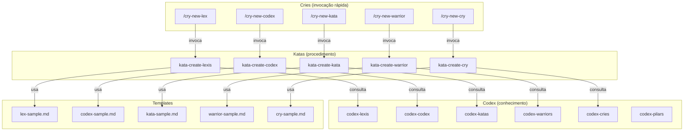
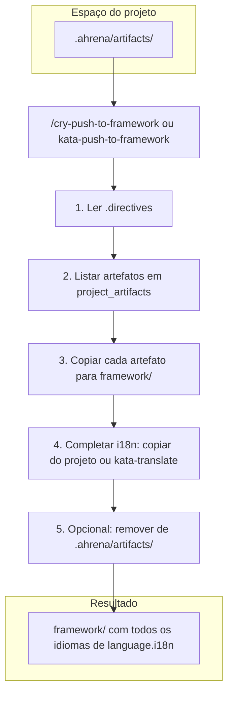

# Authoring — Sistema de Criação de Artefatos

> Documentação do sistema autossuficiente de criação de artefatos do Ahrena.

## Visão Geral

O Ahrena usa seus próprios artefatos para criar novos artefatos. O subclade `authoring` contém o **Kit de Criação** de cada Pilar: um Codex (o que é e como escrever bem), um Kata (procedimento passo a passo) e um Cry (atalho rápido para disparar a criação).

A cadeia de execução é:

```
/cry-new-{pilar} → kata-create-{pilar} → codex-{pilar} + template + lexis
```

## Arquitetura



## Criação no projeto (.ahrena) e Push para o framework

Artefatos podem ser criados primeiro no espaço do projeto (`.ahrena/artifacts/`), específicos do repositório. Os Katas de criação aceitam o input **Destino** ("framework" ou "projeto"). Se "projeto", o artefato é salvo em `.ahrena/artifacts/{lang}/{clade}/{subclade}/{pilar}/` e pode existir só no idioma padrão. Para que o Cursor use esses artefatos (rules, skills, commands), execute `python .ahrena/update.py --sync-cursor` ou `make sync-cursor` após criar ou editar em `.ahrena/artifacts/`. Depois de validar, o usuário pode incorporar ao framework com `/cry-push-to-framework` ou executando `kata-push-to-framework` (skill disponível em `.cursor/skills/kata-push-to-framework`).

### Fluxo do Push para o Framework

Quando os artefatos são criados no projeto (Destino: projeto), eles ficam em `.ahrena/artifacts/` e podem existir apenas no idioma padrão. O **Push para o framework** é o procedimento que os incorpora ao repositório canônico: o `kata-push-to-framework` (ou o Cry `/cry-push-to-framework`) lê as diretivas, lista os artefatos em `paths.project_artifacts`, copia cada um para `framework/` na mesma estrutura, completa os idiomas obrigatórios (copiando do projeto ou gerando com `kata-translate`) e opcionalmente remove as cópias em `.ahrena/artifacts/`. O diagrama abaixo resume esse fluxo.



## Inventário de Artefatos

### Codex (conhecimento por Pilar)

| Artefato | Descrição |
|----------|-----------|
| `codex-pilars` | Referência central sobre o sistema de Pilares, hierarquia e relações |
| `codex-lexis` | Como escrever uma boa Lexis |
| `codex-codex` | Como escrever um bom Codex |
| `codex-katas` | Como escrever um bom Kata |
| `codex-warriors` | Como escrever um bom Warrior |
| `codex-cries` | Como escrever um bom Cry |

### Katas (procedimentos de criação)

| Artefato | Descrição |
|----------|-----------|
| `kata-create-lexis` | Procedimento para criar uma nova Lexis (destino: framework ou projeto) |
| `kata-create-codex` | Procedimento para criar um novo Codex (destino: framework ou projeto) |
| `kata-create-kata` | Procedimento para criar um novo Kata (destino: framework ou projeto) |
| `kata-create-warrior` | Procedimento para criar um novo Warrior (destino: framework ou projeto) |
| `kata-create-cry` | Procedimento para criar um novo Cry (destino: framework ou projeto) |
| `kata-push-to-framework` | Procedimento para incorporar artefatos de `.ahrena/artifacts/` ao `framework/` (com i18n) |

### Cries (atalhos de criação)

| Artefato | Descrição |
|----------|-----------|
| `cry-new-lex` | Atalho rápido para criar uma nova Lexis |
| `cry-new-codex` | Atalho rápido para criar um novo Codex |
| `cry-new-kata` | Atalho rápido para criar um novo Kata |
| `cry-new-warrior` | Atalho rápido para criar um novo Warrior |
| `cry-new-cry` | Atalho rápido para criar um novo Cry |
| `cry-push-to-framework` | Atalho para incorporar artefatos do projeto ao framework |

## Como Usar

**Criar no framework (padrão):**

```
/cry-new-lex
```

O agente irá: ler o codex do Pilar, executar o kata de criação, usar o template, posicionar no Clade/Subclade correto e criar versões em todos os idiomas obrigatórios.

**Criar no projeto (específico do repositório):**

Ao invocar um kata de criação (ou cry), informe **Destino: projeto**. O artefato será salvo em `.ahrena/artifacts/{lang}/{clade}/{subclade}/{pilar}/` e pode existir só no idioma padrão. Depois de validar, incorpore ao framework com:

```
/cry-push-to-framework
```

(ou `cry-push-to-framework todos --remove` para incorporar todos e remover do projeto).

## Referências

- `codex-pilars` — Referência central sobre os Pilares e fluxo de artefatos no projeto (.ahrena) e Push
- `lex-template-usage` — Lei de uso obrigatório de templates
- `framework/templates/` — Templates oficiais de cada Pilar
- `kata-push-to-framework` — Incorporação de artefatos de `.ahrena/artifacts/` ao framework
