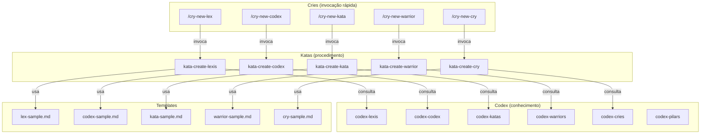
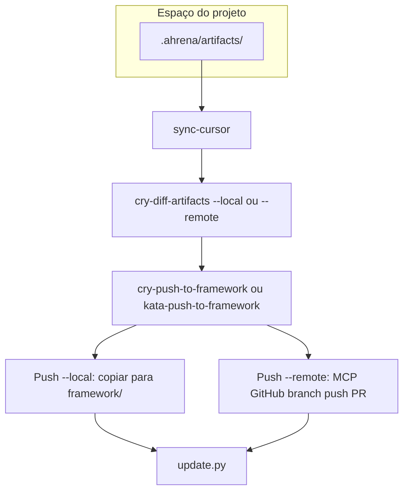

# Authoring — Sistema de Criação de Artefatos

> Documentação do sistema autossuficiente de criação de artefatos do Ahrena.

## Visão Geral

O Ahrena usa seus próprios artefatos para criar novos artefatos. O subclade `authoring` contém o **Kit de Criação** de cada Pilar: um Codex (o que é e como escrever bem), um Kata (procedimento passo a passo) e um Cry (atalho rápido para disparar a criação).

A cadeia de execução é:

```
/cry-new-{pilar} → kata-create-{pilar} → codex-{pilar} + template + lexis
```

## Arquitetura



## Criação no projeto (.ahrena) e Push para o framework

Artefatos podem ser criados primeiro no espaço do projeto (`.ahrena/artifacts/`), específicos do repositório. Os Katas de criação aceitam o input **Destino** ("framework" ou "projeto"). O fluxo canônico em cinco passos:

1. **Criar no projeto:** use os Katas de criação com Destino **projeto** — o artefato é salvo em `.ahrena/artifacts/{lang}/{clade}/{subclade}/{pilar}/`.
2. **Sincronizar .cursor local:** execute `python .ahrena/update.py --sync-cursor` (ou `make sync-cursor`) para regerar `.cursor/` a partir de `.ahrena/framework/` e `.ahrena/artifacts/`.
3. **Validar e comparar (opcional):** use `cry-diff-artifacts --local` para ver diferenças entre `.ahrena/artifacts` e `framework/` local; use `cry-diff-artifacts --remote` para comparar com a versão mais recente do framework no remoto (via MCP do GitHub).
4. **Push para o framework:** execute `cry-push-to-framework` ou `kata-push-to-framework` com **--local** (cópia para `framework/` no repo atual) ou **--remote** (sincronização com o repositório do framework no GitHub via MCP do GitHub).
5. **Atualizar instalação:** execute `python .ahrena/update.py` (e opcionalmente `--sync-cursor`) para trazer a versão mais recente do framework.

### Fluxo do Push e do Diff

O **Push** pode ser **--local** (cópia para `framework/` no disco) ou **--remote** (envio ao repositório do framework no GitHub, obrigatoriamente via MCP do GitHub). O **Diff** (`kata-diff-artifacts` / `cry-diff-artifacts`) compara artefatos em modo **--local** (vs framework local) ou **--remote** (vs versão mais recente no remoto, via MCP do GitHub).



## Inventário de Artefatos

### Codex (conhecimento por Pilar)

| Artefato | Descrição |
|----------|-----------|
| `codex-pilars` | Referência central sobre o sistema de Pilares, hierarquia e relações |
| `codex-lexis` | Como escrever uma boa Lexis |
| `codex-codex` | Como escrever um bom Codex |
| `codex-katas` | Como escrever um bom Kata |
| `codex-warriors` | Como escrever um bom Warrior |
| `codex-cries` | Como escrever um bom Cry |

### Katas (procedimentos de criação)

| Artefato | Descrição |
|----------|-----------|
| `kata-create-lexis` | Procedimento para criar uma nova Lexis (destino: framework ou projeto) |
| `kata-create-codex` | Procedimento para criar um novo Codex (destino: framework ou projeto) |
| `kata-create-kata` | Procedimento para criar um novo Kata (destino: framework ou projeto) |
| `kata-create-warrior` | Procedimento para criar um novo Warrior (destino: framework ou projeto) |
| `kata-create-cry` | Procedimento para criar um novo Cry (destino: framework ou projeto) |
| `kata-push-to-framework` | Procedimento para incorporar artefatos de `.ahrena/artifacts/` ao framework (modo local ou remoto; remoto via MCP do GitHub) |
| `kata-diff-artifacts` | Procedimento para comparar artefatos do projeto com o framework (modos local e remoto; remoto via MCP do GitHub) |

### Cries (atalhos de criação)

| Artefato | Descrição |
|----------|-----------|
| `cry-new-lex` | Atalho rápido para criar uma nova Lexis |
| `cry-new-codex` | Atalho rápido para criar um novo Codex |
| `cry-new-kata` | Atalho rápido para criar um novo Kata |
| `cry-new-warrior` | Atalho rápido para criar um novo Warrior |
| `cry-new-cry` | Atalho rápido para criar um novo Cry |
| `cry-push-to-framework` | Atalho para incorporar artefatos do projeto ao framework (--local ou --remote) |
| `cry-diff-artifacts` | Atalho para comparar artefatos do projeto com o framework (--local ou --remote) |

## Como Usar

**Criar no framework (padrão):**

```
/cry-new-lex
```

O agente irá: ler o codex do Pilar, executar o kata de criação, usar o template, posicionar no Clade/Subclade correto e criar versões em todos os idiomas obrigatórios.

**Criar no projeto (específico do repositório):**

Ao invocar um kata de criação (ou cry), informe **Destino: projeto**. O artefato será salvo em `.ahrena/artifacts/{lang}/{clade}/{subclade}/{pilar}/`. Execute `python .ahrena/update.py --sync-cursor` para o Cursor usar o artefato. Opcionalmente, use `cry-diff-artifacts --local` para ver diferenças antes do push. Incorpore ao framework com:

```
/cry-push-to-framework --local
```

(ou `cry-push-to-framework --remote todos` para enviar ao repositório do framework no GitHub via MCP; ou `--local todos --remove` para incorporar todos no framework local e remover do projeto).

## Referências

- `codex-pilars` — Referência central sobre os Pilares e fluxo de artefatos no projeto (.ahrena) e Push
- `lex-template-usage` — Lei de uso obrigatório de templates
- `framework/templates/` — Templates oficiais de cada Pilar
- `kata-push-to-framework` — Incorporação de artefatos de `.ahrena/artifacts/` ao framework
