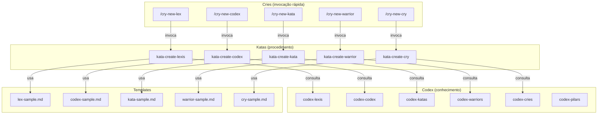

# Authoring — Sistema de Criação de Artefatos

> Documentação do sistema autossuficiente de criação de artefatos do Ahrena.

## Visão Geral

O Ahrena usa seus próprios artefatos para criar novos artefatos. O subclade `authoring` contém o **Kit de Criação** de cada Pilar: um Codex (o que é e como escrever bem), um Kata (procedimento passo a passo) e um Cry (atalho rápido para disparar a criação).

A cadeia de execução é:

```
/cry-new-{pilar} → kata-create-{pilar} → codex-{pilar} + template + lexis
```

## Arquitetura



## Inventário de Artefatos

### Codex (conhecimento por Pilar)

| Artefato | Descrição |
|----------|-----------|
| `codex-pilars` | Referência central sobre o sistema de Pilares, hierarquia e relações |
| `codex-lexis` | Como escrever uma boa Lexis |
| `codex-codex` | Como escrever um bom Codex |
| `codex-katas` | Como escrever um bom Kata |
| `codex-warriors` | Como escrever um bom Warrior |
| `codex-cries` | Como escrever um bom Cry |

### Katas (procedimentos de criação)

| Artefato | Descrição |
|----------|-----------|
| `kata-create-lexis` | Procedimento para criar uma nova Lexis |
| `kata-create-codex` | Procedimento para criar um novo Codex |
| `kata-create-kata` | Procedimento para criar um novo Kata |
| `kata-create-warrior` | Procedimento para criar um novo Warrior |
| `kata-create-cry` | Procedimento para criar um novo Cry |

### Cries (atalhos de criação)

| Artefato | Descrição |
|----------|-----------|
| `cry-new-lex` | Atalho rápido para criar uma nova Lexis |
| `cry-new-codex` | Atalho rápido para criar um novo Codex |
| `cry-new-kata` | Atalho rápido para criar um novo Kata |
| `cry-new-warrior` | Atalho rápido para criar um novo Warrior |
| `cry-new-cry` | Atalho rápido para criar um novo Cry |

## Como Usar

Criar um novo artefato com um único comando:

```
/cry-new-lex
```

O agente irá:
1. Ler o `codex-lexis` para entender a estrutura e boas práticas
2. Executar o `kata-create-lexis` passo a passo
3. Usar o template `lex-sample.md` como base
4. Posicionar o artefato no Clade/Subclade correto
5. Criar versões em todos os idiomas obrigatórios

## Referências

- `codex-pilars` — Referência central sobre os Pilares
- `lex-template-usage` — Lei de uso obrigatório de templates
- `framework/templates/` — Templates oficiais de cada Pilar
