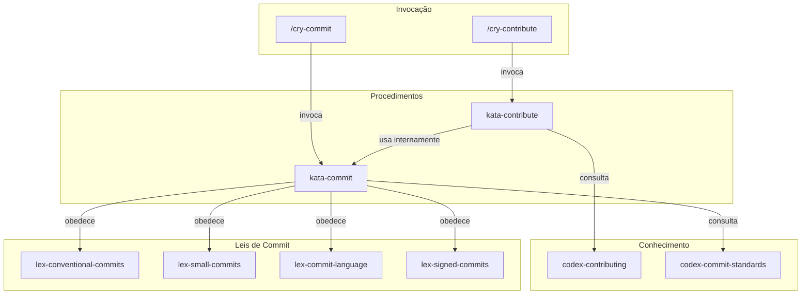

# Contributing — Fluxo de Contribuição

> Documentação do sistema de contribuição, padrões de commit e criação de Pull Requests.

## Visão Geral

O subclade `contributing` define o fluxo unificado de contribuição da Guardia. Abrange desde as leis de commit até o procedimento de abertura de PRs via MCP. O processo é o mesmo para todos os contribuidores (internos e externos), garantindo transparência e rastreabilidade.

## Arquitetura



## Inventário de Artefatos

### Lexis (leis de commit)

| Artefato | Descrição |
|----------|-----------|
| `lex-conventional-commits` | Formato obrigatório `type(scope): description` |
| `lex-small-commits` | Um propósito por commit, mudanças atômicas |
| `lex-commit-language` | Subject em inglês |
| `lex-signed-commits` | Assinatura GPG obrigatória |

### Codex (conhecimento)

| Artefato | Descrição |
|----------|-----------|
| `codex-contributing` | Fluxo completo de contribuição (da discussão ao merge) |
| `codex-commit-standards` | Estrutura detalhada das mensagens de commit |

### Katas (procedimentos)

| Artefato | Descrição |
|----------|-----------|
| `kata-commit` | Procedimento para criar commits conformes |
| `kata-contribute` | Procedimento para abrir Pull Requests via MCP |

### Cries (atalhos)

| Artefato | Descrição |
|----------|-----------|
| `cry-commit` | Atalho para commitar seguindo as 4 Lexis |
| `cry-contribute` | Atalho para abrir PR ou contribuir ao framework |

## Como Usar

### Commitar mudanças

```
/cry-commit
```

O agente analisa as mudanças, cria commits atômicos seguindo Conventional Commits, com subject em inglês e assinatura GPG.

### Abrir um Pull Request

```
/cry-contribute pr
```

O agente executa o `kata-contribute`, que cria o PR no repositório origin via ferramentas MCP do GitKraken.

### Fluxo completo de contribuição

O `codex-contributing` define o processo passo a passo:

1. Abrir discussão no GitHub Discussions (categoria Ideas)
2. Discussão aprovada vira issue
3. Criar branch a partir de main (`feat/nome`, `fix/nome`, `docs/nome`)
4. Implementar (seguindo Lexis de commit)
5. Abrir PR preenchendo o template
6. Manter CI verde e responder ao review
7. Merge pelo maintainer

## Referências

- [CONTRIBUTING da Guardia](https://hub.guardia.finance/docs/community/CONTRIBUTING/)
- `.github/pull_request_template.md` — Template de PR
- `.github/CODEOWNERS` — Arquivo de codeowners
