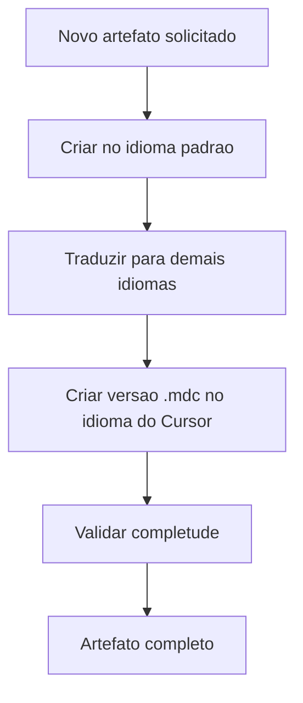

# Codex: Estrutura de Idiomas do Framework

> **Prefixo:** `codex-` | **Tipo:** Manual de Referência | **Escopo:** Organização de pastas por idioma dentro de `framework/`

## Visão Geral

Este Codex documenta como a estrutura de pastas de idioma funciona no Ahrena. O framework adota uma abordagem onde o idioma é o primeiro nível de navegação dentro de `framework/`, com cada idioma possuindo uma árvore completa e espelhada de artefatos.

Este manual trata exclusivamente da **estrutura de pastas**. Para orientações sobre **como traduzir conteúdo**, consulte os artefatos em `documentation/i18n/`.

## Contexto

- **Domínio:** Organização estrutural de idiomas no framework
- **Público-alvo:** Todos os agentes IA, Warriors e mantenedores do framework
- **Atualização:** sempre que um novo idioma for adicionado a `language.i18n` ou a estrutura de pastas mudar

## Conteúdo

### Princípios

1. **Idioma como raiz:** o código do idioma (ex: `pt-BR`, `es`, `en`) é sempre o primeiro diretório dentro de `framework/`.
2. **Espelhamento total:** cada pasta de idioma replica integralmente a árvore de clades, subclades e pilares.
3. **Fonte da verdade:** o idioma definido em `language.default` (atualmente `pt-BR`) é a fonte da verdade.
4. **Cursor monolíngue:** arquivos `.mdc` no `.cursor/` usam exclusivamente o idioma de `language.cursor`.

### Estrutura de Pastas

```
framework/
├── .directives.sample
├── pt-BR/                          # Idioma padrão (fonte da verdade)
│   ├── _foundation/
│   │   ├── process/lexis/
│   │   ├── quality/lexis/
│   │   └── i18n/
│   │       ├── lexis/lex-framework-language.md
│   │       └── codex/codex-framework-language.md
│   └── documentation/i18n/
│       ├── lexis/
│       │   ├── lex-language.md
│       │   ├── lex-language-ptbr.md
│       │   ├── lex-language-en.md
│       │   └── lex-language-es.md
│       ├── codex/
│       │   ├── codex-language.md
│       │   ├── codex-language-ptbr.md
│       │   ├── codex-language-en.md
│       │   └── codex-language-es.md
│       ├── katas/kata-translate.md
│       ├── warriors/warrior-translator.md
│       └── cries/cry-translate.md
├── es/                             # Espanhol (mesma estrutura)
│   └── ...
└── en/                             # Inglês (mesma estrutura)
    └── ...
```

### Padrões e Convenções

| Aspecto | Padrão | Exemplo |
|---------|--------|---------|
| Endereçamento framework | `{lang}/{clade}/{subclade}/{pilar}/{prefix}-{name}.md` | `pt-BR/_foundation/i18n/lexis/lex-framework-language.md` |
| Endereçamento Cursor | `{clade}/{subclade}/{prefix}-{name}.mdc` | `_foundation/i18n/lex-framework-language.mdc` |
| Idioma padrão | Definido em `language.default` | `pt-BR` |
| Idiomas obrigatórios | Listados em `language.i18n` | `pt-BR`, `es`, `en` |
| Idioma do Cursor | Definido em `language.cursor` | `en` |
| Nomes de pasta | Código BCP 47 | `pt-BR`, `es`, `en` |

### Fluxo de Criação de Artefato



1. Criar o artefato no idioma padrão (`language.default`)
2. Traduzir para cada idioma de `language.i18n` (usando `warrior-translator` de `documentation/i18n/`)
3. Criar a versão `.mdc` para o Cursor no idioma de `language.cursor`
4. Validar que o artefato existe em todos os idiomas obrigatórios

### Fluxo de Atualização

1. Alterar o artefato no idioma padrão
2. Sinalizar que as traduções precisam de atualização
3. Usar `cry-translate` ou `warrior-translator` para atualizar cada tradução
4. Atualizar a versão `.mdc` se necessário

### Separação de Responsabilidades

| Clade | Escopo | Artefatos |
|-------|--------|-----------|
| `_foundation/i18n/` | **Estrutura** de pastas e regras de navegação por idioma | `lex-framework-language`, `codex-framework-language` |
| `documentation/i18n/` | **Tradução** de conteúdo — regras por idioma, procedimentos, agente | `lex-language`, `lex-language-{lang}`, `codex-language`, `codex-language-{lang}`, `kata-translate`, `warrior-translator`, `cry-translate` |

### Restrições Técnicas

- **Sem conteúdo na raiz:** nenhum artefato `.md` deve existir diretamente em `framework/` fora das pastas de idioma (exceto `.directives.sample`)
- **Sem i18n no Cursor:** o diretório `.cursor/` não possui pastas de idioma
- **Termos canônicos:** nomes próprios do Ahrena não são traduzidos

## Glossário

| Termo | Definição |
|-------|-----------|
| i18n | Abreviação de "internationalization" (18 letras entre o "i" e o "n") |
| BCP 47 | Padrão para códigos de idioma (ex: `pt-BR`, `en-US`, `es`) |
| Idioma padrão | O idioma definido em `language.default`, usado como fonte da verdade |
| Idioma do Cursor | O idioma definido em `language.cursor`, usado para arquivos `.mdc` |
| Espelhamento | Replicação da mesma estrutura de diretórios em cada pasta de idioma |

## Referências

- `lex-framework-language` — Lei estrutural que esta Codex complementa
- `documentation/i18n/` — Artefatos de tradução genéricos
- `.ahrena/.directives` — Fonte da verdade para configuração de idiomas
