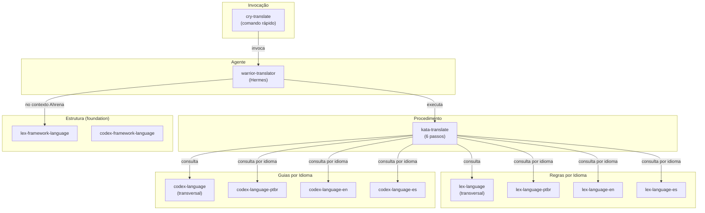

# Sistema de Tradução do Ahrena

> Documentação completa do sistema de internacionalização e tradução de documentação técnica.

## Visão Geral

O sistema de tradução do Ahrena é um conjunto de artefatos que permite traduzir qualquer documentação técnica em Markdown de forma consistente, com regras e guias específicos por idioma. Foi projetado para ser **genérico** — funciona para documentação do framework Ahrena, de projetos e de qualquer outro conteúdo técnico.

O sistema é composto por **Lexis** (leis), **Codex** (guias), um **Kata** (procedimento), um **Warrior** (agente) e um **Cry** (comando), organizados no Clade `documentation/i18n/`.

## Arquitetura



## Inventário de Artefatos

### `documentation/i18n/` (tradução genérica)

| Artefato | Tipo | Descrição |
|----------|------|-----------|
| `lex-language` | Lexis | Regras **transversais** de tradução (aplicam-se a qualquer idioma) |
| `lex-language-ptbr` | Lexis | Regras para traduzir **para pt-BR** |
| `lex-language-en` | Lexis | Regras para traduzir **para inglês** |
| `lex-language-es` | Lexis | Regras para traduzir **para espanhol** |
| `codex-language` | Codex | Guia **transversal** de tradução |
| `codex-language-ptbr` | Codex | Guia para traduzir **para pt-BR** |
| `codex-language-en` | Codex | Guia para traduzir **para inglês** |
| `codex-language-es` | Codex | Guia para traduzir **para espanhol** |
| `kata-translate` | Kata | Procedimento de tradução em **6 passos** |
| `warrior-translator` | Warrior | Agente **Hermes** — tradutor especialista |
| `cry-translate` | Cry | Comando rápido com **ordem de tradução** |

### `_foundation/i18n/` (estrutura do framework)

| Artefato | Tipo | Descrição |
|----------|------|-----------|
| `lex-framework-language` | Lexis | Idioma como raiz de navegação em `framework/` |
| `codex-framework-language` | Codex | Manual de organização de pastas por idioma |

## Como Usar

### Traduzir um documento para todos os idiomas

```
/cry-translate framework/pt-BR/_foundation/process/lexis/lex-directives.md
```

O `cry-translate` irá:
1. Ler `.ahrena/.directives` para saber os idiomas obrigatórios
2. Identificar que o idioma de origem é pt-BR
3. Traduzir para es (consultando regras de espanhol)
4. Traduzir para en (consultando regras de inglês)

### Traduzir para um idioma específico

```
/cry-translate docs/architecture.md en
```

### Traduzir com ordem personalizada

```
/cry-translate docs/api.md es,en --order en,es
```

## Extensibilidade: Adicionando um Novo Idioma

Para adicionar um novo idioma (ex: japonês `ja`):

1. **Atualizar `.ahrena/.directives`:**
   - Adicionar `ja` à lista `language.i18n`

2. **Criar os artefatos de tradução:**
   - `lex-language-ja` — Regras para traduzir para japonês
   - `codex-language-ja` — Guia para traduzir para japonês

3. **Criar a pasta de idioma no framework:**
   - `framework/ja/` com a estrutura espelhada

4. **Traduzir os artefatos existentes:**
   - Usar `cry-translate` para traduzir cada documento para `ja`

Os artefatos transversais (`lex-language`, `codex-language`, `kata-translate`, `warrior-translator`, `cry-translate`) **não precisam ser alterados** — já suportam qualquer idioma via `lex-language-{lang}`.

## Relação com `_foundation/i18n/`

| Clade | Responsabilidade |
|-------|-----------------|
| `_foundation/i18n/` | **Estrutura:** como as pastas de idioma são organizadas, regras de navegação, espelhamento |
| `documentation/i18n/` | **Tradução:** como traduzir conteúdo, regras linguísticas por idioma, agente, comando |

A `_foundation/i18n/` define o **esqueleto** (pastas e endereçamento). A `documentation/i18n/` define o **conteúdo** (como traduzir com qualidade).

## Referências

- `.ahrena/.directives` — Fonte da verdade para idiomas e endereçamento
- `lex-framework-language` — Lei estrutural de idiomas do framework
- `codex-framework-language` — Manual estrutural de idiomas do framework
