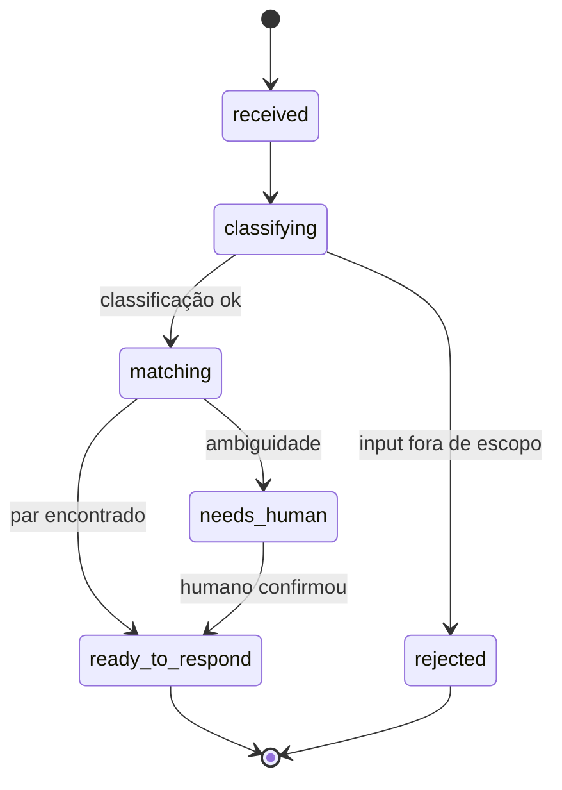
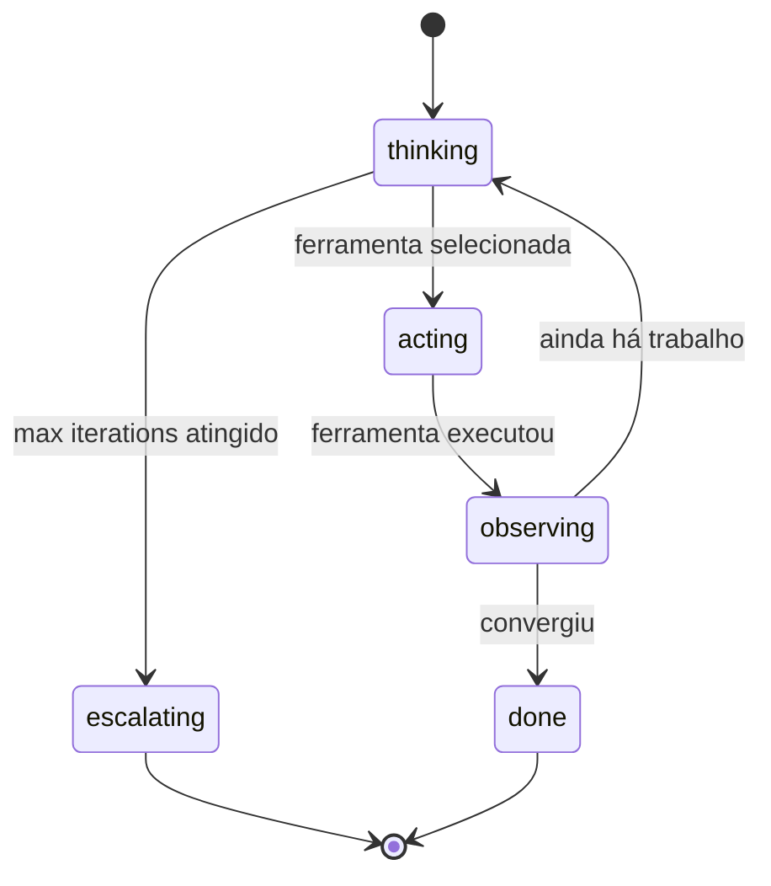

# Kata: Design do Orchestrator e Reasoning Loop

> **Prefixo:** `kata-` | **Tipo:** Skill Repetível | **Escopo:** Engenharia — Agents: design do orquestrador do agent em `operational-concrete`, produzindo `orchestrator.md` e `reasoning-loop.md`

## Objetivo

Produzir o orquestrador canônico do agent: o componente raiz que recebe o input do usuário, executa o loop de raciocínio, despacha ferramentas, delega a specialists quando aplicável e produz o output. Cobre parte da **Diretriz 04 — Loop de Feedback Explícito** (o lado runtime do loop) e a estrutura cognitiva mencionada em `lex-agent-construction-directives`.

Produz dois arquivos:

- `orchestrator.md` — persona do orquestrador, escopo, estados entre specialists, workflow completo
- `reasoning-loop.md` — padrão de raciocínio escolhido (ReAct, Plan-and-Execute, Reflexion, etc.), estados do loop, parâmetros operacionais (max iterations, timeout, fallback)

## Quando Usar

- Após `kata-agent-overview-design` ter produzido `overview.md` e `system-prompt.md`
- Antes de `kata-agent-specialists-design` (o orchestrator decide se specialists serão delegados a Theseus)
- Quando há revisão de arquitetura de raciocínio do agent (ex.: mudança de ReAct para Plan-and-Execute aprovada via ADR)

## Inputs

| Input | Obrigatório | Descrição |
|-------|:-----------:|-----------|
| `context` | Sim | Bounded Context |
| `agent` | Sim | Slug do agent |
| `overview_path` | Sim | `docs/{context}/agents/{agent}/overview.md` (produzido pelo kata anterior) |
| `system_prompt_path` | Sim | `docs/{context}/agents/{agent}/system-prompt.md` (produzido pelo kata anterior) |
| `--from-pov <path>` | Não | Path do PoV; orquestrador deriva loop e estados do PoV quando disponível |
| `--pattern` | Não | `react` \| `plan-and-execute` \| `reflexion` \| `tool-calling-simple` (padrão decidido na fase de design) |

## Workflow

```
Progresso:
- [ ] 1. Ler overview + system-prompt + (opcional) PoV
- [ ] 2. Escolher padrão de raciocínio (com justificativa)
- [ ] 3. Decidir specialists (1, vários, ou nenhum)
- [ ] 4. Redigir orchestrator.md (persona, escopo, estados, workflow)
- [ ] 5. Redigir reasoning-loop.md (padrão, estados, parâmetros)
- [ ] 6. Validação final
```

### Passo 1: Ler overview + system-prompt + (opcional) PoV

1. Carrega `overview.md` para extrair caso de uso primário e fora de escopo
2. Carrega `system-prompt.md` para extrair blocos 2 (capacidades + fronteiras) e 3 (estilo de raciocínio)
3. Em `with-pov`, lê `pov-path/system-prompt.md` e quaisquer notas sobre estados do PoV — herda quando aplicável, refina para rigor de produção

### Passo 2: Escolher padrão de raciocínio

| Padrão | Quando usar | Quando NÃO usar |
|--------|-------------|-----------------|
| `tool-calling-simple` | Agent com 1-3 tools e 1 ciclo deterministic (entrada → ferramenta → resposta) | Quando precisa decompor em sub-tarefas |
| `react` | Agent que itera entre `Thought → Action → Observation` até convergir | Em tarefas com plano global fixo (use plan-and-execute) |
| `plan-and-execute` | Agent que precisa decompor input em N sub-tarefas explícitas e executar em ordem | Em tarefas single-shot |
| `reflexion` | Agent que precisa auto-revisar output antes de devolver (qualidade > latência) | Em tier-1 com SLO de latência apertado |

A escolha DEVE estar justificada em uma seção dedicada de `reasoning-loop.md`. Não usar padrão sem justificativa.

### Passo 3: Decidir specialists

Specialists são sub-agentes invocados pelo orchestrator quando a tarefa decompõe em sub-domínios cognitivos distintos. Regras:

- **0 specialists** — o orchestrator faz tudo. Aceitável quando o escopo é estreito e o padrão de raciocínio é `tool-calling-simple` ou `react`
- **1 specialist** — overkill na maioria dos casos; reavaliar se faz sentido criar a abstração
- **2-5 specialists** — caso normal para `plan-and-execute`; cada specialist tem aggregate próprio (delegação a `warrior-theseus` via `kata-agent-specialists-design`)
- **> 5 specialists** — sinaliza que o escopo do agent está grande demais; sugerir split em dois agents

Registra a decisão no `orchestrator.md` seção `Estados (entre specialists)`. Quando ≥ 2 specialists, marca obrigação de invocar `kata-agent-specialists-design` em seguida.

### Passo 4: Redigir orchestrator.md

Template canônico:

```markdown
# Orchestrator — {agent}

> **Bounded Context:** {context}
> **Agent:** {agent}
> **Source of truth:** `system-prompt.md` define a identidade; este arquivo define a orquestração runtime.

## Persona

{Persona resumida do orchestrator — é o "fio condutor" do agent. Direta, alinhada a `system-prompt.md::Bloco 1`.}

## Escopo

- **Faz:** orquestrar o ciclo de raciocínio, despachar ferramentas, delegar a specialists, produzir output canônico
- **Não faz:** lógica de domínio dos specialists (delegada), persistência direta (delegada a tools), tomada de decisão sobre escopo estrutural (escalonamento humano via `escalation.md`)

## Specialists declarados

| Specialist | Path | Aggregate (Theseus) |
|-----------|------|---------------------|
| `{specialist-1}` | `specialists/{specialist-1}.md` | `{aggregate-name}` |
| `{specialist-2}` | `specialists/{specialist-2}.md` | `{aggregate-name}` |

> Quando 0 specialists: declarar `Specialists declarados: nenhum (orquestrador faz tudo)`.

## Estados (entre specialists)



> Substituir pelo diagrama real do agent.

## Workflow (com tools e dependências)

| Etapa | O que faz | Tools usadas | Specialist | Memória consumida | Erros possíveis |
|-------|-----------|--------------|------------|-------------------|------------------|
| 1. Receber | Recebe input, valida `org_id`/`client_id`, classifica intenção | (nenhuma) | — | curta | `ERR400_INVALID_PARAMETER` |
| 2. Classificar | Decide qual specialist invocar | search histórico | classifier | média | `ERR409_AMBIGUOUS_INTENT` |
| 3. Executar | Delega ao specialist apropriado | (depende do specialist) | (variável) | (variável) | (variável) |
| 4. Auto-revisão (opcional, reflexion) | Verifica output antes de devolver | critic LLM | — | (nenhuma) | — |
| 5. Responder | Aplica formato de saída | (nenhuma) | — | curta | — |

## Loop de feedback runtime

- **HITL para ações irreversíveis:** {lista as ações que pedem confirmação humana — cross-link `feedback.md::HITL irreversibles`}
- **Critic LLM:** {invocado em quais etapas, modelo usado, threshold de aceitação}
- **Métricas runtime:** {nomes de métricas emitidas via decorator de observability — cross-link `metrics.md`}

## Referências

- `system-prompt.md` — identidade canônica
- `reasoning-loop.md` — padrão de raciocínio + estados internos do loop
- `specialists/` — sub-agentes invocados
- `tools.md` — catálogo de ferramentas
- `memory.md` — camadas consumidas
- `feedback.md`, `metrics.md` — loop de feedback + SLO
- `guardrails.md` — controles OWASP LLM Top 10 2025 aplicados
- `lex-agent-design-docs`, `lex-agent-construction-directives`
```

### Passo 5: Redigir reasoning-loop.md

```markdown
# Reasoning Loop — {agent}

> **Padrão:** `tool-calling-simple` \| `react` \| `plan-and-execute` \| `reflexion`
> **Justificativa da escolha:** {1-3 frases referenciando trade-offs}

## Estados do loop



> Substituir pelo diagrama real do padrão escolhido.

## Parâmetros operacionais

| Parâmetro | Valor | Justificativa |
|-----------|-------|---------------|
| `max_iterations` | {N} | trade-off latência × completude |
| `timeout_per_step` | {N}s | per SLO declarado (tier-1/2) |
| `temperature` | {0.0 - 1.0} | determinismo necessário para reconciliação |
| `top_p` | {0.0 - 1.0} | |
| `fallback_action` | {ação} | ex.: `escalate_to_human` quando exceder max iterations |

## Encadeamento com outros arquivos

- **Identidade carregada:** lê `system-prompt.md` no boot (snapshot imutável durante a sessão)
- **Memória consumida por estado:**
  - `thinking`: curta + média
  - `acting`: nenhuma (tool consome o que precisa)
  - `observing`: curta + (opcional longa)
- **Tools despachadas:** ver `tools.md`
- **Feedback emitido:** ver `feedback.md` + `metrics.md`

## Referências

- `orchestrator.md` — orquestrador que encarna este loop
- `lex-agent-construction-directives::Diretriz 04`
```

### Validação Final

- [ ] `orchestrator.md` tem seção `Specialists declarados` preenchida (nenhum, ou lista com paths)
- [ ] Quando ≥ 2 specialists, obrigação de `kata-agent-specialists-design` registrada
- [ ] Diagrama Mermaid `stateDiagram-v2` válido e refletindo o caso de uso
- [ ] `reasoning-loop.md::Padrão` é um dos 4 padrões enumerados, com justificativa
- [ ] Parâmetros operacionais com valores concretos (não placeholders) e justificativa
- [ ] Cross-references com `tools.md`, `memory.md`, `feedback.md`, `metrics.md` declaradas

## Outputs

| Output | Formato | Destino |
|--------|---------|---------|
| `orchestrator.md` | Markdown | `docs/{context}/agents/{agent}/orchestrator.md` |
| `reasoning-loop.md` | Markdown | `docs/{context}/agents/{agent}/reasoning-loop.md` |

## Restrições

- `orchestrator.md` NÃO contém prompt completo — referencia `system-prompt.md`
- `reasoning-loop.md` NÃO duplica o workflow do orchestrator — fica restrito ao loop interno
- Padrão de raciocínio sem justificativa é proibido
- > 5 specialists exige escalonamento humano via `escalation.md::Critérios de Escalação`

---

**Modelo:** Kata produz a estrutura de orquestração + loop de raciocínio do agent. Decide se specialists são necessários e prepara handoff para `kata-agent-specialists-design` quando aplicável.
