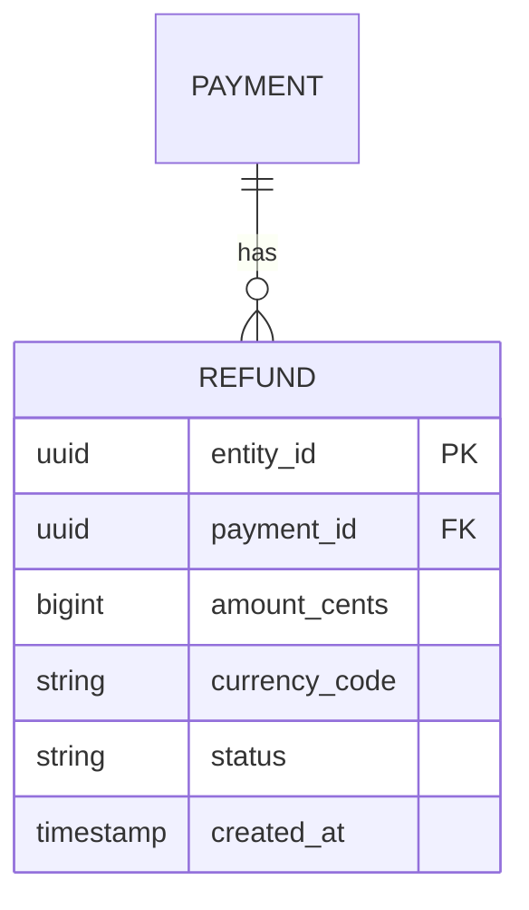
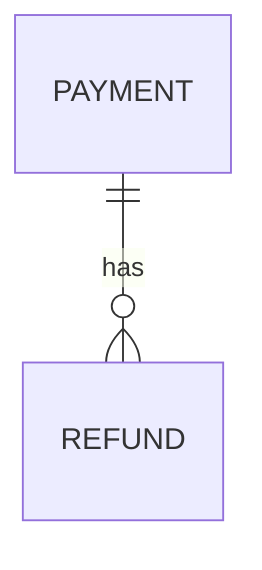

# Kata: Desenhar Schema de Dados

> **Prefixo:** `kata-` | **Tipo:** Skill Repetível | **Escopo:** Desenho de schema para nova entidade, domínio ou expansão de modelo existente — entidades, relacionamentos, índices, migrations, retenção

## Objetivo

Dada a descrição de uma entidade ou domínio nova (ex.: módulo de refund, cadastro de beneficiários), produzir **proposta de schema** completa: entidades, atributos, relacionamentos, índices, estratégia de migration (expand-contract quando necessário), política de retenção, e decisão relacional vs. NoSQL. Saída é consumida pelo `warrior-apollo` (implementação) e pelo `warrior-atlas` (provisão de DB).

## Quando Usar

- Feature nova que persiste dados não modelados antes
- Evolução de entidade existente com mudança estrutural (novo relacionamento, cardinalidade)
- Invocada por `warrior-demeter` ou delegada por `warrior-athena` na Fase 3

## Inputs

| Input | Obrigatório | Descrição |
|-------|:-----------:|-----------|
| Descrição do domínio | Sim | Que entidades existem, como se relacionam, fluxos principais |
| Requisitos de escala | Sim | Volume esperado (rows/mês), padrão de acesso (read-heavy vs. write-heavy), latência |
| Compliance | Não | PII? Retenção regulada? Residência de dados? |
| Stack existente | Sim | Qual DB já em uso (Aurora? DynamoDB?) para consistência |

## Workflow

```
Progresso:
- [ ] 1. Identificar entidades, value objects, aggregates
- [ ] 2. Modelar relacionamentos e cardinalidades
- [ ] 3. Decidir relacional vs. NoSQL
- [ ] 4. Definir atributos e tipos
- [ ] 5. Definir índices para access patterns
- [ ] 6. Classificar PII e política de retenção
- [ ] 7. Estratégia de migration (se evolução)
- [ ] 8. Persistir documento de schema
```

### Passo 1: Entidades, value objects, aggregates

Usando `codex-data-modeling`:

- Listar entidades com identidade própria (`Refund`, `Payment`).
- Identificar value objects imutáveis (`Money`, `Address`).
- Desenhar aggregates: qual entidade é raiz; quais são interna do aggregate.

Regra: aggregate = boundary de transação. Pequeno = concorrência maior.

### Passo 2: Relacionamentos

Para cada par de entidades:

- **1:1**: FK + unique constraint (considerar merge na mesma tabela se sempre juntos).
- **1:N**: FK na entidade "many".
- **N:M**: tabela de junção com atributos próprios quando há metadado da relação.
- **Polimórfico**: evitar; preferir tabelas separadas ou interface pattern.

Desenhar diagrama ER simples em Mermaid:



### Passo 3: Relacional vs. NoSQL

Decision tree em `codex-data-modeling`:

- **Aurora PostgreSQL** é o default para Guardia (OLTP transacional).
- **DynamoDB** para access patterns conhecidos + escala massiva.
- **Misto** é válido (OLTP relacional + read model em DynamoDB/OpenSearch).

Se decisão é não trivial → ADR via `kata-adr-write`.

### Passo 4: Atributos e tipos

Para cada entidade:

- Atributos base de Ahrena (`codex-entities`): `entity_id`, `entity_type`, `version`, `created_at`, `updated_at`, `created_by`, `updated_by`.
- Campos específicos com tipo explícito e constraints.
- Money: `amount_cents` (bigint) + `currency_code` (char(3)) — nunca float.
- Timestamps: sempre UTC (`timestamp with time zone` em Postgres, epoch em DynamoDB).
- Enums: validar no código + `CHECK` constraint em DB.

Para cada coluna, decidir: NOT NULL? DEFAULT? UNIQUE?

### Passo 5: Índices

Listar queries principais (access patterns):

```
Q1: list refunds by payment_id ordered by created_at DESC
Q2: find refund by idempotency_key (unique)
Q3: count refunds in last 24h for fraud rule
```

Índices derivados:

```sql
CREATE INDEX idx_refund_payment_created ON refund (payment_id, created_at DESC);
CREATE UNIQUE INDEX idx_refund_idempotency ON refund (idempotency_key);
-- Q3 pode usar índice de Q1 (prefixo (created_at DESC)) ou precisar de outro
```

Verificar com `EXPLAIN` quando possível.

### Passo 6: PII e retenção

Classificar cada coluna:

| Coluna | Classe | Retenção |
|---|---|---|
| `entity_id` | sistema | 7y (audit) |
| `customer_cpf` | PII | LGPD — soft delete 5y inactive |
| `amount_cents` | transacional | 7y (legal) |
| `notes` (livre texto) | potencial PII | evitar livre; se necessário, retenção 90d |

Atualizar `docs/data-retention.yaml` (`lex-data-retention`).

### Passo 7: Migration (se evolução)

Se é evolução de schema existente, aplicar expand-contract (`lex-migrations-reversible`):

1. **Expand**: ADD COLUMN nullable; código escreve em ambos.
2. **Backfill**: job em batches.
3. **Cut-over**: código usa só novo.
4. **Contract**: DROP ou NOT NULL aplicado.

Estimar duração por fase; se alguma excede 10min em prod, detalhar estratégia (pg_repack, janela).

### Passo 8: Persistir documento de schema

Estrutura em `docs/issues/issue-{n}/03b-schema.md` (complementa architecture.md):

```markdown
# Schema — Issue #{n}: {título}

## Entidades

### Refund (aggregate root)

| Coluna | Tipo | Constraints | Notas |
|---|---|---|---|
| entity_id | UUID | PK | v4 |
| payment_id | UUID | FK → payment.entity_id, NOT NULL | |
| amount_cents | BIGINT | NOT NULL, CHECK > 0 | |
| idempotency_key | TEXT | UNIQUE | |
| ... | ... | ... | ... |

## Relacionamentos



## Índices

| Nome | Colunas | Motivo |
|---|---|---|
| idx_refund_payment_created | (payment_id, created_at DESC) | Q1 (lista por payment) |
| ... | ... | ... |

## PII e retenção

| Coluna | Classe | Retenção |
|---|---|---|

## Migration

(se aplicável, expand-contract)

## Decisão: DB

Aurora PostgreSQL (OLTP) + Redis cache para idempotency lookups.

ADR referenciado: docs/adr/ADR-XXX-aurora-for-refund.md
```

## Saídas

| Saída | Formato | Destino |
|-------|---------|---------|
| Documento de schema | Markdown | `docs/issues/issue-{n}/03b-schema.md` |
| Diagrama ER | Mermaid embutido | No documento |
| Atualização de retenção | YAML | `docs/data-retention.yaml` |
| ADR (se necessário) | Markdown MADR | `docs/adr/ADR-*` |

## Restrições

- **Sem over-design**: se entidade simples, não forçar aggregate pattern.
- **Atributos base obrigatórios**: sempre `entity_id`, `created_at`, `updated_at`.
- **Índices justificados**: cada índice tem access pattern documentado; não especular.
- **Retenção declarada**: cada tabela nova atualiza `docs/data-retention.yaml`.

## Referências

- `codex-data-modeling`
- `lex-migrations-reversible`, `lex-data-retention`
- `codex-entities` — campos base Ahrena
- `warrior-demeter`
