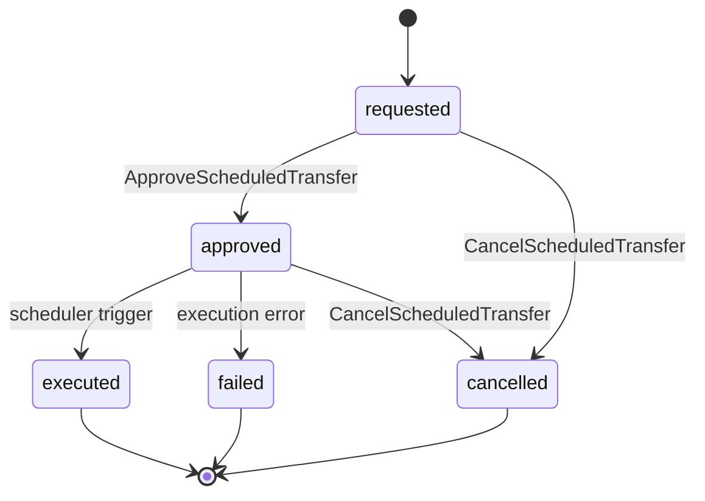

# Codex: Documentos de Design de Feature — Estrutura e Templates

> **Prefixo:** `codex-` | **Tipo:** Manual de Referência | **Escopo:** Plataforma Guardia — templates e convenções para os documentos produzidos no ciclo de design de feature

## Visão Geral

Este Codex é o manual canônico dos documentos de design de feature da plataforma Guardia. Define a estrutura de pastas dentro de `docs/`, o template de cada categoria e as convenções que `warrior-prometheus`, `warrior-theseus`, `warrior-daedalus`, `warrior-kronos` e qualquer agente que produza esses documentos DEVE seguir. A Lei correspondente está em `lex-feature-design-docs`.

## Contexto

- **Domínio:** organização de artefatos de design de feature na plataforma Guardia
- **Público-alvo:** warriors de design, autores humanos, revisores de PR
- **Atualização:** a cada mudança na estrutura ou templates (ADR obrigatório quando muda categoria reservada)

## Estrutura Canônica

```
docs/
└── {context}/                  # Bounded Context em kebab-case
    ├── entities/
    │   └── {entity-name}.md
    ├── oas/
    │   └── openapi.yaml
    ├── events/
    │   └── events.md
    ├── agents/                 # reservado
    └── metrics/                # reservado
```

### Convenções

| Item | Regra |
|------|-------|
| `{context}` | Bounded Context em kebab-case. Ex.: `ScheduledPayments` → `scheduled-payments` |
| Arquivos de `entities/` | kebab-case do PascalCase. Ex.: `ScheduledTransfer` → `scheduled-transfer.md` |
| Arquivo de `oas/` | `openapi.yaml`; quando múltiplas APIs: `openapi-{slug}.yaml` |
| Arquivo de `events/` | `events.md` |
| Idioma | conforme `language.default` em `.ahrena/.directives` |

## Templates

### 1. `entities/{entity-name}.md`

Cada entidade do Bounded Context tem **um arquivo dedicado** em `docs/{context}/entities/`. O template é:

````markdown
# Entity: {NomeDaEntidade}

> **Classificação DDD:** Entity | Aggregate Root | Value Object
> **Bounded Context:** {context}
> **entity_type:** `{snake_case}`

## Por que existe

{Descrever em 2 a 4 frases o motivo de a entidade existir no domínio. Foque no problema de negócio que ela resolve, não no esquema técnico. Exemplo: "Representa uma transferência bancária ordenada por um contador para execução em data futura. Existe para separar a intenção (agendamento) da execução (processamento) e permitir o ciclo de aprovação obrigatório por supervisor."}

## Campos

| Campo | Tipo | Tamanho | Obrigatório | Descrição |
|-------|------|---------|:-----------:|-----------|
| `entity_id` | UUID v7 | 36 | Sim | Identificador único da entidade (lex-entities) |
| `entity_type` | string | — | Sim | Valor fixo: `{snake_case}` |
| `version` | integer | — | Sim | Versão otimista da entidade |
| `created_at` | datetime (ISO 8601) | — | Sim | Criação |
| `updated_at` | datetime (ISO 8601) | — | Sim | Última atualização |
| `discarded_at` | datetime (ISO 8601) | — | Não | Soft delete (lex-entities) |
| `{campo_negocio}` | {tipo} | {tamanho} | Sim/Não | {Descrição funcional} |

> **Tipo:** use os tipos canônicos: `string`, `integer`, `decimal`, `boolean`, `datetime`, `date`, `enum<...>`, `UUID v7`, `Money`, `array<...>`, `object<...>`, ou referência a outra Entity/VO.
> **Tamanho:** comprimento máximo (string), precisão (decimal), ou `—` quando não se aplica.
> **Obrigatório:** Sim quando o campo é exigido para criar a entidade; Não quando opcional.

## Regras de Negócio

Liste numericamente as regras de negócio que governam a entidade em linguagem de domínio (não em SQL/código).

1. **{RN-1 — Nome curto}:** {regra completa em uma frase. Ex.: "Uma transferência só pode ser agendada para datas úteis em até 90 dias no futuro."}
2. **{RN-2}:** {...}
3. **{RN-3}:** {...}

## Invariantes

Invariantes são condições que **sempre são verdadeiras** sobre a entidade ou o agregado. Diferem de regras de negócio porque não admitem exceção em nenhum estado.

- **{INV-1}:** {ex.: "`amount` é sempre estritamente positivo."}
- **{INV-2}:** {ex.: "`status` só transita pelos estados definidos no diagrama."}
- **{INV-3}:** {ex.: "Uma transferência `executed` nunca pode voltar a `requested`."}

## Relações

| Relação | Cardinalidade | Tipo | Entidade Alvo | Observação |
|---------|---------------|------|---------------|------------|
| owns | 1..N | composição | `{OutraEntidade}` | {ex.: "ScheduledTransfer owns 1..N TransferApproval"} |
| references | N..1 | referência | `{OutraEntidade}` | {ex.: "Referencia Account pelo entity_id; não compõe."} |

> Use `composição` quando a entidade alvo só existe via raiz; `referência` quando alvo tem ciclo independente.

## Erros

Erros emitidos por casos de uso que tocam esta entidade. Cada erro DEVE seguir `lex-error-handling` (code, reason, message).

| Code | Reason | Mensagem | Quando ocorre |
|------|--------|----------|---------------|
| `ERR400_INVALID_PARAMETER` | `INVALID_SCHEDULED_DATE` | "scheduled_date must be a future business day" | {RN-1 violada} |
| `ERR409_CONFLICT` | `INVALID_STATE_TRANSITION` | "transfer cannot move from {from} to {to}" | Tentativa de transição inválida |

## Referências

- `lex-entities` — estrutura base obrigatória
- `lex-entity-naming` — snake_case para entity_type e campos; PascalCase nos documentos DDD
- `lex-error-handling` — formato de erros
- `docs/{context}/events/events.md` — eventos emitidos por esta entidade
- `docs/{context}/oas/openapi.yaml` — endpoints REST que expõem esta entidade
````

### 2. `oas/openapi.yaml`

A especificação OpenAPI 3.x do Bounded Context segue `codex-oas-structure` na íntegra. O arquivo `oas/openapi.yaml` é canônico. Esqueleto mínimo:

```yaml
openapi: 3.0.3
info:
  title: {Bounded Context} API
  version: 0.1.0
  description: |
    API REST do bounded context {context}. Esta especificação é a fonte de verdade
    para os endpoints expostos pelas entidades em docs/{context}/entities/.
  contact:
    name: Guardia Platform
servers:
  - url: https://api.guardia.com
    description: Production
  - url: https://api.staging.guardia.com
    description: Staging

tags:
  - name: {EntityName}
    description: Operações sobre {EntityName}

paths:
  /v1/{resource}:
    get:
      summary: Lista {resource}
      operationId: list{Resource}
      tags: [{EntityName}]
      parameters:
        - $ref: '#/components/parameters/PageSize'
        - $ref: '#/components/parameters/PageToken'
      responses:
        '200':
          description: OK
          content:
            application/json:
              schema:
                $ref: '#/components/schemas/{Resource}List'

components:
  parameters:
    PageSize: { ... }
    PageToken: { ... }
  schemas:
    {Resource}: { ... }
    {Resource}List: { ... }
  securitySchemes:
    bearerAuth:
      type: http
      scheme: bearer
      bearerFormat: JWT
```

> Diretrizes complementares: ordem de operações por recurso (`POST → GET list → GET item → PATCH → DELETE`), uso de `$ref` para schemas reutilizáveis, parâmetros canônicos de paginação (`page_size`, `page_token`) conforme `codex-restful-pagination`, e cabeçalhos obrigatórios (`Idempotency-Key`, `X-Grd-Trace-Id`) conforme `codex-restful-headers`.

### 3. `events/events.md`

Documenta **todos os eventos do Bounded Context**, organizados por entidade. Para cada entidade, um diagrama de estado em Mermaid e, para cada evento, o payload no formato CloudEvents.

````markdown
# Eventos — {Bounded Context}

> **Bounded Context:** {context}
> **Module CloudEvents:** `{module}` (segmento `{module}` em `event.guardia.{module}.{entity_type}.{event_name}`)

## Visão Geral

Resumo em 2-4 frases dos eventos publicados por este contexto e seus principais consumidores.

## Catálogo

| entity_type | event_name | type completo | Publicador | Consumidores |
|-------------|------------|--------------|-----------|--------------|
| `scheduled_transfer` | `requested` | `event.guardia.platform.scheduled_transfer.requested` | ScheduledPayments | Approval, Audit |
| `scheduled_transfer` | `approved` | `event.guardia.platform.scheduled_transfer.approved` | Approval | ScheduledPayments, Audit |
| `scheduled_transfer` | `executed` | `event.guardia.platform.scheduled_transfer.executed` | BankingIntegration | ScheduledPayments, Ledger |

---

## {NomeDaEntidadeEmPascalCase}

> `entity_type`: `{snake_case}`

### Ciclo de Vida



### Eventos

#### `event.guardia.{module}.{entity_type}.requested`

> Emitido quando o usuário cria a entidade.

```json
{
  "specversion": "1.0",
  "id": "01957f3e-a1b2-7c8d-9e0f-1a2b3c4d5e6f",
  "source": "/guardia/platform/scheduled-payments",
  "type": "event.guardia.platform.scheduled_transfer.requested",
  "subject": "scheduled_transfer/{entity_id}",
  "time": "2026-04-26T10:00:00Z",
  "datacontenttype": "application/json",
  "idempotencykey": "01957f3e-a1b2-7c8d-9e0f-1a2b3c4d5e6f",
  "data": {
    "entity_id": "01957f3e-a1b2-7c8d-9e0f-1a2b3c4d5e6f",
    "entity_type": "scheduled_transfer",
    "version": 1,
    "created_at": "2026-04-26T10:00:00Z",
    "updated_at": "2026-04-26T10:00:00Z",
    "scheduled_date": "2026-04-30",
    "amount": 100000,
    "currency": "BRL",
    "source_account_id": "...",
    "target_account_id": "..."
  }
}
```

| Campo de `data` | Tipo | Obrigatório | Descrição |
|-----------------|------|:-----------:|-----------|
| `entity_id` | UUID v7 | Sim | Identificador da entidade |
| `entity_type` | string | Sim | Sempre `{snake_case}` |
| `scheduled_date` | date | Sim | Data agendada para execução |
| `amount` | integer (centavos) | Sim | Valor em menor unidade da moeda |
| `currency` | string (ISO 4217) | Sim | Código da moeda |

**Idempotência:** `idempotencykey` igual ao `entity_id` da requisição original.
**Trigger:** Use Case `RequestScheduledTransfer`.

---

#### `event.guardia.{module}.{entity_type}.approved`

> Emitido quando supervisor aprova.

```json
{ ... payload completo ... }
```

| Campo | Tipo | Obrigatório | Descrição |
|-------|------|:-----------:|-----------|

**Trigger:** Use Case `ApproveScheduledTransfer`.

---

(repita para cada evento da entidade)

---

## {OutraEntidade}

(repete a estrutura: ciclo de vida → eventos com payload)

## Referências

- `lex-cloudevents`, `codex-cloudevents` — formato CloudEvents
- `lex-entity-naming` — snake_case nos segmentos do tipo CloudEvents
- `lex-idempotency` — `idempotencykey` obrigatório
- `docs/{context}/entities/` — entidades que emitem estes eventos
````

### 4. `agents/` — reservado

Reservado para documentar agentes (Isac, automações, integrações) que atuam neste contexto. Estrutura definida em rodada futura.

### 5. `metrics/` — reservado

Reservado para SLI/SLO, dashboards e métricas de produto e operação do contexto. Estrutura definida em rodada futura, alinhada a `lex-slo-required` e `lex-observability-required`.

## Relações Cruzadas

Os três tipos de documento se referenciam:

| De → Para | Referência |
|-----------|------------|
| `entities/{e}.md` → `events/events.md` | Lista os eventos emitidos pela entidade na seção *Referências* |
| `entities/{e}.md` → `oas/openapi.yaml` | Lista os endpoints REST que expõem a entidade |
| `events/events.md` → `entities/` | Cada seção da entidade no events.md referencia o arquivo da entidade |
| `oas/openapi.yaml` → `entities/` | Schemas refletem o catálogo de campos das entidades |

A consistência cruzada é verificada pelo `warrior-prometheus` ao final do ciclo (Fase 4 — Verificação de Consistência).

## Restrições

- **Não inverter a hierarquia:** sempre `docs/{context}/{categoria}/`. Categoria como nível superior (`docs/entities/{context}/...`) é PROIBIDO.
- **Não duplicar campo de entidade no payload de evento:** o payload referencia o catálogo da entidade; só campos relevantes ao evento são reproduzidos.
- **Não criar arquivo único de "domínio":** o modelo de domínio se distribui entre `entities/` (tabelas e regras), `events/` (ciclo de vida) e `oas/` (contrato exposto). O documento monolítico `domain-model.md` é descontinuado.
- **Não usar paths configuráveis:** `paths.domain`, `paths.oas`, `paths.events` foram removidos de `.ahrena/.directives`. A estrutura é fixa e codificada nesta Lexis/Codex.

## Referências

- `lex-feature-design-docs` — Lei correspondente
- `kata-feature-design-docs` — procedimento operacional
- `lex-entities`, `codex-entities` — estrutura base de entidades
- `lex-entity-naming` — convenções de nomeação
- `lex-cloudevents`, `codex-cloudevents` — eventos
- `codex-oas-structure` — estrutura do OpenAPI
- `codex-restful-payload`, `codex-restful-headers`, `codex-restful-pagination` — convenções REST
- `warrior-prometheus`, `warrior-theseus`, `warrior-daedalus`, `warrior-kronos` — agentes que produzem estes documentos
