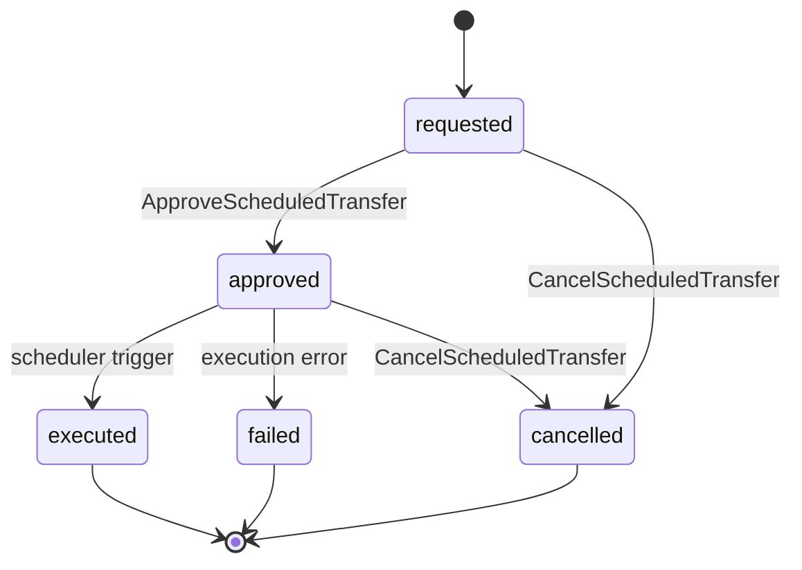
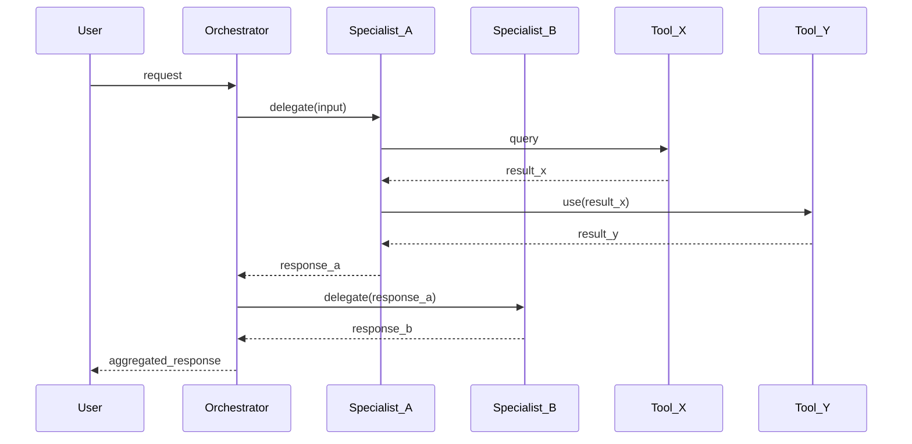
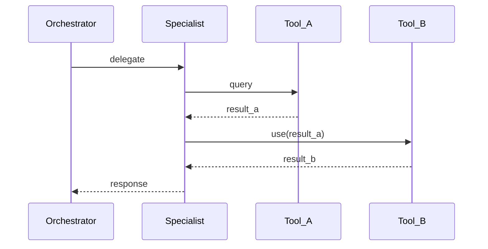
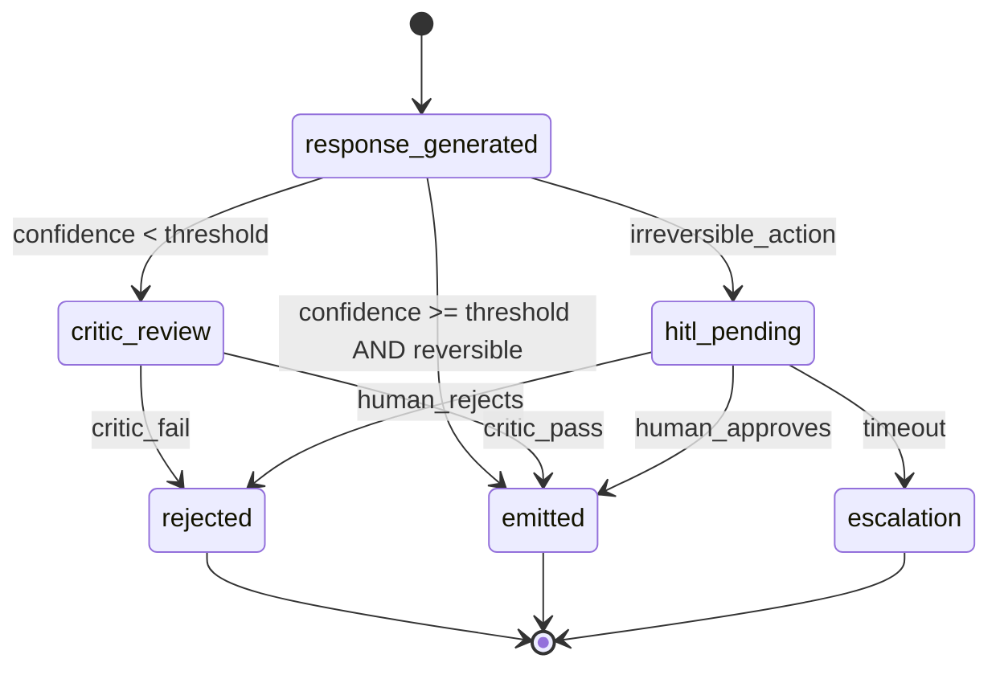
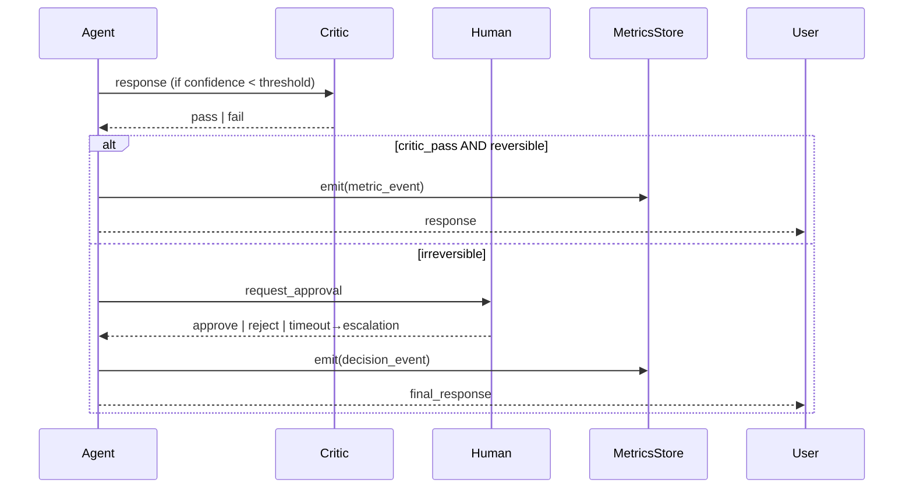
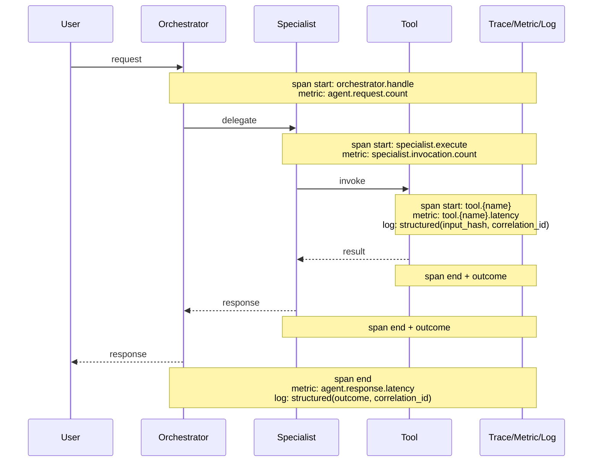
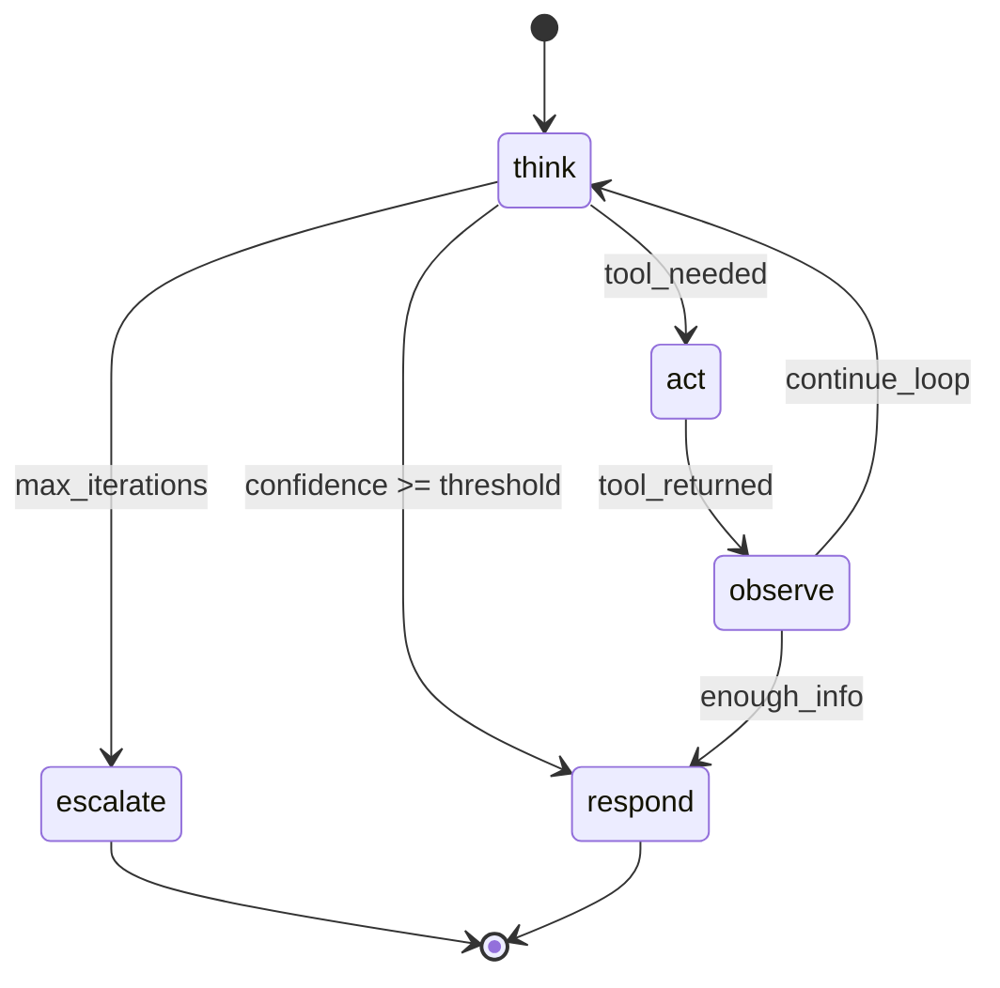
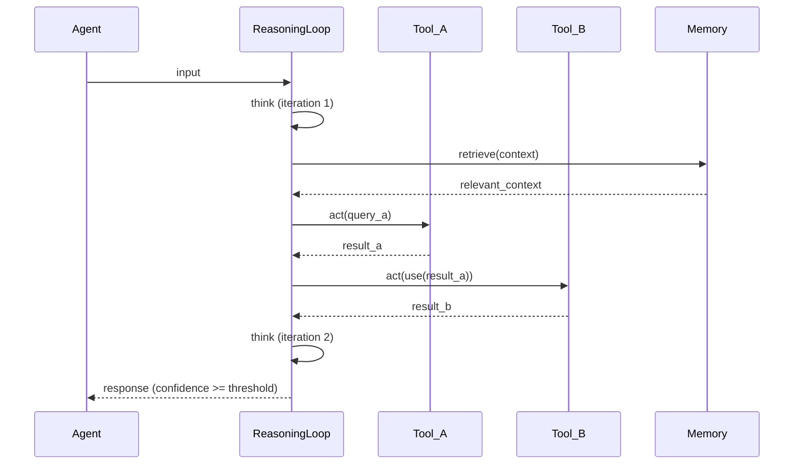
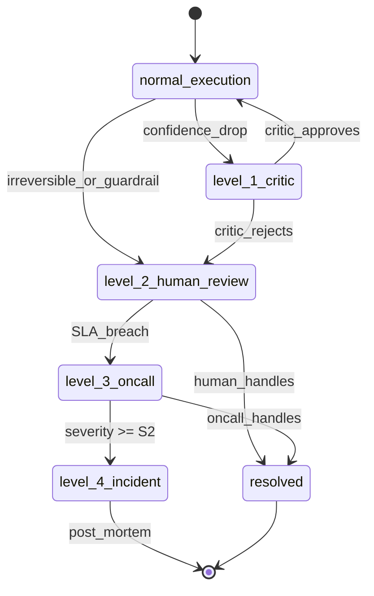
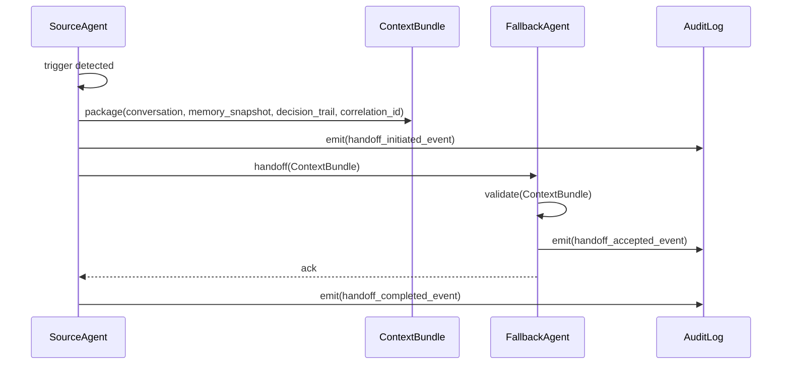

# Codex: Documentos de Design de Feature — Estrutura e Templates

> **Prefixo:** `codex-` | **Tipo:** Manual de Referência | **Escopo:** Plataforma Guardia — templates e convenções para os documentos produzidos no ciclo de design de feature

## Visão Geral

Este Codex é o manual canônico dos documentos de design de feature da plataforma Guardia. Define a estrutura de pastas dentro de `docs/`, o template de cada categoria e as convenções que `warrior-prometheus`, `warrior-theseus`, `warrior-daedalus`, `warrior-kronos` e qualquer agente que produza esses documentos DEVE seguir. A Lei correspondente está em `lex-feature-design-docs`.

## Contexto

- **Domínio:** organização de artefatos de design de feature na plataforma Guardia
- **Público-alvo:** warriors de design, autores humanos, revisores de PR
- **Atualização:** a cada mudança na estrutura ou templates (ADR obrigatório quando muda categoria reservada)

## Estrutura Canônica

```
docs/
└── {context}/                  # Bounded Context em kebab-case
    ├── entities/
    │   └── {entity-name}.md
    ├── oas/
    │   └── openapi.yaml
    ├── events/
    │   └── events.md
    ├── agents/
    │   └── {agent}/            # 13 arquivos por agente (ver seção 4)
    ├── dooc/
    │   └── {agent-name}.md     # DoOC snapshot por agent (ver seção 5)
    └── metrics/                # reservado — métricas capability-level (ver seção 6)
```

### Convenções

| Item | Regra |
|------|-------|
| `{context}` | Bounded Context em kebab-case. Ex.: `ScheduledPayments` → `scheduled-payments` |
| Arquivos de `entities/` | kebab-case do PascalCase. Ex.: `ScheduledTransfer` → `scheduled-transfer.md` |
| Arquivo de `oas/` | `openapi.yaml`; quando múltiplas APIs: `openapi-{slug}.yaml` |
| Arquivo de `events/` | `events.md` |
| Idioma | conforme `language.default` em `.ahrena/.directives` |

## Templates

### 1. `entities/{entity-name}.md`

Cada entidade do Bounded Context tem **um arquivo dedicado** em `docs/{context}/entities/`. O template é:

````markdown
# Entity: {NomeDaEntidade}

> **Classificação DDD:** Entity | Aggregate Root | Value Object
> **Bounded Context:** {context}
> **entity_type:** `{snake_case}`

## Por que existe

{Descrever em 2 a 4 frases o motivo de a entidade existir no domínio. Foque no problema de negócio que ela resolve, não no esquema técnico. Exemplo: "Representa uma transferência bancária ordenada por um contador para execução em data futura. Existe para separar a intenção (agendamento) da execução (processamento) e permitir o ciclo de aprovação obrigatório por supervisor."}

## Campos

| Campo | Tipo | Tamanho | Obrigatório | Descrição |
|-------|------|---------|:-----------:|-----------|
| `entity_id` | UUID v7 | 36 | Sim | Identificador único da entidade (lex-entities) |
| `entity_type` | string | — | Sim | Valor fixo: `{snake_case}` |
| `version` | integer | — | Sim | Versão otimista da entidade |
| `created_at` | datetime (ISO 8601) | — | Sim | Criação |
| `updated_at` | datetime (ISO 8601) | — | Sim | Última atualização |
| `discarded_at` | datetime (ISO 8601) | — | Não | Soft delete (lex-entities) |
| `{campo_negocio}` | {tipo} | {tamanho} | Sim/Não | {Descrição funcional} |

> **Tipo:** use os tipos canônicos: `string`, `integer`, `decimal`, `boolean`, `datetime`, `date`, `enum<...>`, `UUID v7`, `Money`, `array<...>`, `object<...>`, ou referência a outra Entity/VO.
> **Tamanho:** comprimento máximo (string), precisão (decimal), ou `—` quando não se aplica.
> **Obrigatório:** Sim quando o campo é exigido para criar a entidade; Não quando opcional.

## Regras de Negócio

Liste numericamente as regras de negócio que governam a entidade em linguagem de domínio (não em SQL/código).

1. **{RN-1 — Nome curto}:** {regra completa em uma frase. Ex.: "Uma transferência só pode ser agendada para datas úteis em até 90 dias no futuro."}
2. **{RN-2}:** {...}
3. **{RN-3}:** {...}

## Invariantes

Invariantes são condições que **sempre são verdadeiras** sobre a entidade ou o agregado. Diferem de regras de negócio porque não admitem exceção em nenhum estado.

- **{INV-1}:** {ex.: "`amount` é sempre estritamente positivo."}
- **{INV-2}:** {ex.: "`status` só transita pelos estados definidos no diagrama."}
- **{INV-3}:** {ex.: "Uma transferência `executed` nunca pode voltar a `requested`."}

## Relações

| Relação | Cardinalidade | Tipo | Entidade Alvo | Observação |
|---------|---------------|------|---------------|------------|
| owns | 1..N | composição | `{OutraEntidade}` | {ex.: "ScheduledTransfer owns 1..N TransferApproval"} |
| references | N..1 | referência | `{OutraEntidade}` | {ex.: "Referencia Account pelo entity_id; não compõe."} |

> Use `composição` quando a entidade alvo só existe via raiz; `referência` quando alvo tem ciclo independente.

## Erros

Erros emitidos por casos de uso que tocam esta entidade. Cada erro DEVE seguir `lex-error-handling` (code, reason, message).

| Code | Reason | Mensagem | Quando ocorre |
|------|--------|----------|---------------|
| `ERR400_INVALID_PARAMETER` | `INVALID_SCHEDULED_DATE` | "scheduled_date must be a future business day" | {RN-1 violada} |
| `ERR409_CONFLICT` | `INVALID_STATE_TRANSITION` | "transfer cannot move from {from} to {to}" | Tentativa de transição inválida |

## Referências

- `lex-entities` — estrutura base obrigatória
- `lex-entity-naming` — snake_case para entity_type e campos; PascalCase nos documentos DDD
- `lex-error-handling` — formato de erros
- `docs/{context}/events/events.md` — eventos emitidos por esta entidade
- `docs/{context}/oas/openapi.yaml` — endpoints REST que expõem esta entidade
````

### 2. `oas/openapi.yaml`

A especificação OpenAPI 3.x do Bounded Context segue `codex-oas-structure` na íntegra. O arquivo `oas/openapi.yaml` é canônico. Esqueleto mínimo:

```yaml
openapi: 3.0.3
info:
  title: {Bounded Context} API
  version: 0.1.0
  description: |
    API REST do bounded context {context}. Esta especificação é a fonte de verdade
    para os endpoints expostos pelas entidades em docs/{context}/entities/.
  contact:
    name: Guardia Platform
servers:
  - url: https://api.guardia.com
    description: Production
  - url: https://api.staging.guardia.com
    description: Staging

tags:
  - name: {EntityName}
    description: Operações sobre {EntityName}

paths:
  /v1/{resource}:
    get:
      summary: Lista {resource}
      operationId: list{Resource}
      tags: [{EntityName}]
      parameters:
        - $ref: '#/components/parameters/PageSize'
        - $ref: '#/components/parameters/PageToken'
      responses:
        '200':
          description: OK
          content:
            application/json:
              schema:
                $ref: '#/components/schemas/{Resource}List'

components:
  parameters:
    PageSize: { ... }
    PageToken: { ... }
  schemas:
    {Resource}: { ... }
    {Resource}List: { ... }
  securitySchemes:
    bearerAuth:
      type: http
      scheme: bearer
      bearerFormat: JWT
```

> Diretrizes complementares: ordem de operações por recurso (`POST → GET list → GET item → PATCH → DELETE`), uso de `$ref` para schemas reutilizáveis, parâmetros canônicos de paginação (`page_size`, `page_token`) conforme `codex-restful-pagination`, e cabeçalhos obrigatórios (`Idempotency-Key`, `X-Grd-Trace-Id`) conforme `codex-restful-headers`.

### 3. `events/events.md`

Documenta **todos os eventos do Bounded Context**, organizados por entidade. Para cada entidade, um diagrama de estado em Mermaid e, para cada evento, o payload no formato CloudEvents.

````markdown
# Eventos — {Bounded Context}

> **Bounded Context:** {context}
> **Module CloudEvents:** `{module}` (segmento `{module}` em `event.guardia.{module}.{entity_type}.{event_name}`)

## Visão Geral

Resumo em 2-4 frases dos eventos publicados por este contexto e seus principais consumidores.

## Catálogo

| entity_type | event_name | type completo | Publicador | Consumidores |
|-------------|------------|--------------|-----------|--------------|
| `scheduled_transfer` | `requested` | `event.guardia.platform.scheduled_transfer.requested` | ScheduledPayments | Approval, Audit |
| `scheduled_transfer` | `approved` | `event.guardia.platform.scheduled_transfer.approved` | Approval | ScheduledPayments, Audit |
| `scheduled_transfer` | `executed` | `event.guardia.platform.scheduled_transfer.executed` | BankingIntegration | ScheduledPayments, Ledger |

---

## {NomeDaEntidadeEmPascalCase}

> `entity_type`: `{snake_case}`

### Ciclo de Vida



### Eventos

#### `event.guardia.{module}.{entity_type}.requested`

> Emitido quando o usuário cria a entidade.

```json
{
  "specversion": "1.0",
  "id": "01957f3e-a1b2-7c8d-9e0f-1a2b3c4d5e6f",
  "source": "/guardia/platform/scheduled-payments",
  "type": "event.guardia.platform.scheduled_transfer.requested",
  "subject": "scheduled_transfer/{entity_id}",
  "time": "2026-04-26T10:00:00Z",
  "datacontenttype": "application/json",
  "idempotencykey": "01957f3e-a1b2-7c8d-9e0f-1a2b3c4d5e6f",
  "data": {
    "entity_id": "01957f3e-a1b2-7c8d-9e0f-1a2b3c4d5e6f",
    "entity_type": "scheduled_transfer",
    "version": 1,
    "created_at": "2026-04-26T10:00:00Z",
    "updated_at": "2026-04-26T10:00:00Z",
    "scheduled_date": "2026-04-30",
    "amount": 100000,
    "currency": "BRL",
    "source_account_id": "...",
    "target_account_id": "..."
  }
}
```

| Campo de `data` | Tipo | Obrigatório | Descrição |
|-----------------|------|:-----------:|-----------|
| `entity_id` | UUID v7 | Sim | Identificador da entidade |
| `entity_type` | string | Sim | Sempre `{snake_case}` |
| `scheduled_date` | date | Sim | Data agendada para execução |
| `amount` | integer (centavos) | Sim | Valor em menor unidade da moeda |
| `currency` | string (ISO 4217) | Sim | Código da moeda |

**Idempotência:** `idempotencykey` igual ao `entity_id` da requisição original.
**Trigger:** Use Case `RequestScheduledTransfer`.

---

#### `event.guardia.{module}.{entity_type}.approved`

> Emitido quando supervisor aprova.

```json
{ ... payload completo ... }
```

| Campo | Tipo | Obrigatório | Descrição |
|-------|------|:-----------:|-----------|

**Trigger:** Use Case `ApproveScheduledTransfer`.

---

(repita para cada evento da entidade)

---

## {OutraEntidade}

(repete a estrutura: ciclo de vida → eventos com payload)

## Referências

- `lex-cloudevents`, `codex-cloudevents` — formato CloudEvents
- `lex-entity-naming` — snake_case nos segmentos do tipo CloudEvents
- `lex-idempotency` — `idempotencykey` obrigatório
- `docs/{context}/entities/` — entidades que emitem estes eventos
````

### 4. `agents/`

Documenta os agentes de IA que atuam no Bounded Context — identidade (system-prompt embutido), memória, ferramentas, **loop de raciocínio**, feedback, **autorização**, **escalação**, escopo, métricas, guardrails. Produzido por `warrior-metis` durante o ciclo de design e consumido por `warrior-apollo-agents` durante a implementação. Cada agent é uma unidade Hub & Spoke (orchestrator + specialists subordinados) — a estrutura interna de cada agent espelha o padrão `entities/{entity}.md` aplicado aos specialists.

O **snapshot da DoOC** vive **fora** de `agents/` — em `docs/{context}/dooc/{agent}.md` (seção 5) — porque é artefato de governança (gate de promoção `pre-operational` → `operational-concrete`), não estrutura do agent.

#### Convenções específicas

| Item | Regra |
|------|-------|
| `{agent}` | kebab-case do nome do agente. Ex.: `RecClassifier` → `rec-classifier/` |
| Arquivos de `specialists/` | `{specialist-name}.md` em kebab-case. 1 arquivo por specialist. Máximo de 5 specialists por agente — acima disso, reconsiderar a arquitetura (specialists adicionais viram agentes próprios) |
| Idioma | conforme `language.default` em `.ahrena/.directives` |
| Padrão DDD | orchestrator central + N specialists subordinados |

#### Estrutura de pastas por agente

```
docs/{context}/
└── agents/
    └── {agent}/
        ├── overview.md
        ├── orchestrator.md
        ├── specialists/
        │   ├── {specialist-1}.md
        │   └── {specialist-2}.md
        ├── tools.md
        ├── memory.md
        ├── reasoning-loop.md
        ├── feedback.md
        ├── context-pack.md
        ├── system-prompt.md
        ├── metrics.md
        ├── guardrails.md
        ├── authorization.md
        └── escalation.md
```

Os 13 arquivos mapeiam às 6 Diretrizes de `lex-agent-construction-directives` (consulte `codex-agent-construction-directives` para detalhamento conceitual e exemplos canônicos de stage tags e itens da DoOC). **`feedback`, `guardrails`, `reasoning-loop`, `authorization` e `escalation` são conceitos distintos e não se sobrepõem** — feedback é o sinal de retorno após a ação, guardrails são restrições de runtime em I/O, reasoning-loop é o padrão cognitivo do agent, authorization é a permissão de ação, escalação é o protocolo de handoff. **`dooc-snapshot` vive fora de `agents/` — ver seção 5 (`dooc/`).**

#### 4.1. `overview.md`

Cabeçalho DDD-style do agente: propósito, stage tag, entry mode, tier, owner e referências cruzadas. É o ponto de entrada para qualquer humano ou agente que abre a pasta `{agent}/`.

````markdown
# Agent: {AgentName}

> **Stage:** `pre-operational` | `operational-concrete` | `legacy-pov`
> **Entry mode:** `with-pov` | `direct-entry` | `user-override`
> **Tier:** `tier-1` | `tier-2` | `tier-3` | `tier-4`
> **Owner:** @{username} (product) + @{username} (engineering)
> **Bounded Context:** {context}

## Propósito

{2 a 4 frases descrevendo o problema de negócio que o agente resolve. Foque no valor entregue, não na implementação. Exemplo: "Classifica transações bancárias em categorias contábeis para reduzir tempo de fechamento mensal de 14 para 9 dias úteis."}

## Stage tag

- **Valor declarado:** `stage: {valor}`
- **Critério de promoção:** {referência à DoOC em `dooc-snapshot.md` quando `operational-concrete`; gaps declarados quando `pre-operational` ou `legacy-pov`}

## Entry mode

- **Modo declarado:** `{with-pov | direct-entry | user-override}`
- **ADR/PDR de override:** {path em `docs/adr/` ou `docs/pdr/`, ou `N/A` quando `with-pov`}

## Referências

- `docs/{context}/agents/{agent}/orchestrator.md` — workflow do agente
- `docs/{context}/agents/{agent}/dooc-snapshot.md` — snapshot da DoOC
- `lex-agent-construction-directives` — Lei mestre das 6 Diretrizes + DoOC
- `codex-agent-construction-directives` — manual conceitual (Piaget, stage tags, anti-padrões)
````

#### 4.2. `orchestrator.md`

Documenta o **orchestrator** do agente — persona central que recebe a requisição, delega para specialists, agrega resultados e retorna ao usuário. Aplica Diretriz 01 (Identidade) e Diretriz 05 (Escopo) ao nível do orquestrador.

Diagramas Mermaid **obrigatórios**:

- `stateDiagram-v2` — estados entre specialists (qual specialist está ativo, transições entre eles).
- `sequenceDiagram` — workflow completo com tools e dependências entre tools (ordem de chamada, qual tool consome output de qual).

````markdown
# Orchestrator: {AgentName}

> **Stage:** {valor}
> **Specialists subordinados:** N

## Persona

{Papel, domínio, recusas, tom. Referenciar `lex-brand-voice` para voz Guardia.}

## Escopo

{Casos de uso cobertos; cenários fora do escopo enumerados com recusa explícita.}

## Estados (entre specialists)

```mermaid
stateDiagram-v2
    [*] --> {estado_inicial}
    {estado_inicial} --> {specialist_1_ativo}: {trigger}
    {specialist_1_ativo} --> {specialist_2_ativo}: {trigger}
    {specialist_2_ativo} --> {estado_final}: {trigger}
    {estado_final} --> [*]
```

## Workflow (com tools e dependências)



## Referências

- `docs/{context}/agents/{agent}/specialists/` — cada specialist subordinado
- `docs/{context}/agents/{agent}/tools.md` — catálogo de tools
- `docs/{context}/agents/{agent}/system-prompt.md` — instância aplicada
- `lex-system-prompt` — especificação canônica de system prompts (consultada pelo arquivo system-prompt.md)
- `lex-mcp` — quando tools de tipo MCP forem usadas
````

#### 4.3. `specialists/{name}.md`

Um arquivo **por specialist**, kebab-case. Espelha a estrutura de `entities/{entity}.md`: classificação DDD, "Por que existe", responsabilidades, subset de tools que invoca, subset de memória que consulta, erros emitidos. Diagramas Mermaid obrigatórios quando o specialist tem fluxo próprio com tools.

````markdown
# Specialist: {SpecialistName}

> **Classificação DDD:** Specialist (subordinado ao Orchestrator)
> **Agent:** {AgentName}
> **Bounded Context:** {context}

## Por que existe

{2 a 4 frases. Foque na fatia do problema que este specialist resolve e por que faz sentido isolá-lo do orquestrador.}

## Responsabilidades

- {responsabilidade 1}
- {responsabilidade 2}
- {responsabilidade 3}

## Estados

```mermaid
stateDiagram-v2
    [*] --> {estado_inicial}
    {estado_inicial} --> {estado_intermediario}: {trigger}
    {estado_intermediario} --> {estado_final}: {trigger}
    {estado_final} --> [*]
```

## Workflow com tools



## Tools consumidas (subset)

| Tool | Tipo | Side-effects | Idempotente |
|------|------|--------------|:-----------:|
| `{tool_name}` | deterministic \| ML \| MCP | none \| write \| network | Sim/Não |

## Memória consumida (subset)

| Camada | Schema referenciado | TTL |
|--------|---------------------|-----|
| curta \| média \| longa | `{schema}` | {valor} |

## Erros emitidos

| Code | Reason | Mensagem |
|------|--------|----------|
| `ERR400_INVALID_PARAMETER` | `INVALID_INPUT` | "..." |

## Referências

- `docs/{context}/agents/{agent}/orchestrator.md`
- `docs/{context}/agents/{agent}/tools.md`
- `docs/{context}/agents/{agent}/memory.md`
````

#### 4.4. `tools.md`

Catálogo tripartido de tools (Diretriz 03): **deterministic** (funções puras, validações, cálculos), **ML** (classificadores, embeddings), **MCP** (servers externos). Quando `Type = MCP`, é **obrigatório** linkar para `lex-mcp` (transport preference + comportamento de fallback).

````markdown
# Tools — {AgentName}

> **Catálogo tripartido per Diretriz 03 (`codex-agent-construction-directives`).**

## Deterministic

| Tool | Pydantic signature | Permissões | Side-effects | Idempotente |
|------|---------------------|------------|--------------|:-----------:|
| `validate_account(account_id: UUID) -> ValidationResult` | leitura | none | Sim |
| `normalize_currency(amount: int, from_currency: str, to_currency: str) -> int` | none | none | Sim |

## ML

| Tool | Pydantic signature | Modelo | Side-effects | Idempotente |
|------|---------------------|--------|--------------|:-----------:|
| `classify_transaction(text: str) -> Category` | classifier-v3 | none | Sim (mesmo input, mesmo output) |

## MCP

| Tool | Server | Transport | Side-effects | Idempotente |
|------|--------|-----------|--------------|:-----------:|
| `github.get_file(...)` | `github` | remote-http | leitura | Sim |
| `slack.send_message(...)` | `slack` | remote-http | write (notificação) | Não (requer `Idempotency-Key` per `lex-idempotency`) |

> **MCP tools** seguem `lex-mcp` (transport preference order, fallback behavior, allow-list via `mcp.servers` em `.ahrena/.directives`). Toda tool listada na seção MCP DEVE referenciar o server correspondente em `mcp.servers`.

## Idempotência

Tools que modificam estado DEVEM declarar comportamento de idempotência per `lex-idempotency` (chave + janela + payload-hash quando aplicável).

## Validação de input em fronteira

Cada tool DEVE validar input em sua fronteira via Pydantic (per `lex-python-security`); inputs inválidos retornam erro estruturado e não chegam ao corpo da função.

## Referências

- `lex-idempotency` — idempotência para tools que modificam estado
- `lex-mcp` — uso correto de servers MCP
- `lex-python-security` — validação de input em fronteira
- `lex-observability-required` — trace + metric + log por tool
````

#### 4.5. `memory.md`

Três camadas de memória (Diretriz 02): **curta** (janela da sessão), **média** (histórico do cliente/contexto recente), **longa** (regras de domínio, conhecimento institucional). Cada camada DEVE declarar retenção per `lex-data-retention` e tratamento de PII.

````markdown
# Memory — {AgentName}

> **3 camadas mandatórias para `operational-concrete` per Diretriz 02.**

## Camadas

| Camada | Schema | Store | TTL | Retenção | PII handling |
|--------|--------|-------|-----|----------|--------------|
| curta | `SessionContext` | janela do LLM | sessão | n/a | dados em trânsito; nunca persistido fora da sessão |
| média | `CustomerHistory` | Redis | 30d (rolling) | 30d (per `lex-data-retention` — classe `operational-context`) | CPF mascarado; email hash; nunca conteúdo bruto |
| longa | `DomainRules` | Postgres (versionado) + vector store | indefinido (versionado por SHA) | per `lex-data-retention` — classe `domain-knowledge` (revisão trimestral) | dados de regra (sem PII) |

## Camada curta

{Definição do schema da janela; campos preservados entre turnos da mesma sessão; limite de tokens.}

## Camada média

{Schema do histórico; chave de busca (entity_id, customer_id); estratégia de invalidação; quem escreve (orchestrator vs. specialists).}

## Camada longa

{Estratégia de RAG quando aplicável; versionamento de regras; processo de atualização (PR, ADR quando estrutural).}

## Right to be forgotten

Camada média DEVE suportar deleção on-request per `lex-data-retention` (LGPD Art. 18 / GDPR Art. 17) dentro do SLA de 15 dias.

## Referências

- `lex-data-retention` — política de retenção por classe
- `codex-data-modeling` — modelagem de schemas persistidos
````

#### 4.6. `feedback.md`

Loop de feedback explícito (Diretriz 04): **HITL** (humano no loop para irreversíveis), **critic** (LLM crítico para reversíveis) e **métricas objetivas** (signal de negócio). Diagramas Mermaid `stateDiagram-v2` + `sequenceDiagram` **obrigatórios** — cobrem loop normal, caminho de erro e escalation.

````markdown
# Feedback — {AgentName}

> **Diretriz 04 — Loop de Feedback Explícito.**

## Modalidades

| Modalidade | Quando | Bloqueante | Latência alvo |
|------------|--------|:----------:|---------------|
| HITL | ações irreversíveis (per `codex-ai-first-experience`) | Sim | < 4h business |
| Critic LLM | ações reversíveis em batch | Não | < 30s |
| Métricas objetivas | sempre | Não | dashboard em tempo real |

## Estados do loop



## Sequência (HITL + critic + métricas)



## Métricas objetivas

| Métrica | Tipo | Threshold | Janela | Dashboard |
|---------|------|-----------|--------|-----------|
| `accuracy` | leading | >= 0.92 | 7d, n >= 500 | {link} |
| `reversal_rate` | lagging | <= 0.05 | 30d | {link} |
| `time_to_action` | lagging | <= 9d (vs. baseline 14d) | mensal | {link} |

> Tier-1/2 dispara SLO formal per `lex-slo-required`; tier-3/4 mantém métricas (b) e (c) da DoOC mesmo sem SLO formal.

## Escalation matrix

| Trigger | Ação | Canal |
|---------|------|-------|
| timeout HITL > 4h | escalation para owner | Slack @{owner} |
| reversal_rate > 0.10 (24h) | pause + critic-only | runbook em `docs/runbooks/` |

## Referências

- `lex-slo-required` — SLO para tier-1/2
- `lex-runbook-for-every-alert` — runbook obrigatório para cada alerta
- `codex-ai-first-experience` — HITL para ações irreversíveis
- Diretriz 04 em `codex-agent-construction-directives`
````

#### 4.7. `context-pack.md`

Material que orienta o agente além do system prompt (Diretriz 06): few-shot, documentação de domínio, exemplos negativos curados, histórico observado. Distingue mandatórios de opcionais; mandatórios crescem com o estágio (`pre-operational` exige menos que `operational-concrete`).

````markdown
# Context Pack — {AgentName}

> **Diretriz 06 — Contexto Rico.**

## Few-shot examples

| ID | Input | Output esperado | Origem | Categoria |
|----|-------|-----------------|--------|-----------|
| FS-001 | "..." | "..." | cliente piloto | classificação típica |
| FS-002 | "..." | "..." | revisão humana | edge case |

Mandatório: 5-15 exemplos em `pre-operational`; ≥10 curados em `operational-concrete`.

## Exemplos negativos

| ID | Input | Output errado (a evitar) | Por que falha | Origem |
|----|-------|--------------------------|---------------|--------|
| NEG-001 | "..." | "..." | extrapolação fora de escopo | incidente 2026-03-12 |

Mandatório: 3-5 em `pre-operational`; ≥10 cobrindo modos de falha observados em `operational-concrete`.

## Documentação de domínio

| Path | Quando consultar |
|------|------------------|
| `docs/{context}/rules/{rule}.md` | regras de negócio versionadas |
| `docs/{context}/entities/{entity}.md` | definição da entidade alvo |

## Histórico observado (RAG)

| Janela | Estratégia | Atualização |
|--------|-----------|-------------|
| últimos 30-90d | embeddings em vector store; top-K=5 | diária |

> Mandatório apenas em `operational-concrete`; opcional em `pre-operational` (`--from-pov` enriquece quando promovido a partir de PoV).

## Referências

- Diretriz 06 em `codex-agent-construction-directives`
- `lex-data-retention` — retenção do histórico observado
````

#### 4.8. `system-prompt.md`

Este arquivo é a **instância** do system prompt aplicado ao agente. A especificação canônica (estrutura, OWASP LLM controls, voz Guardia) vive em `lex-system-prompt` *(entrega como pre-req-B do plano-032 — referenciar quando disponível)*.

````markdown
# System Prompt — {AgentName}

> **Especificação canônica:** `lex-system-prompt`
> **Stage tag:** `stage: {pre-operational | operational-concrete | legacy-pov}` *(declaração obrigatória per `codex-agent-construction-directives` — ver "Stage tags em system prompt")*

## Prompt aplicado

```text
# Agent: {agent-name}
# stage: {valor}
# DoOC: {referência ao dooc-snapshot.md quando operational-concrete; gaps quando pre-operational}
# tier: {valor}
# Owner: @{username}
# Manual: docs/{context}/agents/{agent}/overview.md

{Corpo do system prompt — papel, domínio, recusas, tom, ferramentas disponíveis, feedback.}
```

## Controles aplicados

| Controle OWASP LLM | Mecanismo | Localização |
|--------------------|-----------|-------------|
| LLM01 (prompt injection) | guardrail de detecção + sanitização | `guardrails.md` |
| LLM02 (insecure output) | output schema + validação | `tools.md` |
| LLM06 (sensitive disclosure) | PII redaction | `guardrails.md` |
| LLM07 (insecure plugin) | tools allow-list | `tools.md` |
| LLM05 (supply chain) | MCP allow-list | `lex-mcp` |

## Histórico de versões

| Versão | Data | Mudança | ADR (quando breaking) |
|--------|------|---------|------------------------|
| v1 | YYYY-MM-DD | versão inicial | n/a |

> Mudanças instantâneas por default; ADR obrigatória para breaking changes (mudança de stage, mudança em DoOC, remoção de Diretriz).

## Referências

- `lex-system-prompt` — especificação canônica *(pre-req-B; placeholder até merge)*
- `codex-agent-construction-directives` — Diretriz 01 + stage tags
- `guardrails.md` — controles aplicados
````

#### 4.9. `metrics.md`

KPIs, SLO/SLI, dashboards e alertas do agente — cobre tanto o lado **operacional** (latência, error rate, token cost) quanto o lado **de produto** (accuracy, reversal rate, time-to-action). Diagrama Mermaid `sequenceDiagram` **obrigatório** mapeando o request lifecycle (orchestrator → specialists → tools → response) com **pontos de instrumentação** explícitos (spans, métricas, log estruturado).

> Distinção: este arquivo é per-agent (operacional + KPIs do agent). Métricas **capability-level** (e.g. KPI do bounded context inteiro) ficam em `docs/{context}/metrics/` quando essa seção sair de reservada.

````markdown
# Metrics — {AgentName}

> **Tier:** `{tier-1 | tier-2 | tier-3 | tier-4}` (tier-1/2 dispara SLO obrigatório per `lex-slo-required`).

## Request lifecycle com pontos de instrumentação



## SLOs declarados

```yaml
# Referenciar arquivo canônico: docs/{context}/metrics/slo-{agent}.yaml
service: {agent-name}
tier: {tier}
slos:
  - name: response_latency_p99
    sli: agent.response.latency.p99
    objective: < 2000ms
    window: 30d
  - name: classification_accuracy
    sli: classifier.accuracy (rolling)
    objective: >= 0.92
    window: 7d
```

## Dashboards

| Dashboard | Métricas chave | Link |
|-----------|----------------|------|
| `{agent}-overview` | request rate, error rate, p99 latency, accuracy | {link} |
| `{agent}-cost` | LLM token usage, tool invocations, total cost | {link} |

## Alertas e runbooks

| Alerta | Threshold | Runbook |
|--------|-----------|---------|
| `{agent}-error-rate-high` | error_rate > 5% (5m) | `docs/runbooks/{agent}-error-rate-high.md` |
| `{agent}-accuracy-drop` | accuracy < 0.85 (24h) | `docs/runbooks/{agent}-accuracy-drop.md` |

> Per `lex-runbook-for-every-alert`, todo alerta DEVE ter runbook versionado e linkado na annotation `runbook_url`.

## Trace + metric + log obrigatórios

Per `lex-observability-required`, cada superfície de runtime nova (orchestrator, specialist, tool) DEVE emitir span + métrica de latência + log estruturado com `correlation_id`. Logs NÃO PODEM conter PII bruto.

## Referências

- `lex-slo-required` — SLO obrigatório para tier-1/2
- `lex-runbook-for-every-alert` — runbook por alerta
- `lex-observability-required` — span + metric + log por superfície de runtime
````

#### 4.10. `guardrails.md`

Controles aplicados ao agente: OWASP LLM Top 10 (LLM01/02/06/07/05), escopo de ação (Diretriz 05), redação de PII, isolamento por `org_id` e `client_id`.

````markdown
# Guardrails — {AgentName}

> **Aplica os controles especificados em `lex-system-prompt` (pre-req-B) à instância do agente.**

## Controles OWASP LLM Top 10

| ID | Risco | Controle aplicado | Localização |
|----|-------|--------------------|-------------|
| LLM01 | Prompt injection | detecção de patterns + sanitização de input + system prompt rígido | sanitizer em fronteira |
| LLM02 | Insecure output handling | schema obrigatório no output; rejeição quando schema inválido | `tools.md` |
| LLM05 | Supply chain | MCP allow-list via `mcp.servers`; tools assinadas | `lex-mcp` |
| LLM06 | Sensitive disclosure | PII redaction em logs; output filter de dados sensíveis | redactor + filter |
| LLM07 | Insecure plugin design | tools com permissões mínimas; least-privilege | `tools.md` |

## Escopo de ação (Diretriz 05)

Recusas explícitas que o agente DEVE emitir:

- Perguntas fora do domínio declarado: "{recusa-1}"
- Solicitações de dados de outro `org_id` ou `client_id`: "{recusa-2}"
- Operações que requerem aprovação humana sem HITL ativo: "{recusa-3}"

## Isolamento multitenancy

Toda chamada de tool e toda leitura de memória DEVE filtrar por `org_id` e `client_id` da sessão. O agente NÃO PODE acessar dados de outro tenant — mesmo via prompt-injection. Quando filtro não aplicado: erro estruturado e log de violação.

## Redação de PII

Em logs (per `lex-observability-required`): CPF mascarado (últimos 4 dígitos), email hash, nome substituído por `<redacted-name>`, número de conta truncado. Conteúdo bruto NUNCA persiste em log; persistência apenas na camada média de memória com retenção declarada per `lex-data-retention`.

## LGPD / GDPR

- Direito ao esquecimento: deleção on-request em até 15d (LGPD Art. 18).
- Direito à portabilidade: export estruturado da memória média sob solicitação.
- Base legal de processamento: declarada por contexto (consentimento, contrato, interesse legítimo).

## Referências

- `lex-system-prompt` — controles OWASP especificados *(pre-req-B; placeholder até merge)*
- `lex-data-retention` — retenção e direito ao esquecimento
- `lex-observability-required` — PII em logs
- Diretriz 05 em `codex-agent-construction-directives`
````

#### 4.11. `reasoning-loop.md`

Define o **padrão cognitivo** do agent — como ele pensa entre receber uma requisição e produzir uma resposta. Distingue-se de `feedback.md` (que é o sinal pós-ação) e de `orchestrator.md` (que é a coreografia entre specialists): `reasoning-loop` descreve o ciclo interno de pensamento. Padrões canônicos: ReAct, Chain-of-Thought, Tree-of-Thought, Self-Refine, Plan-and-Solve. Diagramas Mermaid `stateDiagram-v2` **obrigatório** (estados do loop) + `sequenceDiagram` **obrigatório** (chamadas a tools dentro do loop, com dependências entre tools).

````markdown
# Reasoning Loop — {AgentName}

> **Padrão:** `ReAct` | `Chain-of-Thought` | `Tree-of-Thought` | `Self-Refine` | `Plan-and-Solve` | `custom`
> **Max iterações:** N
> **Critério de parada:** {confidence ≥ threshold | resposta final emitida | budget de tokens excedido | erro}

## Padrão escolhido

{Nome do padrão + justificativa em 2-4 frases. Por que este padrão para este agent? Que tipo de problema ele resolve melhor que alternativas?}

## Estados do loop



## Workflow (com tools e dependências)



## Parâmetros operacionais

| Parâmetro | Valor | Justificativa |
|-----------|-------|---------------|
| `max_iterations` | N | {balanço entre cobertura e custo de tokens} |
| `confidence_threshold` | 0.X | {calibrado contra dataset de validação} |
| `token_budget_per_loop` | N | {limite duro; loop aborta se excedido} |
| `temperature` | 0.X | {alta para exploração, baixa para determinismo} |

## Encadeamento com outros arquivos

- O loop **chama tools** declaradas em `tools.md`; dependências entre tools (qual consome output de qual) são canonizadas no `sequenceDiagram` acima.
- O loop **consulta memória** declarada em `memory.md` (camadas curto/médio/longo) durante o estado `think`.
- O loop **emite sinais de feedback** capturados em `feedback.md` (critic, métricas) — feedback é consequência, não parte do loop.
- O loop **escala** para humano/outro agent via protocolo em `escalation.md` quando `max_iterations` é atingido ou guardrail bloqueia ação.

## Referências

- `codex-agent-construction-directives` — Diretriz 03 (Ferramentas) + Diretriz 06 (Contexto) aplicadas ao loop
- `tools.md` — catálogo de tools chamadas pelo loop
- `memory.md` — camadas consultadas durante `think`
- `escalation.md` — trigger por `max_iterations`
````

#### 4.12. `authorization.md`

Permissões de ação do agent — **o que ele PODE fazer**. Distingue-se de `guardrails.md` (que é restrição de runtime em I/O) e de `escalation.md` (que é trigger de handoff): `authorization` define o catálogo de ações permitidas + escopo de cada uma + identidade IAM/RBAC sob a qual o agent atua. Tabela-heavy; **sem Mermaid obrigatório**.

````markdown
# Authorization — {AgentName}

> **Identidade IAM:** {role / service-account / claims OAuth} per `lex-auth`
> **Princípio:** least-privilege — agent tem o conjunto mínimo de permissões para o escopo declarado.

## Catálogo de ações permitidas

| Ação | Escopo | Tipo | Aprovação requerida | Tool relacionada |
|------|--------|------|:-------------------:|------------------|
| `read_transaction` | tenant scope (`org_id` + `client_id`) | read | não | `get_transaction` |
| `classify_transaction` | per-transaction | mutate (label only, reversível) | não (critic LLM) | `classify` |
| `post_journal_entry` | per-transaction | mutate (irreversível) | **HITL obrigatório** per `feedback.md` | `post_entry` |
| `delete_transaction` | per-transaction | irreversível | **HITL obrigatório** + ADR de exceção | — (proibido por default) |

## Permissões por tier

| Tier | Permissões adicionais ou restrições |
|------|--------------------------------------|
| tier-1 | Todas as ações `irreversível` requerem HITL ativo + observability span dedicado |
| tier-2 | HITL obrigatório para ações `irreversível` em transações > R$ 10.000 |
| tier-3/4 | Critic LLM substitui HITL para `irreversível` em batch (com rollback budget declarado) |

## Mapeamento IAM/RBAC

| Recurso | Permission set | Role/Policy |
|---------|----------------|-------------|
| Database (tenant tables) | `read`, `write` (com filtro `org_id`+`client_id`) | `{agent}-data-role` |
| Event bus (publish) | `publish` em `event.guardia.{module}.{entity}.*` | `{agent}-publisher-role` |
| Secret manager | `read` em `agent/{name}/*` | `{agent}-secrets-role` |
| MCP servers | per `lex-mcp` allow-list (declarado em `tools.md`) | — |

## Recusas explícitas

O agent **DEVE** recusar (com mensagem estruturada de erro per `lex-error-handling`) quando:

- Solicitação cruza tenant boundary (`org_id` ou `client_id` divergem do contexto)
- Ação não está no catálogo acima
- Ação requer HITL e nenhum aprovador está disponível dentro do SLA declarado

## Auditoria

Toda execução de ação `mutate` ou `irreversível` emite evento `event.guardia.agents.{agent}.action.executed` com `action_id`, `permission_used`, `actor` (`org_id`+`user_id`), `correlation_id`. Retenção per `lex-data-retention` classe `audit-logs`.

## Referências

- `lex-auth` — OAuth + RBAC + tenant isolation
- `lex-error-handling` — formato de erro estruturado em recusa
- `lex-data-retention` — retenção de audit-logs
- `guardrails.md` — controles complementares (I/O); este arquivo é catálogo de **permissões**, não restrições
- `escalation.md` — quando ação proibida exige handoff humano
````

#### 4.13. `escalation.md`

Protocolo de **handoff** — quando e como o agent transfere controle para humano ou outro agent. Distingue-se de `feedback.md` (que captura sinal pós-ação) e de `authorization.md` (que define permissões): `escalation` define os **triggers** + **destino** + **contrato de handoff** (o que é transferido, o que é preservado, audit trail). Diagramas Mermaid `stateDiagram-v2` **obrigatório** (níveis de escalação) + `sequenceDiagram` **obrigatório** (handoff com tools e dependências quando outro agent é destino).

````markdown
# Escalation — {AgentName}

> **Princípio:** escalação é falha controlada — preferível a comportamento ambíguo. Sempre preserva contexto e audit trail.

## Triggers

| Trigger | Origem | Destino | SLA de resposta |
|---------|--------|---------|-----------------|
| `confidence < threshold_critical` | `reasoning-loop.md` | humano (HITL) | 4h business |
| `reversal_rate > threshold (24h)` | `feedback.md` (critic) | humano (owner) | 1h business |
| `max_iterations reached` | `reasoning-loop.md` | humano OU agent {fallback-name} | conforme tier |
| `authorization denied` (ação requer aprovação) | `authorization.md` | humano (aprovador HITL) | conforme `feedback.md` |
| `guardrail violation` | `guardrails.md` | humano (Security) + log de violação | 30min |
| `user explicit request` | input do usuário ("transfira para humano") | humano | imediato |

## Níveis de escalação



## Handoff entre agents (quando aplicável)



## Contrato de handoff

O `ContextBundle` transferido **DEVE** conter:

- `conversation_id` + transcript completo (input do usuário, respostas intermediárias, ferramentas chamadas)
- Snapshot da memória **média** (episódica) — não a longa (preserva isolamento)
- `decision_trail` — sequência de decisões do `reasoning-loop` com confidence por etapa
- `correlation_id` para rastreio cross-agent em `metrics.md`
- Razão da escalação (trigger acima) + tier do agent original

O `ContextBundle` **NÃO PODE** conter:

- Credenciais (mesmo da sessão original)
- `org_id` ou `client_id` em texto livre (apenas em campos estruturados isolados)
- Memória **longa** (vector store completo) — só referências

## Destinos válidos

| Destino | Quando | Como acionado |
|---------|--------|---------------|
| Humano (HITL) | aprovação irreversível, guardrail, request explícito | Slack webhook + e-mail per `feedback.md` matriz |
| Humano (on-call) | SLA breach do HITL, severity ≥ S2 | PagerDuty per `lex-runbook-for-every-alert` |
| Agent {fallback-name} | `max_iterations` em loop quando há agent especializado para edge case | direct invocation com `ContextBundle` |
| Incidente formal | guardrail violation S1, dados vazaram, financial impact | per `codex-incident-response` |

## Referências

- `feedback.md` — HITL como destino primário
- `reasoning-loop.md` — `max_iterations` trigger
- `authorization.md` — recusas que disparam escalação
- `guardrails.md` — violações que disparam handoff a Security
- `lex-runbook-for-every-alert` — runbook para alerta de SLA breach
- `codex-incident-response` — quando escalação vira incidente formal
- Diretriz 04 em `codex-agent-construction-directives` — feedback explícito (de que escalação é caso particular)
````

### 5. `dooc/`

Snapshot da **Definition of Operational Concrete** por agent. **Sibling de `agents/`** — não vive dentro de `agents/` porque é artefato de **governança** (gate de promoção `pre-operational` → `operational-concrete`), não estrutura do agent. Cada agent que sai de PoV produz um arquivo aqui; o arquivo é preenchido por `warrior-metis` durante o design citando evidências fornecidas pelo usuário.

#### Convenções específicas

| Item | Regra |
|------|-------|
| Naming | `{agent-name}.md` em kebab-case (mesmo slug usado em `agents/{agent}/`) |
| Idioma | conforme `language.default` em `.ahrena/.directives` |
| Versionamento | append-only via git history; snapshot reflete o **momento da promoção** ou da **última auditoria** |

#### Estrutura da pasta

```
docs/{context}/
└── dooc/
    ├── {agent-1}.md
    └── {agent-2}.md
```

#### 5.1. `dooc/{agent}.md`

Suporta 3 **entry modes**:

- **`with-pov`** — fluxo canônico: agente vem de PoV produzido por `warrior-claudionor`, com evidências completas dos 9 itens.
- **`direct-entry`** — Mêtis acionada sem PoV prévia; ADR ou PDR obrigatório registrando a decisão.
- **`user-override`** — PoV existe mas evidências parciais; usuário promove com override; ADR ou PDR obrigatório.

Cada item da DoOC aceita evidência real OU `N/A — direct-entry` OU `N/A — user-override`.

````markdown
# DoOC Snapshot — {AgentName}

**Entry mode:** `with-pov` | `direct-entry` | `user-override`
**Snapshot date:** YYYY-MM-DD
**Mêtis session:** {session-id ou referência PR/Issue}
**Override ADR/PDR:** {path em `docs/adr/` ou `docs/pdr/`, ou `N/A` se `with-pov`}
**Promoted by:** @{username} (responsável pela decisão, especialmente quando entry_mode ≠ with-pov)

> Per `lex-agent-construction-directives` HARD-GATE, todo agente em estado `operational-concrete` DEVE ter este snapshot.
> Para `direct-entry` (sem PoV prévia) e `user-override` (PoV existe mas evidências parciais), ADR ou PDR registrando a decisão é mandatório.

## Items DoOC

### (a) Origem do PoV declarada

- **Evidence:** `docs/{context}/agents-pov/{agent}/pov.md` | `N/A — direct-entry` | `N/A — user-override`
- **Notes:** {quando N/A, justificativa do override}

### (b) Métrica leading provada

- **Evidence:** {número + threshold + janela; ex.: `accuracy >= 0.92 em janela de 7 dias com n≥500`} | `N/A — direct-entry (alvo declarado: ...)` | `N/A — user-override`
- **Notes:** {obrigatória em todos os tiers; ver `codex-agent-construction-directives` — DoOC item (b)}

### (c) Métrica lagging declarada

- **Evidence:** {KPI de negócio + baseline + alvo; ex.: `tempo de fechamento: baseline 14d, alvo 9d`} | `N/A — direct-entry` | `N/A — user-override`
- **Notes:** {obrigatória em todos os tiers}

### (d) Escopo estabilizado (sem mudança nas últimas 2 semanas)

- **Evidence:** {SHA do commit em `docs/{context}/agents-pov/{agent}/scope.md` + data ≥ 14d atrás} | `N/A — direct-entry (escopo inicial declarado)` | `N/A — user-override`
- **Notes:**

### (e) Observability data do PoV disponível (mínimo 7 dias)

- **Evidence:** {link para dashboard + janela de 7d coberta} | `N/A — direct-entry (observability será instrumentada do dia 0)` | `N/A — user-override`
- **Notes:**

### (f) Stakeholder owner identificado

- **Evidence:** @{username} + papel + canal de escalonamento (Slack handle + email)
- **Notes:**

### (g) Capacidade de implementação confirmada

- **Evidence:** sprint do `warrior-apollo-agents` agendada | ADR declarando caminho alternativo em `docs/adr/`
- **Notes:**

### (h) Tier de criticidade declarado

- **Evidence:** `tier-1` | `tier-2` | `tier-3` | `tier-4` (tier-1/2 dispara SLO obrigatório per `lex-slo-required`; tier-3/4 NÃO dispensa as métricas (b) e (c))
- **Notes:**

### (i) Stage explícito no system prompt

- **Evidence:** `stage: operational-concrete` literal em `agents/{agent}/system-prompt.md` linha {N}
- **Notes:**

## Aprovação

- [ ] Mêtis confirmou que evidências citadas estão verificadas
- [ ] Para `entry_mode` ≠ `with-pov`: ADR/PDR aprovado e referenciado acima
- [ ] Owner ciente e responsável (campo "Promoted by" preenchido)

## Referências

- `lex-agent-construction-directives` — HARD-GATE da DoOC
- `codex-agent-construction-directives` — detalhamento dos 9 itens
- `warrior-metis` — agente que preenche e valida o snapshot
- `agents/{agent}/` — agent ao qual este snapshot pertence
````

### 6. `metrics/` — reservado

Reservado para SLI/SLO, dashboards e métricas **capability-level** (KPIs do bounded context inteiro) — distintas das métricas **per-agent** (operacionais + de produto do agent), que vivem em `agents/{agent}/metrics.md`. Estrutura definida em rodada futura, alinhada a `lex-slo-required` e `lex-observability-required`.

## Relações Cruzadas

Os tipos de documento se referenciam:

| De → Para | Referência |
|-----------|------------|
| `entities/{e}.md` → `events/events.md` | Lista os eventos emitidos pela entidade na seção *Referências* |
| `entities/{e}.md` → `oas/openapi.yaml` | Lista os endpoints REST que expõem a entidade |
| `events/events.md` → `entities/` | Cada seção da entidade no events.md referencia o arquivo da entidade |
| `oas/openapi.yaml` → `entities/` | Schemas refletem o catálogo de campos das entidades |
| `agents/{agent}/orchestrator.md` → `specialists/` | Orchestrator lista os specialists subordinados (Hub & Spoke) |
| `agents/{agent}/specialists/{s}.md` → `agents/{agent}/tools.md` | Specialist declara o subset de tools que consome |
| `agents/{agent}/specialists/{s}.md` → `agents/{agent}/memory.md` | Specialist declara o subset de memória que consulta |
| `agents/{agent}/reasoning-loop.md` → `agents/{agent}/tools.md`, `memory.md` | Loop chama tools (com dependências entre tools) e consulta memória durante `think` |
| `agents/{agent}/reasoning-loop.md` → `agents/{agent}/escalation.md` | Loop escala quando `max_iterations` é atingido |
| `agents/{agent}/feedback.md` → `agents/{agent}/escalation.md` | Feedback (critic/HITL) escala em violação |
| `agents/{agent}/authorization.md` → `agents/{agent}/feedback.md`, `escalation.md` | Ação proibida dispara HITL ou escalação |
| `agents/{agent}/guardrails.md` → `agents/{agent}/escalation.md` | Guardrail violation força handoff a Security |
| `agents/{agent}/system-prompt.md` → `agents/{agent}/guardrails.md` | System prompt referencia os controles OWASP aplicados |
| `agents/{agent}/tools.md` (Type=MCP) → `lex-mcp` | Tools tipo MCP linkam `lex-mcp` para preferência de transporte e fallback |
| `dooc/{agent}.md` → `agents/{agent}/`, `lex-agent-construction-directives` | Snapshot da DoOC referencia o agent e a HARD-GATE com os 9 itens |
| `agents/{agent}/` → `entities/`, `events/`, `oas/` | Agentes operam sobre entidades, emitem/consomem eventos e podem expor endpoints (cross-link por arquivo quando aplicável) |

A consistência cruzada é verificada pelo `warrior-prometheus` ao final do ciclo (Fase 4 — Verificação de Consistência); para `agents/` e `dooc/`, a verificação é orquestrada por `warrior-metis`.

## Restrições

- **Não inverter a hierarquia:** sempre `docs/{context}/{categoria}/`. Categoria como nível superior (`docs/entities/{context}/...`) é PROIBIDO.
- **Não duplicar campo de entidade no payload de evento:** o payload referencia o catálogo da entidade; só campos relevantes ao evento são reproduzidos.
- **Não criar arquivo único de "domínio":** o modelo de domínio se distribui entre `entities/` (tabelas e regras), `events/` (ciclo de vida) e `oas/` (contrato exposto). O documento monolítico `domain-model.md` é descontinuado.
- **Não usar paths configuráveis:** `paths.domain`, `paths.oas`, `paths.events` foram removidos de `.ahrena/.directives`. A estrutura é fixa e codificada nesta Lexis/Codex.
- **`specialists/` é collection (N arquivos), não documento único:** kebab-case ordenável; **máximo de 5 specialists por agente** — acima disso, reconsiderar a arquitetura (specialists adicionais viram agentes próprios).
- **`reasoning-loop`, `feedback`, `guardrails`, `authorization`, `escalation` são conceitos distintos** — não misturar. Loop é cognição interna; feedback é sinal pós-ação; guardrails são restrições em I/O; authorization é catálogo de permissões; escalation é protocolo de handoff. Sobreposição é code smell — refatorar para reduzir duplicação por composição (cross-link), não por mistura conceitual.
- **`dooc/` vive fora de `agents/`:** snapshot da DoOC é artefato de governança, não estrutura do agent. Mover `dooc-snapshot.md` para dentro de `agents/{agent}/` é PROIBIDO.
- **`dooc/{agent}.md` é preenchido manualmente por Mêtis:** evidências citadas DEVEM ser verificáveis; placeholder ou TODO é PROIBIDO em snapshot `operational-concrete`. Quando `entry_mode` ≠ `with-pov`, ADR ou PDR é obrigatório.
- **Mudanças em arquivos de `agents/` são instantâneas por default:** ADR obrigatória apenas para breaking changes (nova/removida Diretriz, mudança em itens da DoOC, mudança de stage).

## Referências

- `lex-feature-design-docs` — Lei correspondente
- `kata-feature-design-docs` — procedimento operacional
- `lex-entities`, `codex-entities` — estrutura base de entidades
- `lex-entity-naming` — convenções de nomeação
- `lex-cloudevents`, `codex-cloudevents` — eventos
- `codex-oas-structure` — estrutura do OpenAPI
- `codex-restful-payload`, `codex-restful-headers`, `codex-restful-pagination` — convenções REST
- `lex-agent-construction-directives`, `codex-agent-construction-directives` — 6 Diretrizes + DoOC + stage tags (consumidos pelos templates `agents/` e `dooc/`)
- `lex-mcp` — uso correto de servers MCP em tools (link obrigatório de `tools.md` quando Type=MCP)
- `lex-auth` — OAuth + RBAC + tenant isolation (consumido por `authorization.md`)
- `lex-idempotency`, `lex-data-retention`, `lex-observability-required`, `lex-slo-required`, `lex-runbook-for-every-alert`, `lex-python-security` — Lexis referenciadas pelos 13 arquivos do template `agents/`
- `codex-incident-response` — escalação que vira incidente formal (consumido por `escalation.md`)
- `warrior-prometheus`, `warrior-theseus`, `warrior-daedalus`, `warrior-kronos`, `warrior-metis` — agentes que produzem estes documentos
- `warrior-apollo-agents` — consumidor canônico de `docs/{context}/agents/` durante implementação
