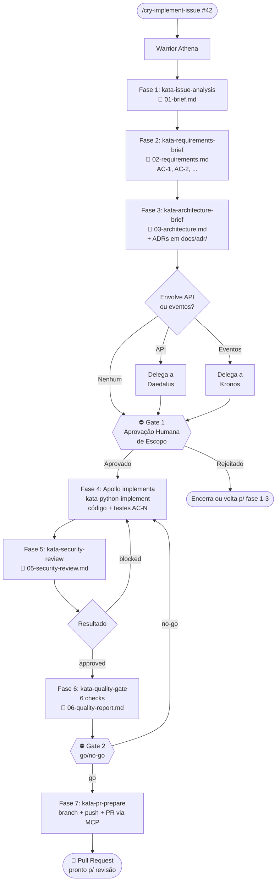

# Engineering / Workflow — Issue-Driven Development

Este clade contém todos os artefatos que compõem o fluxo **Issue-Driven Development** do Ahrena — um processo estruturado para transformar issues do GitHub em Pull Requests de alta qualidade, com rastreabilidade completa, gates de aprovação e geração automática de Architecture Decision Records.

## 1. Introdução

O fluxo **Issue-Driven Development** atende a um problema comum: como garantir que features e bugfixes implementados por agentes IA (ou por equipes híbridas humano+IA) sejam rastreáveis, auditáveis e de qualidade consistente? A resposta é um processo com fases obrigatórias, gates humanos em pontos críticos, validação automatizada antes do PR e documentação estruturada em `docs/`.

**Use este fluxo quando:**
- Implementar uma feature nova
- Corrigir um bug que envolve mais do que alteração trivial
- Mudar comportamento existente em um componente de produção
- Adicionar endpoints, eventos ou integrações externas

**Não use este fluxo para:**
- Hotfixes urgentes em produção (onde o gate humano atrasaria demais)
- Refactors puramente locais sem mudança de comportamento
- Experimentação/spike (onde o overhead do fluxo pesa mais do que o valor)
- Tarefas que não partem de uma issue existente

O orquestrador é o **Warrior Athena**, invocado pelo **Cry `/cry-implement-issue`**.

## 2. Visão Geral



## 3. Pré-requisitos

### MCPs Ativos

No `.ahrena/.directives`:

```yaml
mcp:
  servers:
    - github    # obrigatório
    - notion    # opcional (enriquece Fase 1)
```

### Variáveis de Ambiente

- `GITHUB_PAT` — **obrigatório** (para GitHub MCP)
- `NOTION_API_KEY` — opcional (para contexto Notion na Fase 1)

### Configuração

No `.ahrena/.directives` (seção opcional `quality`):

```yaml
quality:
  coverage_threshold: 80      # padrão se ausente

knowledge:
  notion:
    root_page: "page-id-ou-url"   # opcional: priorização de busca no Notion
```

### Issue existente

O fluxo começa em uma issue já criada no GitHub — o orquestrador **não cria issues**. Se a issue não existir, Athena encerra.

## 4. As 7 Fases

### Fase 1 — Análise da Issue

**Kata:** [`kata-issue-analysis`](katas/kata-issue-analysis.md)
**Output:** `docs/issues/issue-{n}/01-brief.md`

Athena lê a issue (título, body, labels, comentários) via GitHub MCP e, se Notion está ativo, busca páginas relacionadas (specs de produto, ADRs anteriores). Consolida tudo em um brief estruturado que inclui: problema, contexto adicional, tipo de trabalho, riscos e desconhecidos.

**Exemplo de trecho do brief:**

```markdown
## Problema

O módulo de pagamentos não suporta reembolso. Clientes que precisam
cancelar uma compra precisam contatar o suporte, que executa o refund
manualmente via painel admin. Isso gera latência e risco de erro.

## Contexto adicional

### Do Notion
- **[Refund Spec v2](https://notion.so/...):** define janela de 30 dias
  e regras de refund total vs. parcial por tipo de pagamento.
```

### Fase 2 — Elicitação de Requisitos (perspectiva PO)

**Kata:** [`kata-requirements-brief`](katas/kata-requirements-brief.md)
**Output:** `docs/issues/issue-{n}/02-requirements.md`

Athena transforma o brief em uma lista numerada de **Critérios de Aceitação** (ACs) no formato Given/When/Then. Faz perguntas de clarificação ao usuário quando há desconhecidos. Define Definition of Done e lista explicitamente o **out of scope**.

**Exemplo:**

```markdown
### AC-1: Criar refund total via POST /v1/refunds

- **Dado** que existe um pagamento P com status "captured" há menos de 30 dias
- **Quando** POST /v1/refunds é chamado com payment_id = P.id
- **Então** o sistema cria um refund com status "processing" e retorna 201
```

### Fase 3 — Brief Arquitetural

**Kata:** [`kata-architecture-brief`](katas/kata-architecture-brief.md)
**Output:** `docs/issues/issue-{n}/03-architecture.md` + ADRs em `docs/adr/`

Athena mapeia os componentes afetados (arquivos novos/modificados, contratos externos) em uma tabela que define o **escopo exato** do PR. Propõe abordagem técnica. Delega a **Daedalus** se envolve API REST e/ou **Kronos** se envolve eventos. Invoca **`kata-adr-write`** para cada decisão arquitetural relevante.

### Gate 1 — Aprovação de Escopo (human-in-the-loop)

Athena apresenta ao humano:
- Brief
- Lista de ACs
- Tabela de componentes
- ADRs propostos (em status `proposed`)

O humano aprova, rejeita ou pede ajustes. **Sem aprovação, Athena não codifica.**

### Fase 4 — Implementação

Athena delega a **Apollo** (ou warrior do stack equivalente) via `kata-python-implement`. A implementação deve:
- Cobrir todos os ACs
- Marcar cada teste com `AC-N` correspondente (convenção de rastreabilidade — ver §6)
- Ficar restrita aos componentes declarados na Fase 3

### Fase 5 — Revisão de Segurança

**Kata:** [`kata-security-review`](katas/kata-security-review.md)
**Output:** `docs/issues/issue-{n}/05-security-review.md`

Athena invoca revisão contra OWASP Top 10, autenticação/autorização, dados sensíveis e CVE scan em dependências. Achados críticos retornam à Fase 4.

### Fase 6 — Gate 2 de Qualidade

**Kata:** [`kata-quality-gate`](katas/kata-quality-gate.md)
**Output:** `docs/issues/issue-{n}/06-quality-report.md`

**Este é o coração da validação.** Executa 6 checks (detalhados em §5). Resultado é `go` ou `no-go`.

### Fase 7 — Preparação do PR

**Kata:** [`kata-pr-prepare`](katas/kata-pr-prepare.md)

Athena cria branch, faz push e abre PR via GitHub MCP. O body do PR é estruturado com referências a todos os artefatos em `docs/`. ADRs são transicionados de `proposed` para `accepted`.

## 5. Os 2 Gates

### Gate 1 — Aprovação de Escopo

**Quando:** entre Fase 3 e Fase 4.
**Quem:** humano.
**O que é apresentado:** brief, ACs, arquitetura, ADRs propostos.
**O que é validado:** se o entendimento da issue, os critérios de aceitação e a arquitetura proposta estão corretos e suficientes.
**Em caso de falha:** Athena retorna à fase indicada pelo humano ou encerra o fluxo.

### Gate 2 — Qualidade da Implementação

**Quando:** entre Fase 6 e Fase 7.
**Quem:** `kata-quality-gate` (automatizado).
**O que é validado:** 6 checks obrigatórios:

| # | Check | O que verifica |
|:-:|---|---|
| 1 | **Rastreabilidade AC ↔ Teste** | Cada AC tem pelo menos um teste; cada teste novo referencia um AC |
| 2 | **Scope creep** | Nenhum arquivo modificado fora da tabela de componentes da Fase 3 |
| 3 | **Best practices** | Aderência às Lexis aplicáveis (typing, testing, security, immutability, error-handling, conventional-commits) |
| 4 | **Testes passam** | `pytest` executa sem falhas |
| 5 | **Cobertura** | `pytest --cov` ≥ threshold (padrão 80%) |
| 6 | **Tipos** | `mypy --strict` sem erros novos |

**Em caso de falha:** relatório detalhado é gerado, fluxo retorna à Fase 4. **Não há override manual** — não dá para marcar como `go` se um check falhou.

## 6. Matriz de Rastreabilidade AC ↔ Teste

Cada teste novo na Fase 4 **deve** referenciar o(s) AC(s) que cobre. Três formas aceitas:

**Forma 1 — nome do teste:**
```python
def test_create_refund_returns_201_AC_1():
    response = client.post("/v1/refunds", json={"payment_id": "p123"})
    assert response.status_code == 201
```

**Forma 2 — docstring:**
```python
def test_refund_idempotency():
    """AC-2: chamadas repetidas com mesmo Idempotency-Key retornam o mesmo resultado."""
    ...
```

**Forma 3 — marker pytest:**
```python
@pytest.mark.ac("AC-3")
def test_refund_after_window_returns_422():
    ...
```

No relatório do Gate 2, o resultado aparece como tabela:

| AC | Descrição | Testes que cobrem | Status |
|---|---|---|:-:|
| AC-1 | Criar refund total | `test_create_refund_returns_201_AC_1` | ✅ |
| AC-2 | Idempotência | `test_refund_idempotency` | ✅ |
| AC-3 | Janela de 30 dias | `test_refund_after_window_returns_422` | ✅ |

**Teste sem AC → scope creep detectado → Gate 2 falha.**

## 7. Quando Gerar ADR

Durante a Fase 3, Athena avalia cada decisão de design. Use o checklist:

| Situação | Gera ADR? |
|---|:-:|
| Nova escolha tecnológica (framework, library, padrão) | ✅ Sim |
| Deviation de padrão existente no codebase | ✅ Sim |
| Trade-off significativo entre alternativas | ✅ Sim |
| Decisão que afeta múltiplos componentes | ✅ Sim |
| Decisão que afeta contrato externo (API, evento) | ✅ Sim |
| Fix pontual de bug sem mudança de padrão | ❌ Não |
| Refactor localizado seguindo padrão existente | ❌ Não |
| Adição de endpoint seguindo padrão do codebase | ❌ Não |

Quando aplicável, `kata-architecture-brief` invoca `kata-adr-write`, que cria `docs/adr/ADR-{n}-{slug}.md` em formato MADR simplificado (Context, Decision, Consequences, Alternatives). ADRs nascem com status `proposed` e transicionam para `accepted` ao final do fluxo (Fase 7) após sobreviverem ao Gate 2.

## 8. Estrutura de `docs/` após o Fluxo

```
docs/
├── adr/
│   ├── ADR-001-use-event-sourcing-for-ledger.md
│   ├── ADR-007-use-fastapi-routers.md
│   └── ADR-008-use-event-sourcing-for-refund-audit-trail.md
└── issues/
    └── issue-42/
        ├── 01-brief.md              # Análise da issue
        ├── 02-requirements.md       # ACs numerados
        ├── 03-architecture.md       # Design + componentes afetados
        ├── 05-security-review.md    # Relatório OWASP + CVE
        └── 06-quality-report.md     # Gate 2 + matriz de rastreabilidade
```

Estado efêmero de orquestração fica em `.ahrena/workflow/issue-{n}/checkpoint.md` — nunca em `docs/`.

## 9. Exemplo End-to-End: Issue #42 "Adicionar endpoint de refund"

**Invocação:**
```
/cry-implement-issue 42 guardiafinance/ahrena
```

**Fase 1 — Brief** (`docs/issues/issue-42/01-brief.md`):
> Problema: clientes não podem cancelar compras autonomamente. Contexto Notion: "Refund Spec v2" define janela de 30 dias, refund total vs. parcial.

**Fase 2 — Requisitos** (5 ACs):
- AC-1: POST /v1/refunds cria refund total com 201
- AC-2: Refund é idempotente via `Idempotency-Key`
- AC-3: Refund após 30 dias retorna 422 com `refund_window_exceeded`
- AC-4: Cada refund gera evento `refund.created`
- AC-5: Audit log registra ator, timestamp, valor, motivo

**Fase 3 — Arquitetura:**
- Componentes afetados: `src/refunds/service.py` (novo), `src/refunds/repository.py` (novo), `openapi/refunds.yaml` (novo), `events/refund.created.md` (novo)
- Delegação: Daedalus produz OAS de `/v1/refunds`; Kronos documenta `refund.created`
- ADR-008 gerado: "Use event sourcing for refund audit trail"

**Gate 1:** humano revisa e aprova.

**Fase 4:** Apollo implementa. Testes marcados com `AC-1` a `AC-5`.

**Fase 5 — Segurança:** 0 achados críticos, 1 médio (log sem mascaramento de CPF — corrigido). Resultado: `approved`.

**Fase 6 — Gate 2:** 6 checks ✅, cobertura 87%. Resultado: `go`.

**Fase 7 — PR:**
- Branch: `feat/issue-42-add-refund-endpoint`
- PR: `feat(refunds): add refund creation endpoint (#42)`
- ADR-008 transicionado para `accepted`

## 10. FAQ

**Posso pular o Gate 1?**
Não. `lex-issue-driven` proíbe — Athena recusa avançar sem aprovação humana explícita.

**E se a issue não tiver detalhes suficientes?**
Athena detecta os desconhecidos na Fase 1 e os converte em perguntas na Fase 2. Se o humano não puder responder, a pergunta vira um item em "Perguntas Pendentes" e o AC correspondente fica `PENDENTE` — o fluxo pode esperar.

**Como customizo o threshold de cobertura?**
Edite `.ahrena/.directives`:
```yaml
quality:
  coverage_threshold: 90
```

**E se eu quiser adicionar código além do escopo declarado na Fase 3?**
O scope creep check do Gate 2 bloqueia. Duas opções:
1. **Ampliar ACs** — retornar à Fase 2, atualizar requisitos, re-executar Gate 1 e Gate 2.
2. **Reverter** — remover o código extra do PR atual e abrir uma nova issue para ele.

**O fluxo pode ser pausado e retomado?**
Sim — o `.ahrena/workflow/issue-{n}/checkpoint.md` preserva o estado. Uma nova invocação de `/cry-implement-issue` com o mesmo número de issue retoma onde parou.

**Posso usar sem Notion?**
Sim. Se `notion` não estiver em `mcp.servers`, a Fase 1 pula o enriquecimento e avança apenas com o conteúdo da issue do GitHub.

**O que acontece se o Gate 2 falhar repetidamente?**
Athena apresenta o relatório; o humano decide entre corrigir (nova iteração da Fase 4) ou escalar (problema de ACs mal definidos → renegociar no Gate 1). Não há limite de iterações imposto pelo fluxo.

## 11. Referências Cruzadas

- **Cry:** [`cry-implement-issue`](cries/cry-implement-issue.md)
- **Warrior:** [`warrior-athena`](warriors/warrior-athena.md)
- **Lexis:** [`lex-issue-driven`](lexis/lex-issue-driven.md)
- **Codex:** [`codex-issue-workflow`](codex/codex-issue-workflow.md)
- **Katas:**
  - [`kata-issue-analysis`](katas/kata-issue-analysis.md) — Fase 1
  - [`kata-requirements-brief`](katas/kata-requirements-brief.md) — Fase 2
  - [`kata-architecture-brief`](katas/kata-architecture-brief.md) — Fase 3
  - [`kata-adr-write`](katas/kata-adr-write.md) — ADRs
  - [`kata-security-review`](katas/kata-security-review.md) — Fase 5
  - [`kata-quality-gate`](katas/kata-quality-gate.md) — Fase 6 (Gate 2)
  - [`kata-pr-prepare`](katas/kata-pr-prepare.md) — Fase 7
- **Warriors delegados:**
  - `warrior-apollo` (Python) — em `engineering/backend/warriors/`
  - `warrior-hephaestus` (Frontend) — em `engineering/frontend/warriors/`
  - `warrior-daedalus` (API) — em `engineering/platform/warriors/`
  - `warrior-kronos` (Eventos) — em `engineering/platform/warriors/`
  - `warrior-atlas` (AWS) — em `engineering/devops/warriors/`
- **MCPs usados:**
  - `kata-mcp-github-read`, `codex-mcp-github` — leitura de issues + criação de PR
  - `kata-mcp-notion-read`, `codex-mcp-notion` — contexto Notion (opcional)
