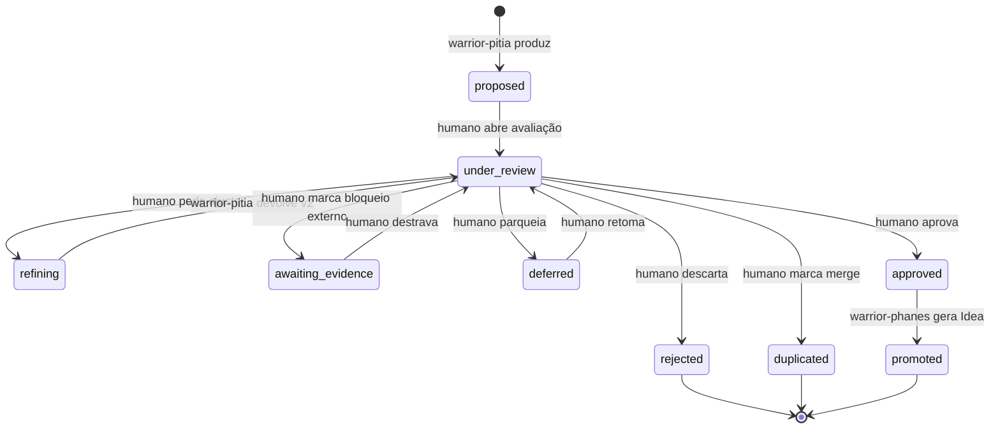

# Codex: Artefatos de Product Discovery — Insights e Ideas

> **Prefixo:** `codex-` | **Tipo:** Manual de Referência | **Escopo:** Product Discovery — schema, ciclo de vida e governança dos artefatos `insights/*.md` e `ideas/*.md`

## Visão Geral

Este Codex é o manual canônico dos artefatos produzidos durante a fase de Product Discovery do Ahrena. Define o schema YAML do front-matter de **insights** (produzidos por `warrior-pitia`) e de **ideas** (produzidas por `warrior-phanes`), a máquina de estados que governa o ciclo de vida dos insights, a convenção de numeração e o endereçamento canônico dentro de `docs/discovery/`. A lei correspondente está em `lex-discovery-flow`.

Insights são observações estruturadas extraídas de fontes (APIs, docs, processos, entrevistas, telas) que descrevem oportunidades, dores ou hipóteses sobre um domínio de negócio. Ideas são candidatos de solução: insights aprovados sintetizados em problema, hipótese, usuário-alvo, métrica de sucesso e estimativa de esforço. O par insight → Idea forma o input do ciclo de design (`warrior-prometheus` em diante).

## Contexto

- **Domínio:** Product Discovery — fase prévia ao design cycle do Ahrena
- **Público-alvo:** `warrior-pitia`, `warrior-phanes`, Product Managers, stakeholders que avaliam insights, autores humanos
- **Atualização:** após cada ciclo Discovery → Idea completo (revisão obrigatória após o primeiro uso real, registrada em ADR quando o schema mudar)

## Endereçamento canônico

Os artefatos de execução produzidos por Pítia e Phanes moram em:

```
docs/
└── discovery/
    └── {topic}/                   # tópico em kebab-case (ex: scheduled-payments-research)
        ├── insights/
        │   └── {NNN}-{slug}.md    # NNN sequencial dentro do topic, zero-padded
        └── ideas/
            └── {NNN}-{slug}.md    # NNN sequencial dentro do topic, zero-padded
```

### Convenções

| Item | Regra |
|------|-------|
| `{topic}` | Tema da iniciativa de Discovery em kebab-case. Ex.: `accountant-onboarding`, `scheduled-payments-research` |
| `{NNN}` | Número sequencial **dentro do topic**, zero-padded com 3 dígitos (`001`, `002`, …, `099`, `100`). Sem buracos |
| `{slug}` | Resumo curto em kebab-case do conteúdo do insight/idea. Ex.: `manual-reconciliation-bottleneck` |
| Idioma | Conforme `language.default` em `.ahrena/.directives` |
| Arquivos por insight/idea | **Um arquivo por artefato** — facilita PR-por-insight e granularidade de revisão |

## Schema do Insight

Cada arquivo `docs/discovery/{topic}/insights/{NNN}-{slug}.md` deve conter front-matter YAML seguido de corpo Markdown livre.

```yaml
---
id: "{topic}/insights/{NNN}-{slug}"
topic: "{topic}"
status: proposed
source_refs:
  - "https://figma.com/file/abc123"
  - "notion://page-id"
  - "docs/transcripts/interview-2026-05-04-accountant-X.md"
tags:
  - reconciliation
  - manual-process
created_at: "2026-05-06T10:00:00Z"
updated_at: "2026-05-06T10:00:00Z"
# Campos populados conforme transições da máquina de estados:
merged_into: null              # preenchido quando status: duplicated → "{topic}/insights/{NNN}-{slug}"
idea_ref: null                 # preenchido quando status: promoted → "{topic}/ideas/{NNN}-{slug}"
rejected_reason: null          # preenchido quando status: rejected
awaiting_evidence_reason: null # preenchido quando status: awaiting_evidence
---

# Insight: {Título Humano em Português}

## Observação

{O que foi observado, em linguagem direta. 2 a 5 frases.}

## Fonte

{De onde veio: qual API/doc/entrevista/processo. Cite trechos quando possível.}

## Implicação inicial

{Por que isso importa para o negócio. Sem propor solução ainda — Idea fica para depois.}

## Perguntas em aberto

{Lista de perguntas que precisam de evidência adicional para amadurecer este insight.}
```

### Campos do front-matter

| Campo | Tipo | Obrigatório | Descrição |
|-------|------|:-----------:|-----------|
| `id` | string | Sim | Identificador estável: `{topic}/insights/{NNN}-{slug}` |
| `topic` | string | Sim | Topic em kebab-case (mesmo do diretório-pai) |
| `status` | enum | Sim | Um dos 9 status da máquina de estados (ver abaixo) |
| `source_refs` | array&lt;string&gt; | Sim (≥1) | URLs ou paths das fontes consultadas |
| `tags` | array&lt;string&gt; | Não | Etiquetas para busca/agregação |
| `created_at` | datetime ISO 8601 | Sim | Data de criação |
| `updated_at` | datetime ISO 8601 | Sim | Última atualização |
| `merged_into` | string \| null | Condicional | Quando `status: duplicated` — referência para o insight canônico |
| `idea_ref` | string \| null | Condicional | Quando `status: promoted` — referência para a Idea gerada |
| `rejected_reason` | string \| null | Condicional | Quando `status: rejected` — motivo curto |
| `awaiting_evidence_reason` | string \| null | Condicional | Quando `status: awaiting_evidence` — o que falta |

## Schema da Idea

Cada arquivo `docs/discovery/{topic}/ideas/{NNN}-{slug}.md` deve conter front-matter YAML com os 5 campos obrigatórios da Idea.

```yaml
---
id: "{topic}/ideas/{NNN}-{slug}"
topic: "{topic}"
problem: "Contadores perdem em média 4h/semana conciliando manualmente lançamentos divergentes entre o ERP e o extrato bancário."
hypothesis: "Se o sistema sugerir conciliação automática com confiança ≥ 90%, contadores aceitarão a sugestão em ≥ 70% dos casos, reduzindo o tempo manual em ≥ 60%."
target_user: "Contador operacional em escritórios com 50–500 clientes ativos"
success_metric: "Tempo médio de conciliação por mês por cliente: baseline 4h → meta 1.5h em 90 dias após release"
effort_estimate: "M (2–4 sprints; depende de integração com ERP X e do modelo de matching)"
linked_insights:
  - "{topic}/insights/001-manual-reconciliation-bottleneck"
  - "{topic}/insights/003-erp-divergence-patterns"
created_at: "2026-05-10T15:00:00Z"
updated_at: "2026-05-10T15:00:00Z"
---

# Idea: {Título Humano em Português}

## Síntese

{2 a 4 frases conectando o problema à hipótese e ao usuário.}

## Insights de origem

{Lista enumerada referenciando cada insight em `linked_insights[]` com 1 frase de resumo.}

## Próximos passos

{Sugestões de validação adicional antes do design cycle (ex.: entrevista confirmatória, prova de conceito, análise de dados de telemetria). Não é decisão de prioridade — isso fica com `warrior-prometheus`.}
```

### Campos do front-matter

| Campo | Tipo | Obrigatório | Descrição |
|-------|------|:-----------:|-----------|
| `id` | string | Sim | Identificador estável: `{topic}/ideas/{NNN}-{slug}` |
| `topic` | string | Sim | Topic em kebab-case (deve coincidir com o `topic` dos insights em `linked_insights[]`) |
| `problem` | string | Sim | Problema concreto observado, em uma frase. Sem solução embutida |
| `hypothesis` | string | Sim | Hipótese testável: "Se X, então Y, medido por Z" |
| `target_user` | string | Sim | Usuário-alvo específico (não "todos os usuários") |
| `success_metric` | string | Sim | Métrica leading ou lagging com baseline e meta |
| `effort_estimate` | enum | Sim | `XS` \| `S` \| `M` \| `L` \| `XL` com justificativa entre parênteses |
| `linked_insights` | array&lt;string&gt; | Sim (≥1) | IDs dos insights de origem; todos com `topic` igual ao da Idea |
| `created_at` | datetime ISO 8601 | Sim | Data de criação |
| `updated_at` | datetime ISO 8601 | Sim | Última atualização |

Os 5 campos de conteúdo (`problem`, `hypothesis`, `target_user`, `success_metric`, `effort_estimate`) são as **5 precondições obrigatórias** validadas pelo HARD-GATE 1 da `lex-discovery-flow`.

## Máquina de estados do Insight



### Tabela de transições

| De → Para | Quem move | Pré-condição | Efeito colateral |
|-----------|-----------|--------------|------------------|
| `[*]` → `proposed` | `warrior-pitia` | Síntese a partir de `source_refs[]` ≥ 1 | Cria arquivo do insight |
| `proposed` → `under_review` | humano | — | — |
| `under_review` → `refining` | humano | Feedback acionável fornecido | — |
| `refining` → `under_review` | `warrior-pitia` | v2 do insight redigida | `updated_at` atualizado |
| `under_review` → `awaiting_evidence` | humano | `awaiting_evidence_reason` preenchido | — |
| `awaiting_evidence` → `under_review` | humano | Evidência obtida | `awaiting_evidence_reason` zerado |
| `under_review` → `deferred` | humano | — | — |
| `deferred` → `under_review` | humano | — | — |
| `under_review` → `duplicated` | humano | `merged_into` aponta para outro insight do mesmo topic | Insight canônico recebe nota |
| `under_review` → `rejected` | humano | `rejected_reason` preenchido | Terminal |
| `under_review` → `approved` | humano | — | Disponível para `warrior-phanes` |
| `approved` → `promoted` | `warrior-phanes` | HARD-GATE 1 da `lex-discovery-flow` cumprido | Arquivo da Idea criado; `idea_ref` preenchido |

Status terminais: `rejected`, `duplicated`, `promoted`. Status não-terminais que parecem terminais: `deferred` (volta para `under_review` quando destravado).

## Restrições

- **Imutabilidade do `id`:** uma vez criado, `id` nunca muda. Se um insight for renomeado, marque o antigo como `duplicated` apontando para o novo.
- **Não inverter a hierarquia:** sempre `docs/discovery/{topic}/{insights|ideas}/`. Categoria como nível superior (`docs/discovery/insights/{topic}/...`) é PROIBIDO.
- **Não consolidar múltiplos insights em um arquivo:** um insight por arquivo, mesmo que sejam relacionados — use `linked_insights[]` na Idea para agregar.
- **Idea sem insight de origem:** PROIBIDO em v1. Se uma Idea legitimamente nasce de pesquisa não documentada como insight, primeiro crie o insight, depois a Idea.
- **`topic` não muda entre insight e Idea:** o `topic` da Idea deve coincidir com o `topic` de todos os seus `linked_insights[]`.

## Glossário

| Termo | Definição |
|-------|-----------|
| Topic | Tema de uma iniciativa de Discovery; agrupador de insights e ideas relacionados |
| Insight | Observação estruturada extraída de fontes; unidade de descoberta |
| Idea | Candidato de solução derivado de insights aprovados; unidade de proposição |
| Promotion | Transição `approved → promoted` de um insight, executada por `warrior-phanes` ao gerar a Idea |
| Refining | Estado em que `warrior-pitia` está iterando o insight após feedback humano |

## Referências

- `lex-discovery-flow` — lei correspondente com HARD-GATEs
- `kata-discovery-synthesis` — procedimento de produção de insights por `warrior-pitia`
- `kata-ideation-from-insight` — procedimento de promoção de insight a Idea por `warrior-phanes`
- `warrior-pitia`, `warrior-phanes` — agentes vinculados
- `lex-feature-design-docs`, `codex-feature-design-docs` — destino downstream após o Discovery (Prometheus consome Ideas)
